# 聊天系统

<cite>
**本文档引用的文件**
- [src/views/chat/index.vue](file://src/views/chat/index.vue)
- [src/views/tabBar/components/wx.vue](file://src/views/tabBar/components/wx.vue)
- [src/views/tabBar/index.vue](file://src/views/tabBar/index.vue)
- [src/components/AddChatModal.vue](file://src/components/AddChatModal.vue)
- [src/store/modules/app.ts](file://src/store/modules/app.ts)
- [uno.config.ts](file://uno.config.ts)
- [src/hooks/useRouteTransition.ts](file://src/hooks/useRouteTransition.ts)
- [src/styles/transition/wx-slide.less](file://src/styles/transition/wx-slide.less)
- [src/styles/transition/index.less](file://src/styles/transition/index.less)
- [src/layout/index.vue](file://src/layout/index.vue)
- [src/router/index.ts](file://src/router/index.ts)
- [src/router/base.ts](file://src/router/base.ts)
- [src/router/modules.ts](file://src/router/modules.ts)
- [src/hooks/useDomWidth.ts](file://src/hooks/useDomWidth.ts)
</cite>

## 更新摘要
**变更内容**
- 新增AddChatModal组件：提供全面的联系人管理和聊天组功能
- 新增动态头像选择：支持群头像随机生成和自定义上传
- 新增联系人分组管理：支持通讯录联系人分组和实时头像映射
- 新增批量添加功能：支持批量添加好友和群聊
- 新增实时头像映射：根据群人数动态映射合适的头像组合
- 新增弹窗式交互：提供直观的聊天添加和管理界面

## 目录
1. [简介](#简介)
2. [项目结构](#项目结构)
3. [核心组件](#核心组件)
4. [架构概览](#架构概览)
5. [详细组件分析](#详细组件分析)
6. [依赖关系分析](#依赖关系分析)
7. [性能考虑](#性能考虑)
8. [故障排除指南](#故障排除指南)
9. [结论](#结论)

## 简介

这是一个基于 Vue 3.5、Vant 4 移动端聊天系统的完整实现。项目采用现代化的前端技术栈，包括 TypeScript、Pinia 状态管理、Vue Router 路由系统、Axios HTTP 客户端等核心技术。系统提供了完整的聊天功能，包括消息发送、接收、显示以及用户认证等功能。

**新增特性**
- 全新的AddChatModal组件，提供直观的聊天添加和管理界面
- 动态头像选择功能，支持群头像随机生成和自定义上传
- 全面的联系人管理功能，包括通讯录分组和实时头像映射
- 批量添加功能，支持批量创建聊天和联系人
- 实时头像映射机制，根据群人数动态选择合适的头像组合
- 弹窗式交互设计，提供流畅的用户体验

## 项目结构

该项目采用模块化的组织方式，主要分为以下几个核心部分：

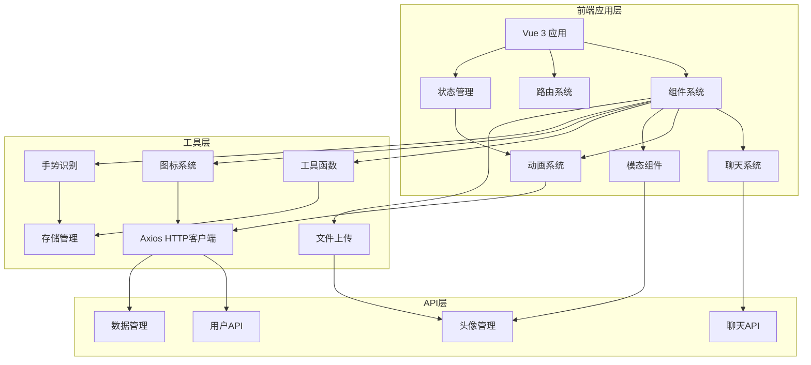

**图表来源**
- [src/main.ts:19-44](file://src/main.ts#L19-L44)
- [src/App.vue:1-80](file://src/App.vue#L1-L80)
- [uno.config.ts:28-39](file://uno.config.ts#L28-L39)

**章节来源**
- [src/main.ts:1-44](file://src/main.ts#L1-L44)
- [package.json:41-56](file://package.json#L41-L56)

## 核心组件

### 聊天页面组件

聊天页面是整个系统的核心组件，实现了完整的聊天功能：

- **消息显示区域**：支持左右布局的消息展示，区分用户发送和好友发送的消息
- **消息输入区域**：包含文本输入框和功能按钮
- **消息切换功能**：支持模拟好友视角和用户视角的切换
- **自动滚动功能**：新消息自动滚动到底部
- **实时消息处理**：基于Pinia的状态管理实现实时消息更新

### AddChatModal组件

**新增** AddChatModal是本次更新的核心组件，提供了全面的聊天添加和管理功能：

- **主弹窗界面**：提供群名称、群人数、头像选择等基础配置
- **动态头像生成**：根据群人数自动匹配合适的头像组合
- **头像上传功能**：支持自定义头像上传和预览
- **聊天列表管理**：支持添加、删除、清空聊天记录
- **批量添加功能**：支持一次性添加多个好友或群聊
- **目标选择**：可选择添加到聊天列表或通讯录
- **实时验证**：提供输入验证和错误提示

### 聊天管理功能

系统提供了完整的聊天管理功能：

- **未读计数**：显示每个聊天会话的未读消息数量
- **置顶切换**：支持将重要聊天置顶显示
- **删除聊天**：支持删除不需要的聊天记录
- **长按菜单**：提供丰富的聊天管理操作
- **滑动操作**：支持左滑查看更多聊天管理选项
- **震动反馈**：长按时提供触觉反馈

### 状态管理系统

系统使用 Pinia 进行状态管理，主要包括：

- **聊天状态管理**：处理聊天列表、消息数据、用户头像等
- **用户状态管理**：处理用户登录、登出、用户信息获取
- **路由状态管理**：管理路由配置和组件缓存
- **联系人分组管理**：处理通讯录联系人分组和头像映射
- **持久化存储**：使用 Pinia Persisted State 插件实现状态持久化

### HTTP 客户端

基于 Axios 封装的 HTTP 客户端，提供了：

- **请求拦截器**：自动添加 Token 和处理请求配置
- **响应拦截器**：统一处理响应数据和错误信息
- **取消重复请求**：防止重复请求造成的数据混乱
- **错误处理**：统一的错误处理机制

### 路由滑动动画

系统实现了微信风格的路由滑动动画：

- **前进动画**：新页面从右侧滑入，旧页面向左微移
- **后退动画**：当前页面向右滑出，底层页面从左侧恢复
- **阴影效果**：模拟微信的页面叠加阴影
- **硬件加速**：使用 transform 属性实现流畅动画

### 图标系统

集成 FileSystemIconLoader 实现本地图标加载：

- **自定义图标**：支持从本地文件系统加载图标
- **图标分类**：按功能分类管理图标资源
- **性能优化**：减少网络请求，提升加载速度
- **样式定制**：支持图标样式和尺寸的灵活配置

**章节来源**
- [src/views/chat/index.vue:105-232](file://src/views/chat/index.vue#L105-L232)
- [src/components/AddChatModal.vue:1-549](file://src/components/AddChatModal.vue#L1-L549)
- [src/store/modules/app.ts:250-377](file://src/store/modules/app.ts#L250-L377)
- [src/store/modules/user.ts:36-109](file://src/store/modules/user.ts#L36-L109)
- [src/utils/http/axios/Axios.ts:18-225](file://src/utils/http/axios/Axios.ts#L18-L225)

## 架构概览

系统采用分层架构设计，各层职责明确：

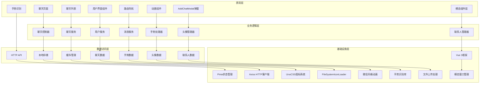

**图表来源**
- [src/views/chat/index.vue:99-232](file://src/views/chat/index.vue#L99-L232)
- [src/components/AddChatModal.vue:194-549](file://src/components/AddChatModal.vue#L194-L549)
- [src/store/modules/app.ts:1-377](file://src/store/modules/app.ts#L1-L377)
- [uno.config.ts:1-96](file://uno.config.ts#L1-L96)

## 详细组件分析

### 聊天页面组件分析

聊天页面组件实现了完整的聊天功能，包括消息的发送、显示和交互。

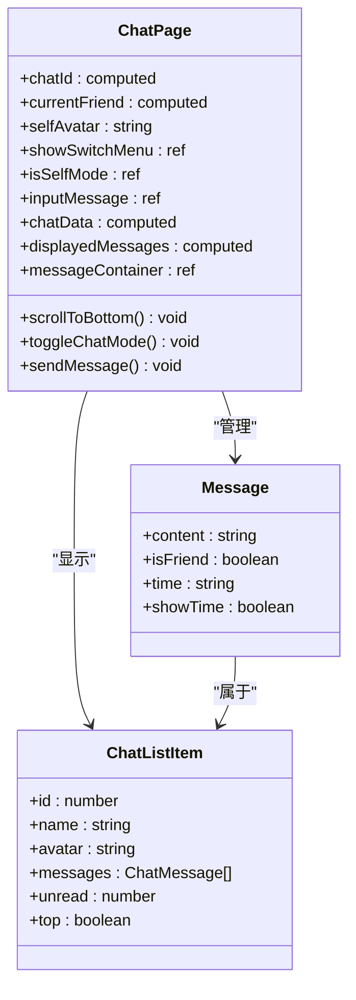

**图表来源**
- [src/views/chat/index.vue:105-188](file://src/views/chat/index.vue#L105-L188)
- [src/store/modules/app.ts:22-38](file://src/store/modules/app.ts#L22-L38)

#### 消息发送流程

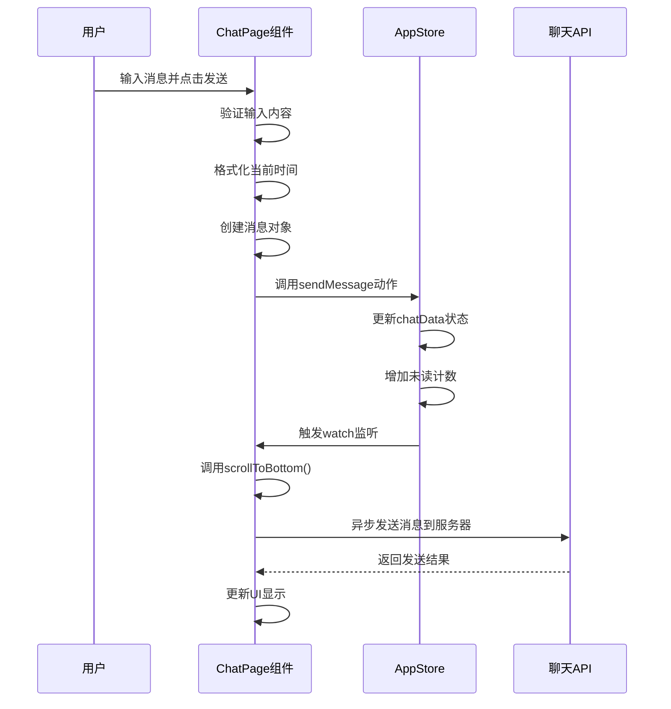

**图表来源**
- [src/views/chat/index.vue:162-173](file://src/views/chat/index.vue#L162-L173)
- [src/store/modules/app.ts:321-342](file://src/store/modules/app.ts#L321-L342)

#### 聊天模式切换流程

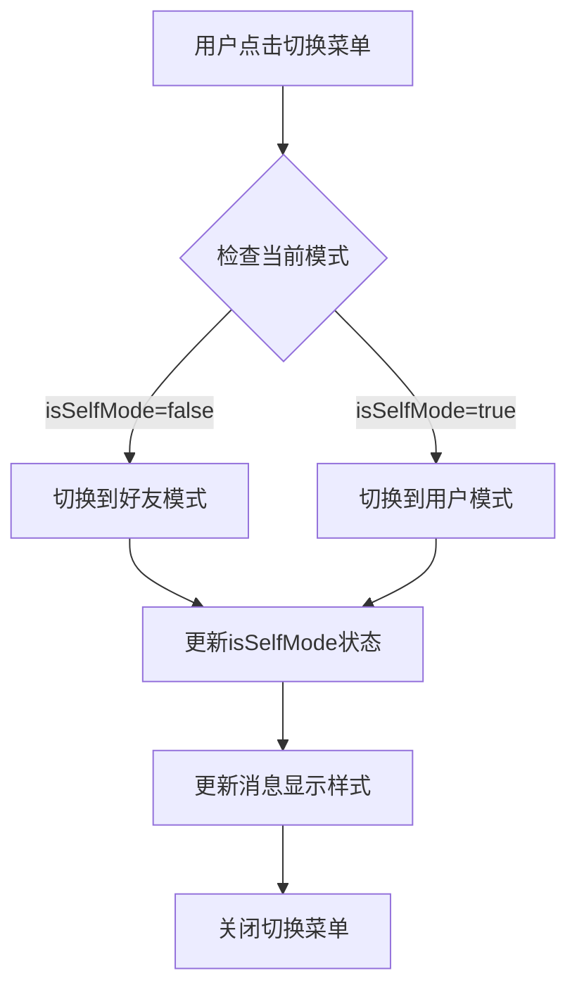

**图表来源**
- [src/views/chat/index.vue:156-160](file://src/views/chat/index.vue#L156-L160)

**章节来源**
- [src/views/chat/index.vue:1-195](file://src/views/chat/index.vue#L1-L195)

### AddChatModal组件分析

**新增** AddChatModal组件提供了全面的聊天添加和管理功能。

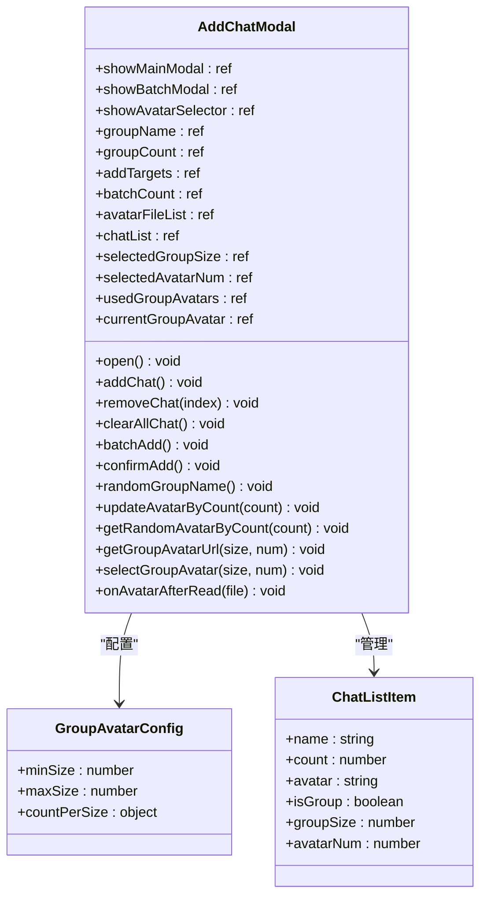

**图表来源**
- [src/components/AddChatModal.vue:194-549](file://src/components/AddChatModal.vue#L194-L549)

#### 动态头像生成流程

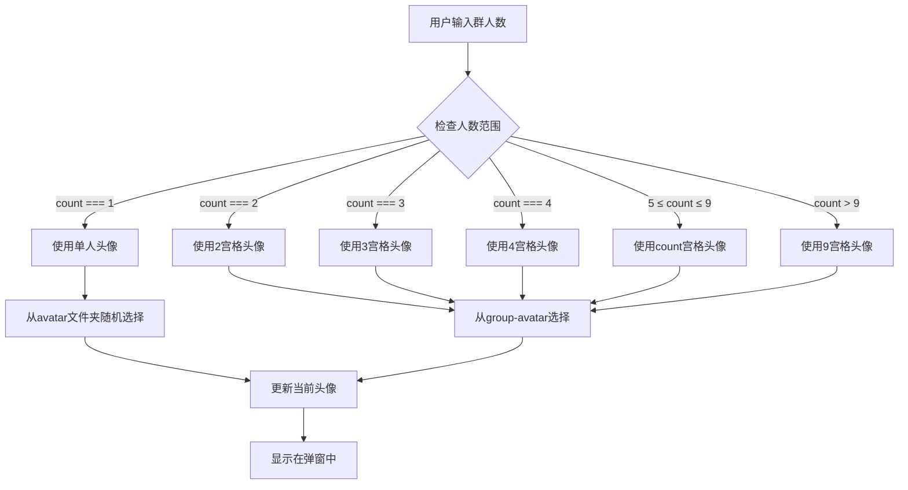

**图表来源**
- [src/components/AddChatModal.vue:312-344](file://src/components/AddChatModal.vue#L312-L344)

#### 批量添加功能流程

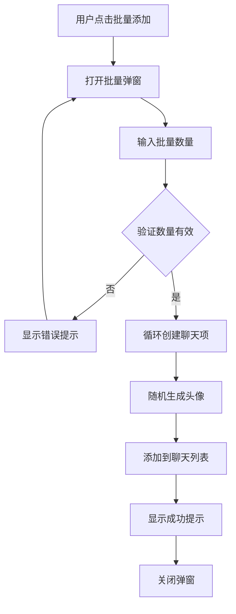

**图表来源**
- [src/components/AddChatModal.vue:455-480](file://src/components/AddChatModal.vue#L455-L480)

#### 聊天添加确认流程

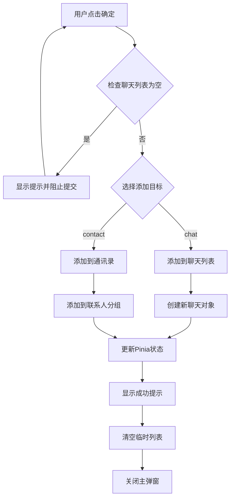

**图表来源**
- [src/components/AddChatModal.vue:482-521](file://src/components/AddChatModal.vue#L482-L521)

**章节来源**
- [src/components/AddChatModal.vue:1-549](file://src/components/AddChatModal.vue#L1-L549)

### 聊天管理功能分析

聊天管理功能提供了完整的聊天会话管理能力。

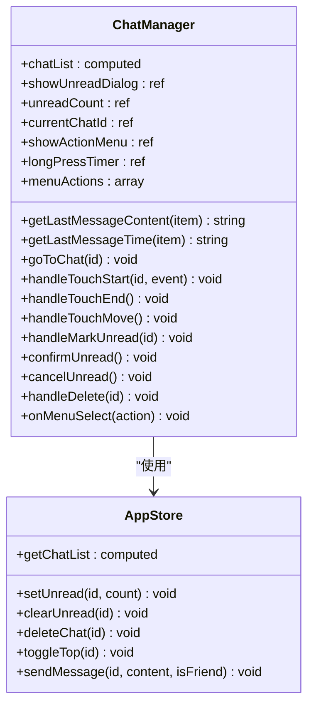

**图表来源**
- [src/views/tabBar/components/wx.vue:113-311](file://src/views/tabBar/components/wx.vue#L113-L311)
- [src/store/modules/app.ts:250-377](file://src/store/modules/app.ts#L250-L377)

#### 长按菜单功能


**图表来源**
- [src/views/tabBar/components/wx.vue:219-247](file://src/views/tabBar/components/wx.vue#L219-L247)

#### 聊天列表管理流程

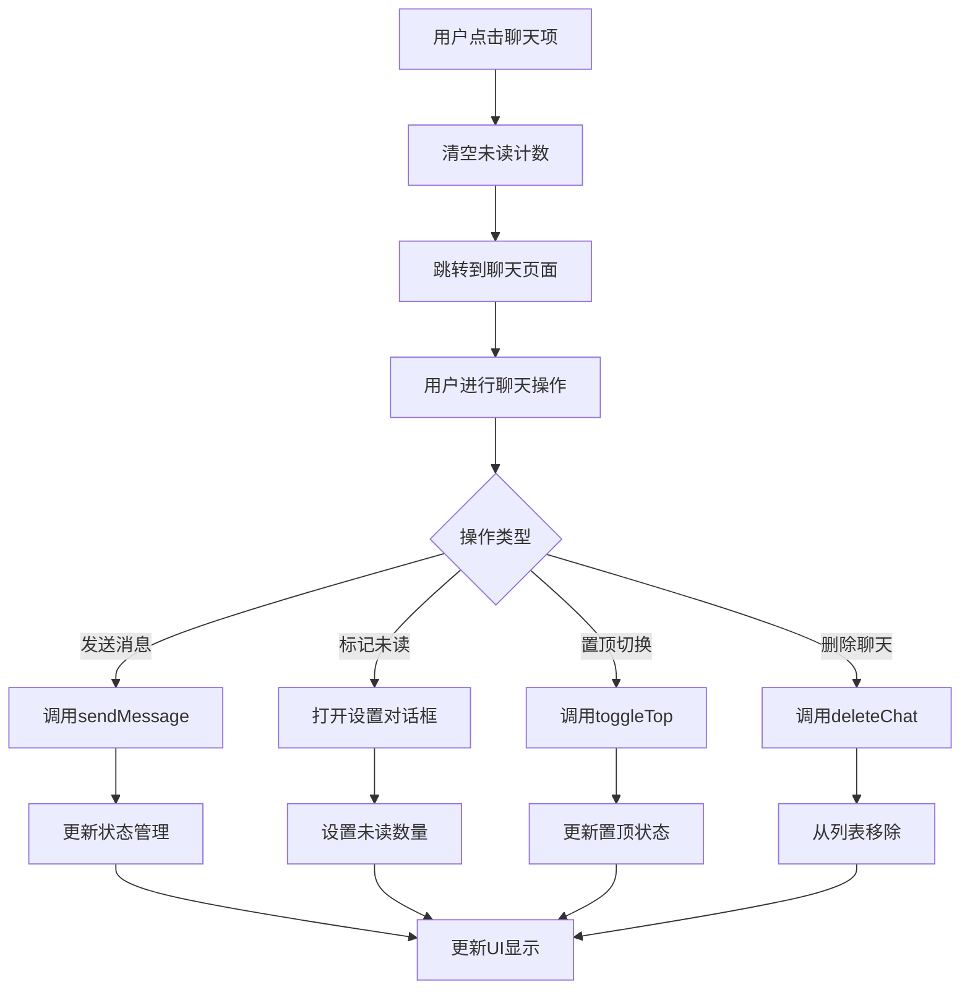

**图表来源**
- [src/views/tabBar/components/wx.vue:212-291](file://src/views/tabBar/components/wx.vue#L212-L291)

**章节来源**
- [src/views/tabBar/components/wx.vue:1-314](file://src/views/tabBar/components/wx.vue#L1-L314)

### 状态管理系统分析

状态管理系统基于Pinia实现，提供了完整的聊天状态管理能力。

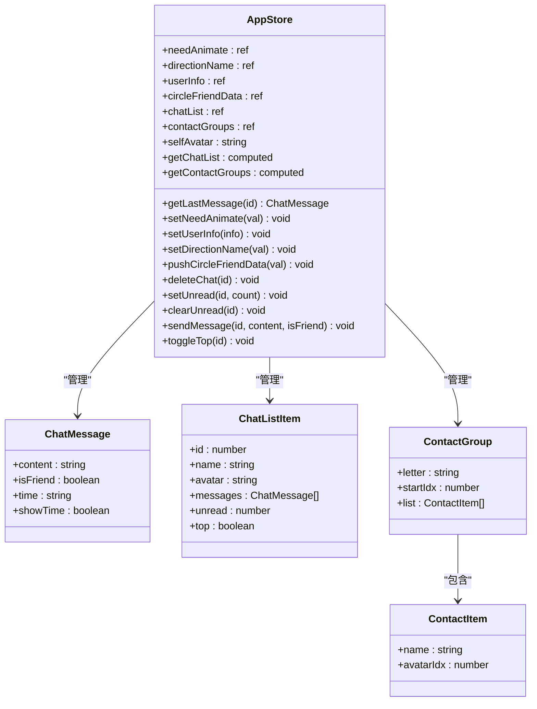

**图表来源**
- [src/store/modules/app.ts:250-377](file://src/store/modules/app.ts#L250-L377)
- [src/store/modules/app.ts:22-38](file://src/store/modules/app.ts#L22-L38)

#### 聊天数据初始化流程

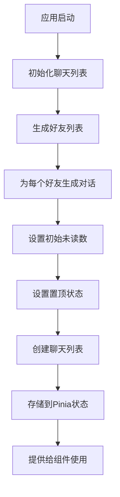

**图表来源**
- [src/store/modules/app.ts:210-248](file://src/store/modules/app.ts#L210-L248)

#### 联系人分组管理流程

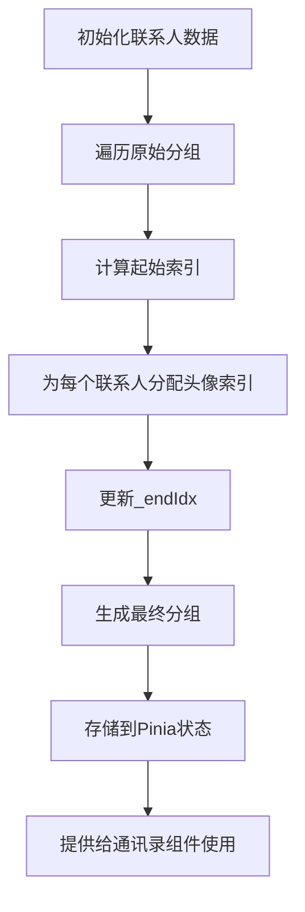

**图表来源**
- [src/store/modules/app.ts:372-383](file://src/store/modules/app.ts#L372-L383)

**章节来源**
- [src/store/modules/app.ts:1-377](file://src/store/modules/app.ts#L1-L377)

### 路由滑动动画分析

系统实现了微信风格的路由滑动动画，提供了流畅的页面切换体验。

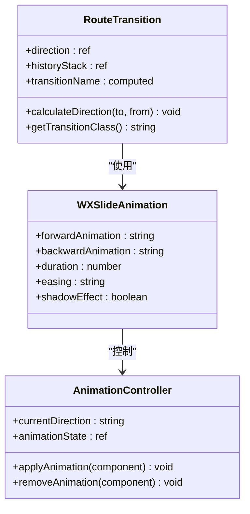

**图表来源**
- [src/hooks/useRouteTransition.ts:13-61](file://src/hooks/useRouteTransition.ts#L13-L61)
- [src/styles/transition/wx-slide.less:1-70](file://src/styles/transition/wx-slide.less#L1-L70)

#### 动画实现流程

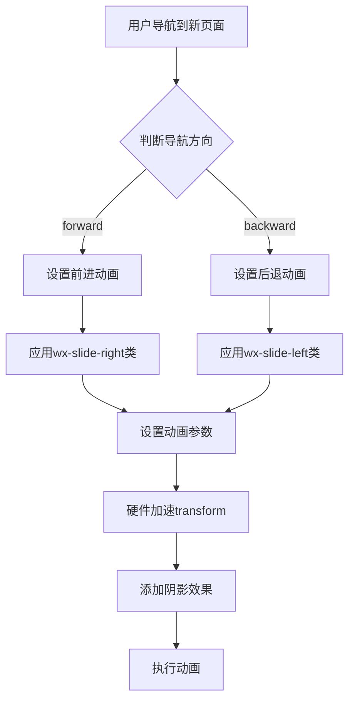

**图表来源**
- [src/hooks/useRouteTransition.ts:45-54](file://src/hooks/useRouteTransition.ts#L45-L54)

**章节来源**
- [src/hooks/useRouteTransition.ts:1-62](file://src/hooks/useRouteTransition.ts#L1-L62)
- [src/styles/transition/wx-slide.less:1-70](file://src/styles/transition/wx-slide.less#L1-L70)

### 图标系统分析

FileSystemIconLoader实现了高效的本地图标加载系统。

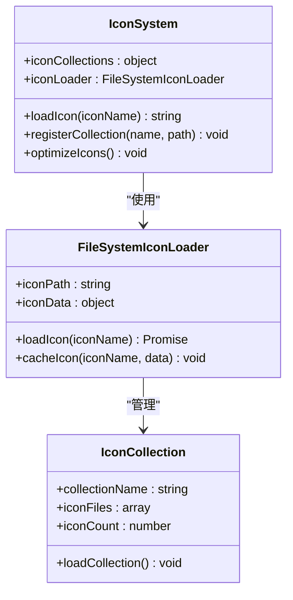

**图表来源**
- [uno.config.ts:28-39](file://uno.config.ts#L28-L39)

#### 图标加载流程

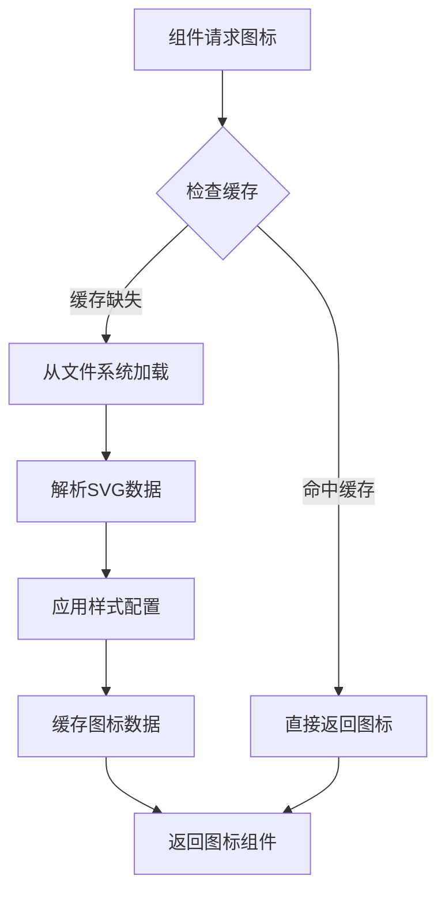

**图表来源**
- [uno.config.ts:28-39](file://uno.config.ts#L28-L39)

**章节来源**
- [uno.config.ts:1-96](file://uno.config.ts#L1-L96)

## 依赖关系分析

系统依赖关系清晰，各模块之间耦合度适中：

```mermaid
graph LR
subgraph "核心依赖"
A[Vue 3.5]
B[Pinia 3.0.4]
C[Vue Router 5.0.4]
D[Axios 1.4.0]
E[UnoCSS 6.0.0]
F[Vant 4.9.22]
G[AddChatModal组件]
end
subgraph "图标系统"
H[FileSystemIconLoader]
I[图标预设]
J[图标缓存]
end
subgraph "动画系统"
K[微信风格动画]
L[硬件加速]
M[过渡效果]
end
subgraph "工具库"
N[Lodash-es 4.17.21]
O[@vueuse/core 10.0.0]
P[防抖节流]
Q[手势识别]
R[文件上传]
end
subgraph "开发工具"
S[Vite 8.0.2]
T[TypeScript 5.9.3]
U[ESLint]
V[Vue 3 Composition API]
W[模态窗口管理]
end
A --> B
A --> C
B --> D
C --> F
D --> N
A --> E
E --> H
G --> F
G --> R
H --> I
I --> J
A --> K
K --> L
L --> M
A --> N
N --> P
A --> O
O --> Q
Q --> R
S --> T
S --> U
W --> F
```

**图表来源**
- [package.json:41-106](file://package.json#L41-L106)

**章节来源**
- [package.json:1-121](file://package.json#L1-L121)

## 性能考虑

系统在性能方面采用了多项优化措施：

### 内存管理
- 使用虚拟滚动减少大量消息时的内存占用
- 实现消息数据的懒加载和按需渲染
- 合理的组件销毁和清理机制
- Pinia状态管理的响应式更新优化
- **新增** AddChatModal组件的临时数据管理，避免内存泄漏

### 网络优化
- 请求去重和取消机制
- 自动重连和错误恢复
- 缓存策略优化
- 实时消息的高效传输

### UI性能
- 虚拟列表实现大消息列表的流畅滚动
- 图片懒加载和压缩
- 动画性能优化
- 响应式设计的性能考虑
- **新增** 模态窗口的硬件加速和性能优化

### 状态管理优化
- Pinia的响应式状态管理
- 计算属性的智能缓存
- 组件级别的状态隔离
- 状态持久化的高效实现

### 动画性能优化
- 硬件加速transform属性
- 优化的贝塞尔曲线缓动函数
- 减少重绘和回流的操作
- 合理的动画时长和延迟

### 图标加载优化
- FileSystemIconLoader减少网络请求
- 图标数据缓存机制
- 按需加载和懒加载策略
- SVG格式的高效渲染

### 手势识别优化
- 防抖节流机制避免频繁触发
- 触摸事件的智能处理
- 内存泄漏防护
- 性能监控和优化

### **新增** AddChatModal组件性能优化
- **头像缓存机制**：避免重复生成相同的头像组合
- **文件上传优化**：支持Base64格式和文件读取两种方式
- **批量操作优化**：批量添加时的性能优化和用户体验提升
- **模态窗口管理**：合理的弹窗生命周期管理

**章节来源**
- [src/hooks/useDomWidth.ts:1-15](file://src/hooks/useDomWidth.ts#L1-L15)
- [src/components/AddChatModal.vue:380-400](file://src/components/AddChatModal.vue#L380-L400)

## 故障排除指南

### 常见问题及解决方案

#### 登录认证问题
- **问题**：登录后无法获取用户信息
- **原因**：Token 无效或过期
- **解决**：检查 Token 存储和刷新机制

#### 消息发送失败
- **问题**：消息发送后没有收到响应
- **原因**：网络连接问题或服务器错误
- **解决**：检查网络状态和服务器日志

#### 状态同步问题
- **问题**：页面刷新后状态丢失
- **原因**：持久化存储配置问题
- **解决**：检查 Pinia Persisted State 配置

#### 图标加载问题
- **问题**：自定义图标无法显示
- **原因**：FileSystemIconLoader配置错误
- **解决**：检查图标路径和配置

#### 聊天数据不同步
- **问题**：聊天列表和聊天页面数据不一致
- **原因**：状态管理更新时机问题
- **解决**：检查Pinia actions的调用顺序

#### 动画卡顿问题
- **问题**：页面切换动画不流畅
- **原因**：硬件加速未启用或动画过度复杂
- **解决**：检查CSS transform属性和动画时长

#### 手势响应问题
- **问题**：长按菜单不响应或误触发
- **原因**：防抖节流设置不当或触摸事件冲突
- **解决**：调整长按延迟时间和触摸事件处理

#### **新增** AddChatModal组件问题
- **问题**：头像无法正常显示或生成
- **原因**：头像文件路径错误或缓存问题
- **解决**：检查头像文件存在性和路径配置

- **问题**：批量添加功能异常
- **原因**：批量数量验证或文件上传问题
- **解决**：检查输入验证和文件处理逻辑

- **问题**：模态窗口无法正常关闭
- **原因**：弹窗状态管理或事件绑定问题
- **解决**：检查模态窗口的显示控制逻辑

**章节来源**
- [src/router/router-guards.ts:11-44](file://src/router/router-guards.ts#L11-L44)
- [src/utils/http/axios/index.ts:203-237](file://src/utils/http/axios/index.ts#L203-L237)
- [uno.config.ts:28-39](file://uno.config.ts#L28-L39)
- [src/components/AddChatModal.vue:482-521](file://src/components/AddChatModal.vue#L482-L521)

## 结论

这个聊天系统是一个功能完整、架构清晰的移动端应用。系统采用了现代化的前端技术栈，具有良好的可维护性和扩展性。主要特点包括：

- **完整的聊天功能**：支持消息发送、接收和显示
- **现代化的技术栈**：Vue 3、TypeScript、Pinia 等
- **丰富的交互功能**：长按菜单、滑动操作、自动滚动
- **完善的聊天管理**：未读计数、置顶切换、删除聊天
- **高效的性能优化**：响应式状态管理、虚拟滚动、缓存策略
- **流畅的动画体验**：微信风格路由滑动动画、硬件加速
- **强大的图标系统**：FileSystemIconLoader集成、本地图标加载
- **良好的用户体验**：响应式设计和流畅的交互
- **完善的错误处理**：统一的错误处理和用户反馈
- **可扩展的架构**：模块化设计便于功能扩展

**重大更新**：本次更新新增了AddChatModal组件，这是一个功能强大的聊天添加和管理组件，提供了以下关键特性：

- **动态头像选择**：根据群人数自动匹配合适的头像组合
- **自定义头像上传**：支持用户自定义头像并实时预览
- **批量添加功能**：支持一次性添加多个聊天和联系人
- **实时头像映射**：智能的头像与群人数对应关系
- **弹窗式交互**：提供直观、易用的用户界面
- **联系人分组管理**：支持通讯录联系人的分组和管理

这些新增功能显著增强了系统的功能性和用户体验，特别是在联系人管理和聊天组创建方面提供了更加完善的支持。新增的AddChatModal组件与现有的聊天系统无缝集成，保持了整体架构的一致性和可维护性。

系统为后续的功能扩展和优化奠定了良好的基础，特别是在新增的微信风格聊天功能、路由滑动动画、FileSystemIconLoader集成、以及新增的AddChatModal组件等方面，为系统的可维护性和开发效率提供了有力保障。特别是Pinia状态管理的重写和性能优化（防抖节流、硬件加速动画），显著提升了系统的整体性能和用户体验。