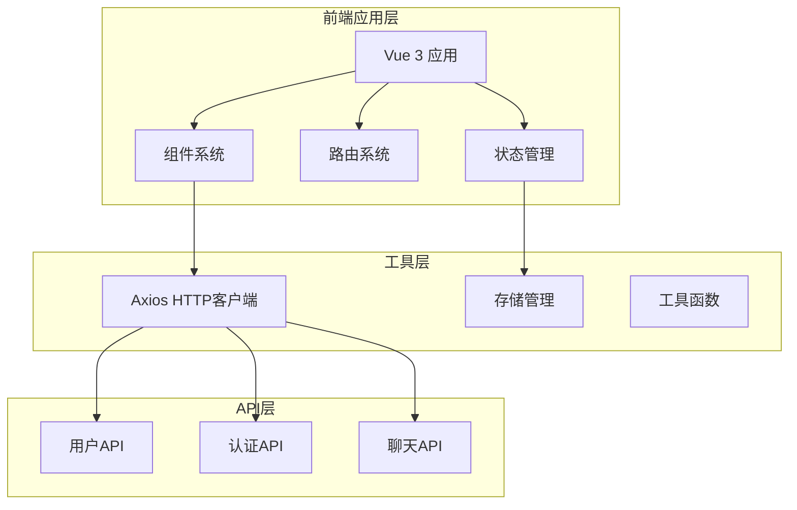
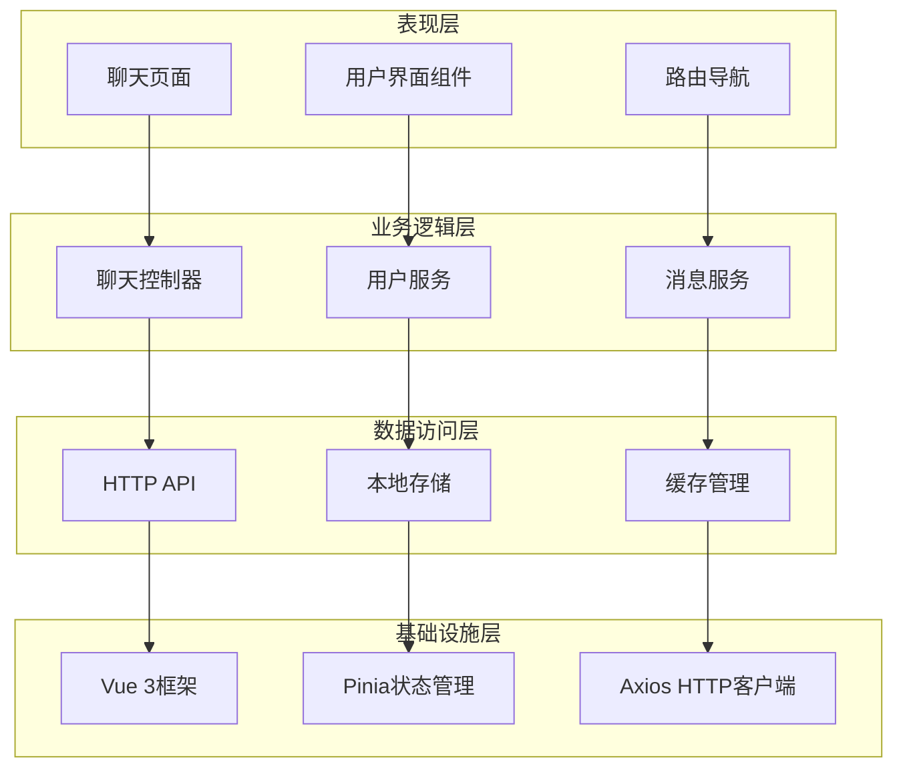
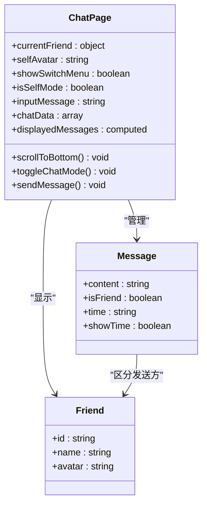
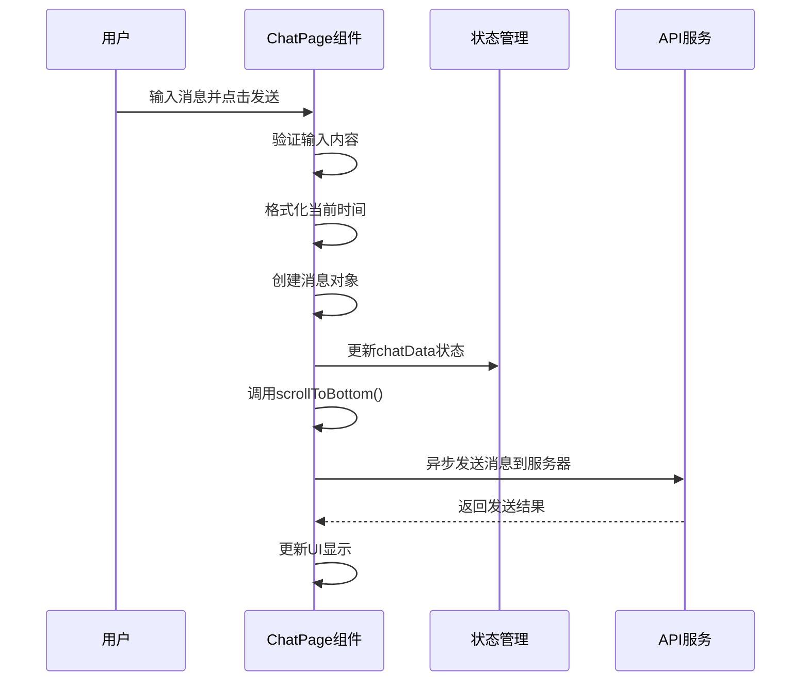
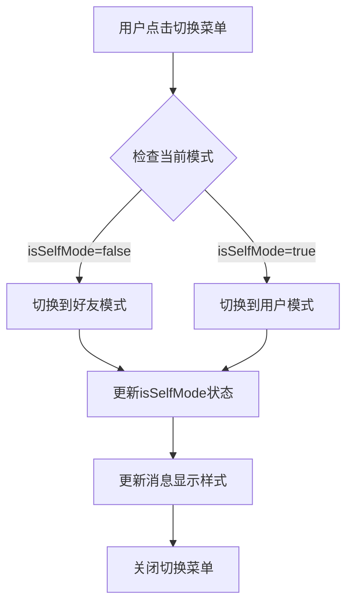
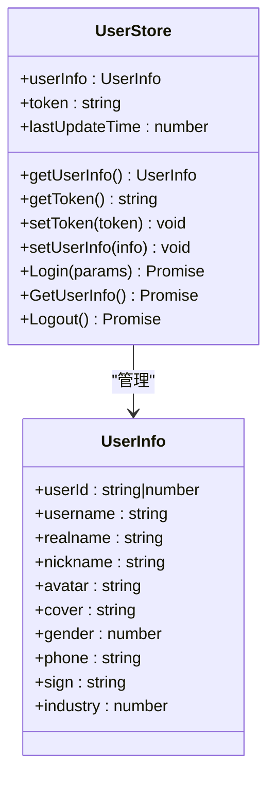
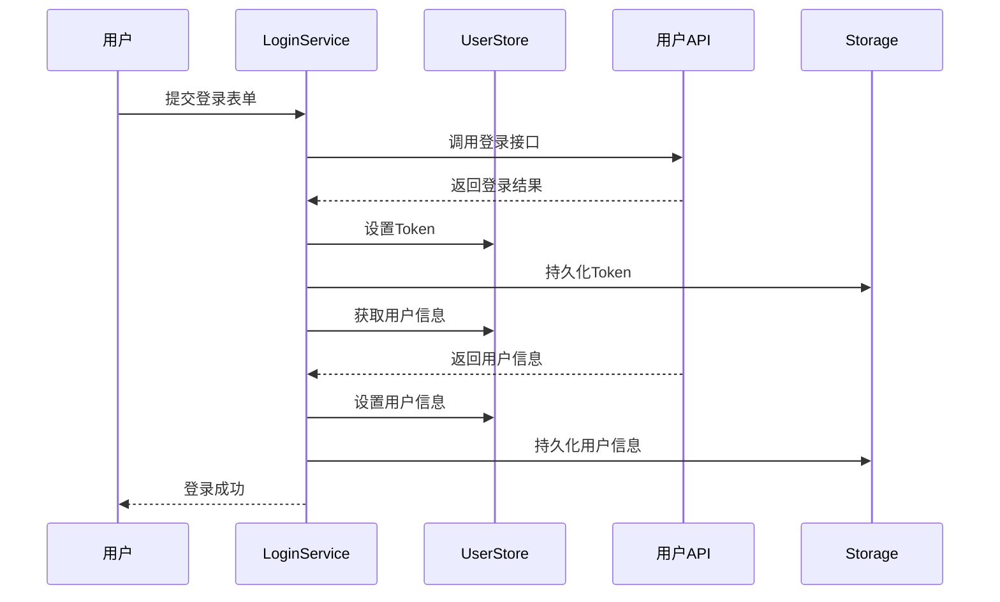
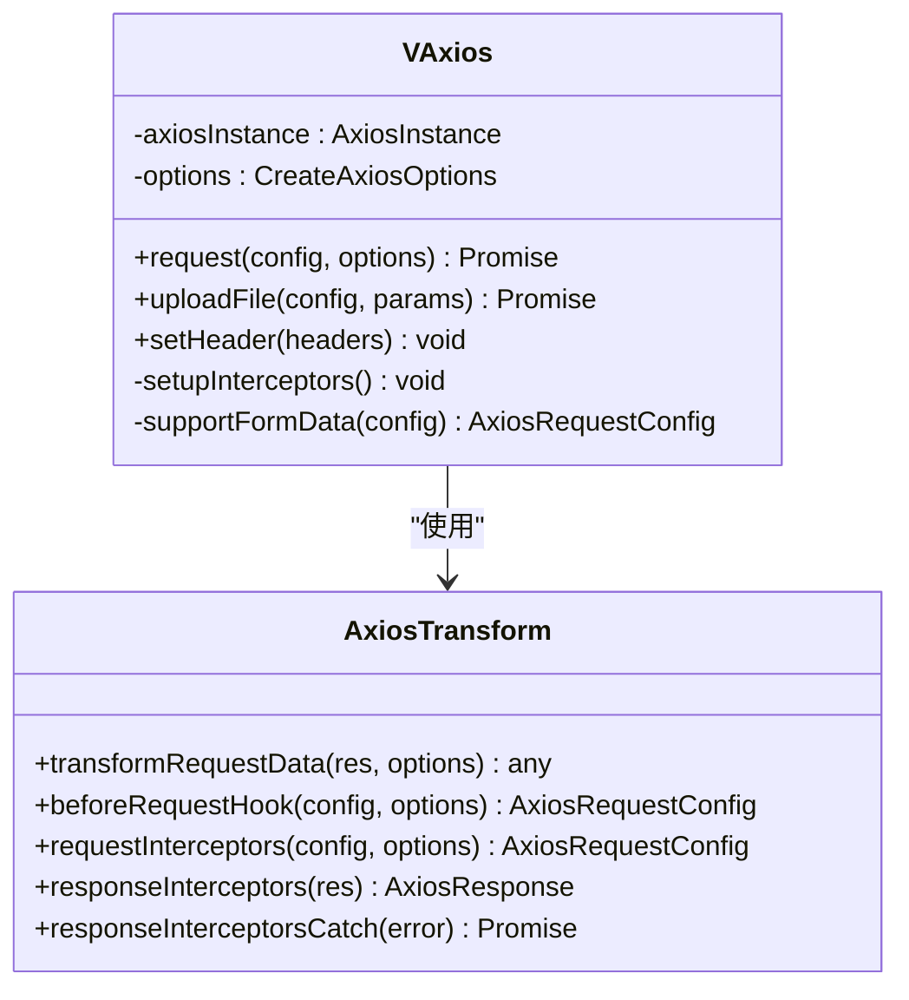
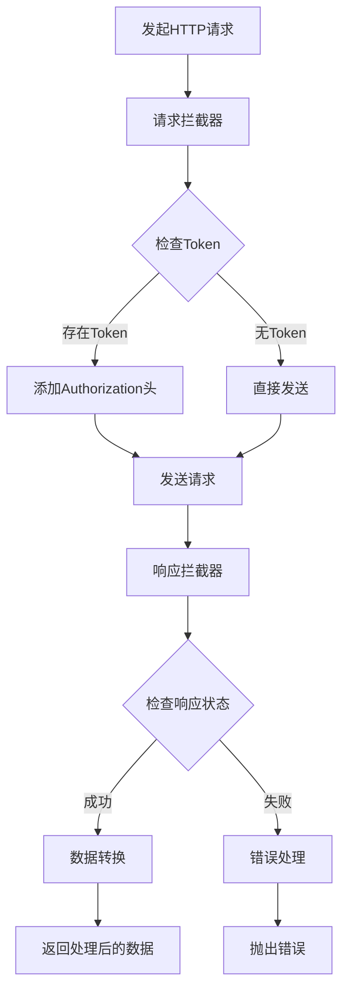
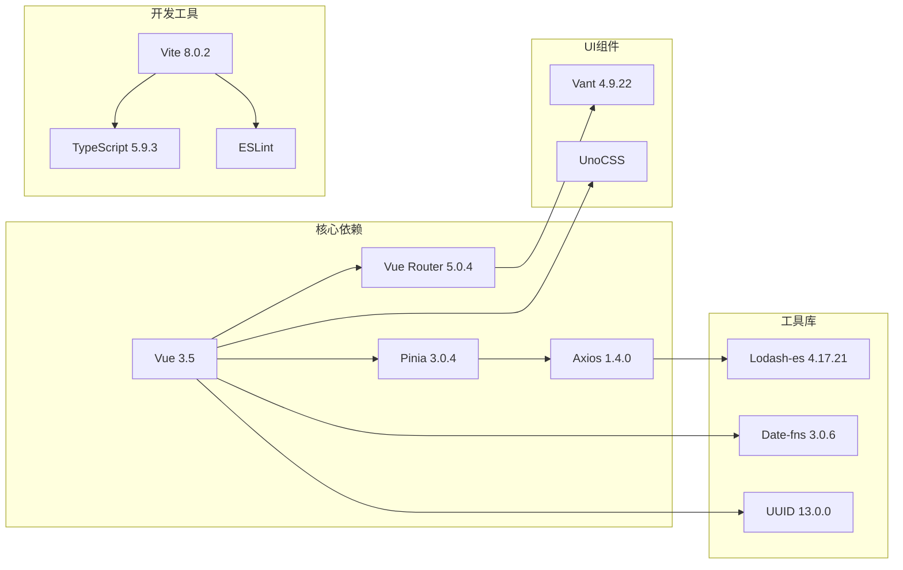

# 聊天系统

<cite>
**本文档引用的文件**
- [src/views/chat/index.vue](file://src/views/chat/index.vue)
- [src/store/modules/user.ts](file://src/store/modules/user.ts)
- [src/store/modules/route.ts](file://src/store/modules/route.ts)
- [src/router/modules.ts](file://src/router/modules.ts)
- [src/router/index.ts](file://src/router/index.ts)
- [src/router/base.ts](file://src/router/base.ts)
- [src/router/router-guards.ts](file://src/router/router-guards.ts)
- [src/api/system/user.ts](file://src/api/system/user.ts)
- [src/utils/http/axios/Axios.ts](file://src/utils/http/axios/Axios.ts)
- [src/utils/http/axios/index.ts](file://src/utils/http/axios/index.ts)
- [src/utils/Storage.ts](file://src/utils/Storage.ts)
- [src/main.ts](file://src/main.ts)
- [src/App.vue](file://src/App.vue)
- [src/store/index.ts](file://src/store/index.ts)
- [package.json](file://package.json)
</cite>

## 目录
1. [简介](#简介)
2. [项目结构](#项目结构)
3. [核心组件](#核心组件)
4. [架构概览](#架构概览)
5. [详细组件分析](#详细组件分析)
6. [依赖关系分析](#依赖关系分析)
7. [性能考虑](#性能考虑)
8. [故障排除指南](#故障排除指南)
9. [结论](#结论)

## 简介

这是一个基于 Vue 3.5、Vant 4 移动端聊天系统的完整实现。项目采用现代化的前端技术栈，包括 TypeScript、Pinia 状态管理、Vue Router 路由系统、Axios HTTP 客户端等核心技术。系统提供了完整的聊天功能，包括消息发送、接收、显示以及用户认证等功能。

## 项目结构

该项目采用模块化的组织方式，主要分为以下几个核心部分：

**图表来源**
- [src/main.ts:19-44](file://src/main.ts#L19-L44)
- [src/App.vue:1-80](file://src/App.vue#L1-L80)

**章节来源**
- [src/main.ts:1-44](file://src/main.ts#L1-L44)
- [package.json:41-56](file://package.json#L41-L56)

## 核心组件

### 聊天页面组件

聊天页面是整个系统的核心组件，实现了完整的聊天功能：

- **消息显示区域**：支持左右布局的消息展示，区分用户发送和好友发送的消息
- **消息输入区域**：包含文本输入框和功能按钮
- **消息切换功能**：支持模拟好友视角和用户视角的切换
- **自动滚动功能**：新消息自动滚动到底部

### 状态管理系统

系统使用 Pinia 进行状态管理，主要包括：

- **用户状态管理**：处理用户登录、登出、用户信息获取
- **路由状态管理**：管理路由配置和组件缓存
- **持久化存储**：使用 Pinia Persisted State 插件实现状态持久化

### HTTP 客户端

基于 Axios 封装的 HTTP 客户端，提供了：

- **请求拦截器**：自动添加 Token 和处理请求配置
- **响应拦截器**：统一处理响应数据和错误信息
- **取消重复请求**：防止重复请求造成的数据混乱
- **错误处理**：统一的错误处理机制

**章节来源**
- [src/views/chat/index.vue:105-232](file://src/views/chat/index.vue#L105-L232)
- [src/store/modules/user.ts:36-109](file://src/store/modules/user.ts#L36-L109)
- [src/utils/http/axios/Axios.ts:18-225](file://src/utils/http/axios/Axios.ts#L18-L225)

## 架构概览

系统采用分层架构设计，各层职责明确：

**图表来源**
- [src/views/chat/index.vue:99-232](file://src/views/chat/index.vue#L99-L232)
- [src/store/modules/user.ts:1-115](file://src/store/modules/user.ts#L1-L115)
- [src/utils/http/axios/index.ts:240-287](file://src/utils/http/axios/index.ts#L240-L287)

## 详细组件分析

### 聊天页面组件分析

聊天页面组件实现了完整的聊天功能，包括消息的发送、显示和交互。

**图表来源**
- [src/views/chat/index.vue:105-188](file://src/views/chat/index.vue#L105-L188)

#### 消息发送流程

**图表来源**
- [src/views/chat/index.vue:205-223](file://src/views/chat/index.vue#L205-L223)

#### 聊天模式切换流程

**图表来源**
- [src/views/chat/index.vue:199-203](file://src/views/chat/index.vue#L199-L203)

**章节来源**
- [src/views/chat/index.vue:1-245](file://src/views/chat/index.vue#L1-L245)

### 用户状态管理分析

用户状态管理模块负责处理用户相关的所有状态和操作。

**图表来源**
- [src/store/modules/user.ts:12-62](file://src/store/modules/user.ts#L12-L62)

#### 登录流程

**图表来源**
- [src/store/modules/user.ts:64-77](file://src/store/modules/user.ts#L64-L77)

**章节来源**
- [src/store/modules/user.ts:1-115](file://src/store/modules/user.ts#L1-L115)

### HTTP 客户端分析

HTTP 客户端基于 Axios 封装，提供了完整的请求和响应处理机制。

**图表来源**
- [src/utils/http/axios/Axios.ts:18-112](file://src/utils/http/axios/Axios.ts#L18-L112)

#### 请求拦截流程

**图表来源**
- [src/utils/http/axios/index.ts:187-198](file://src/utils/http/axios/index.ts#L187-L198)

**章节来源**
- [src/utils/http/axios/Axios.ts:1-225](file://src/utils/http/axios/Axios.ts#L1-L225)
- [src/utils/http/axios/index.ts:1-298](file://src/utils/http/axios/index.ts#L1-L298)

## 依赖关系分析

系统依赖关系清晰，各模块之间耦合度适中：

**图表来源**
- [package.json:41-106](file://package.json#L41-L106)

**章节来源**
- [package.json:1-121](file://package.json#L1-L121)

## 性能考虑

系统在性能方面采用了多项优化措施：

### 内存管理
- 使用虚拟滚动减少大量消息时的内存占用
- 实现消息数据的懒加载和按需渲染
- 合理的组件销毁和清理机制

### 网络优化
- 请求去重和取消机制
- 自动重连和错误恢复
- 缓存策略优化

### UI性能
- 虚拟列表实现大消息列表的流畅滚动
- 图片懒加载和压缩
- 动画性能优化

## 故障排除指南

### 常见问题及解决方案

#### 登录认证问题
- **问题**：登录后无法获取用户信息
- **原因**：Token 无效或过期
- **解决**：检查 Token 存储和刷新机制

#### 消息发送失败
- **问题**：消息发送后没有收到响应
- **原因**：网络连接问题或服务器错误
- **解决**：检查网络状态和服务器日志

#### 状态同步问题
- **问题**：页面刷新后状态丢失
- **原因**：持久化存储配置问题
- **解决**：检查 Pinia Persisted State 配置

**章节来源**
- [src/router/router-guards.ts:11-44](file://src/router/router-guards.ts#L11-L44)
- [src/utils/http/axios/index.ts:203-237](file://src/utils/http/axios/index.ts#L203-L237)

## 结论

这个聊天系统是一个功能完整、架构清晰的移动端应用。系统采用了现代化的前端技术栈，具有良好的可维护性和扩展性。主要特点包括：

- **完整的聊天功能**：支持消息发送、接收和显示
- **现代化的技术栈**：Vue 3、TypeScript、Pinia 等
- **良好的用户体验**：响应式设计和流畅的交互
- **完善的错误处理**：统一的错误处理和用户反馈
- **可扩展的架构**：模块化设计便于功能扩展

系统为后续的功能扩展和优化奠定了良好的基础，可以根据实际需求进一步增强功能和性能。