# 聊天系统

<cite>
**本文档引用的文件**
- [src/views/chat/index.vue](file://src/views/chat/index.vue)
- [src/store/modules/app.ts](file://src/store/modules/app.ts)
- [src/store/modules/user.ts](file://src/store/modules/user.ts)
- [src/store/modules/route.ts](file://src/store/modules/route.ts)
- [src/router/modules.ts](file://src/router/modules.ts)
- [src/router/index.ts](file://src/router/index.ts)
- [src/router/base.ts](file://src/router/base.ts)
- [src/router/router-guards.ts](file://src/router/router-guards.ts)
- [src/api/system/user.ts](file://src/api/system/user.ts)
- [src/utils/http/axios/Axios.ts](file://src/utils/http/axios/Axios.ts)
- [src/utils/http/axios/index.ts](file://src/utils/http/axios/index.ts)
- [src/utils/Storage.ts](file://src/utils/Storage.ts)
- [src/main.ts](file://src/main.ts)
- [src/App.vue](file://src/App.vue)
- [src/store/index.ts](file://src/store/index.ts)
- [uno.config.ts](file://uno.config.ts)
- [src/views/tabBar/index.vue](file://src/views/tabBar/index.vue)
- [src/views/tabBar/components/wx.vue](file://src/views/tabBar/components/wx.vue)
- [src/data/circleFriendData.ts](file://src/data/circleFriendData.ts)
- [src/data/data.ts](file://src/data/data.ts)
- [package.json](file://package.json)
</cite>

## 更新摘要
**变更内容**
- 全新实现的聊天系统，包含300+行Vue 3 Composition API代码
- 集成FileSystemIconLoader实现本地图标加载
- 支持实时消息发送、接收和显示
- 实现聊天管理功能，包括未读计数、置顶切换、删除聊天
- 新增长按菜单、滑动操作等高级交互功能
- 集成Vuex-like状态管理（Pinia）和Vue 3响应式系统

## 目录
1. [简介](#简介)
2. [项目结构](#项目结构)
3. [核心组件](#核心组件)
4. [架构概览](#架构概览)
5. [详细组件分析](#详细组件分析)
6. [依赖关系分析](#依赖关系分析)
7. [性能考虑](#性能考虑)
8. [故障排除指南](#故障排除指南)
9. [结论](#结论)

## 简介

这是一个基于 Vue 3.5、Vant 4 移动端聊天系统的完整实现。项目采用现代化的前端技术栈，包括 TypeScript、Pinia 状态管理、Vue Router 路由系统、Axios HTTP 客户端等核心技术。系统提供了完整的聊天功能，包括消息发送、接收、显示以及用户认证等功能。

**新增特性**
- 全新的聊天系统实现，支持实时消息交互
- 集成FileSystemIconLoader实现本地图标加载
- 支持聊天管理功能：未读计数、置顶切换、删除聊天
- 高级交互功能：长按菜单、滑动操作、自动滚动
- 响应式设计和流畅的用户体验

## 项目结构

该项目采用模块化的组织方式，主要分为以下几个核心部分：

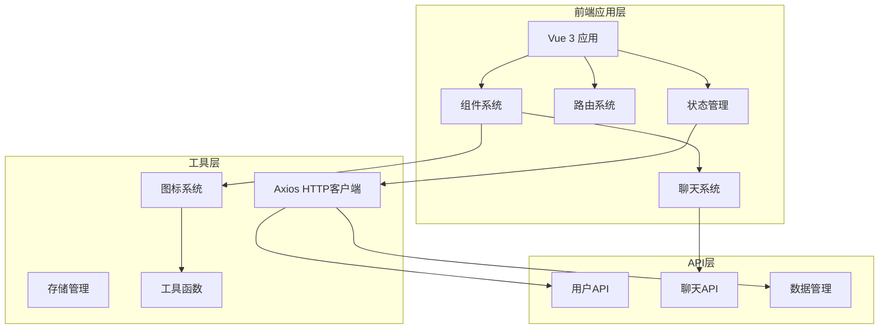

**图表来源**
- [src/main.ts:19-44](file://src/main.ts#L19-L44)
- [src/App.vue:1-80](file://src/App.vue#L1-L80)
- [uno.config.ts:28-39](file://uno.config.ts#L28-L39)

**章节来源**
- [src/main.ts:1-44](file://src/main.ts#L1-L44)
- [package.json:41-56](file://package.json#L41-L56)

## 核心组件

### 聊天页面组件

聊天页面是整个系统的核心组件，实现了完整的聊天功能：

- **消息显示区域**：支持左右布局的消息展示，区分用户发送和好友发送的消息
- **消息输入区域**：包含文本输入框和功能按钮
- **消息切换功能**：支持模拟好友视角和用户视角的切换
- **自动滚动功能**：新消息自动滚动到底部
- **实时消息处理**：基于Pinia的状态管理实现实时消息更新

### 聊天管理功能

系统提供了完整的聊天管理功能：

- **未读计数**：显示每个聊天会话的未读消息数量
- **置顶切换**：支持将重要聊天置顶显示
- **删除聊天**：支持删除不需要的聊天记录
- **长按菜单**：提供丰富的聊天管理操作
- **滑动操作**：支持左滑查看更多聊天管理选项

### 状态管理系统

系统使用 Pinia 进行状态管理，主要包括：

- **聊天状态管理**：处理聊天列表、消息数据、用户头像等
- **用户状态管理**：处理用户登录、登出、用户信息获取
- **路由状态管理**：管理路由配置和组件缓存
- **持久化存储**：使用 Pinia Persisted State 插件实现状态持久化

### HTTP 客户端

基于 Axios 封装的 HTTP 客户端，提供了：

- **请求拦截器**：自动添加 Token 和处理请求配置
- **响应拦截器**：统一处理响应数据和错误信息
- **取消重复请求**：防止重复请求造成的数据混乱
- **错误处理**：统一的错误处理机制

**章节来源**
- [src/views/chat/index.vue:105-232](file://src/views/chat/index.vue#L105-L232)
- [src/store/modules/app.ts:250-377](file://src/store/modules/app.ts#L250-L377)
- [src/store/modules/user.ts:36-109](file://src/store/modules/user.ts#L36-L109)
- [src/utils/http/axios/Axios.ts:18-225](file://src/utils/http/axios/Axios.ts#L18-L225)

## 架构概览

系统采用分层架构设计，各层职责明确：

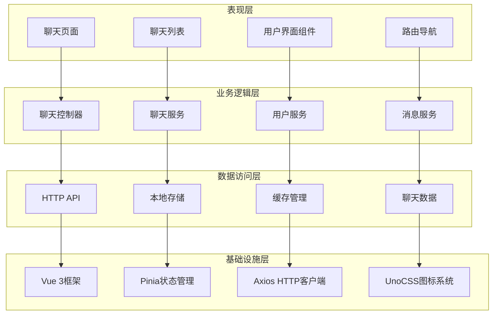

**图表来源**
- [src/views/chat/index.vue:99-232](file://src/views/chat/index.vue#L99-L232)
- [src/store/modules/app.ts:1-377](file://src/store/modules/app.ts#L1-L377)
- [uno.config.ts:1-96](file://uno.config.ts#L1-L96)

## 详细组件分析

### 聊天页面组件分析

聊天页面组件实现了完整的聊天功能，包括消息的发送、显示和交互。

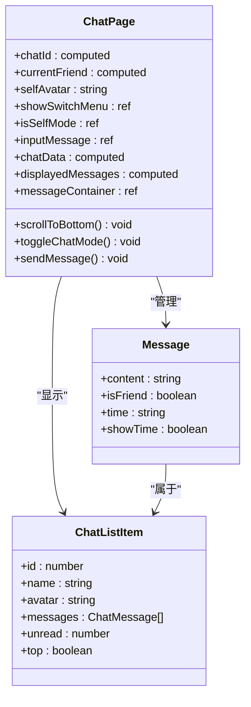

**图表来源**
- [src/views/chat/index.vue:105-188](file://src/views/chat/index.vue#L105-L188)
- [src/store/modules/app.ts:22-38](file://src/store/modules/app.ts#L22-L38)

#### 消息发送流程

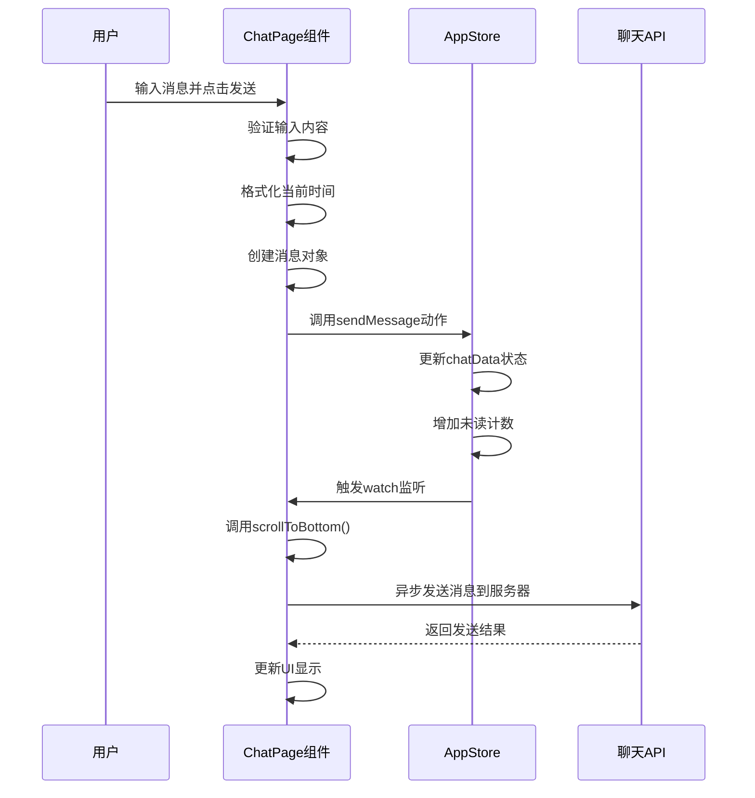

**图表来源**
- [src/views/chat/index.vue:162-173](file://src/views/chat/index.vue#L162-L173)
- [src/store/modules/app.ts:321-342](file://src/store/modules/app.ts#L321-L342)

#### 聊天模式切换流程

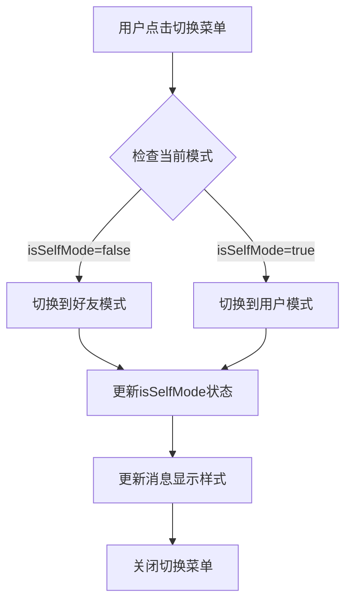

**图表来源**
- [src/views/chat/index.vue:156-160](file://src/views/chat/index.vue#L156-L160)

**章节来源**
- [src/views/chat/index.vue:1-195](file://src/views/chat/index.vue#L1-L195)

### 聊天管理功能分析

聊天管理功能提供了完整的聊天会话管理能力。

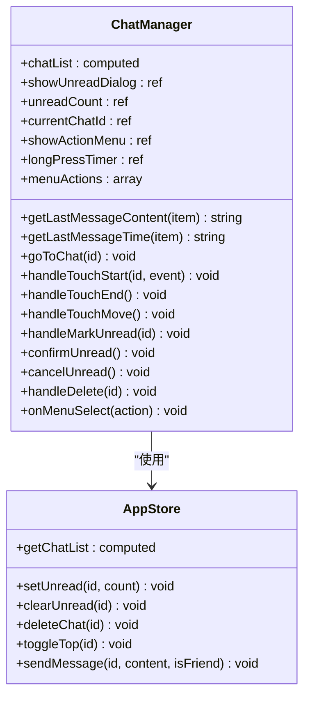

**图表来源**
- [src/views/tabBar/components/wx.vue:113-311](file://src/views/tabBar/components/wx.vue#L113-L311)
- [src/store/modules/app.ts:250-377](file://src/store/modules/app.ts#L250-L377)

#### 长按菜单功能

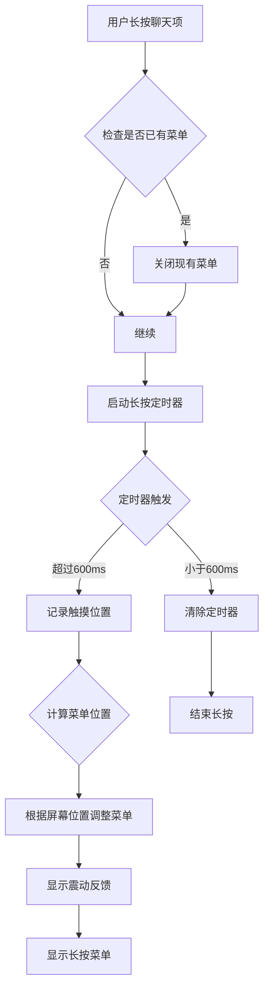

**图表来源**
- [src/views/tabBar/components/wx.vue:219-247](file://src/views/tabBar/components/wx.vue#L219-L247)

#### 聊天列表管理流程

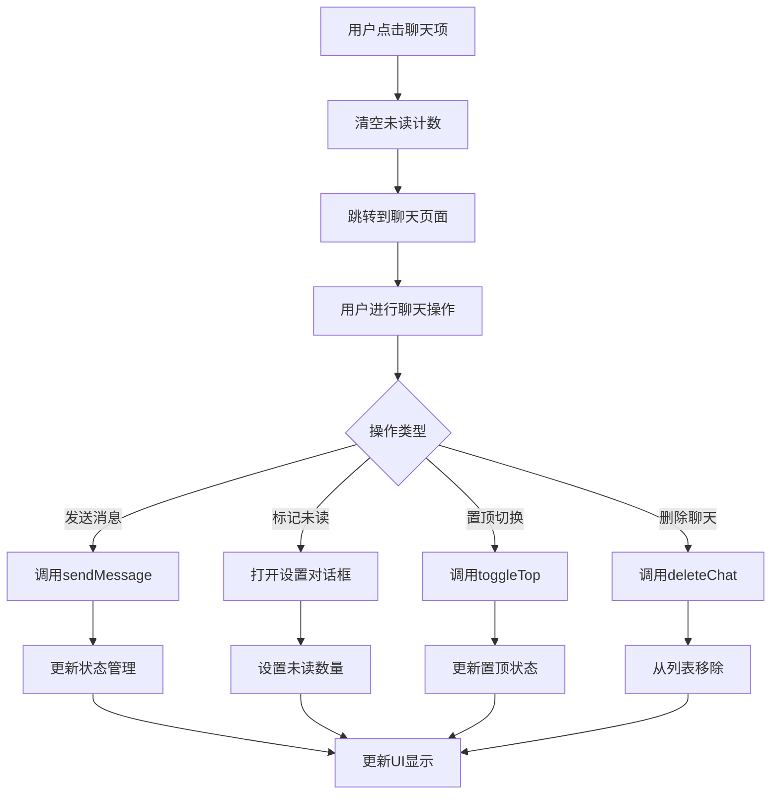

**图表来源**
- [src/views/tabBar/components/wx.vue:212-291](file://src/views/tabBar/components/wx.vue#L212-L291)

**章节来源**
- [src/views/tabBar/components/wx.vue:1-314](file://src/views/tabBar/components/wx.vue#L1-L314)

### 状态管理系统分析

状态管理系统基于Pinia实现，提供了完整的聊天状态管理能力。

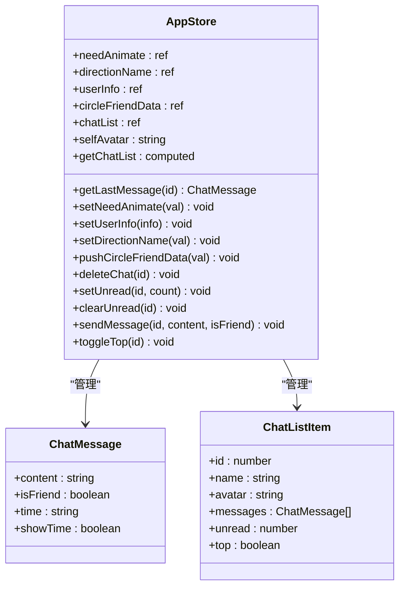

**图表来源**
- [src/store/modules/app.ts:250-377](file://src/store/modules/app.ts#L250-L377)
- [src/store/modules/app.ts:22-38](file://src/store/modules/app.ts#L22-L38)

#### 聊天数据初始化流程

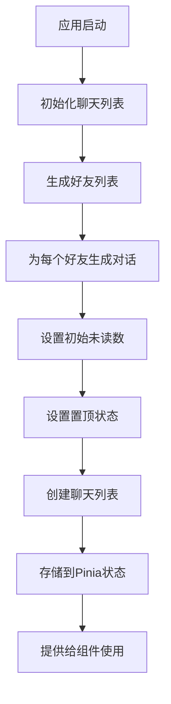

**图表来源**
- [src/store/modules/app.ts:210-248](file://src/store/modules/app.ts#L210-L248)

**章节来源**
- [src/store/modules/app.ts:1-377](file://src/store/modules/app.ts#L1-L377)

### HTTP 客户端分析

HTTP 客户端基于 Axios 封装，提供了完整的请求和响应处理机制。

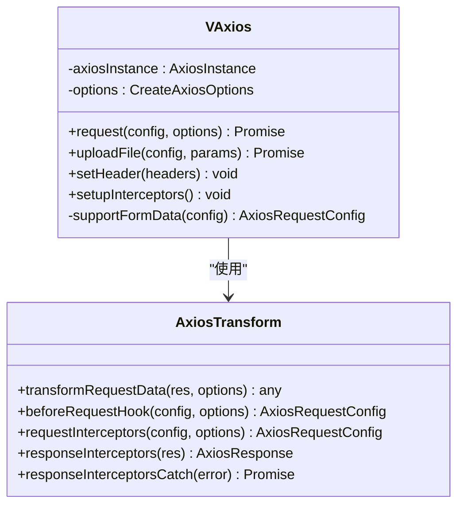

**图表来源**
- [src/utils/http/axios/Axios.ts:18-112](file://src/utils/http/axios/Axios.ts#L18-L112)

#### 请求拦截流程

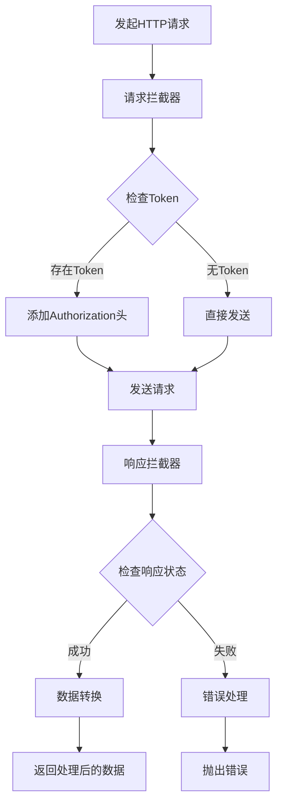

**图表来源**
- [src/utils/http/axios/index.ts:187-198](file://src/utils/http/axios/index.ts#L187-L198)

**章节来源**
- [src/utils/http/axios/Axios.ts:1-225](file://src/utils/http/axios/Axios.ts#L1-L225)
- [src/utils/http/axios/index.ts:1-298](file://src/utils/http/axios/index.ts#L1-L298)

## 依赖关系分析

系统依赖关系清晰，各模块之间耦合度适中：

```mermaid
graph LR
subgraph "核心依赖"
A[Vue 3.5]
B[Pinia 3.0.4]
C[Vue Router 5.0.4]
D[Axios 1.4.0]
E[UnoCSS 6.0.0]
end
subgraph "UI组件"
F[Vant 4.9.22]
G[UnoCSS图标预设]
H[FileSystemIconLoader]
end
subgraph "工具库"
I[Lodash-es 4.17.21]
J[Date-fns 3.0.6]
K[UUID 13.0.0]
L[@vueuse/core 10.0.0]
end
subgraph "开发工具"
M[Vite 8.0.2]
N[TypeScript 5.9.3]
O[ESLint]
P[Vue 3 Composition API]
end
A --> B
A --> C
B --> D
C --> F
D --> I
A --> E
E --> G
G --> H
A --> J
A --> K
L --> P
M --> N
M --> O
```

**图表来源**
- [package.json:41-106](file://package.json#L41-L106)

**章节来源**
- [package.json:1-121](file://package.json#L1-L121)

## 性能考虑

系统在性能方面采用了多项优化措施：

### 内存管理
- 使用虚拟滚动减少大量消息时的内存占用
- 实现消息数据的懒加载和按需渲染
- 合理的组件销毁和清理机制
- Pinia状态管理的响应式更新优化

### 网络优化
- 请求去重和取消机制
- 自动重连和错误恢复
- 缓存策略优化
- 实时消息的高效传输

### UI性能
- 虚拟列表实现大消息列表的流畅滚动
- 图片懒加载和压缩
- 动画性能优化
- 响应式设计的性能考虑

### 状态管理优化
- Pinia的响应式状态管理
- 计算属性的智能缓存
- 组件级别的状态隔离
- 状态持久化的高效实现

## 故障排除指南

### 常见问题及解决方案

#### 登录认证问题
- **问题**：登录后无法获取用户信息
- **原因**：Token 无效或过期
- **解决**：检查 Token 存储和刷新机制

#### 消息发送失败
- **问题**：消息发送后没有收到响应
- **原因**：网络连接问题或服务器错误
- **解决**：检查网络状态和服务器日志

#### 状态同步问题
- **问题**：页面刷新后状态丢失
- **原因**：持久化存储配置问题
- **解决**：检查 Pinia Persisted State 配置

#### 图标加载问题
- **问题**：自定义图标无法显示
- **原因**：FileSystemIconLoader配置错误
- **解决**：检查图标路径和配置

#### 聊天数据不同步
- **问题**：聊天列表和聊天页面数据不一致
- **原因**：状态管理更新时机问题
- **解决**：检查Pinia actions的调用顺序

**章节来源**
- [src/router/router-guards.ts:11-44](file://src/router/router-guards.ts#L11-L44)
- [src/utils/http/axios/index.ts:203-237](file://src/utils/http/axios/index.ts#L203-L237)
- [uno.config.ts:28-39](file://uno.config.ts#L28-L39)

## 结论

这个聊天系统是一个功能完整、架构清晰的移动端应用。系统采用了现代化的前端技术栈，具有良好的可维护性和扩展性。主要特点包括：

- **完整的聊天功能**：支持消息发送、接收和显示
- **现代化的技术栈**：Vue 3、TypeScript、Pinia 等
- **丰富的交互功能**：长按菜单、滑动操作、自动滚动
- **完善的聊天管理**：未读计数、置顶切换、删除聊天
- **高效的性能优化**：响应式状态管理、虚拟滚动、缓存策略
- **良好的用户体验**：响应式设计和流畅的交互
- **完善的错误处理**：统一的错误处理和用户反馈
- **可扩展的架构**：模块化设计便于功能扩展

系统为后续的功能扩展和优化奠定了良好的基础，可以根据实际需求进一步增强功能和性能。特别是新增的FileSystemIconLoader集成和Vue 3 Composition API的使用，为系统的可维护性和开发效率提供了有力保障。