# 路由系统

<cite>
**本文引用的文件列表**
- [src/router/index.ts](file://src/router/index.ts)
- [src/router/router-guards.ts](file://src/router/router-guards.ts)
- [src/router/base.ts](file://src/router/base.ts)
- [src/router/modules.ts](file://src/router/modules.ts)
- [src/store/modules/route.ts](file://src/store/modules/route.ts)
- [src/store/modules/user.ts](file://src/store/modules/user.ts)
- [src/layout/index.vue](file://src/layout/index.vue)
- [src/layout/components/FloatingNavBar.vue](file://src/layout/components/FloatingNavBar.vue)
- [src/views/tabBar/index.vue](file://src/views/tabBar/index.vue)
- [src/views/tabBar/components/wx.vue](file://src/views/tabBar/components/wx.vue)
- [src/views/tabBar/components/address.vue](file://src/views/tabBar/components/address.vue)
- [src/views/tabBar/components/find.vue](file://src/views/tabBar/components/find.vue)
- [src/views/tabBar/components/mine.vue](file://src/views/tabBar/components/mine.vue)
- [src/views/exception/ErrorPage.vue](file://src/views/exception/ErrorPage.vue)
- [src/views/exception/404.vue](file://src/views/exception/404.vue)
- [src/main.ts](file://src/main.ts)
- [src/App.vue](file://src/App.vue)
- [src/hooks/useRouteTransition.ts](file://src/hooks/useRouteTransition.ts)
- [src/hooks/useSwipeBack.ts](file://src/hooks/useSwipeBack.ts)
- [src/styles/transition/wx-slide.less](file://src/styles/transition/wx-slide.less)
- [src/styles/transition/index.less](file://src/styles/transition/index.less)
- [types/router.d.ts](file://types/router.d.ts)
- [src/enums/pageEnum.ts](file://src/enums/pageEnum.ts)
- [src/store/index.ts](file://src/store/index.ts)
- [package.json](file://package.json)
</cite>

## 目录
1. [简介](#简介)
2. [项目结构](#项目结构)
3. [核心组件](#核心组件)
4. [架构总览](#架构总览)
5. [详细组件分析](#详细组件分析)
6. [依赖关系分析](#依赖关系分析)
7. [性能考量](#性能考量)
8. [故障排查指南](#故障排查指南)
9. [结论](#结论)
10. [附录：最佳实践与示例路径](#附录最佳实践与示例路径)

## 简介
本文件系统性梳理 Vue Router 路由体系在本项目中的设计与实现，重点覆盖：
- 静态常量路由与动态模块化路由的组合架构
- 导航守卫的实现与权限校验流程
- 路由缓存策略与 KeepAlive 的联动
- 路由模块化组织方式与扩展方法
- 路由懒加载、嵌套路由、路由参数传递等最佳实践
- 登录守卫、权限控制与路由状态管理的实际应用示例路径
- **新增**：错误页面路由配置与统一错误处理机制
- **新增**：微信风格路由过渡动画与滑动返回手势支持
- **新增**：Tabbar 导航系统的完整实现，包括浮动导航栏和多页面 Tabbar 结构

## 项目结构
路由系统主要由以下部分组成：
- 路由入口与初始化：负责创建路由器、注入常量路由与模块化路由，并挂载守卫
- 路由守卫：统一处理登录拦截、白名单放行、标题设置、导航进度条与缓存策略
- 基础路由定义：根路由、登录页、错误页与 **新增的 Tabbar 路由**等常量路由
- 动态模块路由：按功能域划分的模块化路由集合
- 状态管理：Pinia 中的路由与用户状态，用于维护菜单、路由表与缓存组件集合
- 布局与缓存：Layout 组件结合 KeepAlive 实现组件级缓存
- **新增**：错误页面路由配置，提供统一的错误处理界面
- **新增**：微信风格路由过渡系统，提供前进/后退动画与手势滑动返回
- **新增**：FloatingNavBar 浮动导航栏组件，提供现代化的 Tabbar 导航体验

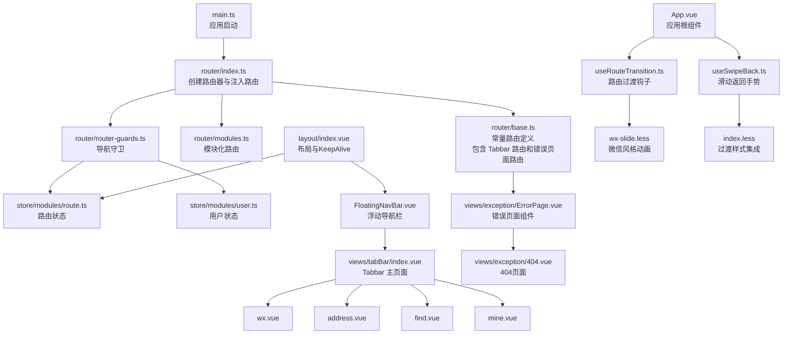

**图表来源**
- [src/main.ts:18-27](file://src/main.ts#L18-L27)
- [src/router/index.ts:19-30](file://src/router/index.ts#L19-L30)
- [src/router/base.ts:28-57](file://src/router/base.ts#L28-L57)
- [src/router/modules.ts:5-146](file://src/router/modules.ts#L5-L146)
- [src/router/router-guards.ts:17-92](file://src/router/router-guards.ts#L17-L92)
- [src/store/modules/route.ts:11-39](file://src/store/modules/route.ts#L11-L39)
- [src/store/modules/user.ts:36-114](file://src/store/modules/user.ts#L36-L114)
- [src/layout/index.vue:6-13](file://src/layout/index.vue#L6-L13)
- [src/layout/components/FloatingNavBar.vue:1-549](file://src/layout/components/FloatingNavBar.vue#L1-L549)
- [src/views/tabBar/index.vue:1-192](file://src/views/tabBar/index.vue#L1-L192)
- [src/views/exception/ErrorPage.vue:1-59](file://src/views/exception/ErrorPage.vue#L1-L59)
- [src/views/exception/404.vue:1-41](file://src/views/exception/404.vue#L1-L41)
- [src/App.vue:17-31](file://src/App.vue#L17-L31)
- [src/hooks/useRouteTransition.ts:13-61](file://src/hooks/useRouteTransition.ts#L13-L61)
- [src/hooks/useSwipeBack.ts:10-74](file://src/hooks/useSwipeBack.ts#L10-L74)
- [src/styles/transition/wx-slide.less:1-70](file://src/styles/transition/wx-slide.less#L1-L70)
- [src/styles/transition/index.less:1-14](file://src/styles/transition/index.less#L1-L14)

**章节来源**
- [src/main.ts:18-27](file://src/main.ts#L18-L27)
- [src/router/index.ts:19-30](file://src/router/index.ts#L19-L30)
- [src/router/base.ts:28-57](file://src/router/base.ts#L28-L57)
- [src/router/modules.ts:5-146](file://src/router/modules.ts#L5-L146)
- [src/router/router-guards.ts:17-92](file://src/router/router-guards.ts#L17-L92)
- [src/store/modules/route.ts:11-39](file://src/store/modules/route.ts#L11-L39)
- [src/store/modules/user.ts:36-114](file://src/store/modules/user.ts#L36-L114)
- [src/layout/index.vue:6-13](file://src/layout/index.vue#L6-L13)

## 核心组件
- 路由器创建与注入
  - 在入口文件中创建路由器，注入常量路由与模块化路由，并挂载守卫
  - 参考路径：[src/router/index.ts:19-30](file://src/router/index.ts#L19-L30)
- 常量路由
  - 包含登录页、根路由、错误页与 **新增的 Tabbar 路由**，作为全局基础路由
  - **更新**：新增完整的错误页面路由配置，支持嵌套子路由
  - 参考路径：[src/router/base.ts:28-57](file://src/router/base.ts#L28-L57)
- 模块化路由
  - 按功能域划分的嵌套路由集合，支持懒加载与缓存控制
  - 参考路径：[src/router/modules.ts:5-146](file://src/router/modules.ts#L5-L146)
- 路由守卫
  - beforeEach：登录拦截、白名单放行、用户信息拉取
  - afterEach：标题设置、导航进度条、KeepAlive 缓存策略
  - 参考路径：[src/router/router-guards.ts:17-92](file://src/router/router-guards.ts#L17-L92)
- 路由状态与用户状态
  - 路由状态：维护菜单、路由表与 KeepAlive 组件集合
  - 用户状态：维护 Token、用户信息与最后更新时间
  - 参考路径：[src/store/modules/route.ts:11-39](file://src/store/modules/route.ts#L11-L39)、[src/store/modules/user.ts:36-114](file://src/store/modules/user.ts#L36-L114)
- 布局与缓存
  - Layout 中通过 KeepAlive 结合路由状态实现组件级缓存
  - **新增**：FloatingNavBar 提供现代化的浮动 Tabbar 导航体验
  - 参考路径：[src/layout/index.vue:6-13](file://src/layout/index.vue#L6-L13)、[src/layout/components/FloatingNavBar.vue:1-549](file://src/layout/components/FloatingNavBar.vue#L1-L549)
- **新增**：错误页面路由配置
  - ErrorPageRoute：完整的错误页面路由结构，支持嵌套子路由
  - ErrorPage.vue：错误页面组件，提供导航栏和重试功能
  - 404.vue：标准 404 页面组件
  - 参考路径：[src/router/base.ts:6-26](file://src/router/base.ts#L6-L26)、[src/views/exception/ErrorPage.vue:1-59](file://src/views/exception/ErrorPage.vue#L1-L59)、[src/views/exception/404.vue:1-41](file://src/views/exception/404.vue#L1-L41)
- **新增**：微信风格路由过渡系统
  - useRouteTransition：维护路由历史栈，判断导航方向并生成过渡动画名称
  - useSwipeBack：实现从屏幕左边缘滑动返回的手势识别
  - wx-slide.less：提供微信 App 风格的滑动过渡动画
  - 参考路径：[src/hooks/useRouteTransition.ts:13-61](file://src/hooks/useRouteTransition.ts#L13-L61)、[src/hooks/useSwipeBack.ts:10-74](file://src/hooks/useSwipeBack.ts#L10-L74)、[src/styles/transition/wx-slide.less:1-70](file://src/styles/transition/wx-slide.less#L1-L70)
- **新增**：Tabbar 导航系统
  - Tabbar 主页面：微信、通讯录、发现、我的四个核心页面
  - 浮动导航栏：响应式设计，支持主题切换和动画效果
  - 地址组件：增强导航功能，支持跳转到错误页面
  - 参考路径：[src/views/tabBar/index.vue:1-192](file://src/views/tabBar/index.vue#L1-L192)、[src/layout/components/FloatingNavBar.vue:1-549](file://src/layout/components/FloatingNavBar.vue#L1-L549)、[src/views/tabBar/components/address.vue:158-161](file://src/views/tabBar/components/address.vue#L158-L161)

**章节来源**
- [src/router/index.ts:19-30](file://src/router/index.ts#L19-L30)
- [src/router/base.ts:6-26](file://src/router/base.ts#L6-L26)
- [src/router/base.ts:28-57](file://src/router/base.ts#L28-L57)
- [src/router/modules.ts:5-146](file://src/router/modules.ts#L5-L146)
- [src/router/router-guards.ts:17-92](file://src/router/router-guards.ts#L17-L92)
- [src/store/modules/route.ts:11-39](file://src/store/modules/route.ts#L11-L39)
- [src/store/modules/user.ts:36-114](file://src/store/modules/user.ts#L36-L114)
- [src/layout/index.vue:6-13](file://src/layout/index.vue#L6-L13)
- [src/layout/components/FloatingNavBar.vue:1-549](file://src/layout/components/FloatingNavBar.vue#L1-L549)
- [src/views/tabBar/index.vue:1-192](file://src/views/tabBar/index.vue#L1-L192)
- [src/views/exception/ErrorPage.vue:1-59](file://src/views/exception/ErrorPage.vue#L1-L59)
- [src/views/exception/404.vue:1-41](file://src/views/exception/404.vue#L1-L41)
- [src/hooks/useRouteTransition.ts:13-61](file://src/hooks/useRouteTransition.ts#L13-L61)
- [src/hooks/useSwipeBack.ts:10-74](file://src/hooks/useSwipeBack.ts#L10-L74)
- [src/styles/transition/wx-slide.less:1-70](file://src/styles/transition/wx-slide.less#L1-L70)
- [src/views/tabBar/components/address.vue:158-161](file://src/views/tabBar/components/address.vue#L158-L161)

## 架构总览
整体架构采用"常量路由 + 模块化路由"的组合模式，配合 Pinia 状态管理与导航守卫实现统一的权限与缓存策略。**新增的错误页面路由配置**提供了统一的错误处理机制，**新增的微信风格路由过渡系统**通过 useRouteTransition 和 useSwipeBack 提供自然流畅的移动端导航体验，**新增的 Tabbar 导航系统**通过 FloatingNavBar 组件提供现代化的移动端导航体验。

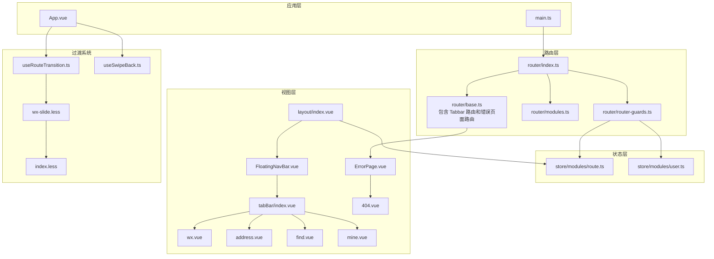

**图表来源**
- [src/main.ts:18-27](file://src/main.ts#L18-L27)
- [src/router/index.ts:19-30](file://src/router/index.ts#L19-L30)
- [src/router/base.ts:6-26](file://src/router/base.ts#L6-L26)
- [src/router/base.ts:28-57](file://src/router/base.ts#L28-L57)
- [src/router/modules.ts:5-146](file://src/router/modules.ts#L5-L146)
- [src/router/router-guards.ts:17-92](file://src/router/router-guards.ts#L17-L92)
- [src/store/modules/route.ts:11-39](file://src/store/modules/route.ts#L11-L39)
- [src/store/modules/user.ts:36-114](file://src/store/modules/user.ts#L36-L114)
- [src/layout/index.vue:6-13](file://src/layout/index.vue#L6-L13)
- [src/layout/components/FloatingNavBar.vue:1-549](file://src/layout/components/FloatingNavBar.vue#L1-L549)
- [src/views/tabBar/index.vue:1-192](file://src/views/tabBar/index.vue#L1-L192)
- [src/views/exception/ErrorPage.vue:1-59](file://src/views/exception/ErrorPage.vue#L1-L59)
- [src/views/exception/404.vue:1-41](file://src/views/exception/404.vue#L1-L41)
- [src/App.vue:17-31](file://src/App.vue#L17-L31)
- [src/hooks/useRouteTransition.ts:13-61](file://src/hooks/useRouteTransition.ts#L13-L61)
- [src/hooks/useSwipeBack.ts:10-74](file://src/hooks/useSwipeBack.ts#L10-L74)
- [src/styles/transition/wx-slide.less:1-70](file://src/styles/transition/wx-slide.less#L1-L70)
- [src/styles/transition/index.less:1-14](file://src/styles/transition/index.less#L1-L14)

## 详细组件分析

### 路由器创建与注入
- 创建 Hash 模式路由器，合并常量路由与模块化路由，设置严格模式与滚动行为
- 初始化时同步将模块化路由注入到路由状态中，供后续守卫与布局使用
- **更新**：现在包含新增的 Tabbar 路由和错误页面路由
- 参考路径：[src/router/index.ts:19-30](file://src/router/index.ts#L19-L30)

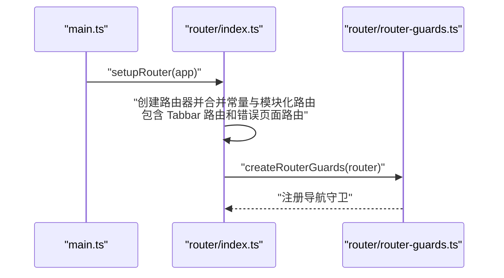

**图表来源**
- [src/main.ts:22-23](file://src/main.ts#L22-L23)
- [src/router/index.ts:19-30](file://src/router/index.ts#L19-L30)
- [src/router/router-guards.ts:17-17](file://src/router/router-guards.ts#L17-L17)

**章节来源**
- [src/router/index.ts:19-30](file://src/router/index.ts#L19-L30)
- [src/main.ts:22-23](file://src/main.ts#L22-L23)

### 常量路由与基础页面
- 根路由：重定向至首页，禁用过渡动画
- 登录页：独立路由，支持白名单放行，禁用过渡动画
- **新增**：错误页面路由：完整的嵌套路由结构，支持子路由和面包屑隐藏
- **新增**：Tabbar 路由：提供完整的 Tabbar 导航系统，禁用过渡动画
- 参考路径：[src/router/base.ts:28-57](file://src/router/base.ts#L28-L57)

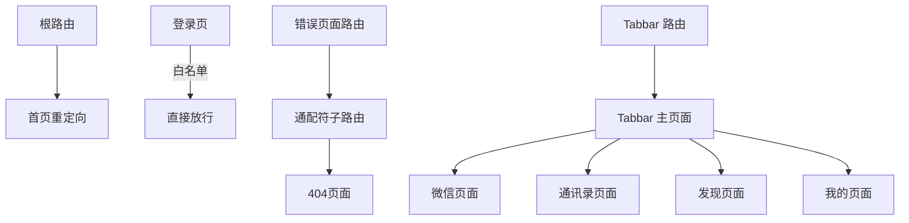

**图表来源**
- [src/router/base.ts:28-57](file://src/router/base.ts#L28-L57)
- [src/views/tabBar/index.vue:1-192](file://src/views/tabBar/index.vue#L1-L192)
- [src/views/exception/ErrorPage.vue:1-59](file://src/views/exception/ErrorPage.vue#L1-L59)
- [src/views/exception/404.vue:1-41](file://src/views/exception/404.vue#L1-L41)

**章节来源**
- [src/router/base.ts:28-57](file://src/router/base.ts#L28-L57)

### 模块化路由与嵌套路由
- 按功能域划分：仪表盘、消息、示例、我的等
- 嵌套路由：外层 Layout + 子页面组件，支持懒加载
- 缓存控制：通过 meta.keepAlive 控制是否缓存
- **新增**：路由元信息扩展，支持 transition 属性控制过渡动画
- 参考路径：[src/router/modules.ts:5-146](file://src/router/modules.ts#L5-L146)、[types/router.d.ts:5-15](file://types/router.d.ts#L5-L15)

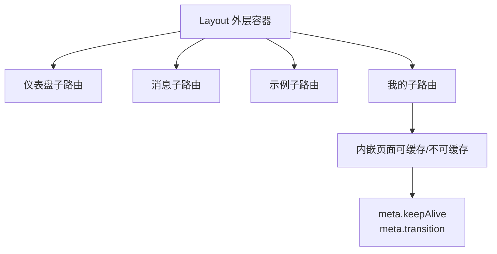

**图表来源**
- [src/router/modules.ts:5-146](file://src/router/modules.ts#L5-L146)
- [types/router.d.ts:5-15](file://types/router.d.ts#L5-L15)

**章节来源**
- [src/router/modules.ts:5-146](file://src/router/modules.ts#L5-L146)
- [types/router.d.ts:5-15](file://types/router.d.ts#L5-L15)

### 路由守卫机制
- beforeEach
  - 启动导航进度条
  - 白名单放行（如登录页）
  - 无 Token 则跳转登录页
  - 首次访问拉取用户信息
  - 参考路径：[src/router/router-guards.ts:17-51](file://src/router/router-guards.ts#L17-L51)
- afterEach
  - 设置页面标题
  - 处理导航失败
  - 基于 meta.keepAlive 与当前组件名动态维护 keepAliveComponents
  - 参考路径：[src/router/router-guards.ts:53-92](file://src/router/router-guards.ts#L53-L92)

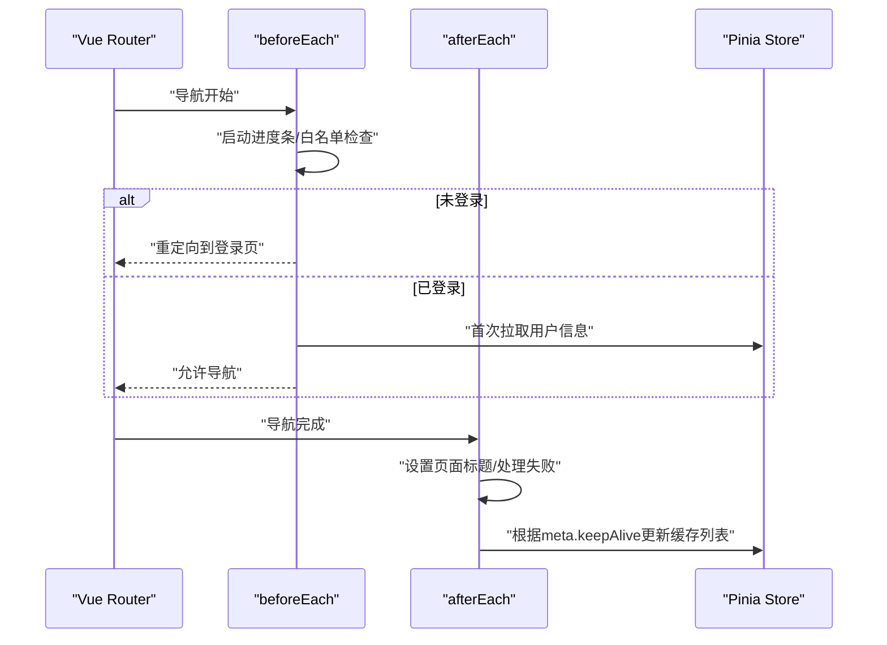

**图表来源**
- [src/router/router-guards.ts:17-92](file://src/router/router-guards.ts#L17-L92)
- [src/store/modules/route.ts:29-32](file://src/store/modules/route.ts#L29-L32)
- [src/store/modules/user.ts:79-89](file://src/store/modules/user.ts#L79-L89)

**章节来源**
- [src/router/router-guards.ts:17-92](file://src/router/router-guards.ts#L17-L92)
- [src/store/modules/route.ts:29-32](file://src/store/modules/route.ts#L29-L32)
- [src/store/modules/user.ts:79-89](file://src/store/modules/user.ts#L79-L89)

### 路由状态管理与缓存策略
- 路由状态
  - menus：菜单数据
  - routers：完整路由表
  - keepAliveComponents：需要缓存的组件名数组
  - 参考路径：[src/store/modules/route.ts:11-39](file://src/store/modules/route.ts#L11-L39)
- 缓存策略
  - 守卫根据 meta.keepAlive 动态增删 keepAliveComponents
  - Layout 中通过 KeepAlive include 实现缓存
  - 参考路径：[src/layout/index.vue:6-13](file://src/layout/index.vue#L6-L13)

**图表来源**
- [src/router/router-guards.ts:62-85](file://src/router/router-guards.ts#L62-L85)
- [src/layout/index.vue:6-13](file://src/layout/index.vue#L6-L13)

**章节来源**
- [src/store/modules/route.ts:11-39](file://src/store/modules/route.ts#L11-L39)
- [src/router/router-guards.ts:62-85](file://src/router/router-guards.ts#L62-L85)
- [src/layout/index.vue:6-13](file://src/layout/index.vue#L6-L13)

### 登录守卫与权限控制
- 登录拦截
  - 无 Token 直接重定向登录页
  - 白名单放行（登录页）
  - 参考路径：[src/router/router-guards.ts:17-51](file://src/router/router-guards.ts#L17-L51)
- 用户信息拉取
  - 首次访问拉取用户信息，避免重复请求
  - 参考路径：[src/store/modules/user.ts:79-89](file://src/store/modules/user.ts#L79-L89)
- 注销与重定向
  - 注销后清除状态并跳转登录页
  - 参考路径：[src/store/modules/user.ts:92-107](file://src/store/modules/user.ts#L92-L107)

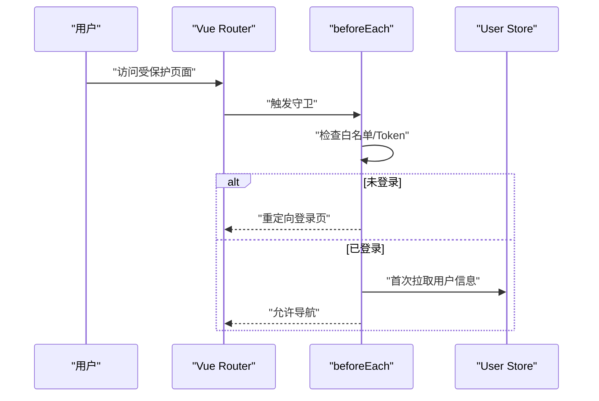

**图表来源**
- [src/router/router-guards.ts:17-51](file://src/router/router-guards.ts#L17-L51)
- [src/store/modules/user.ts:79-89](file://src/store/modules/user.ts#L79-L89)

**章节来源**
- [src/router/router-guards.ts:17-51](file://src/router/router-guards.ts#L17-L51)
- [src/store/modules/user.ts:79-89](file://src/store/modules/user.ts#L79-L89)
- [src/store/modules/user.ts:92-107](file://src/store/modules/user.ts#L92-L107)

### **新增**：错误页面路由配置
- **错误页面路由结构**
  - ErrorPageRoute：完整的嵌套路由结构，支持子路由和面包屑隐藏
  - 子路由指向 404 页面组件，提供标准的页面不存在提示
  - 参考路径：[src/router/base.ts:6-26](file://src/router/base.ts#L6-L26)
- **错误页面组件**
  - ErrorPage.vue：提供导航栏、错误提示和重试按钮
  - 支持返回上一页或刷新当前页的智能重试逻辑
  - 参考路径：[src/views/exception/ErrorPage.vue:1-59](file://src/views/exception/ErrorPage.vue#L1-L59)
- **404 页面组件**
  - 404.vue：标准的页面不存在提示页面
  - 提供回到首页的按钮导航
  - 参考路径：[src/views/exception/404.vue:1-41](file://src/views/exception/404.vue#L1-L41)

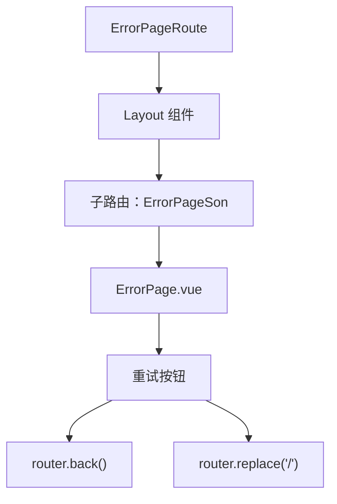

**图表来源**
- [src/router/base.ts:6-26](file://src/router/base.ts#L6-L26)
- [src/views/exception/ErrorPage.vue:49-57](file://src/views/exception/ErrorPage.vue#L49-L57)
- [src/views/exception/404.vue:19-21](file://src/views/exception/404.vue#L19-L21)

**章节来源**
- [src/router/base.ts:6-26](file://src/router/base.ts#L6-L26)
- [src/views/exception/ErrorPage.vue:1-59](file://src/views/exception/ErrorPage.vue#L1-L59)
- [src/views/exception/404.vue:1-41](file://src/views/exception/404.vue#L1-L41)

### **新增**：微信风格路由过渡系统
- **useRouteTransition 组合式函数**
  - 维护路由历史栈，判断导航方向（forward/backward）
  - 根据方向返回对应的过渡动画名称（wx-slide-right/wx-slide-left）
  - 支持 meta.transition 配置控制是否启用动画
  - **更新**：改进了动画禁用逻辑，支持更精确的过渡控制
  - 参考路径：[src/hooks/useRouteTransition.ts:13-61](file://src/hooks/useRouteTransition.ts#L13-L61)
- **微信风格动画**
  - wx-slide-right：前进时新页面从右侧滑入，旧页面向左微移并变暗
  - wx-slide-left：后退时当前页面向右滑出，底层页面从左侧恢复并变亮
  - 使用 cubic-bezier 动画曲线，模拟微信原生过渡效果
  - 参考路径：[src/styles/transition/wx-slide.less:1-70](file://src/styles/transition/wx-slide.less#L1-L70)
- **滑动返回手势**
  - 从屏幕左边缘 20px 内开始向右滑动
  - 滑动距离超过屏幕宽度 1/3 时触发 router.back()
  - 支持 iOS 和 Android 触摸事件
  - 参考路径：[src/hooks/useSwipeBack.ts:10-74](file://src/hooks/useSwipeBack.ts#L10-L74)
- **应用集成**
  - App.vue 中通过 RouterView 包装 transition 组件
  - 使用 computed 属性动态绑定 transitionName
  - 参考路径：[src/App.vue:17-31](file://src/App.vue#L17-L31)

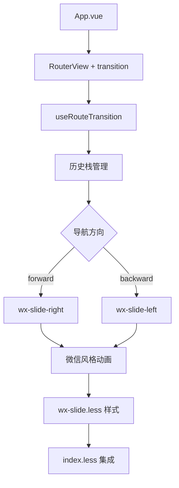

**图表来源**
- [src/App.vue:17-31](file://src/App.vue#L17-L31)
- [src/hooks/useRouteTransition.ts:13-61](file://src/hooks/useRouteTransition.ts#L13-L61)
- [src/styles/transition/wx-slide.less:1-70](file://src/styles/transition/wx-slide.less#L1-L70)
- [src/styles/transition/index.less:1-14](file://src/styles/transition/index.less#L1-L14)

**章节来源**
- [src/hooks/useRouteTransition.ts:13-61](file://src/hooks/useRouteTransition.ts#L13-L61)
- [src/styles/transition/wx-slide.less:1-70](file://src/styles/transition/wx-slide.less#L1-L70)
- [src/hooks/useSwipeBack.ts:10-74](file://src/hooks/useSwipeBack.ts#L10-L74)
- [src/App.vue:17-31](file://src/App.vue#L17-L31)

### **新增**：增强的地址组件导航功能
- **地址组件导航增强**
  - 地址组件中新增了跳转到错误页面的功能
  - 支持多个功能入口的错误页面导航
  - 参考路径：[src/views/tabBar/components/address.vue:158-161](file://src/views/tabBar/components/address.vue#L158-L161)
- **Tabbar 导航系统**
  - **Tabbar 主页面**
    - 提供微信、通讯录、发现、我的四个核心页面
    - 支持徽章显示、红点提醒等微信特色功能
    - 顶部导航栏与内容区域分离设计
    - 参考路径：[src/views/tabBar/index.vue:1-192](file://src/views/tabBar/index.vue#L1-L192)
  - **FloatingNavBar 浮动导航栏**
    - 响应式设计，自动适配不同屏幕尺寸
    - 支持主题切换（深色/浅色模式）
    - 动画效果：点击反馈、指示器移动动画
    - 自适应布局：根据导航项数量动态调整宽度
    - 参考路径：[src/layout/components/FloatingNavBar.vue:1-549](file://src/layout/components/FloatingNavBar.vue#L1-L549)
  - **Tabbar 页面组件**
    - 微信页面：聊天列表、消息提醒
    - 通讯录页面：联系人列表、字母索引
    - 发现页面：朋友圈、视频号、小程序等功能入口
    - 我的页面：用户信息、设置、收藏等功能
    - 参考路径：[src/views/tabBar/components/wx.vue:1-87](file://src/views/tabBar/components/wx.vue#L1-L87)、[src/views/tabBar/components/address.vue:1-224](file://src/views/tabBar/components/address.vue#L1-L224)、[src/views/tabBar/components/find.vue:1-118](file://src/views/tabBar/components/find.vue#L1-L118)、[src/views/tabBar/components/mine.vue:1-116](file://src/views/tabBar/components/mine.vue#L1-L116)

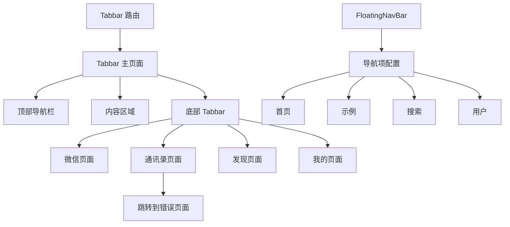

**图表来源**
- [src/views/tabBar/index.vue:1-192](file://src/views/tabBar/index.vue#L1-L192)
- [src/layout/components/FloatingNavBar.vue:1-549](file://src/layout/components/FloatingNavBar.vue#L1-L549)
- [src/layout/index.vue:43-48](file://src/layout/index.vue#L43-L48)
- [src/views/tabBar/components/address.vue:158-161](file://src/views/tabBar/components/address.vue#L158-L161)

**章节来源**
- [src/views/tabBar/index.vue:1-192](file://src/views/tabBar/index.vue#L1-L192)
- [src/layout/components/FloatingNavBar.vue:1-549](file://src/layout/components/FloatingNavBar.vue#L1-L549)
- [src/layout/index.vue:43-48](file://src/layout/index.vue#L43-L48)
- [src/views/tabBar/components/address.vue:158-161](file://src/views/tabBar/components/address.vue#L158-L161)

## 依赖关系分析
- 路由器依赖
  - 常量路由与模块化路由共同构成完整路由表
  - **更新**：包含新增的 Tabbar 路由和错误页面路由
  - 参考路径：[src/router/index.ts:12-24](file://src/router/index.ts#L12-L24)
- 守卫依赖
  - 依赖用户状态进行登录校验
  - 依赖路由状态维护缓存列表
  - 参考路径：[src/router/router-guards.ts:4-8](file://src/router/router-guards.ts#L4-L8)
- 布局依赖
  - 依赖路由状态的 keepAliveComponents
  - **更新**：依赖 FloatingNavBar 组件
  - 参考路径：[src/layout/index.vue:35-41](file://src/layout/index.vue#L35-L41)
- **新增**：错误页面路由依赖关系
  - ErrorPageRoute 依赖 Layout 组件和 404 子路由
  - ErrorPage.vue 依赖 Vue Router 进行页面导航
  - 参考路径：[src/router/base.ts:6-26](file://src/router/base.ts#L6-L26)、[src/views/exception/ErrorPage.vue:44-47](file://src/views/exception/ErrorPage.vue#L44-L47)
- **新增**：过渡系统依赖关系
  - App.vue 依赖 useRouteTransition 和 useSwipeBack
  - useRouteTransition 依赖 Vue Router 的 beforeEach 钩子
  - wx-slide.less 依赖 Less 预处理器和 CSS 动画
  - 参考路径：[src/App.vue:17-31](file://src/App.vue#L17-L31)、[src/hooks/useRouteTransition.ts:13-61](file://src/hooks/useRouteTransition.ts#L13-L61)、[src/hooks/useSwipeBack.ts:10-74](file://src/hooks/useSwipeBack.ts#L10-L74)
- **新增**：Tabbar 依赖关系
  - Tabbar 主页面依赖各功能组件
  - FloatingNavBar 依赖设计设置状态
  - 地址组件依赖错误页面路由进行导航
  - 参考路径：[src/views/tabBar/index.vue:69-72](file://src/views/tabBar/index.vue#L69-L72)、[src/layout/components/FloatingNavBar.vue:88-90](file://src/layout/components/FloatingNavBar.vue#L88-L90)、[src/views/tabBar/components/address.vue:158-161](file://src/views/tabBar/components/address.vue#L158-L161)

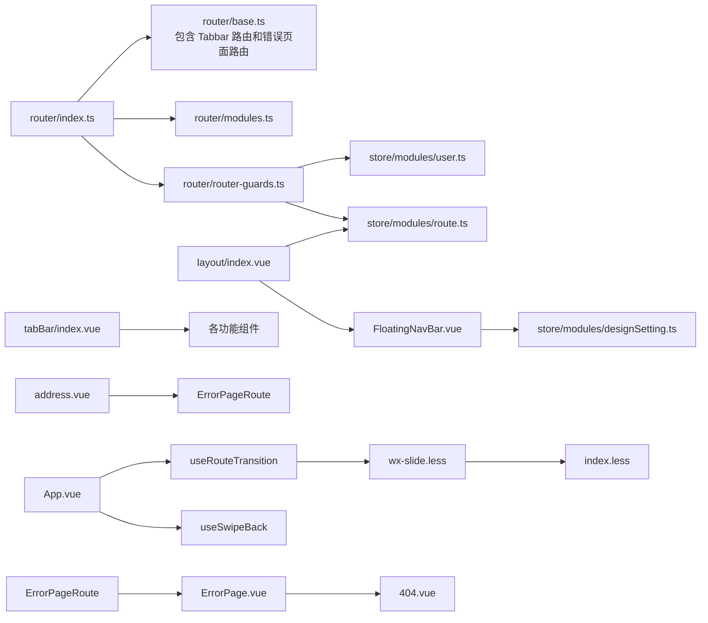

**图表来源**
- [src/router/index.ts:12-24](file://src/router/index.ts#L12-L24)
- [src/router/base.ts:6-26](file://src/router/base.ts#L6-L26)
- [src/router/router-guards.ts:4-8](file://src/router/router-guards.ts#L4-L8)
- [src/store/modules/route.ts:11-39](file://src/store/modules/route.ts#L11-L39)
- [src/store/modules/user.ts:36-114](file://src/store/modules/user.ts#L36-L114)
- [src/layout/index.vue:35-41](file://src/layout/index.vue#L35-L41)
- [src/layout/components/FloatingNavBar.vue:88-90](file://src/layout/components/FloatingNavBar.vue#L88-L90)
- [src/views/tabBar/index.vue:69-72](file://src/views/tabBar/index.vue#L69-L72)
- [src/views/tabBar/components/address.vue:158-161](file://src/views/tabBar/components/address.vue#L158-L161)
- [src/App.vue:17-31](file://src/App.vue#L17-L31)
- [src/hooks/useRouteTransition.ts:13-61](file://src/hooks/useRouteTransition.ts#L13-L61)
- [src/hooks/useSwipeBack.ts:10-74](file://src/hooks/useSwipeBack.ts#L10-L74)
- [src/styles/transition/wx-slide.less:1-70](file://src/styles/transition/wx-slide.less#L1-L70)
- [src/styles/transition/index.less:1-14](file://src/styles/transition/index.less#L1-L14)
- [src/views/exception/ErrorPage.vue:44-47](file://src/views/exception/ErrorPage.vue#L44-L47)

**章节来源**
- [src/router/index.ts:12-24](file://src/router/index.ts#L12-L24)
- [src/router/base.ts:6-26](file://src/router/base.ts#L6-L26)
- [src/router/router-guards.ts:4-8](file://src/router/router-guards.ts#L4-L8)
- [src/store/modules/route.ts:11-39](file://src/store/modules/route.ts#L11-L39)
- [src/store/modules/user.ts:36-114](file://src/store/modules/user.ts#L36-L114)
- [src/layout/index.vue:35-41](file://src/layout/index.vue#L35-L41)
- [src/layout/components/FloatingNavBar.vue:88-90](file://src/layout/components/FloatingNavBar.vue#L88-L90)
- [src/views/tabBar/index.vue:69-72](file://src/views/tabBar/index.vue#L69-L72)
- [src/views/tabBar/components/address.vue:158-161](file://src/views/tabBar/components/address.vue#L158-L161)
- [src/App.vue:17-31](file://src/App.vue#L17-L31)
- [src/hooks/useRouteTransition.ts:13-61](file://src/hooks/useRouteTransition.ts#L13-L61)
- [src/hooks/useSwipeBack.ts:10-74](file://src/hooks/useSwipeBack.ts#L10-L74)
- [src/styles/transition/wx-slide.less:1-70](file://src/styles/transition/wx-slide.less#L1-L70)
- [src/styles/transition/index.less:1-14](file://src/styles/transition/index.less#L1-L14)
- [src/views/exception/ErrorPage.vue:44-47](file://src/views/exception/ErrorPage.vue#L44-L47)

## 性能考量
- 路由懒加载
  - 所有页面组件均采用动态导入，减少首屏体积
  - **更新**：Tabbar 组件也采用懒加载优化
  - 参考路径：[src/router/modules.ts:22,42,62,83,106,115,124,133,142:22-22](file://src/router/modules.ts#L22-L22)、[src/router/modules.ts#L42-L42]、[src/router/modules.ts#L62-L62]、[src/router/modules.ts#L83-L83]、[src/router/modules.ts#L106-L106]、[src/router/modules.ts#L115-L115]、[src/router/modules.ts#L124-L124]、[src/router/modules.ts#L133-L133]、[src/router/modules.ts#L142-L142]
- KeepAlive 缓存
  - 仅缓存必要的组件，避免内存占用过高
  - **更新**：Tabbar 页面组件支持缓存控制
  - 参考路径：[src/router/router-guards.ts:68-84](file://src/router/router-guards.ts#L68-L84)、[src/layout/index.vue:8-11](file://src/layout/index.vue#L8-L11)
- 导航进度条
  - 提升用户体验，避免长时间空白
  - 参考路径：[src/router/router-guards.ts:21-21](file://src/router/router-guards.ts#L21-L21)、[src/router/router-guards.ts:89-91](file://src/router/router-guards.ts#L89-L91)
- **新增**：错误页面路由性能优化
  - 错误页面组件采用懒加载，减少主包体积
  - 支持嵌套子路由，避免重复代码
  - 参考路径：[src/router/base.ts:15-25](file://src/router/base.ts#L15-L25)、[src/views/exception/ErrorPage.vue:1-59](file://src/views/exception/ErrorPage.vue#L1-L59)
- **新增**：微信风格过渡动画性能优化
  - 使用 transform 替代 position 变更，硬件加速优化
  - cubic-bezier 动画曲线确保流畅度
  - transition-duration 控制动画时长
  - 参考路径：[src/styles/transition/wx-slide.less:5-70](file://src/styles/transition/wx-slide.less#L5-L70)
- **新增**：FloatingNavBar 性能优化
  - 使用 ResizeObserver 监听布局变化
  - 动画使用 requestAnimationFrame 优化性能
  - 参考路径：[src/layout/components/FloatingNavBar.vue:169-190](file://src/layout/components/FloatingNavBar.vue#L169-L190)、[src/layout/components/FloatingNavBar.vue:161-167](file://src/layout/components/FloatingNavBar.vue#L161-L167)

**章节来源**
- [src/router/modules.ts:22,42,62,83,106,115,124,133,142:22-22](file://src/router/modules.ts#L22-L22)
- [src/router/router-guards.ts:68-84](file://src/router/router-guards.ts#L68-L84)
- [src/layout/index.vue:8-11](file://src/layout/index.vue#L8-L11)
- [src/router/router-guards.ts:21-21](file://src/router/router-guards.ts#L21-L21)
- [src/router/router-guards.ts:89-91](file://src/router/router-guards.ts#L89-L91)
- [src/router/base.ts:15-25](file://src/router/base.ts#L15-L25)
- [src/views/exception/ErrorPage.vue:1-59](file://src/views/exception/ErrorPage.vue#L1-L59)
- [src/styles/transition/wx-slide.less:5-70](file://src/styles/transition/wx-slide.less#L5-L70)
- [src/layout/components/FloatingNavBar.vue:169-190](file://src/layout/components/FloatingNavBar.vue#L169-L190)
- [src/layout/components/FloatingNavBar.vue:161-167](file://src/layout/components/FloatingNavBar.vue#L161-L167)

## 故障排查指南
- 导航失败
  - afterGuards 中检测并记录导航失败
  - 参考路径：[src/router/router-guards.ts:58-60](file://src/router/router-guards.ts#L58-L60)
- 路由错误
  - onError 回调打印错误
  - 参考路径：[src/router/router-guards.ts:89-91](file://src/router/router-guards.ts#L89-L91)
- 登录状态异常
  - 确认 Token 是否正确存储与读取
  - 参考路径：[src/store/modules/user.ts:54-57](file://src/store/modules/user.ts#L54-L57)、[src/store/modules/user.ts:101-104](file://src/store/modules/user.ts#L101-L104)
- 缓存失效或不生效
  - 检查 meta.keepAlive 与 keepAliveComponents 是否一致
  - 参考路径：[src/router/router-guards.ts:68-84](file://src/router/router-guards.ts#L68-L84)、[src/layout/index.vue:8-11](file://src/layout/index.vue#L8-L11)
- **新增**：错误页面路由问题
  - 检查 ErrorPageRoute 的嵌套结构是否正确
  - 确认子路由指向的 404 组件是否存在
  - 验证路由名称与页面枚举的一致性
  - 参考路径：[src/router/base.ts:6-26](file://src/router/base.ts#L6-L26)、[src/enums/pageEnum.ts:9-11](file://src/enums/pageEnum.ts#L9-L11)
- **新增**：微信风格过渡动画问题
  - 检查 meta.transition 配置是否正确
  - 确认 wx-slide.less 样式是否正确引入
  - 验证 useRouteTransition 是否正确计算导航方向
  - 参考路径：[src/hooks/useRouteTransition.ts:38-61](file://src/hooks/useRouteTransition.ts#L38-L61)、[src/styles/transition/wx-slide.less:1-70](file://src/styles/transition/wx-slide.less#L1-L70)、[src/App.vue:5-5](file://src/App.vue#L5-L5)
- **新增**：滑动返回手势问题
  - 检查触摸事件监听是否正常
  - 验证边缘触发阈值和滑动比例设置
  - 确认 router.back() 调用时机
  - 参考路径：[src/hooks/useSwipeBack.ts:18-74](file://src/hooks/useSwipeBack.ts#L18-L74)
- **新增**：Tabbar 导航问题
  - 检查 FloatingNavBar 的导航项配置是否正确
  - 确认 Tabbar 主页面的徽章和红点显示逻辑
  - 验证地址组件的错误页面导航功能
  - 参考路径：[src/layout/components/FloatingNavBar.vue:208-220](file://src/layout/components/FloatingNavBar.vue#L208-L220)、[src/views/tabBar/index.vue:40-51](file://src/views/tabBar/index.vue#L40-L51)、[src/views/tabBar/components/address.vue:158-161](file://src/views/tabBar/components/address.vue#L158-L161)

**章节来源**
- [src/router/router-guards.ts:58-60](file://src/router/router-guards.ts#L58-L60)
- [src/router/router-guards.ts:89-91](file://src/router/router-guards.ts#L89-L91)
- [src/store/modules/user.ts:54-57](file://src/store/modules/user.ts#L54-L57)
- [src/store/modules/user.ts:101-104](file://src/store/modules/user.ts#L101-L104)
- [src/router/router-guards.ts:68-84](file://src/router/router-guards.ts#L68-L84)
- [src/layout/index.vue:8-11](file://src/layout/index.vue#L8-L11)
- [src/router/base.ts:6-26](file://src/router/base.ts#L6-L26)
- [src/enums/pageEnum.ts:9-11](file://src/enums/pageEnum.ts#L9-L11)
- [src/hooks/useRouteTransition.ts:38-61](file://src/hooks/useRouteTransition.ts#L38-L61)
- [src/styles/transition/wx-slide.less:1-70](file://src/styles/transition/wx-slide.less#L1-L70)
- [src/App.vue:5-5](file://src/App.vue#L5-L5)
- [src/hooks/useSwipeBack.ts:18-74](file://src/hooks/useSwipeBack.ts#L18-L74)
- [src/layout/components/FloatingNavBar.vue:208-220](file://src/layout/components/FloatingNavBar.vue#L208-L220)
- [src/views/tabBar/index.vue:40-51](file://src/views/tabBar/index.vue#L40-L51)
- [src/views/tabBar/components/address.vue:158-161](file://src/views/tabBar/components/address.vue#L158-L161)

## 结论
本项目的路由系统通过"常量路由 + 模块化路由"与 Pinia 状态管理相结合，实现了清晰的权限控制与高效的组件缓存策略。**新增的错误页面路由配置**提供了统一的错误处理机制，支持嵌套子路由和智能重试功能。**新增的微信风格路由过渡系统**通过 useRouteTransition 和 useSwipeBack 实现了前进/后退动画与手势滑动返回功能，提供了自然流畅的移动端导航体验。**新增的 Tabbar 导航系统**进一步增强了移动端用户体验，通过 FloatingNavBar 提供现代化的浮动导航体验，并在地址组件中集成了错误页面导航功能。导航守卫统一处理登录拦截、白名单放行与缓存逻辑，配合 Layout 的 KeepAlive 实现良好的用户体验。整体架构易于扩展，适合在大型移动端应用中推广使用。

## 附录：最佳实践与示例路径
- 路由懒加载
  - 示例路径：[src/router/modules.ts:22](file://src/router/modules.ts#L22-L22)、[src/router/modules.ts:42](file://src/router/modules.ts#L42-L42)、[src/router/modules.ts:62](file://src/router/modules.ts#L62-L62)、[src/router/modules.ts:83](file://src/router/modules.ts#L83-L83)、[src/router/modules.ts:106](file://src/router/modules.ts#L106-L106)、[src/router/modules.ts:115](file://src/router/modules.ts#L115-L115)、[src/router/modules.ts:124](file://src/router/modules.ts#L124-L124)、[src/router/modules.ts:133](file://src/router/modules.ts#L133-L133)、[src/router/modules.ts:142](file://src/router/modules.ts#L142-L142)
- 嵌套路由
  - 示例路径：[src/router/modules.ts:5-25](file://src/router/modules.ts#L5-L25)、[src/router/modules.ts:26-45](file://src/router/modules.ts#L26-L45)、[src/router/modules.ts:46-65](file://src/router/modules.ts#L46-L65)、[src/router/modules.ts:66-86](file://src/router/modules.ts#L66-L86)
- 路由参数传递
  - 示例路径：[src/router/modules.ts:7-9](file://src/router/modules.ts#L7-L9)、[src/router/modules.ts:27-29](file://src/router/modules.ts#L27-L29)、[src/router/modules.ts:47-49](file://src/router/modules.ts#L47-L49)、[src/router/modules.ts:67-69](file://src/router/modules.ts#L67-L69)
- 登录守卫
  - 示例路径：[src/router/router-guards.ts:17-51](file://src/router/router-guards.ts#L17-L51)
- 权限控制
  - 示例路径：[src/store/modules/user.ts:79-89](file://src/store/modules/user.ts#L79-L89)
- 路由状态管理
  - 示例路径：[src/store/modules/route.ts:29-32](file://src/store/modules/route.ts#L29-L32)
- 路由缓存策略
  - 示例路径：[src/router/router-guards.ts:68-84](file://src/router/router-guards.ts#L68-L84)、[src/layout/index.vue:8-11](file://src/layout/index.vue#L8-L11)
- **新增**：错误页面路由配置
  - 示例路径：[src/router/base.ts:6-26](file://src/router/base.ts#L6-L26)、[src/views/exception/ErrorPage.vue:1-59](file://src/views/exception/ErrorPage.vue#L1-L59)、[src/views/exception/404.vue:1-41](file://src/views/exception/404.vue#L1-L41)
- **新增**：微信风格路由过渡
  - 示例路径：[src/hooks/useRouteTransition.ts:13-61](file://src/hooks/useRouteTransition.ts#L13-L61)、[src/hooks/useSwipeBack.ts:10-74](file://src/hooks/useSwipeBack.ts#L10-L74)、[src/styles/transition/wx-slide.less:1-70](file://src/styles/transition/wx-slide.less#L1-L70)
- **新增**：Tabbar 导航系统
  - 示例路径：[src/views/tabBar/index.vue:1-192](file://src/views/tabBar/index.vue#L1-L192)、[src/layout/components/FloatingNavBar.vue:1-549](file://src/layout/components/FloatingNavBar.vue#L1-L549)、[src/layout/index.vue:43-48](file://src/layout/index.vue#L43-L48)
- **新增**：增强的地址组件导航
  - 示例路径：[src/views/tabBar/components/address.vue:158-161](file://src/views/tabBar/components/address.vue#L158-L161)、[src/views/tabBar/components/wx.vue:1-87](file://src/views/tabBar/components/wx.vue#L1-L87)、[src/views/tabBar/components/find.vue:1-118](file://src/views/tabBar/components/find.vue#L1-L118)、[src/views/tabBar/components/mine.vue:1-116](file://src/views/tabBar/components/mine.vue#L1-L116)