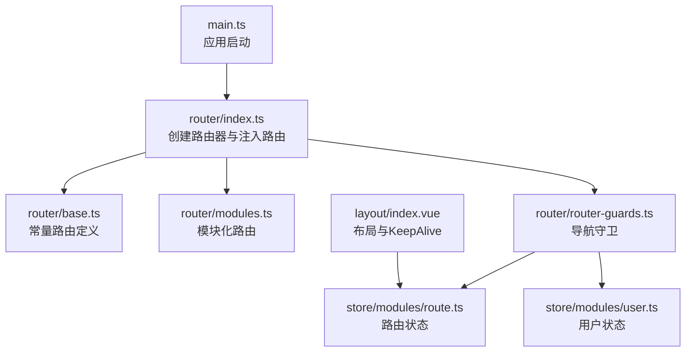
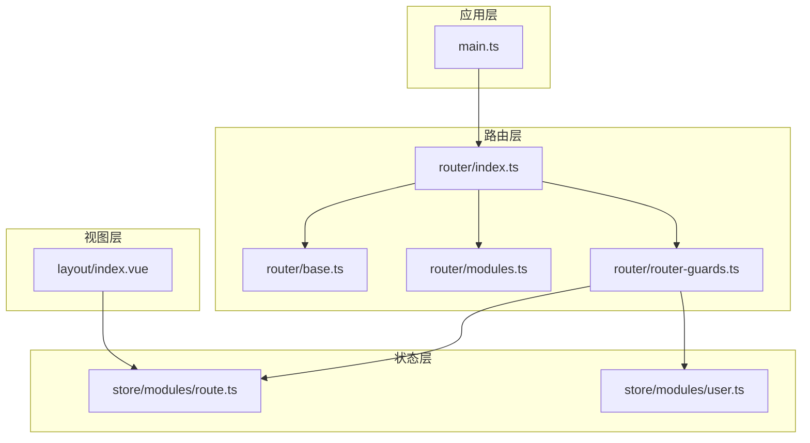
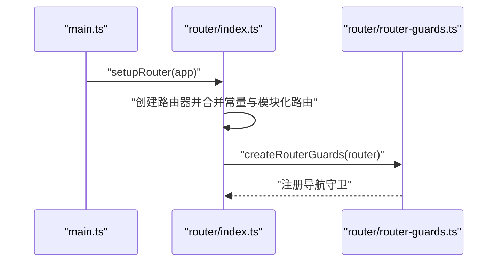
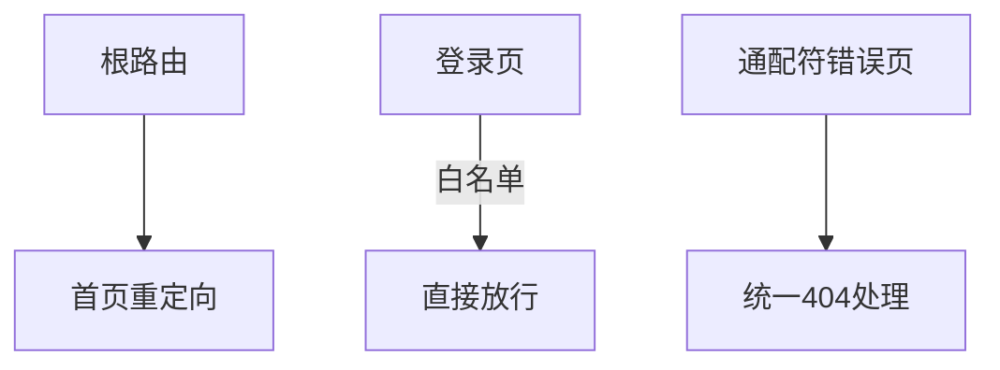
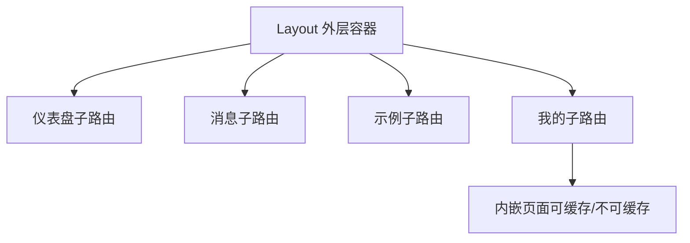
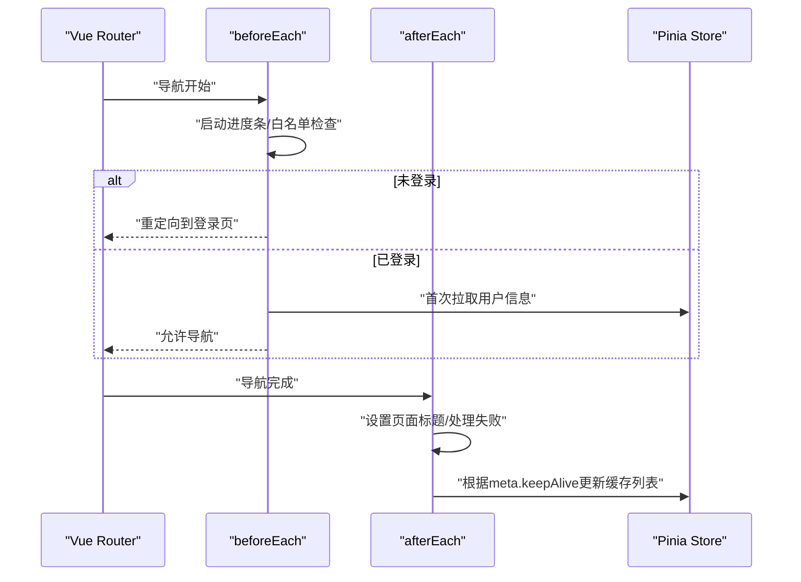
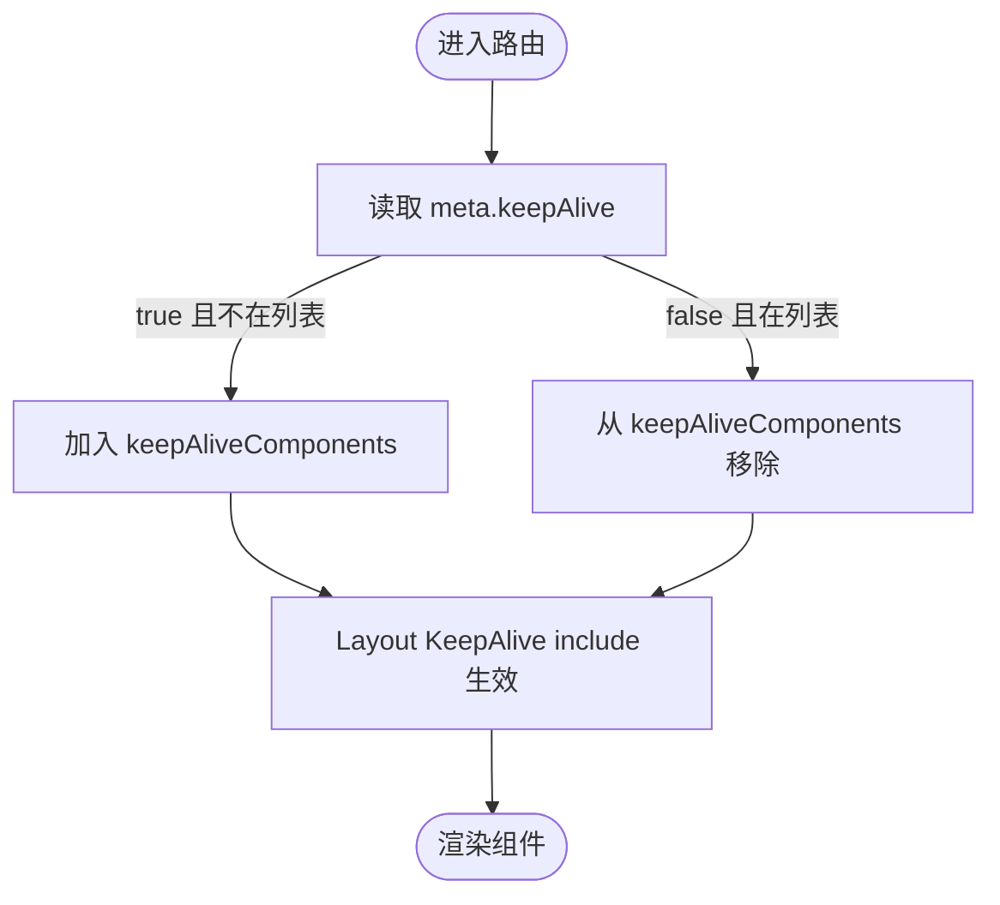
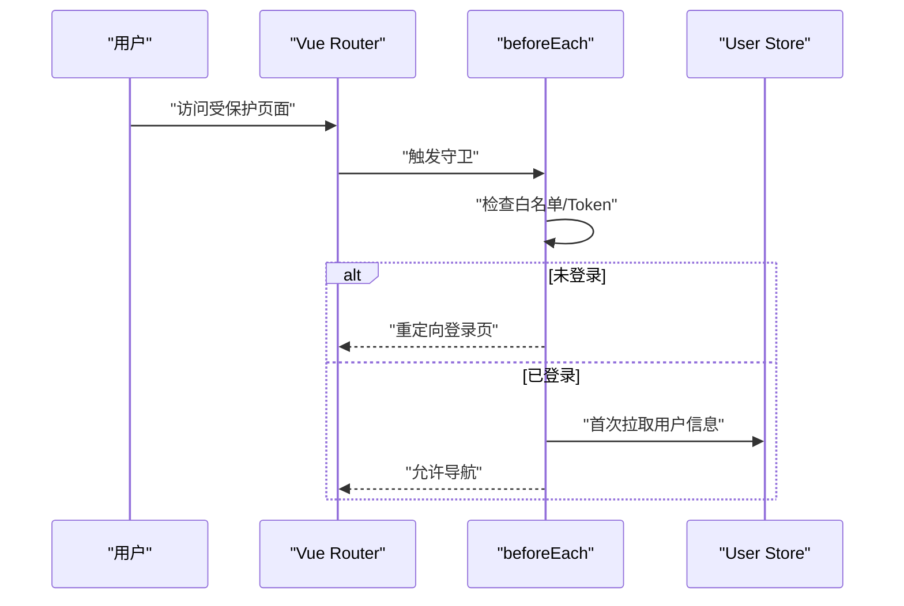
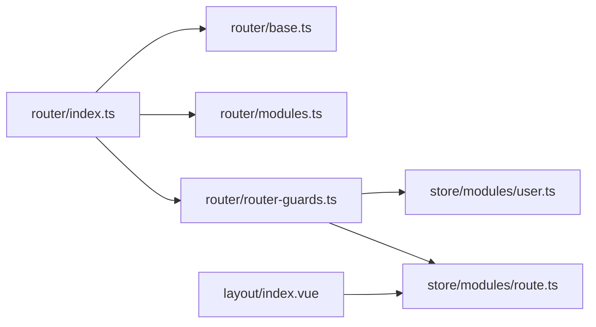

# 路由系统

<cite>
**本文引用的文件列表**
- [src/router/index.ts](file://src/router/index.ts)
- [src/router/router-guards.ts](file://src/router/router-guards.ts)
- [src/router/base.ts](file://src/router/base.ts)
- [src/router/modules.ts](file://src/router/modules.ts)
- [src/store/modules/route.ts](file://src/store/modules/route.ts)
- [src/store/modules/user.ts](file://src/store/modules/user.ts)
- [src/layout/index.vue](file://src/layout/index.vue)
- [src/main.ts](file://src/main.ts)
- [src/enums/pageEnum.ts](file://src/enums/pageEnum.ts)
- [src/store/index.ts](file://src/store/index.ts)
- [package.json](file://package.json)
</cite>

## 目录
1. [简介](#简介)
2. [项目结构](#项目结构)
3. [核心组件](#核心组件)
4. [架构总览](#架构总览)
5. [详细组件分析](#详细组件分析)
6. [依赖关系分析](#依赖关系分析)
7. [性能考量](#性能考量)
8. [故障排查指南](#故障排查指南)
9. [结论](#结论)
10. [附录：最佳实践与示例路径](#附录最佳实践与示例路径)

## 简介
本文件系统性梳理 Vue Router 路由体系在本项目中的设计与实现，重点覆盖：
- 静态常量路由与动态模块化路由的组合架构
- 导航守卫的实现与权限校验流程
- 路由缓存策略与 KeepAlive 的联动
- 路由模块化组织方式与扩展方法
- 路由懒加载、嵌套路由、路由参数传递等最佳实践
- 登录守卫、权限控制与路由状态管理的实际应用示例路径

## 项目结构
路由系统主要由以下部分组成：
- 路由入口与初始化：负责创建路由器、注入常量路由与模块化路由，并挂载守卫
- 路由守卫：统一处理登录拦截、白名单放行、标题设置、导航进度条与缓存策略
- 基础路由定义：根路由、登录页、错误页等常量路由
- 动态模块路由：按功能域划分的模块化路由集合
- 状态管理：Pinia 中的路由与用户状态，用于维护菜单、路由表与缓存组件集合
- 布局与缓存：Layout 组件结合 KeepAlive 实现组件级缓存

**图表来源**
- [src/main.ts:18-27](file://src/main.ts#L18-L27)
- [src/router/index.ts:19-30](file://src/router/index.ts#L19-L30)
- [src/router/base.ts:28-44](file://src/router/base.ts#L28-L44)
- [src/router/modules.ts:5-146](file://src/router/modules.ts#L5-L146)
- [src/router/router-guards.ts:17-92](file://src/router/router-guards.ts#L17-L92)
- [src/store/modules/route.ts:11-39](file://src/store/modules/route.ts#L11-L39)
- [src/store/modules/user.ts:36-114](file://src/store/modules/user.ts#L36-L114)
- [src/layout/index.vue:6-13](file://src/layout/index.vue#L6-L13)

**章节来源**
- [src/main.ts:18-27](file://src/main.ts#L18-L27)
- [src/router/index.ts:19-30](file://src/router/index.ts#L19-L30)
- [src/router/base.ts:28-44](file://src/router/base.ts#L28-L44)
- [src/router/modules.ts:5-146](file://src/router/modules.ts#L5-L146)
- [src/router/router-guards.ts:17-92](file://src/router/router-guards.ts#L17-L92)
- [src/store/modules/route.ts:11-39](file://src/store/modules/route.ts#L11-L39)
- [src/store/modules/user.ts:36-114](file://src/store/modules/user.ts#L36-L114)
- [src/layout/index.vue:6-13](file://src/layout/index.vue#L6-L13)

## 核心组件
- 路由器创建与注入
  - 在入口文件中创建路由器，注入常量路由与模块化路由，并挂载守卫
  - 参考路径：[src/router/index.ts:19-30](file://src/router/index.ts#L19-L30)
- 常量路由
  - 包含登录页、根路由与错误页，作为全局基础路由
  - 参考路径：[src/router/base.ts:28-44](file://src/router/base.ts#L28-L44)
- 模块化路由
  - 按功能域划分的嵌套路由集合，支持懒加载与缓存控制
  - 参考路径：[src/router/modules.ts:5-146](file://src/router/modules.ts#L5-L146)
- 路由守卫
  - beforeEach：登录拦截、白名单放行、用户信息拉取
  - afterEach：标题设置、导航进度条、KeepAlive 缓存策略
  - 参考路径：[src/router/router-guards.ts:17-92](file://src/router/router-guards.ts#L17-L92)
- 路由状态与用户状态
  - 路由状态：维护菜单、路由表与 KeepAlive 组件集合
  - 用户状态：维护 Token、用户信息与最后更新时间
  - 参考路径：[src/store/modules/route.ts:11-39](file://src/store/modules/route.ts#L11-L39)、[src/store/modules/user.ts:36-114](file://src/store/modules/user.ts#L36-L114)
- 布局与缓存
  - Layout 中通过 KeepAlive 结合路由状态实现组件级缓存
  - 参考路径：[src/layout/index.vue:6-13](file://src/layout/index.vue#L6-L13)

**章节来源**
- [src/router/index.ts:19-30](file://src/router/index.ts#L19-L30)
- [src/router/base.ts:28-44](file://src/router/base.ts#L28-L44)
- [src/router/modules.ts:5-146](file://src/router/modules.ts#L5-L146)
- [src/router/router-guards.ts:17-92](file://src/router/router-guards.ts#L17-L92)
- [src/store/modules/route.ts:11-39](file://src/store/modules/route.ts#L11-L39)
- [src/store/modules/user.ts:36-114](file://src/store/modules/user.ts#L36-L114)
- [src/layout/index.vue:6-13](file://src/layout/index.vue#L6-L13)

## 架构总览
整体架构采用“常量路由 + 模块化路由”的组合模式，配合 Pinia 状态管理与导航守卫实现统一的权限与缓存策略。

**图表来源**
- [src/main.ts:18-27](file://src/main.ts#L18-L27)
- [src/router/index.ts:19-30](file://src/router/index.ts#L19-L30)
- [src/router/base.ts:28-44](file://src/router/base.ts#L28-L44)
- [src/router/modules.ts:5-146](file://src/router/modules.ts#L5-L146)
- [src/router/router-guards.ts:17-92](file://src/router/router-guards.ts#L17-L92)
- [src/store/modules/route.ts:11-39](file://src/store/modules/route.ts#L11-L39)
- [src/store/modules/user.ts:36-114](file://src/store/modules/user.ts#L36-L114)
- [src/layout/index.vue:6-13](file://src/layout/index.vue#L6-L13)

## 详细组件分析

### 路由器创建与注入
- 创建 Hash 模式路由器，合并常量路由与模块化路由，设置严格模式与滚动行为
- 初始化时同步将模块化路由注入到路由状态中，供后续守卫与布局使用
- 参考路径：[src/router/index.ts:19-30](file://src/router/index.ts#L19-L30)

**图表来源**
- [src/main.ts:22-23](file://src/main.ts#L22-L23)
- [src/router/index.ts:19-30](file://src/router/index.ts#L19-L30)
- [src/router/router-guards.ts:17-17](file://src/router/router-guards.ts#L17-L17)

**章节来源**
- [src/router/index.ts:19-30](file://src/router/index.ts#L19-L30)
- [src/main.ts:22-23](file://src/main.ts#L22-L23)

### 常量路由与基础页面
- 根路由：重定向至首页
- 登录页：独立路由，支持白名单放行
- 错误页：通配符路由，统一兜底
- 参考路径：[src/router/base.ts:28-44](file://src/router/base.ts#L28-L44)

**图表来源**
- [src/router/base.ts:28-44](file://src/router/base.ts#L28-L44)

**章节来源**
- [src/router/base.ts:28-44](file://src/router/base.ts#L28-L44)

### 模块化路由与嵌套路由
- 按功能域划分：仪表盘、消息、示例、我的等
- 嵌套路由：外层 Layout + 子页面组件，支持懒加载
- 缓存控制：通过 meta.keepAlive 控制是否缓存
- 参考路径：[src/router/modules.ts:5-146](file://src/router/modules.ts#L5-L146)

**图表来源**
- [src/router/modules.ts:5-146](file://src/router/modules.ts#L5-L146)

**章节来源**
- [src/router/modules.ts:5-146](file://src/router/modules.ts#L5-L146)

### 路由守卫机制
- beforeEach
  - 启动导航进度条
  - 白名单放行（如登录页）
  - 无 Token 则跳转登录页
  - 首次访问拉取用户信息
  - 参考路径：[src/router/router-guards.ts:17-51](file://src/router/router-guards.ts#L17-L51)
- afterEach
  - 设置页面标题
  - 处理导航失败
  - 基于 meta.keepAlive 与当前组件名动态维护 keepAliveComponents
  - 参考路径：[src/router/router-guards.ts:53-92](file://src/router/router-guards.ts#L53-L92)

**图表来源**
- [src/router/router-guards.ts:17-92](file://src/router/router-guards.ts#L17-L92)
- [src/store/modules/route.ts:29-32](file://src/store/modules/route.ts#L29-L32)
- [src/store/modules/user.ts:79-89](file://src/store/modules/user.ts#L79-L89)

**章节来源**
- [src/router/router-guards.ts:17-92](file://src/router/router-guards.ts#L17-L92)
- [src/store/modules/route.ts:29-32](file://src/store/modules/route.ts#L29-L32)
- [src/store/modules/user.ts:79-89](file://src/store/modules/user.ts#L79-L89)

### 路由状态管理与缓存策略
- 路由状态
  - menus：菜单数据
  - routers：完整路由表
  - keepAliveComponents：需要缓存的组件名数组
  - 参考路径：[src/store/modules/route.ts:11-39](file://src/store/modules/route.ts#L11-L39)
- 缓存策略
  - 守卫根据 meta.keepAlive 动态增删 keepAliveComponents
  - Layout 中通过 KeepAlive include 实现缓存
  - 参考路径：[src/layout/index.vue:6-13](file://src/layout/index.vue#L6-L13)

**图表来源**
- [src/router/router-guards.ts:62-85](file://src/router/router-guards.ts#L62-L85)
- [src/layout/index.vue:6-13](file://src/layout/index.vue#L6-L13)

**章节来源**
- [src/store/modules/route.ts:11-39](file://src/store/modules/route.ts#L11-L39)
- [src/router/router-guards.ts:62-85](file://src/router/router-guards.ts#L62-L85)
- [src/layout/index.vue:6-13](file://src/layout/index.vue#L6-L13)

### 登录守卫与权限控制
- 登录拦截
  - 无 Token 直接重定向登录页
  - 白名单放行（登录页）
  - 参考路径：[src/router/router-guards.ts:17-51](file://src/router/router-guards.ts#L17-L51)
- 用户信息拉取
  - 首次访问拉取用户信息，避免重复请求
  - 参考路径：[src/store/modules/user.ts:79-89](file://src/store/modules/user.ts#L79-L89)
- 注销与重定向
  - 注销后清除状态并跳转登录页
  - 参考路径：[src/store/modules/user.ts:92-107](file://src/store/modules/user.ts#L92-L107)

**图表来源**
- [src/router/router-guards.ts:17-51](file://src/router/router-guards.ts#L17-L51)
- [src/store/modules/user.ts:79-89](file://src/store/modules/user.ts#L79-L89)

**章节来源**
- [src/router/router-guards.ts:17-51](file://src/router/router-guards.ts#L17-L51)
- [src/store/modules/user.ts:79-89](file://src/store/modules/user.ts#L79-L89)
- [src/store/modules/user.ts:92-107](file://src/store/modules/user.ts#L92-L107)

## 依赖关系分析
- 路由器依赖
  - 常量路由与模块化路由共同构成完整路由表
  - 参考路径：[src/router/index.ts:12-24](file://src/router/index.ts#L12-L24)
- 守卫依赖
  - 依赖用户状态进行登录校验
  - 依赖路由状态维护缓存列表
  - 参考路径：[src/router/router-guards.ts:4-8](file://src/router/router-guards.ts#L4-L8)
- 布局依赖
  - 依赖路由状态的 keepAliveComponents
  - 参考路径：[src/layout/index.vue:35-41](file://src/layout/index.vue#L35-L41)

**图表来源**
- [src/router/index.ts:12-24](file://src/router/index.ts#L12-L24)
- [src/router/router-guards.ts:4-8](file://src/router/router-guards.ts#L4-L8)
- [src/store/modules/route.ts:11-39](file://src/store/modules/route.ts#L11-L39)
- [src/store/modules/user.ts:36-114](file://src/store/modules/user.ts#L36-L114)
- [src/layout/index.vue:35-41](file://src/layout/index.vue#L35-L41)

**章节来源**
- [src/router/index.ts:12-24](file://src/router/index.ts#L12-L24)
- [src/router/router-guards.ts:4-8](file://src/router/router-guards.ts#L4-L8)
- [src/store/modules/route.ts:11-39](file://src/store/modules/route.ts#L11-L39)
- [src/store/modules/user.ts:36-114](file://src/store/modules/user.ts#L36-L114)
- [src/layout/index.vue:35-41](file://src/layout/index.vue#L35-L41)

## 性能考量
- 路由懒加载
  - 所有页面组件均采用动态导入，减少首屏体积
  - 参考路径：[src/router/modules.ts:22,42,62,83,106,115,124,133,142:22-22](file://src/router/modules.ts#L22-L22), [src/router/modules.ts#L42-L42], [src/router/modules.ts#L62-L62], [src/router/modules.ts#L83-L83], [src/router/modules.ts#L106-L106], [src/router/modules.ts#L115-L115], [src/router/modules.ts#L124-L124], [src/router/modules.ts#L133-L133], [src/router/modules.ts#L142-L142]
- KeepAlive 缓存
  - 仅缓存必要的组件，避免内存占用过高
  - 参考路径：[src/router/router-guards.ts:68-84](file://src/router/router-guards.ts#L68-L84), [src/layout/index.vue:8-11](file://src/layout/index.vue#L8-L11)
- 导航进度条
  - 提升用户体验，避免长时间空白
  - 参考路径：[src/router/router-guards.ts:21-21](file://src/router/router-guards.ts#L21-L21), [src/router/router-guards.ts:89-91](file://src/router/router-guards.ts#L89-L91)

**章节来源**
- [src/router/modules.ts:22,42,62,83,106,115,124,133,142:22-22](file://src/router/modules.ts#L22-L22)
- [src/router/router-guards.ts:68-84](file://src/router/router-guards.ts#L68-L84)
- [src/layout/index.vue:8-11](file://src/layout/index.vue#L8-L11)
- [src/router/router-guards.ts:21-21](file://src/router/router-guards.ts#L21-L21)
- [src/router/router-guards.ts:89-91](file://src/router/router-guards.ts#L89-L91)

## 故障排查指南
- 导航失败
  - afterGuards 中检测并记录导航失败
  - 参考路径：[src/router/router-guards.ts:58-60](file://src/router/router-guards.ts#L58-L60)
- 路由错误
  - onError 回调打印错误
  - 参考路径：[src/router/router-guards.ts:89-91](file://src/router/router-guards.ts#L89-L91)
- 登录状态异常
  - 确认 Token 是否正确存储与读取
  - 参考路径：[src/store/modules/user.ts:54-57](file://src/store/modules/user.ts#L54-L57), [src/store/modules/user.ts:101-104](file://src/store/modules/user.ts#L101-L104)
- 缓存失效或不生效
  - 检查 meta.keepAlive 与 keepAliveComponents 是否一致
  - 参考路径：[src/router/router-guards.ts:68-84](file://src/router/router-guards.ts#L68-L84), [src/layout/index.vue:8-11](file://src/layout/index.vue#L8-L11)

**章节来源**
- [src/router/router-guards.ts:58-60](file://src/router/router-guards.ts#L58-L60)
- [src/router/router-guards.ts:89-91](file://src/router/router-guards.ts#L89-L91)
- [src/store/modules/user.ts:54-57](file://src/store/modules/user.ts#L54-L57)
- [src/store/modules/user.ts:101-104](file://src/store/modules/user.ts#L101-L104)
- [src/router/router-guards.ts:68-84](file://src/router/router-guards.ts#L68-L84)
- [src/layout/index.vue:8-11](file://src/layout/index.vue#L8-L11)

## 结论
本项目的路由系统通过“常量路由 + 模块化路由”与 Pinia 状态管理相结合，实现了清晰的权限控制与高效的组件缓存策略。导航守卫统一处理登录拦截、白名单放行与缓存逻辑，配合 Layout 的 KeepAlive 实现良好的用户体验。整体架构易于扩展，适合在大型移动端应用中推广使用。

## 附录：最佳实践与示例路径
- 路由懒加载
  - 示例路径：[src/router/modules.ts:22](file://src/router/modules.ts#L22-L22), [src/router/modules.ts:42](file://src/router/modules.ts#L42-L42), [src/router/modules.ts:62](file://src/router/modules.ts#L62-L62), [src/router/modules.ts:83](file://src/router/modules.ts#L83-L83), [src/router/modules.ts:106](file://src/router/modules.ts#L106-L106), [src/router/modules.ts:115](file://src/router/modules.ts#L115-L115), [src/router/modules.ts:124](file://src/router/modules.ts#L124-L124), [src/router/modules.ts:133](file://src/router/modules.ts#L133-L133), [src/router/modules.ts:142](file://src/router/modules.ts#L142-L142)
- 嵌套路由
  - 示例路径：[src/router/modules.ts:5-25](file://src/router/modules.ts#L5-L25), [src/router/modules.ts:26-45](file://src/router/modules.ts#L26-L45), [src/router/modules.ts:46-65](file://src/router/modules.ts#L46-L65), [src/router/modules.ts:66-86](file://src/router/modules.ts#L66-L86)
- 路由参数传递
  - 示例路径：[src/router/modules.ts:7-9](file://src/router/modules.ts#L7-L9), [src/router/modules.ts:27-29](file://src/router/modules.ts#L27-L29), [src/router/modules.ts:47-49](file://src/router/modules.ts#L47-L49), [src/router/modules.ts:67-69](file://src/router/modules.ts#L67-L69)
- 登录守卫
  - 示例路径：[src/router/router-guards.ts:17-51](file://src/router/router-guards.ts#L17-L51)
- 权限控制
  - 示例路径：[src/store/modules/user.ts:79-89](file://src/store/modules/user.ts#L79-L89)
- 路由状态管理
  - 示例路径：[src/store/modules/route.ts:29-32](file://src/store/modules/route.ts#L29-L32)
- 路由缓存策略
  - 示例路径：[src/router/router-guards.ts:68-84](file://src/router/router-guards.ts#L68-L84), [src/layout/index.vue:8-11](file://src/layout/index.vue#L8-L11)