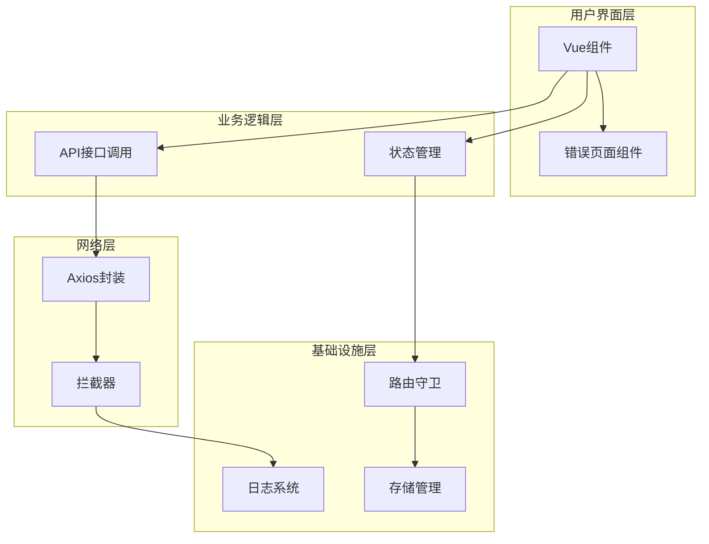
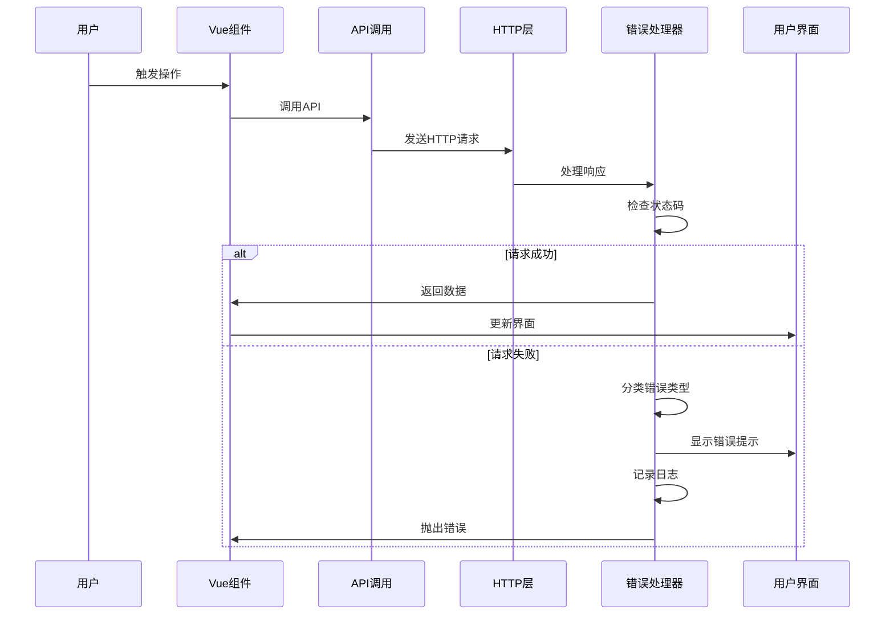
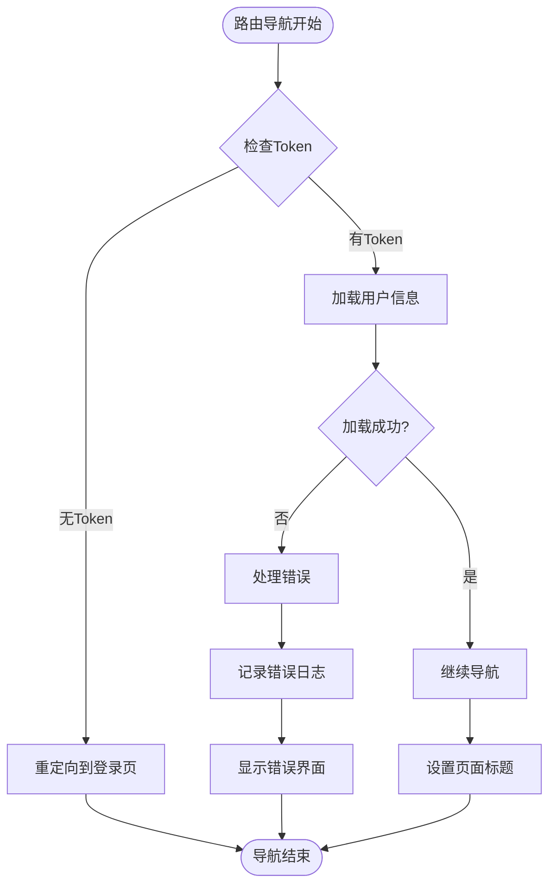
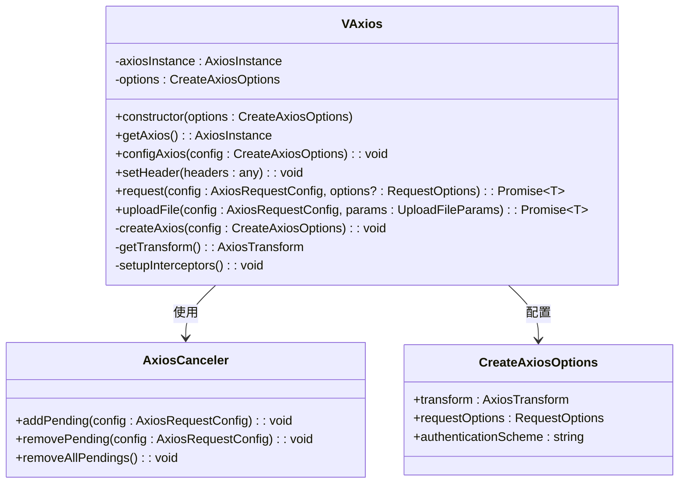
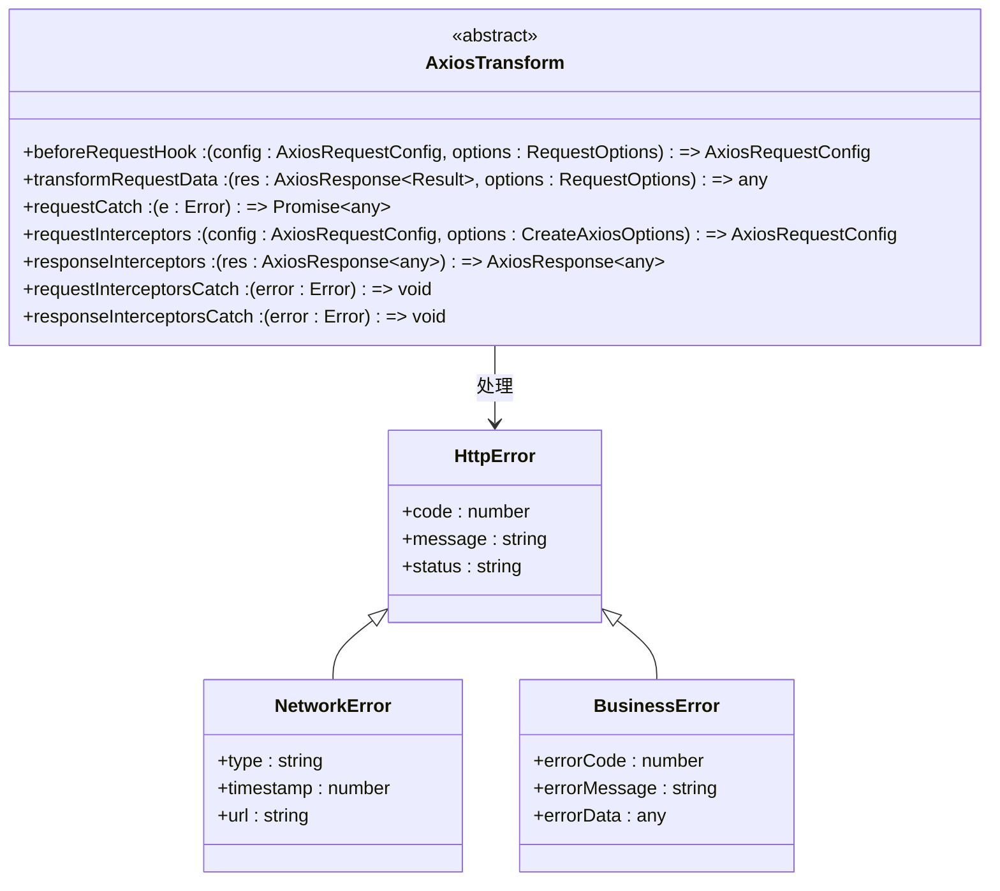
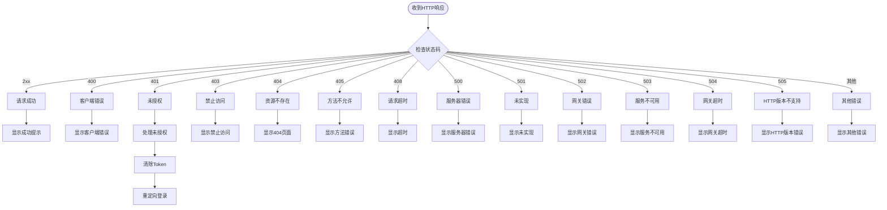
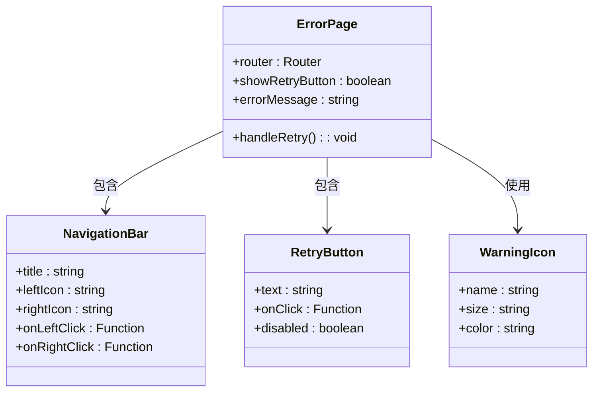
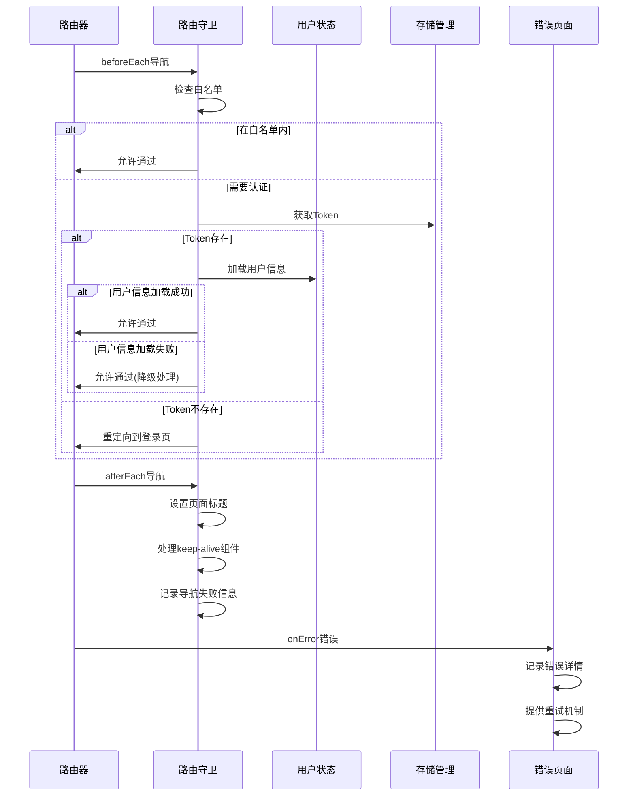
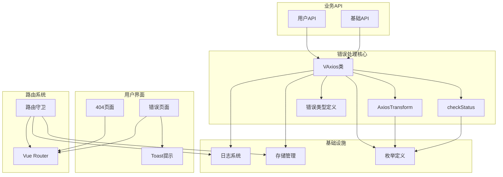

# 错误处理系统

<cite>
**本文档引用的文件**
- [checkStatus.ts](file://src/utils/http/axios/checkStatus.ts)
- [log.ts](file://src/utils/log.ts)
- [ErrorPage.vue](file://src/views/exception/ErrorPage.vue)
- [router-guards.ts](file://src/router/router-guards.ts)
- [Axios.ts](file://src/utils/http/axios/Axios.ts)
- [axiosTransform.ts](file://src/utils/http/axios/axiosTransform.ts)
- [httpEnum.ts](file://src/enums/httpEnum.ts)
- [404.vue](file://src/views/exception/404.vue)
- [index.ts](file://src/utils/http/axios/index.ts)
- [types.ts](file://src/utils/http/axios/types.ts)
- [Storage.ts](file://src/utils/Storage.ts)
- [user.ts](file://src/api/system/user.ts)
</cite>

## 目录
1. [简介](#简介)
2. [项目结构](#项目结构)
3. [核心组件](#核心组件)
4. [架构概览](#架构概览)
5. [详细组件分析](#详细组件分析)
6. [依赖关系分析](#依赖关系分析)
7. [性能考虑](#性能考虑)
8. [故障排除指南](#故障排除指南)
9. [结论](#结论)

## 简介

本项目构建了一个完整的错误处理系统，涵盖了HTTP请求错误处理、路由错误处理、用户界面错误展示以及全局日志记录等多个层面。该系统采用模块化设计，通过统一的错误处理策略确保用户体验的一致性和可靠性。

系统主要特点包括：
- 统一的HTTP请求错误处理机制
- 基于状态码的错误分类和处理
- 用户友好的错误提示界面
- 完整的日志记录和监控能力
- 路由级别的错误捕获和恢复机制

## 项目结构

错误处理系统的整体架构分为四个主要层次：

**图表来源**
- [index.ts:1-298](file://src/utils/http/axios/index.ts#L1-L298)
- [router-guards.ts:1-85](file://src/router/router-guards.ts#L1-L85)

**章节来源**
- [index.ts:1-298](file://src/utils/http/axios/index.ts#L1-L298)
- [router-guards.ts:1-85](file://src/router/router-guards.ts#L1-L85)

## 核心组件

### HTTP错误处理核心

HTTP错误处理系统的核心由以下组件构成：

#### VAxios类
VAxios是整个HTTP错误处理系统的基础类，负责：
- Axios实例的创建和配置
- 请求和响应拦截器的设置
- 错误处理和重试机制
- 请求取消和并发控制

#### AxiosTransform抽象类
AxiosTransform定义了HTTP请求的数据处理规范，包括：
- 请求前的数据预处理
- 响应数据的统一处理
- 错误处理策略的定义
- 拦截器的生命周期管理

#### 错误状态处理
系统实现了完整的HTTP状态码处理机制，涵盖：
- 4xx客户端错误（400, 401, 403, 404, 405, 408）
- 5xx服务器错误（500, 501, 502, 503, 504, 505）
- 网络超时和连接错误
- 自定义业务错误码处理

**章节来源**
- [Axios.ts:1-225](file://src/utils/http/axios/Axios.ts#L1-L225)
- [axiosTransform.ts:1-53](file://src/utils/http/axios/axiosTransform.ts#L1-L53)
- [checkStatus.ts:1-49](file://src/utils/http/axios/checkStatus.ts#L1-L49)

### 用户界面错误处理

#### 错误页面组件
系统提供了专门的错误页面组件，用于展示各种错误状态：
- 错误页面布局和样式设计
- 用户友好的错误提示信息
- 重试和返回功能
- 响应式设计适配

#### 404页面处理
404页面提供了完整的页面不存在处理机制：
- 友好的页面不存在提示
- 返回首页的快捷方式
- 图片资源的懒加载
- 导航状态的正确处理

**章节来源**
- [ErrorPage.vue:1-59](file://src/views/exception/ErrorPage.vue#L1-L59)
- [404.vue:1-41](file://src/views/exception/404.vue#L1-L41)

### 日志和监控系统

#### 日志记录工具
系统实现了统一的日志记录机制：
- 项目名称前缀的标准化输出
- 错误级别的异常抛出
- 警告信息的友好提示
- 控制台输出的格式化

#### 存储管理
存储系统提供了完整的数据持久化能力：
- 本地存储的封装和管理
- Cookie的统一操作接口
- 过期时间的智能管理
- 数据序列化的安全处理

**章节来源**
- [log.ts:1-10](file://src/utils/log.ts#L1-L10)
- [Storage.ts:1-128](file://src/utils/Storage.ts#L1-L128)

## 架构概览

### 整体错误处理流程

**图表来源**
- [index.ts:33-123](file://src/utils/http/axios/index.ts#L33-L123)
- [checkStatus.ts:3-48](file://src/utils/http/axios/checkStatus.ts#L3-L48)

### 路由错误处理机制

**图表来源**
- [router-guards.ts:11-44](file://src/router/router-guards.ts#L11-L44)

**章节来源**
- [router-guards.ts:1-85](file://src/router/router-guards.ts#L1-L85)

## 详细组件分析

### HTTP错误处理组件

#### VAxios类详细分析

VAxios类实现了完整的HTTP请求生命周期管理：

**图表来源**
- [Axios.ts:18-225](file://src/utils/http/axios/Axios.ts#L18-L225)

#### AxiosTransform抽象类分析

AxiosTransform定义了HTTP请求的标准化处理流程：

**图表来源**
- [axiosTransform.ts:13-52](file://src/utils/http/axios/axiosTransform.ts#L13-L52)

**章节来源**
- [Axios.ts:1-225](file://src/utils/http/axios/Axios.ts#L1-L225)
- [axiosTransform.ts:1-53](file://src/utils/http/axios/axiosTransform.ts#L1-L53)

### 错误状态处理机制

#### HTTP状态码分类处理

系统实现了详细的HTTP状态码处理策略：

**图表来源**
- [checkStatus.ts:3-48](file://src/utils/http/axios/checkStatus.ts#L3-L48)

**章节来源**
- [checkStatus.ts:1-49](file://src/utils/http/axios/checkStatus.ts#L1-L49)

### 用户界面错误展示

#### 错误页面组件设计

错误页面组件提供了统一的错误展示界面：

**图表来源**
- [ErrorPage.vue:44-59](file://src/views/exception/ErrorPage.vue#L44-L59)

**章节来源**
- [ErrorPage.vue:1-59](file://src/views/exception/ErrorPage.vue#L1-L59)

### 路由错误处理

#### 路由守卫错误处理

路由守卫实现了多层次的错误处理机制：

**图表来源**
- [router-guards.ts:11-84](file://src/router/router-guards.ts#L11-L84)

**章节来源**
- [router-guards.ts:1-85](file://src/router/router-guards.ts#L1-L85)

## 依赖关系分析

### 错误处理系统依赖图

**图表来源**
- [index.ts:1-298](file://src/utils/http/axios/index.ts#L1-L298)
- [router-guards.ts:1-85](file://src/router/router-guards.ts#L1-L85)

### 关键依赖关系

#### HTTP错误处理依赖链

HTTP错误处理系统的关键依赖关系如下：

1. **VAxios** 依赖于：
   - Axios库进行HTTP请求
   - AxiosCanceler进行请求取消
   - AxiosTransform进行数据处理
   - checkStatus进行状态码处理

2. **AxiosTransform** 依赖于：
   - RequestOptions进行配置
   - Result接口进行数据结构定义
   - 各种枚举类型进行状态定义

3. **错误页面组件** 依赖于：
   - Vue Router进行页面导航
   - Vant UI组件进行用户交互
   - 样式系统进行界面展示

**章节来源**
- [index.ts:1-298](file://src/utils/http/axios/index.ts#L1-L298)
- [Axios.ts:1-225](file://src/utils/http/axios/Axios.ts#L1-L225)

## 性能考虑

### 错误处理性能优化

#### 异步错误处理
系统采用了异步错误处理机制，确保错误不会阻塞主线程：
- Promise链式调用处理异步错误
- 非阻塞的日志记录
- 异步的用户界面更新

#### 内存管理
错误处理系统注重内存使用效率：
- 及时清理过期的错误状态
- 合理的缓存策略
- 避免内存泄漏的资源管理

#### 网络性能
HTTP错误处理优化了网络请求性能：
- 请求取消机制防止资源浪费
- 重复请求的智能去重
- 连接池的合理使用

## 故障排除指南

### 常见错误诊断

#### HTTP请求错误排查

1. **请求超时问题**
   - 检查网络连接状态
   - 验证服务器响应时间
   - 调整超时配置参数

2. **认证失败问题**
   - 验证Token的有效性
   - 检查认证头的格式
   - 确认用户权限状态

3. **数据格式错误**
   - 检查API响应格式
   - 验证数据转换逻辑
   - 确认编码格式设置

#### 用户界面错误排查

1. **错误页面显示问题**
   - 检查路由配置
   - 验证组件渲染
   - 确认样式加载

2. **Toast提示问题**
   - 检查Vant UI组件
   - 验证提示配置
   - 确认显示时机

#### 路由错误排查

1. **导航失败问题**
   - 检查路由守卫逻辑
   - 验证Token状态
   - 确认用户权限

2. **页面标题问题**
   - 检查meta配置
   - 验证标题设置逻辑
   - 确认文档对象

**章节来源**
- [index.ts:203-237](file://src/utils/http/axios/index.ts#L203-L237)
- [router-guards.ts:51-53](file://src/router/router-guards.ts#L51-L53)

### 调试技巧

#### 日志记录调试
系统提供了完善的日志记录机制：
- 错误级别日志的分类记录
- 时间戳的精确记录
- 上下文信息的完整保留

#### 错误监控
实现错误监控和报告：
- 错误发生的统计分析
- 用户行为轨迹追踪
- 性能指标的监控

## 结论

本项目的错误处理系统展现了现代前端应用的最佳实践，通过模块化的设计和完善的错误处理机制，确保了应用的稳定性和用户体验。

### 系统优势

1. **完整性**：涵盖了从网络层到用户界面的全栈错误处理
2. **一致性**：统一的错误处理策略和用户界面设计
3. **可扩展性**：模块化的架构便于功能扩展和维护
4. **用户体验**：友好的错误提示和恢复机制

### 改进建议

1. **错误分类细化**：可以进一步细分错误类型，提供更精确的处理策略
2. **性能监控**：集成性能监控工具，实时跟踪错误发生频率
3. **自动化测试**：增加错误处理的自动化测试用例
4. **文档完善**：补充详细的错误处理文档和最佳实践指南

该错误处理系统为Vue3微信H5应用提供了坚实的技术基础，能够有效提升应用的可靠性和用户满意度。