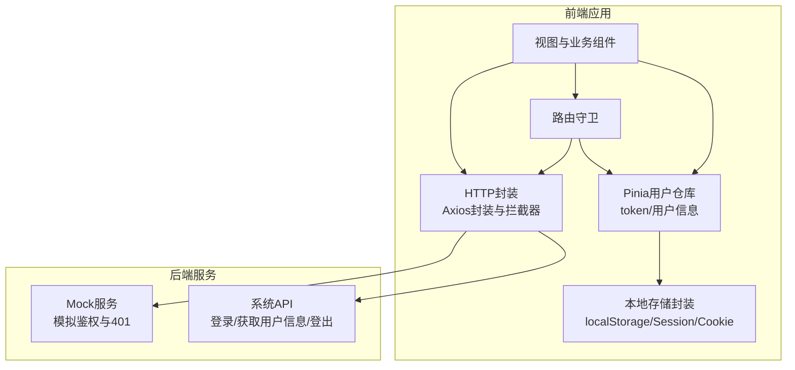
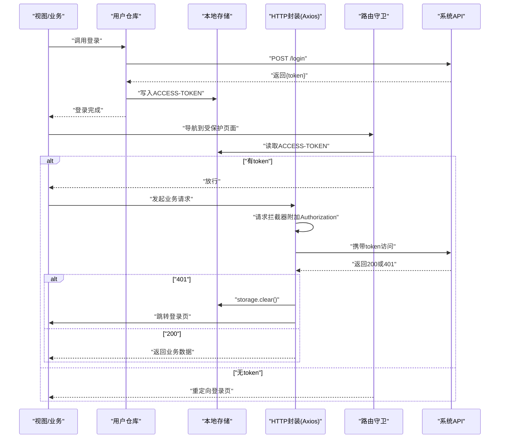
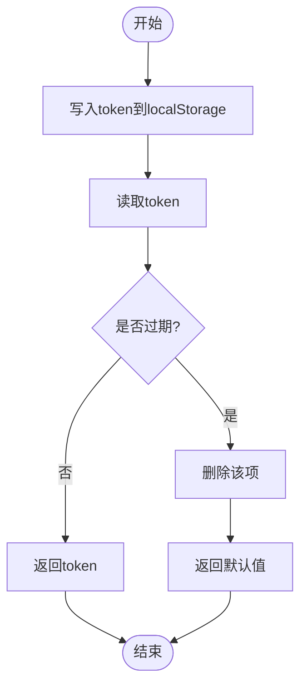
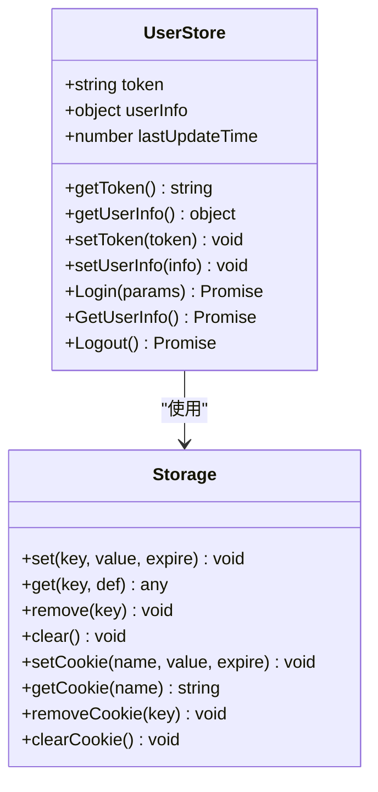
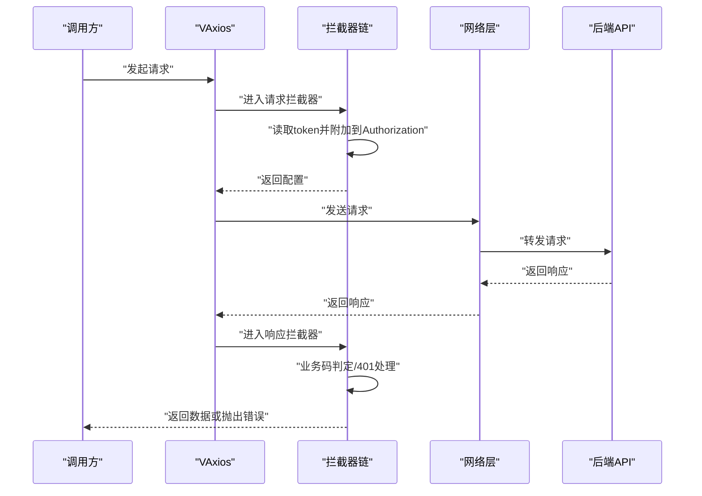
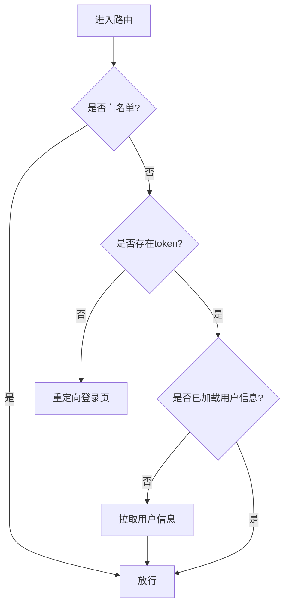
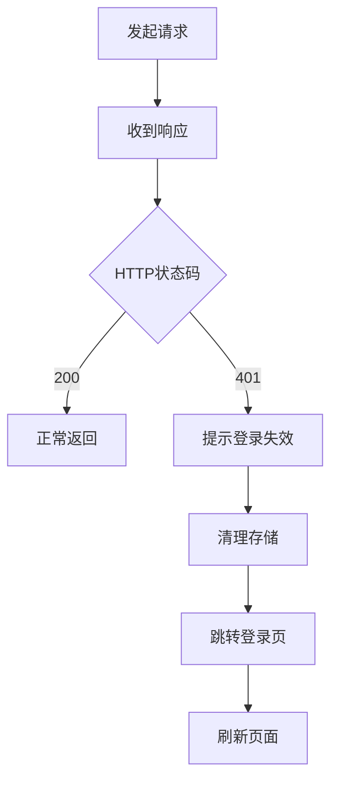
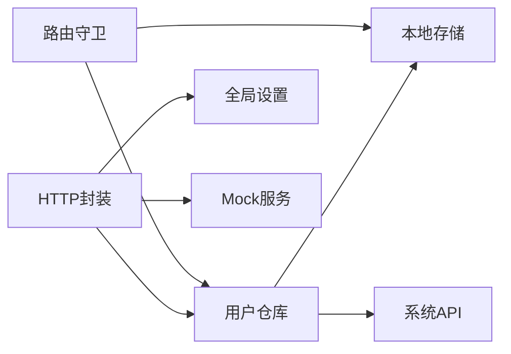

# Token管理

<cite>
**本文引用的文件**
- [Storage.ts](file://src/utils/Storage.ts)
- [user.ts（用户仓库）](file://src/store/modules/user.ts)
- [Axios.ts](file://src/utils/http/axios/Axios.ts)
- [axiosTransform.ts](file://src/utils/http/axios/axiosTransform.ts)
- [index.ts（HTTP封装）](file://src/utils/http/axios/index.ts)
- [router-guards.ts](file://src/router/router-guards.ts)
- [mutation-types.ts](file://src/store/mutation-types.ts)
- [httpEnum.ts](file://src/enums/httpEnum.ts)
- [cacheEnum.ts](file://src/enums/cacheEnum.ts)
- [user.ts（系统API）](file://src/api/system/user.ts)
- [_util.ts（Mock工具）](file://mock/_util.ts)
- [user.ts（Mock用户）](file://mock/user/user.ts)
- [checkStatus.ts](file://src/utils/http/axios/checkStatus.ts)
- [main.ts](file://src/main.ts)
</cite>

## 目录
1. [简介](#简介)
2. [项目结构](#项目结构)
3. [核心组件](#核心组件)
4. [架构总览](#架构总览)
5. [详细组件分析](#详细组件分析)
6. [依赖关系分析](#依赖关系分析)
7. [性能考量](#性能考量)
8. [故障排查指南](#故障排查指南)
9. [结论](#结论)
10. [附录](#附录)

## 简介
本文件面向“Token管理”主题，系统性梳理本项目中JWT令牌的生成、存储、验证与自动续期机制，以及在HTTP请求中的自动附加策略；同时给出Token失效处理（401）与登出流程、安全存储最佳实践（含HttpOnly Cookie与XSS防护建议）、完整示例与调试技巧。文档严格基于仓库现有实现进行分析与总结。

## 项目结构
围绕Token管理的关键目录与文件如下：
- 存储层：src/utils/Storage.ts 提供localStorage/sessionStorage与Cookie的统一封装
- 状态层：src/store/modules/user.ts 管理token与用户信息，持久化至localStorage
- HTTP层：src/utils/http/axios/index.ts 封装Axios，内置请求/响应拦截器与错误处理
- 路由守卫：src/router/router-guards.ts 控制访问权限与登录态校验
- 枚举与常量：src/enums/httpEnum.ts、src/enums/cacheEnum.ts、src/store/mutation-types.ts
- API层：src/api/system/user.ts 定义登录/获取用户信息/登出等接口
- Mock层：mock/user/user.ts、mock/_util.ts 模拟后端行为，便于演示与测试

图表来源
- [user.ts（用户仓库）:1-115](file://src/store/modules/user.ts#L1-L115)
- [index.ts（HTTP封装）:1-298](file://src/utils/http/axios/index.ts#L1-L298)
- [router-guards.ts:1-93](file://src/router/router-guards.ts#L1-L93)
- [Storage.ts:1-128](file://src/utils/Storage.ts#L1-L128)
- [user.ts（系统API）:1-60](file://src/api/system/user.ts#L1-L60)
- [user.ts（Mock用户）:46-95](file://mock/user/user.ts#L46-L95)

章节来源
- [main.ts:1-30](file://src/main.ts#L1-L30)
- [user.ts（用户仓库）:1-115](file://src/store/modules/user.ts#L1-L115)
- [index.ts（HTTP封装）:1-298](file://src/utils/http/axios/index.ts#L1-L298)
- [router-guards.ts:1-93](file://src/router/router-guards.ts#L1-L93)
- [Storage.ts:1-128](file://src/utils/Storage.ts#L1-L128)
- [user.ts（系统API）:1-60](file://src/api/system/user.ts#L1-L60)
- [user.ts（Mock用户）:46-95](file://mock/user/user.ts#L46-L95)

## 核心组件
- 本地存储封装：提供统一的set/get/remove/clear与Cookie相关能力，支持默认过期时间与前缀键
- 用户仓库：集中管理token与用户信息，登录成功写入localStorage，登出清理
- HTTP封装：请求拦截器自动附加Authorization头；响应拦截器处理401并触发登出流程
- 路由守卫：白名单放行、无token跳转登录、首次进入拉取用户信息
- 枚举与常量：统一HTTP状态码与token键名

章节来源
- [Storage.ts:1-128](file://src/utils/Storage.ts#L1-L128)
- [user.ts（用户仓库）:1-115](file://src/store/modules/user.ts#L1-L115)
- [index.ts（HTTP封装）:1-298](file://src/utils/http/axios/index.ts#L1-L298)
- [router-guards.ts:1-93](file://src/router/router-guards.ts#L1-L93)
- [httpEnum.ts:1-36](file://src/enums/httpEnum.ts#L1-L36)
- [cacheEnum.ts:1-15](file://src/enums/cacheEnum.ts#L1-L15)
- [mutation-types.ts:1-4](file://src/store/mutation-types.ts#L1-L4)

## 架构总览
下图展示了Token在系统中的流转：登录获取token -> 写入仓库与本地存储 -> 请求时自动附加 -> 响应401时清理并跳转登录。

图表来源
- [user.ts（用户仓库）:64-107](file://src/store/modules/user.ts#L64-L107)
- [index.ts（HTTP封装）:187-198](file://src/utils/http/axios/index.ts#L187-L198)
- [index.ts（HTTP封装）:97-122](file://src/utils/http/axios/index.ts#L97-L122)
- [router-guards.ts:18-51](file://src/router/router-guards.ts#L18-L51)
- [Storage.ts:40-57](file://src/utils/Storage.ts#L40-L57)
- [user.ts（系统API）:12-43](file://src/api/system/user.ts#L12-L43)

## 详细组件分析

### 本地存储与Token持久化
- 设计要点
  - 统一前缀键与默认过期时间（7天）
  - 支持localStorage/sessionStorage与Cookie读写
  - get方法自动判断过期并清理
- Token键名
  - ACCESS_TOKEN：用户令牌键
  - CURRENT_USER：当前用户信息键
- 使用策略
  - 登录成功后将token写入localStorage
  - 读取优先级：仓库内状态 > localStorage > 默认值
  - 登出时移除对应键并清空存储

图表来源
- [Storage.ts:27-57](file://src/utils/Storage.ts#L27-L57)
- [mutation-types.ts:1-2](file://src/store/mutation-types.ts#L1-L2)
- [user.ts（用户仓库）:43-48](file://src/store/modules/user.ts#L43-L48)

章节来源
- [Storage.ts:1-128](file://src/utils/Storage.ts#L1-L128)
- [user.ts（用户仓库）:1-115](file://src/store/modules/user.ts#L1-L115)
- [mutation-types.ts:1-4](file://src/store/mutation-types.ts#L1-L4)

### 用户仓库与Token生命周期
- 登录
  - 调用登录接口，成功后将token写入仓库与localStorage
- 获取用户信息
  - 首次进入受保护页面时拉取用户信息并持久化
- 登出
  - 调用登出接口（可选），清理仓库与localStorage，跳转登录页并刷新

图表来源
- [user.ts（用户仓库）:36-109](file://src/store/modules/user.ts#L36-L109)
- [Storage.ts:13-121](file://src/utils/Storage.ts#L13-L121)

章节来源
- [user.ts（用户仓库）:1-115](file://src/store/modules/user.ts#L1-L115)

### HTTP请求拦截与自动附加
- 请求拦截器
  - 从用户仓库读取token
  - 若withToken非false，则在Authorization头中附加token（支持带认证方案）
- 响应拦截器
  - 统一处理业务错误码
  - 对401进行专门处理：弹窗提示、清理存储、跳转登录页
- 错误处理
  - 网络异常与超时提示
  - 其他HTTP状态码通过checkStatus映射提示

图表来源
- [Axios.ts:175-223](file://src/utils/http/axios/Axios.ts#L175-L223)
- [index.ts（HTTP封装）:187-198](file://src/utils/http/axios/index.ts#L187-L198)
- [index.ts（HTTP封装）:97-122](file://src/utils/http/axios/index.ts#L97-L122)
- [checkStatus.ts:3-48](file://src/utils/http/axios/checkStatus.ts#L3-L48)

章节来源
- [Axios.ts:1-225](file://src/utils/http/axios/Axios.ts#L1-L225)
- [axiosTransform.ts:1-53](file://src/utils/http/axios/axiosTransform.ts#L1-L53)
- [index.ts（HTTP封装）:1-298](file://src/utils/http/axios/index.ts#L1-L298)
- [checkStatus.ts:1-49](file://src/utils/http/axios/checkStatus.ts#L1-L49)

### 路由守卫与访问控制
- 白名单：登录页直接放行
- 无token：重定向登录页
- 首次进入：若用户信息未加载则拉取一次
- 页面标题与进度条：统一处理

图表来源
- [router-guards.ts:18-51](file://src/router/router-guards.ts#L18-L51)

章节来源
- [router-guards.ts:1-93](file://src/router/router-guards.ts#L1-L93)

### Token自动刷新机制
- 现状说明
  - 本项目未实现客户端侧的自动刷新（例如refresh_token轮询或静默刷新）
  - 401时统一清理存储并跳转登录页
- 实现建议（概念性）
  - 在请求拦截器中检测即将过期（例如基于JWT的exp字段），在过期前主动调用刷新接口
  - 刷新成功后更新仓库与存储中的token，重试原请求
  - 需要避免并发刷新与死循环刷新

[本节为概念性建议，不涉及具体源码分析]

### Token失效处理与登出
- 401处理
  - 响应拦截器识别401，弹窗提示并清理存储
  - 跳转登录页，强制登出
- 登出流程
  - 调用后端登出接口（可选）
  - 清理仓库与本地存储
  - 导航至登录页并刷新

图表来源
- [index.ts（HTTP封装）:97-122](file://src/utils/http/axios/index.ts#L97-L122)
- [user.ts（用户仓库）:92-107](file://src/store/modules/user.ts#L92-L107)

章节来源
- [index.ts（HTTP封装）:1-298](file://src/utils/http/axios/index.ts#L1-L298)
- [user.ts（用户仓库）:1-115](file://src/store/modules/user.ts#L1-L115)

### 安全存储最佳实践
- XSS防护
  - 优先使用HttpOnly Cookie（服务端设置），避免将敏感令牌存于localStorage/sessionStorage
  - 如必须使用前端存储，确保应用无XSS漏洞，限制第三方脚本注入
- CSRF与SameSite
  - Cookie建议启用SameSite与Secure属性（服务端配置）
- Token键名与命名空间
  - 使用统一的键名常量与前缀，降低冲突风险
- 过期与清理
  - 明确过期策略与清理时机，避免长期持有高权限令牌

章节来源
- [Storage.ts:1-128](file://src/utils/Storage.ts#L1-L128)
- [cacheEnum.ts:1-15](file://src/enums/cacheEnum.ts#L1-L15)
- [mutation-types.ts:1-4](file://src/store/mutation-types.ts#L1-L4)

### 完整示例与调试技巧
- 示例场景
  - 登录：调用登录接口，成功后仓库与存储中出现token
  - 访问受保护页面：路由守卫放行，请求自动附加Authorization
  - 401：弹窗提示，清理存储并跳转登录
- 调试技巧
  - 打开浏览器开发者工具，查看Network中Authorization头是否正确
  - 在Console中检查仓库与存储中的token状态
  - 使用Mock模式验证401分支与登出流程
  - 关注路由守卫日志与进度条状态

章节来源
- [user.ts（系统API）:1-60](file://src/api/system/user.ts#L1-L60)
- [user.ts（Mock用户）:46-95](file://mock/user/user.ts#L46-L95)
- [_util.ts（Mock工具）:56-77](file://mock/_util.ts#L56-L77)

## 依赖关系分析
- 组件耦合
  - 用户仓库依赖本地存储与系统API
  - HTTP封装依赖用户仓库与全局设置
  - 路由守卫依赖用户仓库与本地存储
- 外部依赖
  - Axios、Pinia、Vue Router、Vant等
- 循环依赖
  - 未发现明显循环依赖

图表来源
- [user.ts（用户仓库）:1-115](file://src/store/modules/user.ts#L1-L115)
- [index.ts（HTTP封装）:1-298](file://src/utils/http/axios/index.ts#L1-L298)
- [router-guards.ts:1-93](file://src/router/router-guards.ts#L1-L93)
- [Storage.ts:1-128](file://src/utils/Storage.ts#L1-L128)
- [user.ts（系统API）:1-60](file://src/api/system/user.ts#L1-L60)
- [user.ts（Mock用户）:46-95](file://mock/user/user.ts#L46-L95)

章节来源
- [user.ts（用户仓库）:1-115](file://src/store/modules/user.ts#L1-L115)
- [index.ts（HTTP封装）:1-298](file://src/utils/http/axios/index.ts#L1-L298)
- [router-guards.ts:1-93](file://src/router/router-guards.ts#L1-L93)
- [Storage.ts:1-128](file://src/utils/Storage.ts#L1-L128)

## 性能考量
- 请求去重与取消
  - 通过AxiosCanceler避免重复请求，减少网络与服务端压力
- 缓存与过期
  - 本地存储提供过期控制，避免读取过期数据
- 路由守卫轻量化
  - 仅做必要检查与一次性用户信息拉取，避免阻塞渲染

章节来源
- [Axios.ts:1-225](file://src/utils/http/axios/Axios.ts#L1-L225)
- [Storage.ts:1-128](file://src/utils/Storage.ts#L1-L128)

## 故障排查指南
- 无法附加Token
  - 检查请求拦截器是否生效，确认仓库中token存在
  - 确认withToken未被显式设为false
- 401频繁触发
  - 检查后端token有效期与签发策略
  - 确认前端未篡改token或跨域Cookie未生效
- 登出后仍可访问
  - 确认storage.clear()与仓库清理执行
  - 检查是否有缓存页面未刷新
- 网络异常
  - 查看响应拦截器对网络错误的提示与处理

章节来源
- [index.ts（HTTP封装）:187-198](file://src/utils/http/axios/index.ts#L187-L198)
- [index.ts（HTTP封装）:203-237](file://src/utils/http/axios/index.ts#L203-L237)
- [checkStatus.ts:1-49](file://src/utils/http/axios/checkStatus.ts#L1-L49)
- [user.ts（用户仓库）:92-107](file://src/store/modules/user.ts#L92-L107)

## 结论
本项目通过“用户仓库 + 本地存储 + HTTP拦截器 + 路由守卫”的组合，实现了Token的可靠存储与自动附加，并在401时提供统一的登出与跳转机制。对于自动刷新与HttpOnly Cookie等更高级的安全策略，可在现有架构基础上扩展实现，以进一步提升安全性与用户体验。

## 附录
- 关键枚举与常量
  - HTTP状态码：SUCCESS、TOKEN_EXPIRED、ERROR、TIMEOUT
  - Token键名：ACCESS_TOKEN、CURRENT_USER
  - 缓存键名：TOKEN_KEY、USER_INFO_KEY、BASE_LOCAL_CACHE_KEY、BASE_SESSION_CACHE_KEY
- Mock验证
  - Mock用户接口会校验Authorization头，401时返回相应错误码

章节来源
- [httpEnum.ts:1-36](file://src/enums/httpEnum.ts#L1-L36)
- [mutation-types.ts:1-4](file://src/store/mutation-types.ts#L1-L4)
- [cacheEnum.ts:1-15](file://src/enums/cacheEnum.ts#L1-L15)
- [user.ts（Mock用户）:46-95](file://mock/user/user.ts#L46-L95)
- [_util.ts（Mock工具）:56-77](file://mock/_util.ts#L56-L77)