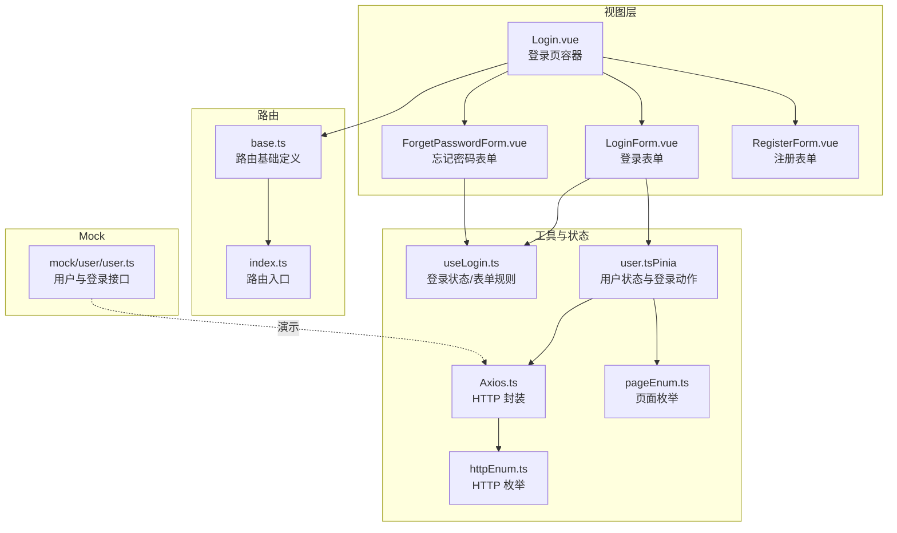
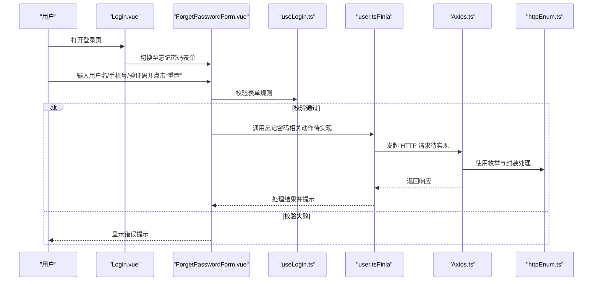
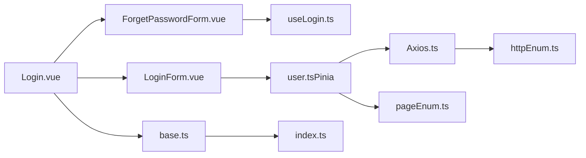
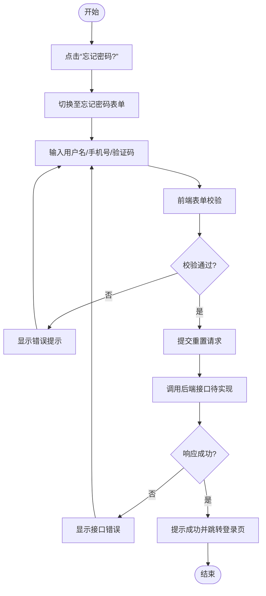

# 忘记密码

<cite>
**本文引用的文件**
- [ForgetPasswordForm.vue](file://src/views/login/ForgetPasswordForm.vue)
- [useLogin.ts](file://src/views/login/useLogin.ts)
- [LoginForm.vue](file://src/views/login/LoginForm.vue)
- [Login.vue](file://src/views/login/Login.vue)
- [user.ts（系统用户API）](file://src/api/system/user.ts)
- [user.ts（用户状态 Pinia）](file://src/store/modules/user.ts)
- [Axios.ts](file://src/utils/http/axios/Axios.ts)
- [httpEnum.ts](file://src/enums/httpEnum.ts)
- [pageEnum.ts](file://src/enums/pageEnum.ts)
- [base.ts（路由基础定义）](file://src/router/base.ts)
- [index.ts（路由入口）](file://src/router/index.ts)
- [user.ts（Mock 用户数据与接口）](file://mock/user/user.ts)
</cite>

## 目录
1. [简介](#简介)
2. [项目结构](#项目结构)
3. [核心组件](#核心组件)
4. [架构总览](#架构总览)
5. [详细组件分析](#详细组件分析)
6. [依赖关系分析](#依赖关系分析)
7. [性能考虑](#性能考虑)
8. [故障排查指南](#故障排查指南)
9. [结论](#结论)
10. [附录：完整流程示例与最佳实践](#附录完整流程示例与最佳实践)

## 简介
本文件围绕“忘记密码”功能进行系统化实现说明，覆盖从表单设计、输入校验、验证码发送、密码重置到状态管理与安全防护的全流程。当前仓库已具备忘记密码表单与规则、登录页切换入口、HTTP 封装与枚举等基础设施，但忘记密码的后端接口与验证码发送逻辑尚未在前端完成实现。本文在现有代码基础上，给出可落地的实现建议与流程图示，帮助快速补齐功能并确保安全性与可用性。

## 项目结构
与“忘记密码”直接相关的前端模块分布如下：
- 视图层：登录页容器、登录表单、忘记密码表单、注册表单
- 工具与状态：登录状态与表单规则工具、用户 Pinia Store、HTTP 封装
- 路由与页面枚举：登录页路由、页面常量
- Mock 数据：用户列表与登录/登出/获取用户信息接口（用于演示）

**图表来源**
- [Login.vue:1-47](file://src/views/login/Login.vue#L1-L47)
- [LoginForm.vue:1-124](file://src/views/login/LoginForm.vue#L1-L124)
- [ForgetPasswordForm.vue:1-101](file://src/views/login/ForgetPasswordForm.vue#L1-L101)
- [RegisterForm.vue:1-164](file://src/views/login/RegisterForm.vue#L1-L164)
- [useLogin.ts:1-97](file://src/views/login/useLogin.ts#L1-L97)
- [user.ts（系统用户API）:1-60](file://src/api/system/user.ts#L1-L60)
- [user.ts（用户状态 Pinia）:1-115](file://src/store/modules/user.ts#L1-L115)
- [Axios.ts:1-225](file://src/utils/http/axios/Axios.ts#L1-L225)
- [httpEnum.ts:1-36](file://src/enums/httpEnum.ts#L1-L36)
- [pageEnum.ts:1-12](file://src/enums/pageEnum.ts#L1-L12)
- [base.ts（路由基础定义）:1-54](file://src/router/base.ts#L1-L54)
- [index.ts（路由入口）:1-33](file://src/router/index.ts#L1-L33)
- [user.ts（Mock 用户数据与接口）:1-96](file://mock/user/user.ts#L1-L96)

**章节来源**
- [Login.vue:1-47](file://src/views/login/Login.vue#L1-L47)
- [LoginForm.vue:1-124](file://src/views/login/LoginForm.vue#L1-L124)
- [ForgetPasswordForm.vue:1-101](file://src/views/login/ForgetPasswordForm.vue#L1-L101)
- [RegisterForm.vue:1-164](file://src/views/login/RegisterForm.vue#L1-L164)
- [useLogin.ts:1-97](file://src/views/login/useLogin.ts#L1-L97)
- [user.ts（系统用户API）:1-60](file://src/api/system/user.ts#L1-L60)
- [user.ts（用户状态 Pinia）:1-115](file://src/store/modules/user.ts#L1-L115)
- [Axios.ts:1-225](file://src/utils/http/axios/Axios.ts#L1-L225)
- [httpEnum.ts:1-36](file://src/enums/httpEnum.ts#L1-L36)
- [pageEnum.ts:1-12](file://src/enums/pageEnum.ts#L1-L12)
- [base.ts（路由基础定义）:1-54](file://src/router/base.ts#L1-L54)
- [index.ts（路由入口）:1-33](file://src/router/index.ts#L1-L33)
- [user.ts（Mock 用户数据与接口）:1-96](file://mock/user/user.ts#L1-L96)

## 核心组件
- 忘记密码表单组件：负责用户名、手机号、短信验证码的输入与提交；当前已具备基础布局与校验规则挂载点，但提交处理逻辑需补充。
- 登录状态与表单规则工具：统一维护登录、注册、忘记密码三种状态下的表单规则，支持动态切换。
- 用户 Pinia Store：封装登录、登出、获取用户信息等动作，为后续密码重置后的跳转与状态更新提供支撑。
- HTTP 封装与枚举：统一封装请求与响应处理、内容类型与请求方法枚举，便于扩展忘记密码所需的接口。
- 路由与页面枚举：提供登录页路由与页面常量，便于在重置成功后进行页面跳转。

**章节来源**
- [ForgetPasswordForm.vue:1-101](file://src/views/login/ForgetPasswordForm.vue#L1-L101)
- [useLogin.ts:1-97](file://src/views/login/useLogin.ts#L1-L97)
- [user.ts（用户状态 Pinia）:1-115](file://src/store/modules/user.ts#L1-L115)
- [Axios.ts:1-225](file://src/utils/http/axios/Axios.ts#L1-L225)
- [httpEnum.ts:1-36](file://src/enums/httpEnum.ts#L1-L36)
- [pageEnum.ts:1-12](file://src/enums/pageEnum.ts#L1-L12)

## 架构总览
下图展示了“忘记密码”从用户交互到后端处理的整体流程，以及与现有代码的对应关系。

**图表来源**
- [Login.vue:1-47](file://src/views/login/Login.vue#L1-L47)
- [ForgetPasswordForm.vue:1-101](file://src/views/login/ForgetPasswordForm.vue#L1-L101)
- [useLogin.ts:1-97](file://src/views/login/useLogin.ts#L1-L97)
- [user.ts（用户状态 Pinia）:1-115](file://src/store/modules/user.ts#L1-L115)
- [Axios.ts:1-225](file://src/utils/http/axios/Axios.ts#L1-L225)
- [httpEnum.ts:1-36](file://src/enums/httpEnum.ts#L1-L36)

## 详细组件分析

### 忘记密码表单组件（ForgetPasswordForm.vue）
- 功能要点
  - 提供用户名、手机号、短信验证码输入框，并绑定表单规则。
  - 在提交时触发表单校验，校验通过后执行后续处理（当前占位逻辑待填充）。
  - 通过登录状态工具控制显示与隐藏。
- 当前实现位置
  - 表单布局与提交事件绑定：[ForgetPasswordForm.vue:2-L52]
  - 表单规则挂载与显示控制：[ForgetPasswordForm.vue:68-L72]
  - 占位处理函数与加载态：[ForgetPasswordForm.vue:82-L97]
- 可扩展点
  - 在提交处理中调用忘记密码 API（见“附录：完整流程示例与最佳实践”）。
  - 增加“发送验证码”按钮的点击事件与倒计时逻辑（参考注册表单的验证码按钮模板）。

**章节来源**
- [ForgetPasswordForm.vue:1-101](file://src/views/login/ForgetPasswordForm.vue#L1-L101)
- [useLogin.ts:1-97](file://src/views/login/useLogin.ts#L1-L97)

### 登录状态与表单规则工具（useLogin.ts）
- 功能要点
  - 维护登录状态枚举（登录、注册、忘记密码）。
  - 根据当前状态返回不同的表单规则集合，支持用户名、密码、手机号、验证码等字段的必填与联动校验。
- 当前实现位置
  - 状态枚举与切换：[useLogin.ts:3-L7]
  - 表单规则生成（含忘记密码场景）：[useLogin.ts:47-L84]
- 可扩展点
  - 在忘记密码场景下，可增加验证码长度、格式等规则。
  - 可引入手机号与用户名的联动校验（如根据用户名自动带出手机号等，视业务而定）。

**章节来源**
- [useLogin.ts:1-97](file://src/views/login/useLogin.ts#L1-L97)

### 登录页容器（Login.vue）
- 功能要点
  - 容器内组合登录表单、忘记密码表单、注册表单等子组件。
  - 通过登录状态工具切换显示不同表单。
- 当前实现位置
  - 组件组合与样式：[Login.vue:1-L47]

**章节来源**
- [Login.vue:1-47](file://src/views/login/Login.vue#L1-L47)

### 登录表单（LoginForm.vue）
- 功能要点
  - 包含“忘记密码?”链接，点击后切换至忘记密码表单。
  - 登录成功后的跳转逻辑与提示，为后续密码重置成功后的反馈提供参考。
- 当前实现位置
  - 切换至忘记密码表单的事件绑定：[LoginForm.vue:37]
  - 登录成功后的跳转与提示：[LoginForm.vue:98-L105]

**章节来源**
- [LoginForm.vue:1-124](file://src/views/login/LoginForm.vue#L1-L124)

### 用户 Pinia Store（user.ts）
- 功能要点
  - 封装登录、登出、获取用户信息等动作，为忘记密码流程提供状态与跳转支撑。
  - 登录成功后设置 Token 与用户信息，失败时返回错误信息。
- 当前实现位置
  - 登录动作与 Token 设置：[user.ts（用户状态 Pinia）:64-L77]
  - 获取用户信息与错误处理：[user.ts（用户状态 Pinia）:79-L89]
  - 登出动作与清理：[user.ts（用户状态 Pinia）:92-L107]

**章节来源**
- [user.ts（用户状态 Pinia）:1-115](file://src/store/modules/user.ts#L1-L115)

### HTTP 封装与枚举（Axios.ts、httpEnum.ts）
- 功能要点
  - 统一请求与响应处理、拦截器、取消重复请求、表单序列化等。
  - 提供请求方法、内容类型与结果枚举，便于扩展忘记密码接口。
- 当前实现位置
  - 请求封装与拦截器：[Axios.ts:55-L100]
  - 请求方法与内容类型枚举：[httpEnum.ts:15-L35]

**章节来源**
- [Axios.ts:1-225](file://src/utils/http/axios/Axios.ts#L1-L225)
- [httpEnum.ts:1-36](file://src/enums/httpEnum.ts#L1-L36)

### 路由与页面枚举（base.ts、index.ts、pageEnum.ts）
- 功能要点
  - 定义登录页路由与首页路由，提供页面常量，便于在忘记密码成功后进行跳转。
- 当前实现位置
  - 登录页路由定义：[base.ts:37-L44]
  - 路由入口与守卫：[index.ts:19-L33]
  - 页面常量：[pageEnum.ts:2-L11]

**章节来源**
- [base.ts（路由基础定义）:1-54](file://src/router/base.ts#L1-L54)
- [index.ts（路由入口）:1-33](file://src/router/index.ts#L1-L33)
- [pageEnum.ts:1-12](file://src/enums/pageEnum.ts#L1-L12)

### Mock 用户数据与接口（mock/user/user.ts）
- 功能要点
  - 提供登录、获取用户信息、登出等接口的 Mock 实现，可用于演示与联调。
- 当前实现位置
  - 登录接口：[user.ts（Mock 用户数据与接口）:40-L59]
  - 获取用户信息接口：[user.ts（Mock 用户数据与接口）:62-L77]
  - 登出接口：[user.ts（Mock 用户数据与接口）:80-L94]

**章节来源**
- [user.ts（Mock 用户数据与接口）:1-96](file://mock/user/user.ts#L1-L96)

## 依赖关系分析
- 组件耦合
  - 忘记密码表单依赖登录状态工具以控制显示与规则。
  - 登录页容器聚合多个表单组件，形成统一入口。
  - 用户 Pinia Store 作为状态中心，被登录与忘记密码流程共同使用。
- 外部依赖
  - HTTP 封装与枚举为所有网络请求提供统一出口。
  - 路由与页面枚举为页面跳转提供依据。

**图表来源**
- [ForgetPasswordForm.vue:1-101](file://src/views/login/ForgetPasswordForm.vue#L1-L101)
- [useLogin.ts:1-97](file://src/views/login/useLogin.ts#L1-L97)
- [Login.vue:1-47](file://src/views/login/Login.vue#L1-L47)
- [LoginForm.vue:1-124](file://src/views/login/LoginForm.vue#L1-L124)
- [user.ts（用户状态 Pinia）:1-115](file://src/store/modules/user.ts#L1-L115)
- [Axios.ts:1-225](file://src/utils/http/axios/Axios.ts#L1-L225)
- [httpEnum.ts:1-36](file://src/enums/httpEnum.ts#L1-L36)
- [base.ts（路由基础定义）:1-54](file://src/router/base.ts#L1-L54)
- [index.ts（路由入口）:1-33](file://src/router/index.ts#L1-L33)
- [pageEnum.ts:1-12](file://src/enums/pageEnum.ts#L1-L12)

**章节来源**
- [ForgetPasswordForm.vue:1-101](file://src/views/login/ForgetPasswordForm.vue#L1-L101)
- [useLogin.ts:1-97](file://src/views/login/useLogin.ts#L1-L97)
- [Login.vue:1-47](file://src/views/login/Login.vue#L1-L47)
- [LoginForm.vue:1-124](file://src/views/login/LoginForm.vue#L1-L124)
- [user.ts（用户状态 Pinia）:1-115](file://src/store/modules/user.ts#L1-L115)
- [Axios.ts:1-225](file://src/utils/http/axios/Axios.ts#L1-L225)
- [httpEnum.ts:1-36](file://src/enums/httpEnum.ts#L1-L36)
- [base.ts（路由基础定义）:1-54](file://src/router/base.ts#L1-L54)
- [index.ts（路由入口）:1-33](file://src/router/index.ts#L1-L33)
- [pageEnum.ts:1-12](file://src/enums/pageEnum.ts#L1-L12)

## 性能考虑
- 表单校验
  - 使用计算型规则与延迟触发，避免频繁校验导致的性能损耗。
- 请求优化
  - 合理使用请求拦截器与重复请求取消，减少无效网络开销。
- UI 交互
  - 提交按钮添加加载态，避免重复提交造成资源浪费。

[本节为通用指导，无需特定文件来源]

## 故障排查指南
- 表单未显示
  - 检查登录状态是否切换至“忘记密码”状态。
  - 参考：[useLogin.ts:6-L23]
- 校验不生效
  - 确认表单规则是否按当前状态返回，特别是忘记密码场景的规则集合。
  - 参考：[useLogin.ts:47-L84]
- 提交无响应
  - 检查提交处理函数是否已实现，当前仅保留占位逻辑。
  - 参考：[ForgetPasswordForm.vue:82-L97]
- 登录成功后跳转异常
  - 检查路由与页面常量配置，确保跳转路径正确。
  - 参考：[base.ts:37-L44], [pageEnum.ts:2-L11]

**章节来源**
- [useLogin.ts:1-97](file://src/views/login/useLogin.ts#L1-L97)
- [ForgetPasswordForm.vue:1-101](file://src/views/login/ForgetPasswordForm.vue#L1-L101)
- [base.ts（路由基础定义）:1-54](file://src/router/base.ts#L1-L54)
- [pageEnum.ts:1-12](file://src/enums/pageEnum.ts#L1-L12)

## 结论
当前项目已具备“忘记密码”表单的基础结构与规则体系，结合现有的 HTTP 封装、路由与页面枚举，可以快速补齐后端接口与验证码发送逻辑。建议优先实现以下关键点：表单提交处理、验证码发送与校验、密码重置接口与状态反馈，并配套完善安全策略与错误处理，以确保用户体验与系统安全。

[本节为总结，无需特定文件来源]

## 附录：完整流程示例与最佳实践

### 忘记密码流程（前端到后端）

[此图为概念流程示意，不直接映射具体源码文件]

### 前端实现要点（基于现有代码）
- 表单与校验
  - 使用现有表单规则工具，确保用户名、手机号、验证码字段的必填与格式校验。
  - 参考：[useLogin.ts:47-L84]
- 提交处理
  - 在忘记密码表单的提交处理中，先进行表单校验，再调用后端接口。
  - 参考：[ForgetPasswordForm.vue:82-L97]
- 状态与跳转
  - 成功后跳转至登录页，可复用登录成功后的提示与跳转逻辑。
  - 参考：[LoginForm.vue:98-L105], [pageEnum.ts:2-L11]

**章节来源**
- [useLogin.ts:1-97](file://src/views/login/useLogin.ts#L1-L97)
- [ForgetPasswordForm.vue:1-101](file://src/views/login/ForgetPasswordForm.vue#L1-L101)
- [LoginForm.vue:1-124](file://src/views/login/LoginForm.vue#L1-L124)
- [pageEnum.ts:1-12](file://src/enums/pageEnum.ts#L1-L12)

### 安全最佳实践
- 验证码安全
  - 限制同一手机号/用户名的发送频率与次数，防止滥用。
  - 验证码有效期建议短时（如 5 分钟），过期即失效。
- 请求防护
  - 对验证码发送与密码重置接口增加限流与 IP 白名单策略。
  - 使用 HTTPS 传输，避免明文泄露。
- 用户隐私
  - 不在日志中记录敏感信息（如验证码、手机号）。
  - 前端仅显示必要提示，避免暴露内部错误细节。
- 错误处理
  - 对网络异常、超时、服务端错误进行统一提示与重试引导。
  - 参考 HTTP 封装的错误处理能力。
  - 参考：[Axios.ts:92-L98]

**章节来源**
- [Axios.ts:1-225](file://src/utils/http/axios/Axios.ts#L1-L225)

### 常见问题与解决方案
- 问题：验证码发送按钮不可用或无响应
  - 解决：检查按钮模板与事件绑定，参考注册表单的验证码按钮模板。
  - 参考：[RegisterForm.vue:39-L43]
- 问题：提交后无任何反馈
  - 解决：在提交处理中加入加载态与成功/失败提示。
  - 参考：[ForgetPasswordForm.vue:82-L97]
- 问题：跳转路径不正确
  - 解决：核对路由与页面常量，确保跳转目标一致。
  - 参考：[base.ts:37-L44], [pageEnum.ts:2-L11]

**章节来源**
- [RegisterForm.vue:1-164](file://src/views/login/RegisterForm.vue#L1-L164)
- [ForgetPasswordForm.vue:1-101](file://src/views/login/ForgetPasswordForm.vue#L1-L101)
- [base.ts（路由基础定义）:1-54](file://src/router/base.ts#L1-L54)
- [pageEnum.ts:1-12](file://src/enums/pageEnum.ts#L1-L12)