# 注册功能

<cite>
**本文档引用的文件**
- [RegisterForm.vue](file://src/views/login/RegisterForm.vue)
- [useLogin.ts](file://src/views/login/useLogin.ts)
- [LoginForm.vue](file://src/views/login/LoginForm.vue)
- [user.ts](file://src/api/system/user.ts)
- [user.ts](file://src/store/modules/user.ts)
- [index.ts](file://src/utils/http/axios/index.ts)
- [Axios.ts](file://src/utils/http/axios/Axios.ts)
- [httpEnum.ts](file://src/enums/httpEnum.ts)
- [user.ts](file://mock/user/user.ts)
- [Login.vue](file://src/views/login/Login.vue)
</cite>

## 目录
1. [简介](#简介)
2. [项目结构](#项目结构)
3. [核心组件](#核心组件)
4. [架构概览](#架构概览)
5. [详细组件分析](#详细组件分析)
6. [依赖关系分析](#依赖关系分析)
7. [性能考虑](#性能考虑)
8. [故障排除指南](#故障排除指南)
9. [结论](#结论)

## 简介

本项目是一个基于Vue3和Vant UI的微信H5应用，注册功能作为登录模块的重要组成部分，提供了完整的用户注册流程。该功能采用现代化的前端技术栈，包括TypeScript、Pinia状态管理和Vant移动端UI组件库，为用户提供流畅的移动端注册体验。

注册功能的核心特性包括：
- 响应式表单设计，适配各种移动设备屏幕尺寸
- 实时表单验证，确保数据完整性
- 完整的用户信息收集流程
- 安全的密码处理机制
- 流畅的用户体验反馈

## 项目结构

注册功能在整个项目架构中的位置如下：

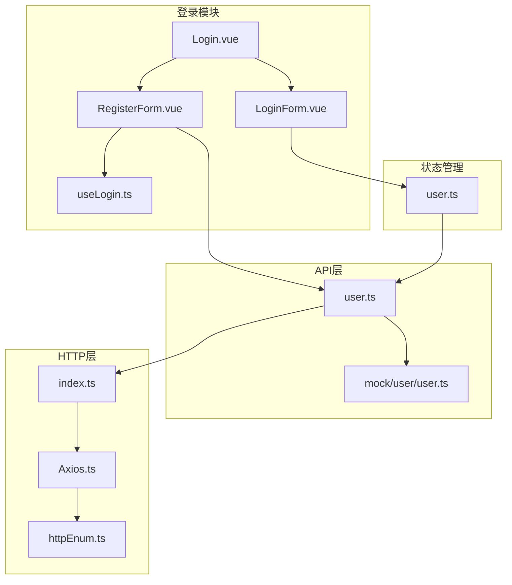

**图表来源**
- [Login.vue:1-47](file://src/views/login/Login.vue#L1-L47)
- [RegisterForm.vue:1-165](file://src/views/login/RegisterForm.vue#L1-L165)
- [useLogin.ts:1-97](file://src/views/login/useLogin.ts#L1-L97)

**章节来源**
- [Login.vue:1-47](file://src/views/login/Login.vue#L1-L47)
- [RegisterForm.vue:1-165](file://src/views/login/RegisterForm.vue#L1-L165)

## 核心组件

注册功能由多个核心组件协同工作，每个组件都有明确的职责分工：

### 表单组件层次结构

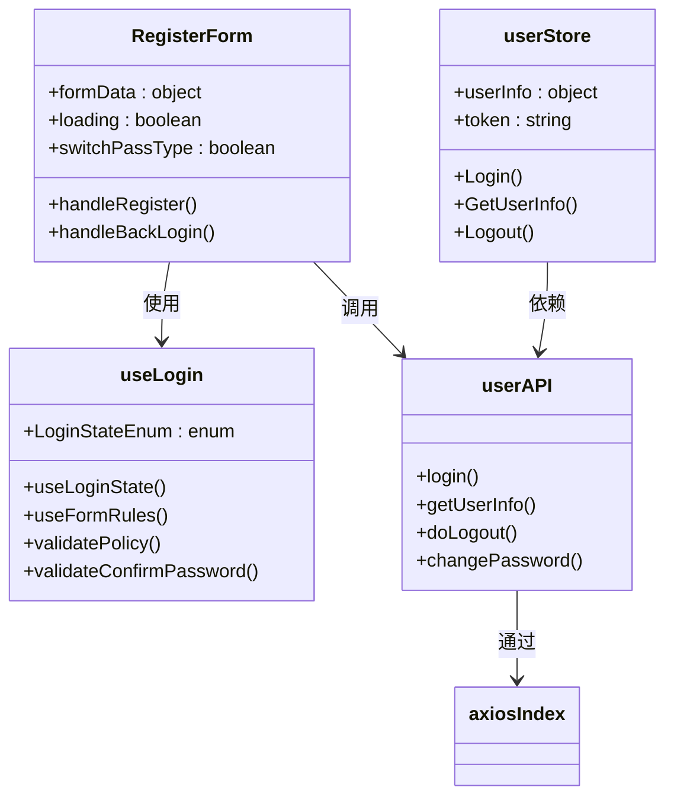

**图表来源**
- [RegisterForm.vue:117-165](file://src/views/login/RegisterForm.vue#L117-L165)
- [useLogin.ts:25-86](file://src/views/login/useLogin.ts#L25-L86)
- [user.ts:1-60](file://src/api/system/user.ts#L1-L60)

### 表单字段设计

注册表单包含以下关键字段：

| 字段名称 | 类型 | 验证规则 | 描述 |
|---------|------|----------|------|
| username | 文本输入 | 必填，长度限制 | 用户名，必填项 |
| mobile | 文本输入 | 必填，手机号格式 | 手机号码，必填项 |
| sms | 文本输入 | 必填，验证码格式 | 短信验证码，必填项 |
| password | 密码输入 | 必填，强度要求 | 登录密码，必填项 |
| confirmPassword | 密码输入 | 必填，与密码匹配 | 确认密码，必填项 |
| policy | 复选框 | 必须勾选 | 隐私政策同意，必填项 |

**章节来源**
- [RegisterForm.vue:128-135](file://src/views/login/RegisterForm.vue#L128-L135)
- [useLogin.ts:25-86](file://src/views/login/useLogin.ts#L25-L86)

## 架构概览

注册功能采用分层架构设计，确保代码的可维护性和扩展性：

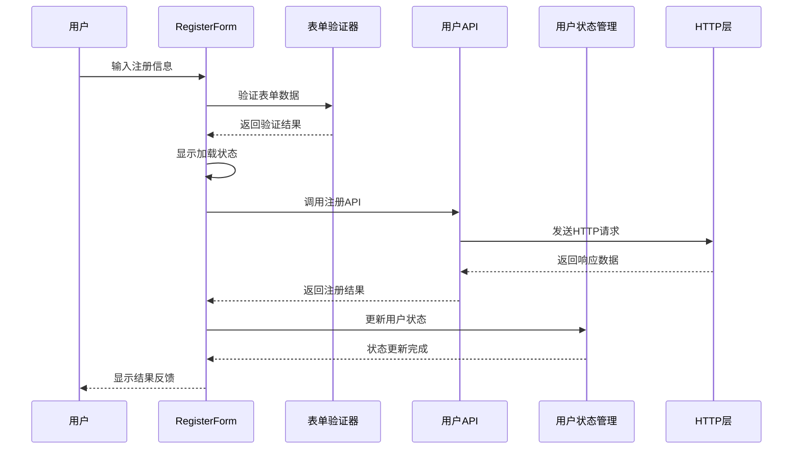

**图表来源**
- [RegisterForm.vue:142-161](file://src/views/login/RegisterForm.vue#L142-L161)
- [user.ts:12-23](file://src/api/system/user.ts#L12-L23)
- [user.ts:64-77](file://src/store/modules/user.ts#L64-L77)

### 状态管理模式

注册功能的状态管理采用Pinia进行集中管理：

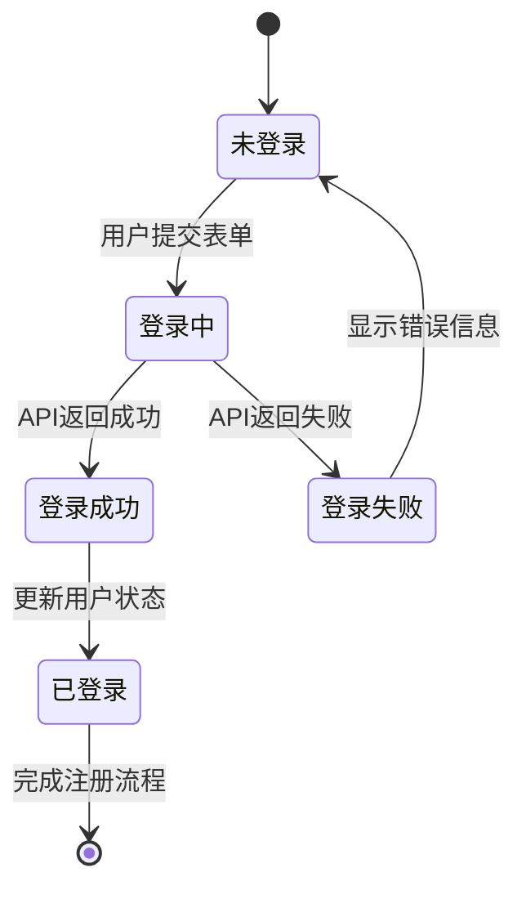

**图表来源**
- [user.ts:36-109](file://src/store/modules/user.ts#L36-L109)

**章节来源**
- [user.ts:36-109](file://src/store/modules/user.ts#L36-L109)

## 详细组件分析

### RegisterForm 组件分析

RegisterForm是注册功能的核心组件，负责用户界面和交互逻辑：

#### 组件结构设计

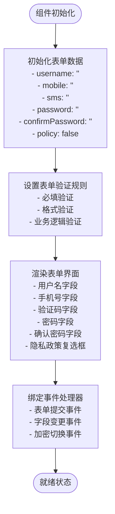

**图表来源**
- [RegisterForm.vue:128-140](file://src/views/login/RegisterForm.vue#L128-L140)

#### 表单验证机制

表单验证采用多层次设计：

1. **基础验证规则**：必填项检查
2. **格式验证规则**：手机号码格式验证
3. **业务逻辑验证**：密码一致性验证
4. **自定义验证规则**：隐私政策同意验证

**章节来源**
- [RegisterForm.vue:1-165](file://src/views/login/RegisterForm.vue#L1-L165)
- [useLogin.ts:25-86](file://src/views/login/useLogin.ts#L25-L86)

### useLogin Hook 分析

useLogin Hook 提供了注册和登录状态管理的核心逻辑：

#### 状态枚举设计

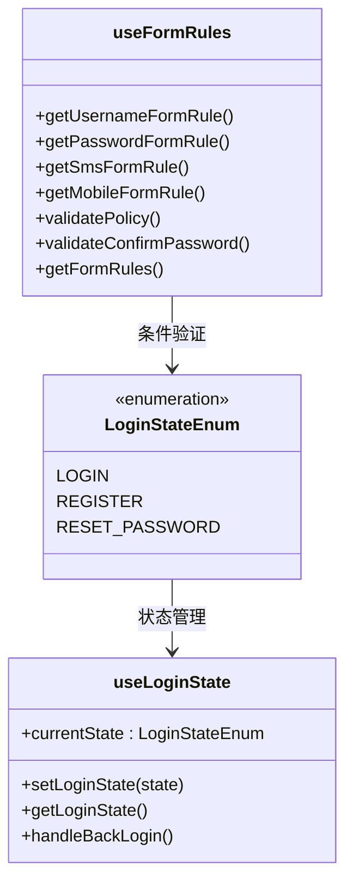

**图表来源**
- [useLogin.ts:3-23](file://src/views/login/useLogin.ts#L3-L23)
- [useLogin.ts:25-86](file://src/views/login/useLogin.ts#L25-L86)

#### 动态验证规则生成

验证规则根据当前登录状态动态生成：

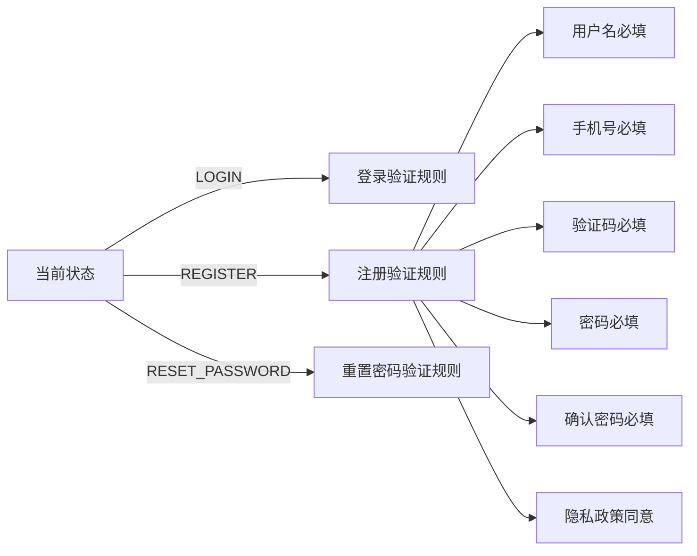

**图表来源**
- [useLogin.ts:57-84](file://src/views/login/useLogin.ts#L57-L84)

**章节来源**
- [useLogin.ts:1-97](file://src/views/login/useLogin.ts#L1-L97)

### API 层设计

API层提供了统一的接口访问方式，支持Mock数据和真实API两种模式：

#### HTTP请求流程

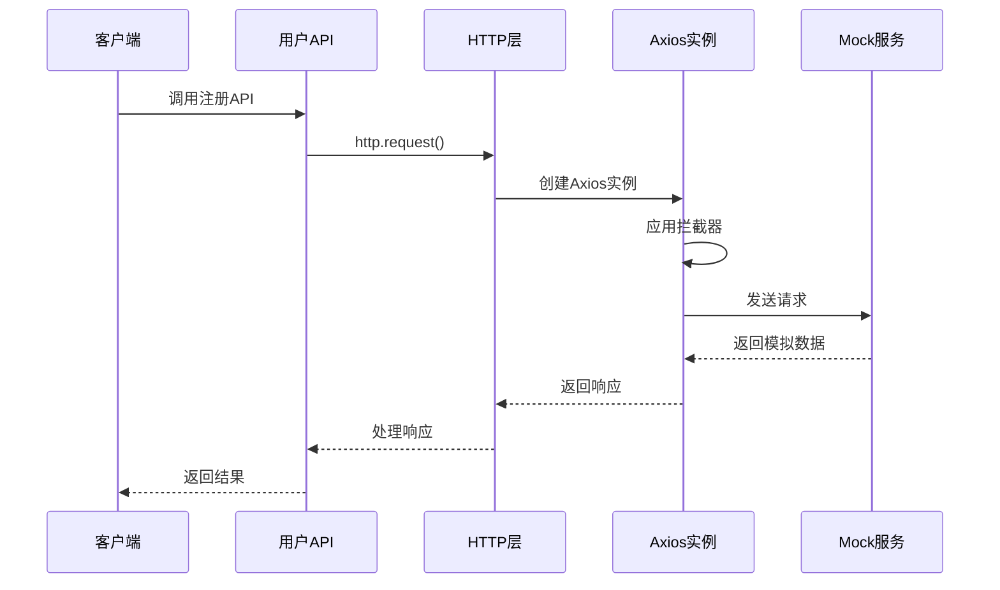

**图表来源**
- [user.ts:12-23](file://src/api/system/user.ts#L12-L23)
- [index.ts:240-287](file://src/utils/http/axios/index.ts#L240-L287)

#### 响应数据结构

API响应采用统一的数据结构：

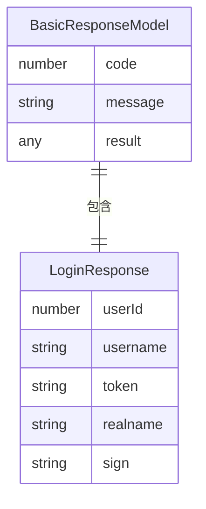

**图表来源**
- [user.ts:3-7](file://src/api/system/user.ts#L3-L7)

**章节来源**
- [user.ts:1-60](file://src/api/system/user.ts#L1-L60)
- [index.ts:29-123](file://src/utils/http/axios/index.ts#L29-L123)

### 状态管理集成

用户状态管理采用Pinia进行集中管理，提供响应式的状态更新能力：

#### 用户状态模型

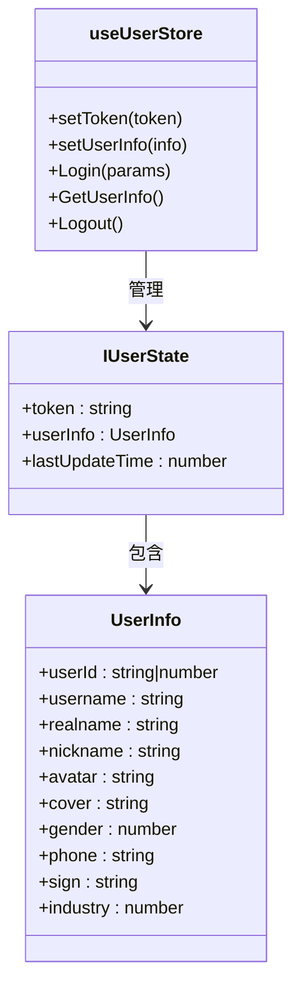

**图表来源**
- [user.ts:12-34](file://src/store/modules/user.ts#L12-L34)
- [user.ts:36-109](file://src/store/modules/user.ts#L36-L109)

**章节来源**
- [user.ts:1-115](file://src/store/modules/user.ts#L1-L115)

## 依赖关系分析

注册功能涉及多个层面的依赖关系，形成了清晰的分层架构：

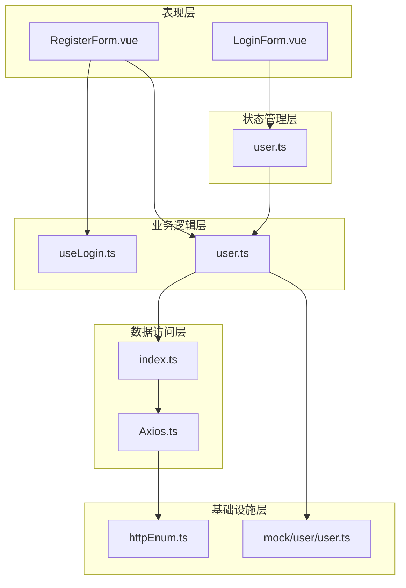

**图表来源**
- [RegisterForm.vue](file://src/views/login/RegisterForm.vue#L120)
- [useLogin.ts](file://src/views/login/useLogin.ts#L1)
- [user.ts](file://src/api/system/user.ts#L1)

### 关键依赖关系

1. **组件依赖**：RegisterForm依赖useLogin Hook进行状态管理
2. **API依赖**：用户API依赖HTTP层进行网络请求
3. **状态依赖**：用户状态管理依赖API层获取数据
4. **配置依赖**：HTTP层依赖枚举类型定义请求参数

**章节来源**
- [RegisterForm.vue:1-165](file://src/views/login/RegisterForm.vue#L1-L165)
- [useLogin.ts:1-97](file://src/views/login/useLogin.ts#L1-L97)

## 性能考虑

注册功能在设计时充分考虑了性能优化：

### 前端性能优化

1. **懒加载策略**：组件按需加载，减少初始包体积
2. **虚拟滚动**：对于大量数据的场景使用虚拟滚动
3. **防抖处理**：输入验证采用防抖机制，避免频繁验证
4. **内存管理**：及时清理事件监听器和定时器

### 网络性能优化

1. **请求合并**：将多个小请求合并为批量请求
2. **缓存策略**：合理使用浏览器缓存和应用缓存
3. **压缩传输**：启用Gzip压缩减少传输体积
4. **CDN加速**：静态资源使用CDN加速

### 移动端优化

1. **触摸优化**：按钮和链接区域足够大，便于触摸操作
2. **字体优化**：使用系统字体，提升渲染性能
3. **图片优化**：采用响应式图片和适当的图片格式
4. **动画优化**：使用CSS3硬件加速的动画效果

## 故障排除指南

### 常见问题及解决方案

#### 表单验证问题

**问题描述**：表单验证规则不生效或验证结果不符合预期

**解决方案**：
1. 检查验证规则的触发时机（onBlur、onChange）
2. 确认字段名称与验证规则映射关系
3. 验证自定义验证函数的返回值格式

#### API调用问题

**问题描述**：注册请求无法发送或响应处理异常

**解决方案**：
1. 检查API端点URL配置
2. 验证请求参数格式
3. 确认HTTP拦截器配置
4. 查看网络请求日志

#### 状态管理问题

**问题描述**：用户状态更新异常或数据不一致

**解决方案**：
1. 检查Pinia store的action实现
2. 验证状态更新的异步处理
3. 确认本地存储的同步机制

**章节来源**
- [useLogin.ts:31-44](file://src/views/login/useLogin.ts#L31-L44)
- [index.ts:203-237](file://src/utils/http/axios/index.ts#L203-L237)

### 调试技巧

1. **浏览器开发者工具**：使用Network面板监控API请求
2. **控制台日志**：添加详细的console.log输出
3. **Vue DevTools**：检查组件状态和props传递
4. **Mock数据**：使用Mock API进行离线调试

## 结论

注册功能作为Vue3微信H5应用的核心功能之一，展现了现代前端开发的最佳实践。通过合理的架构设计、完善的组件分离和强大的状态管理，实现了流畅的用户体验和良好的可维护性。

### 主要优势

1. **模块化设计**：清晰的组件边界和职责分离
2. **响应式验证**：实时的表单验证和用户反馈
3. **状态管理**：集中化的状态管理和持久化存储
4. **可扩展性**：灵活的架构支持功能扩展和定制

### 技术亮点

1. **TypeScript集成**：提供类型安全和更好的开发体验
2. **Vant UI组件**：优秀的移动端UI组件库
3. **Pinia状态管理**：现代化的状态管理方案
4. **Mock数据支持**：完整的开发和测试环境

### 改进建议

1. **注册API完善**：实现完整的用户注册API调用
2. **验证码功能**：集成短信验证码发送和验证功能
3. **密码强度**：增强密码复杂度验证规则
4. **国际化支持**：添加多语言支持功能
5. **安全增强**：实现更严格的安全防护措施

该注册功能为后续的功能扩展奠定了坚实的基础，通过持续的优化和完善，将为用户提供更加优质的移动端注册体验。