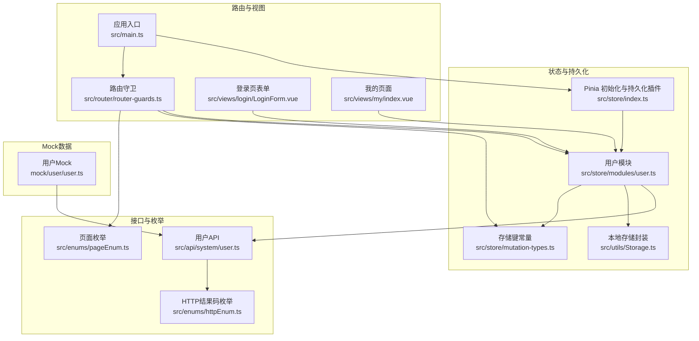
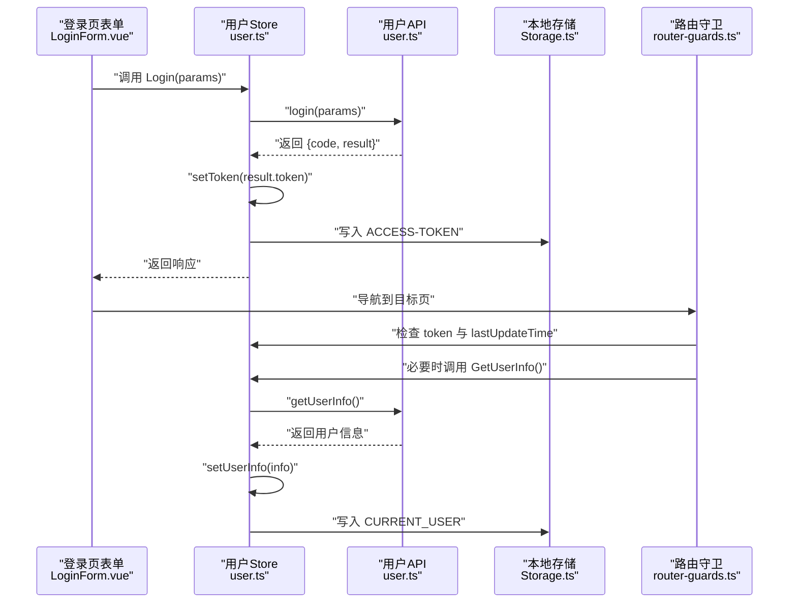
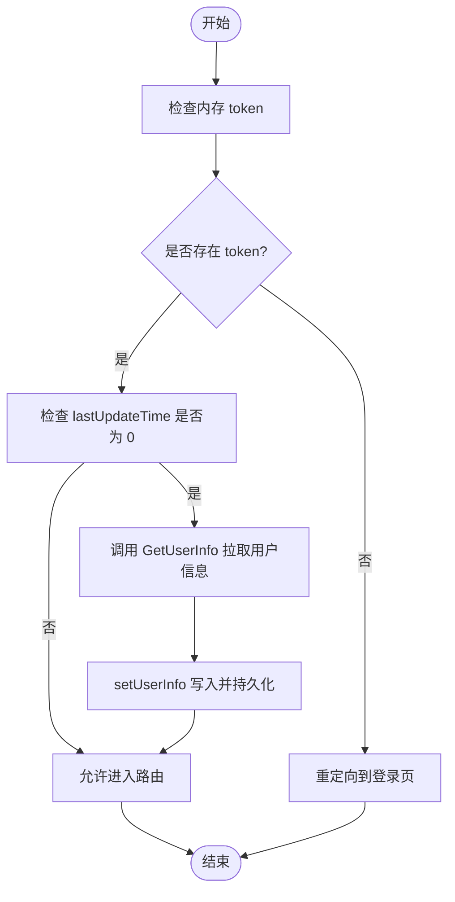
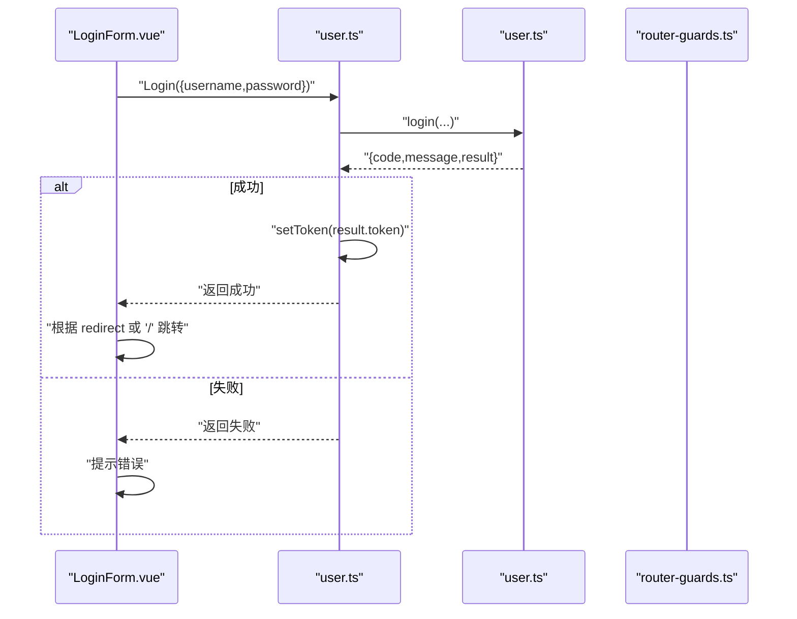
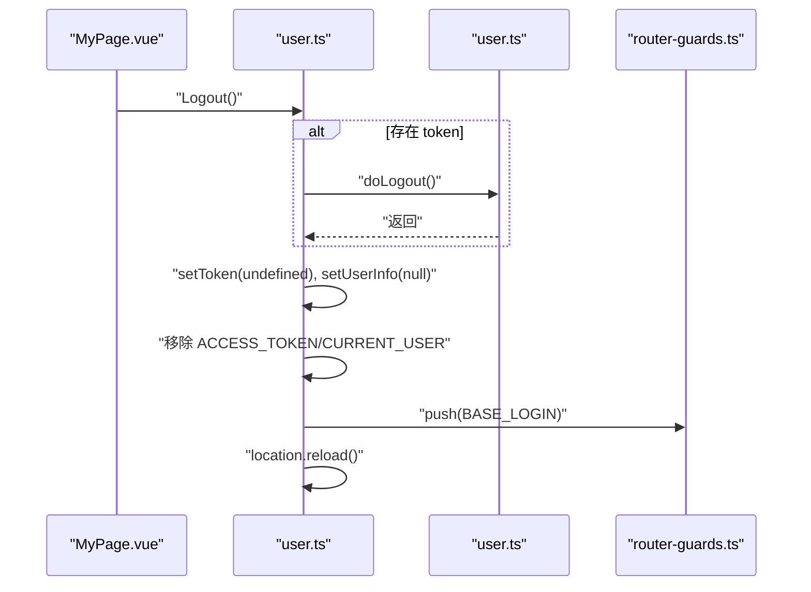
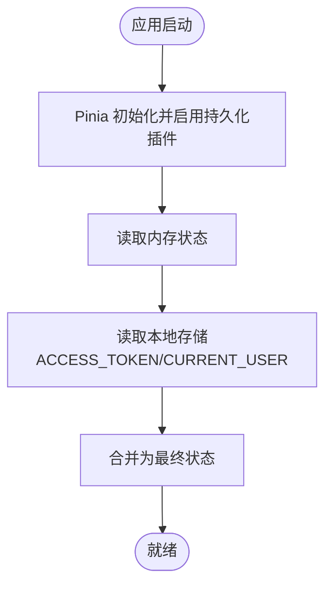
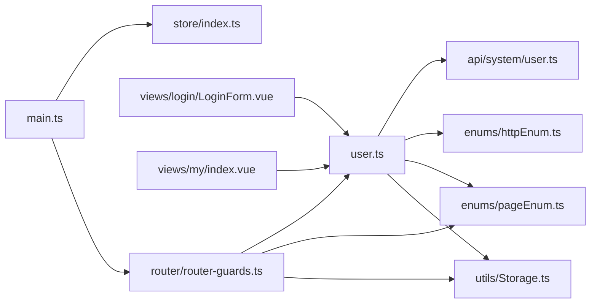

# 用户状态管理

<cite>
**本文引用的文件**
- [src/store/modules/user.ts](file://src/store/modules/user.ts)
- [src/store/index.ts](file://src/store/index.ts)
- [src/store/mutation-types.ts](file://src/store/mutation-types.ts)
- [src/api/system/user.ts](file://src/api/system/user.ts)
- [src/utils/Storage.ts](file://src/utils/Storage.ts)
- [src/router/router-guards.ts](file://src/router/router-guards.ts)
- [src/enums/httpEnum.ts](file://src/enums/httpEnum.ts)
- [src/enums/pageEnum.ts](file://src/enums/pageEnum.ts)
- [src/views/login/LoginForm.vue](file://src/views/login/LoginForm.vue)
- [src/views/my/index.vue](file://src/views/my/index.vue)
- [src/main.ts](file://src/main.ts)
- [mock/user/user.ts](file://mock/user/user.ts)
</cite>

## 目录
1. [简介](#简介)
2. [项目结构](#项目结构)
3. [核心组件](#核心组件)
4. [架构总览](#架构总览)
5. [详细组件分析](#详细组件分析)
6. [依赖关系分析](#依赖关系分析)
7. [性能考量](#性能考量)
8. [故障排查指南](#故障排查指南)
9. [结论](#结论)
10. [附录](#附录)

## 简介
本文件围绕项目中的用户状态管理进行系统性梳理，重点解析 Pinia Store 中的用户状态设计（用户信息模型、登录状态与权限边界）、状态生命周期（登录、登出、状态恢复）、持久化策略（页面刷新后保持登录态）、以及与路由守卫的协同机制。同时给出 actions、getters、mutations 的使用范式与最佳实践，覆盖状态同步、并发处理与错误恢复。

## 项目结构
用户状态管理涉及以下关键模块：
- 状态定义与持久化：Pinia Store（用户模块）+ 本地存储封装
- 接口层：用户相关 API（登录、获取用户信息、登出）
- 路由守卫：鉴权白名单、token 校验、首次拉取用户信息
- 视图层：登录表单、个人中心等页面消费用户状态
- 枚举与常量：HTTP 结果码、页面路径、存储键名

图表来源
- [src/store/modules/user.ts:1-115](file://src/store/modules/user.ts#L1-L115)
- [src/utils/Storage.ts:1-128](file://src/utils/Storage.ts#L1-L128)
- [src/store/mutation-types.ts:1-4](file://src/store/mutation-types.ts#L1-L4)
- [src/store/index.ts:1-13](file://src/store/index.ts#L1-L13)
- [src/api/system/user.ts:1-60](file://src/api/system/user.ts#L1-L60)
- [src/enums/httpEnum.ts:1-36](file://src/enums/httpEnum.ts#L1-L36)
- [src/enums/pageEnum.ts:1-12](file://src/enums/pageEnum.ts#L1-L12)
- [src/router/router-guards.ts:1-93](file://src/router/router-guards.ts#L1-L93)
- [src/views/login/LoginForm.vue:1-124](file://src/views/login/LoginForm.vue#L1-L124)
- [src/views/my/index.vue:1-145](file://src/views/my/index.vue#L1-L145)
- [src/main.ts:1-30](file://src/main.ts#L1-L30)
- [mock/user/user.ts:1-96](file://mock/user/user.ts#L1-L96)

章节来源
- [src/store/modules/user.ts:1-115](file://src/store/modules/user.ts#L1-L115)
- [src/store/index.ts:1-13](file://src/store/index.ts#L1-L13)
- [src/store/mutation-types.ts:1-4](file://src/store/mutation-types.ts#L1-L4)
- [src/api/system/user.ts:1-60](file://src/api/system/user.ts#L1-L60)
- [src/utils/Storage.ts:1-128](file://src/utils/Storage.ts#L1-L128)
- [src/router/router-guards.ts:1-93](file://src/router/router-guards.ts#L1-L93)
- [src/enums/httpEnum.ts:1-36](file://src/enums/httpEnum.ts#L1-L36)
- [src/enums/pageEnum.ts:1-12](file://src/enums/pageEnum.ts#L1-L12)
- [src/views/login/LoginForm.vue:1-124](file://src/views/login/LoginForm.vue#L1-L124)
- [src/views/my/index.vue:1-145](file://src/views/my/index.vue#L1-L145)
- [src/main.ts:1-30](file://src/main.ts#L1-L30)
- [mock/user/user.ts:1-96](file://mock/user/user.ts#L1-L96)

## 核心组件
- 用户状态模块（Pinia Store）
  - 状态字段：token、userInfo、lastUpdateTime
  - Getter：getUserInfo、getToken、getLastUpdateTime
  - Action：setToken、setUserInfo、Login、GetUserInfo、Logout
- 本地存储封装
  - 提供 set/get/remove/clear 及 Cookie 相关能力，支持默认过期时间
- 用户 API
  - login、getUserInfo、doLogout
- 路由守卫
  - 白名单、token 校验、首次获取用户信息、页面标题设置与 keep-alive 组件管理
- 页面与入口
  - 登录页表单提交登录；我的页面展示用户信息；应用入口初始化 Pinia 与路由

章节来源
- [src/store/modules/user.ts:36-109](file://src/store/modules/user.ts#L36-L109)
- [src/utils/Storage.ts:8-123](file://src/utils/Storage.ts#L8-L123)
- [src/api/system/user.ts:12-43](file://src/api/system/user.ts#L12-L43)
- [src/router/router-guards.ts:17-51](file://src/router/router-guards.ts#L17-L51)
- [src/views/login/LoginForm.vue:86-118](file://src/views/login/LoginForm.vue#L86-L118)
- [src/views/my/index.vue:65-88](file://src/views/my/index.vue#L65-L88)
- [src/main.ts:18-27](file://src/main.ts#L18-L27)

## 架构总览
用户状态管理采用“Pinia Store + 本地存储 + 路由守卫”的组合模式：
- Store 负责内存态与状态变更；通过 Storage 将 token 与用户信息持久化到 localStorage
- 路由守卫在每次导航时检查 token 并在必要时拉取用户信息
- 登录成功后写入 token，随后跳转目标页；登出时清理 token 与用户信息并重定向至登录页

图表来源
- [src/views/login/LoginForm.vue:86-118](file://src/views/login/LoginForm.vue#L86-L118)
- [src/store/modules/user.ts:64-90](file://src/store/modules/user.ts#L64-L90)
- [src/api/system/user.ts:12-33](file://src/api/system/user.ts#L12-L33)
- [src/utils/Storage.ts:27-57](file://src/utils/Storage.ts#L27-L57)
- [src/router/router-guards.ts:33-48](file://src/router/router-guards.ts#L33-L48)

## 详细组件分析

### 用户状态模型与生命周期
- 数据模型
  - UserInfo 字段覆盖用户标识、昵称、头像、性别、手机、签名等
  - IUserState 包含 token、userInfo、lastUpdateTime
- 生命周期
  - 登录：调用 Login，成功后 setToken 写入 token 并持久化
  - 获取用户信息：首次进入受保护路由时，若 lastUpdateTime 为 0 则调用 GetUserInfo 拉取并持久化
  - 登出：调用 Logout，清理内存与本地存储，重定向登录页并刷新

图表来源
- [src/store/modules/user.ts:42-51](file://src/store/modules/user.ts#L42-L51)
- [src/router/router-guards.ts:33-48](file://src/router/router-guards.ts#L33-L48)

章节来源
- [src/store/modules/user.ts:12-29](file://src/store/modules/user.ts#L12-L29)
- [src/store/modules/user.ts:36-109](file://src/store/modules/user.ts#L36-L109)
- [src/router/router-guards.ts:17-51](file://src/router/router-guards.ts#L17-L51)

### 登录流程（含鉴权与跳转）
- 表单校验通过后，调用 userStore.Login 发起登录请求
- 若返回码为成功，根据路由参数决定跳转首页或原目标页
- 登录成功后，后续路由守卫会按需拉取用户信息

图表来源
- [src/views/login/LoginForm.vue:86-118](file://src/views/login/LoginForm.vue#L86-L118)
- [src/store/modules/user.ts:64-77](file://src/store/modules/user.ts#L64-L77)
- [src/api/system/user.ts:12-23](file://src/api/system/user.ts#L12-L23)

章节来源
- [src/views/login/LoginForm.vue:86-118](file://src/views/login/LoginForm.vue#L86-L118)
- [src/store/modules/user.ts:64-77](file://src/store/modules/user.ts#L64-L77)
- [src/api/system/user.ts:12-23](file://src/api/system/user.ts#L12-L23)

### 登出流程与状态清理
- 调用 Logout：若存在 token 则尝试远程登出
- 清理内存：setToken(undefined)、setUserInfo(null)
- 清理本地存储：移除 ACCESS_TOKEN 与 CURRENT_USER
- 导航至登录页并刷新页面

图表来源
- [src/views/my/index.vue:74-83](file://src/views/my/index.vue#L74-L83)
- [src/store/modules/user.ts:92-107](file://src/store/modules/user.ts#L92-L107)
- [src/api/system/user.ts:38-43](file://src/api/system/user.ts#L38-L43)
- [src/enums/pageEnum.ts:2-11](file://src/enums/pageEnum.ts#L2-L11)

章节来源
- [src/views/my/index.vue:74-83](file://src/views/my/index.vue#L74-L83)
- [src/store/modules/user.ts:92-107](file://src/store/modules/user.ts#L92-L107)
- [src/api/system/user.ts:38-43](file://src/api/system/user.ts#L38-L43)
- [src/enums/pageEnum.ts:2-11](file://src/enums/pageEnum.ts#L2-L11)

### 状态恢复与持久化策略
- 持久化键：ACCESS_TOKEN、CURRENT_USER
- 恢复策略：Getter 优先读取内存，其次从本地存储恢复
- 插件：Pinia 安装了持久化插件，确保页面刷新后状态可恢复

图表来源
- [src/store/index.ts:5-6](file://src/store/index.ts#L5-L6)
- [src/store/modules/user.ts:42-51](file://src/store/modules/user.ts#L42-L51)
- [src/store/mutation-types.ts:1-2](file://src/store/mutation-types.ts#L1-L2)

章节来源
- [src/store/index.ts:5-6](file://src/store/index.ts#L5-L6)
- [src/store/modules/user.ts:42-51](file://src/store/modules/user.ts#L42-L51)
- [src/store/mutation-types.ts:1-2](file://src/store/mutation-types.ts#L1-L2)

### 权限管理与动态权限说明
- 当前实现
  - 通过 token 存在与否控制访问受保护资源
  - 路由守卫在进入受保护路由时拉取用户信息，便于后续扩展权限判断
- 动态权限建议
  - 在用户信息中增加 roles/permissions 字段
  - 在路由守卫中基于 roles/permissions 做细粒度校验
  - 结合菜单/按钮级权限渲染

章节来源
- [src/router/router-guards.ts:33-48](file://src/router/router-guards.ts#L33-L48)
- [src/store/modules/user.ts:79-89](file://src/store/modules/user.ts#L79-L89)

### 状态同步、并发与错误恢复最佳实践
- 状态同步
  - 所有状态变更统一通过 actions/mutations（本项目主要通过 actions 写入）完成
  - 本地存储与内存状态保持一致，避免竞态
- 并发处理
  - 登录与获取用户信息为串行流程，避免重复请求
  - 路由守卫中对 lastUpdateTime 为 0 的场景才发起一次拉取
- 错误恢复
  - 登录失败返回错误码，前端显示提示并保留当前页
  - 路由守卫拉取用户信息异常时允许继续导航，避免阻塞
  - 登出异常记录日志但不影响整体登出流程

章节来源
- [src/store/modules/user.ts:64-77](file://src/store/modules/user.ts#L64-L77)
- [src/store/modules/user.ts:79-89](file://src/store/modules/user.ts#L79-L89)
- [src/router/router-guards.ts:42-47](file://src/router/router-guards.ts#L42-L47)
- [src/store/modules/user.ts:92-107](file://src/store/modules/user.ts#L92-L107)

## 依赖关系分析
- 组件耦合
  - 用户模块依赖：API、枚举、路由、本地存储
  - 路由守卫依赖：用户模块、页面枚举、本地存储
  - 视图层依赖：用户模块、路由
- 外部依赖
  - Pinia 持久化插件
  - Vue Router 导航进度条

图表来源
- [src/store/modules/user.ts:1-8](file://src/store/modules/user.ts#L1-L8)
- [src/api/system/user.ts:1-7](file://src/api/system/user.ts#L1-L7)
- [src/enums/httpEnum.ts:4-10](file://src/enums/httpEnum.ts#L4-L10)
- [src/enums/pageEnum.ts:2-11](file://src/enums/pageEnum.ts#L2-L111)
- [src/utils/Storage.ts:8-123](file://src/utils/Storage.ts#L8-L123)
- [src/router/router-guards.ts:1-9](file://src/router/router-guards.ts#L1-L9)
- [src/views/login/LoginForm.vue:64-73](file://src/views/login/LoginForm.vue#L64-L73)
- [src/views/my/index.vue:67-69](file://src/views/my/index.vue#L67-L69)
- [src/main.ts:16-24](file://src/main.ts#L16-L24)

章节来源
- [src/store/modules/user.ts:1-8](file://src/store/modules/user.ts#L1-L8)
- [src/router/router-guards.ts:1-9](file://src/router/router-guards.ts#L1-L9)
- [src/views/login/LoginForm.vue:64-73](file://src/views/login/LoginForm.vue#L64-L73)
- [src/views/my/index.vue:67-69](file://src/views/my/index.vue#L67-L69)
- [src/main.ts:16-24](file://src/main.ts#L16-L24)

## 性能考量
- 减少不必要的网络请求：仅在 lastUpdateTime 为 0 时拉取用户信息
- 合理使用本地存储：避免频繁序列化大对象；注意过期时间与清理策略
- 路由守卫轻量化：仅做必要的 token 校验与一次性信息拉取
- 组件缓存：利用 keep-alive 与路由守卫的组件缓存逻辑减少重复渲染

## 故障排查指南
- 登录后无法进入受保护页面
  - 检查 ACCESS_TOKEN 是否写入本地存储
  - 确认路由守卫是否正确读取 token 并拉取用户信息
- 登录成功但用户信息为空
  - 检查 GetUserInfo 返回的数据结构与 setUserInfo 的赋值
  - 确认 CURRENT_USER 是否被持久化
- 登出后仍可访问受保护页面
  - 检查 Logout 是否移除了 ACCESS_TOKEN/CURRENT_USER
  - 确认路由守卫是否在导航时拦截
- Token 过期或无效
  - 检查 HTTP 结果码与错误提示
  - 在路由守卫中对异常情况降级处理

章节来源
- [src/store/modules/user.ts:42-51](file://src/store/modules/user.ts#L42-L51)
- [src/store/modules/user.ts:79-89](file://src/store/modules/user.ts#L79-L89)
- [src/router/router-guards.ts:33-48](file://src/router/router-guards.ts#L33-L48)
- [src/enums/httpEnum.ts:4-10](file://src/enums/httpEnum.ts#L4-L10)

## 结论
本项目通过 Pinia Store + 本地存储 + 路由守卫实现了简洁可靠的用户状态管理：登录、登出、状态恢复流程清晰，持久化策略简单有效。建议在现有基础上扩展用户角色与动态权限，结合菜单/按钮级权限实现更精细的访问控制。

## 附录
- 关键实现路径参考
  - 用户状态模块：[src/store/modules/user.ts:36-109](file://src/store/modules/user.ts#L36-L109)
  - 本地存储封装：[src/utils/Storage.ts:8-123](file://src/utils/Storage.ts#L8-L123)
  - 用户 API：[src/api/system/user.ts:12-43](file://src/api/system/user.ts#L12-L43)
  - 路由守卫：[src/router/router-guards.ts:17-51](file://src/router/router-guards.ts#L17-L51)
  - 登录页表单：[src/views/login/LoginForm.vue:86-118](file://src/views/login/LoginForm.vue#L86-L118)
  - 我的页面：[src/views/my/index.vue:65-88](file://src/views/my/index.vue#L65-L88)
  - 应用入口：[src/main.ts:18-27](file://src/main.ts#L18-L27)
  - Mock 用户数据：[mock/user/user.ts:38-95](file://mock/user/user.ts#L38-L95)