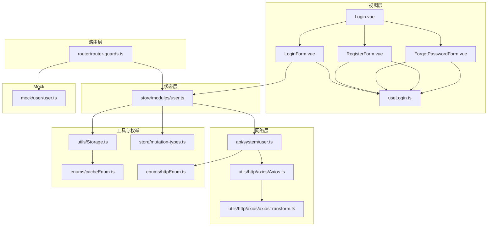
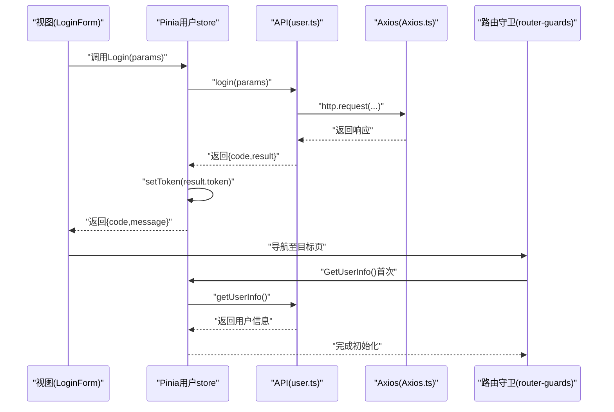
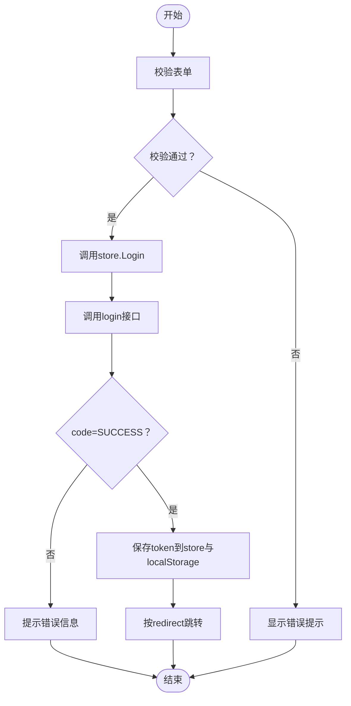
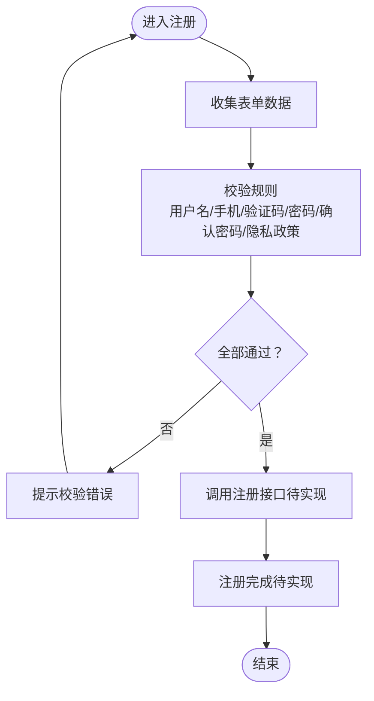
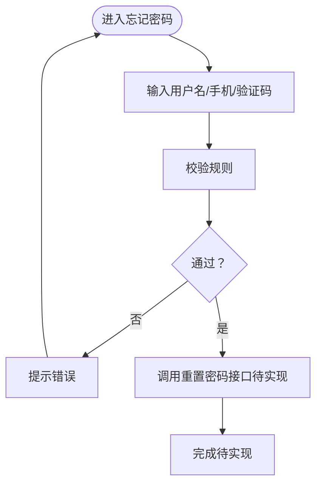
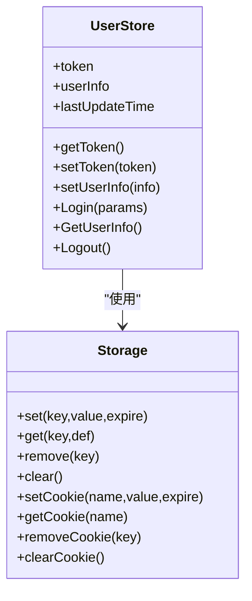
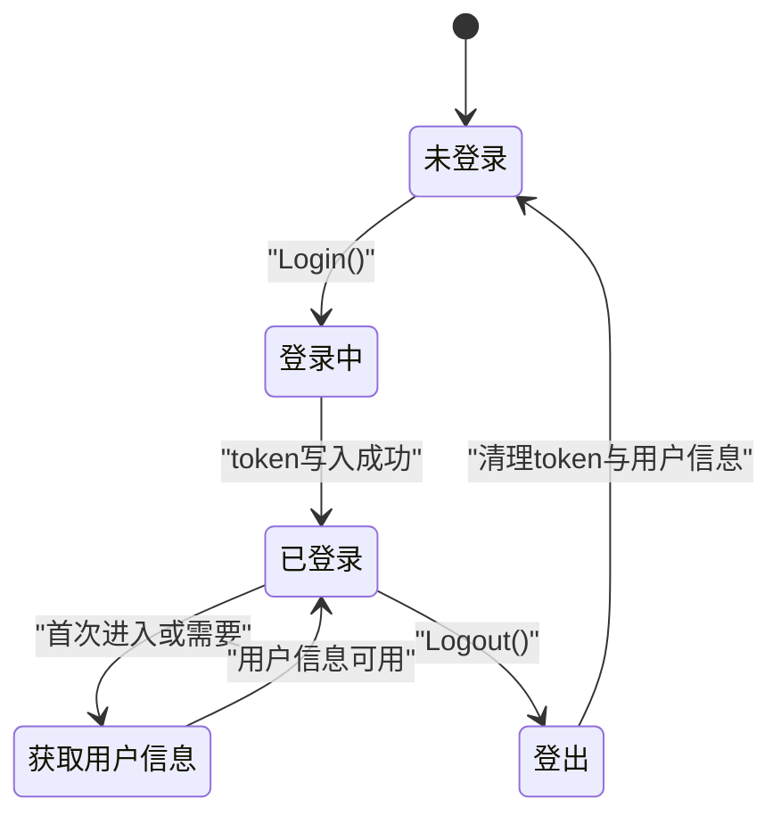
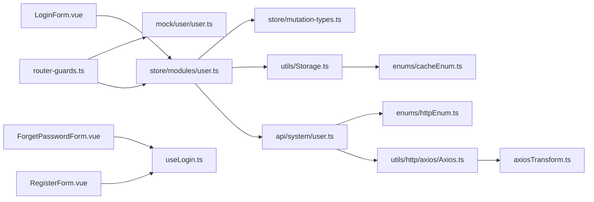

# 用户认证系统

<cite>
**本文引用的文件**
- [src/store/modules/user.ts](file://src/store/modules/user.ts)
- [src/views/login/useLogin.ts](file://src/views/login/useLogin.ts)
- [src/api/system/user.ts](file://src/api/system/user.ts)
- [src/utils/http/axios/Axios.ts](file://src/utils/http/axios/Axios.ts)
- [src/router/router-guards.ts](file://src/router/router-guards.ts)
- [src/views/login/Login.vue](file://src/views/login/Login.vue)
- [src/views/login/LoginForm.vue](file://src/views/login/LoginForm.vue)
- [src/views/login/RegisterForm.vue](file://src/views/login/RegisterForm.vue)
- [src/views/login/ForgetPasswordForm.vue](file://src/views/login/ForgetPasswordForm.vue)
- [src/utils/Storage.ts](file://src/utils/Storage.ts)
- [src/enums/cacheEnum.ts](file://src/enums/cacheEnum.ts)
- [src/enums/httpEnum.ts](file://src/enums/httpEnum.ts)
- [src/store/mutation-types.ts](file://src/store/mutation-types.ts)
- [mock/user/user.ts](file://mock/user/user.ts)
- [src/utils/http/axios/axiosTransform.ts](file://src/utils/http/axios/axiosTransform.ts)
</cite>

## 目录
1. [简介](#简介)
2. [项目结构](#项目结构)
3. [核心组件](#核心组件)
4. [架构总览](#架构总览)
5. [详细组件分析](#详细组件分析)
6. [依赖关系分析](#依赖关系分析)
7. [性能考量](#性能考量)
8. [故障排查指南](#故障排查指南)
9. [结论](#结论)
10. [附录](#附录)

## 简介
本文件面向Vue3微信H5移动端项目，系统性梳理用户认证体系：登录、注册、忘记密码、Token处理与会话管理、用户状态管理（Pinia）、路由守卫与权限控制、以及API接口定义与错误码规范。文档以代码为依据，辅以可视化图示，帮助开发者快速理解与扩展认证能力。

## 项目结构
认证相关代码主要分布在以下模块：
- 视图层：登录页、登录表单、注册表单、忘记密码表单
- 逻辑层：登录状态与规则hooks
- 状态层：Pinia用户store
- 网络层：HTTP封装与Axios拦截器
- 路由层：全局路由守卫
- 工具层：本地存储封装
- 枚举与常量：HTTP状态、缓存键等
- Mock：本地模拟用户接口

**图表来源**
- [src/views/login/Login.vue:1-47](file://src/views/login/Login.vue#L1-L47)
- [src/views/login/LoginForm.vue:1-124](file://src/views/login/LoginForm.vue#L1-L124)
- [src/views/login/RegisterForm.vue:1-165](file://src/views/login/RegisterForm.vue#L1-L165)
- [src/views/login/ForgetPasswordForm.vue:1-101](file://src/views/login/ForgetPasswordForm.vue#L1-L101)
- [src/views/login/useLogin.ts:1-97](file://src/views/login/useLogin.ts#L1-L97)
- [src/store/modules/user.ts:1-115](file://src/store/modules/user.ts#L1-L115)
- [src/api/system/user.ts:1-60](file://src/api/system/user.ts#L1-L60)
- [src/utils/http/axios/Axios.ts:1-225](file://src/utils/http/axios/Axios.ts#L1-L225)
- [src/utils/http/axios/axiosTransform.ts:1-53](file://src/utils/http/axios/axiosTransform.ts#L1-L53)
- [src/router/router-guards.ts:1-93](file://src/router/router-guards.ts#L1-L93)
- [src/utils/Storage.ts:1-128](file://src/utils/Storage.ts#L1-L128)
- [src/enums/cacheEnum.ts:1-15](file://src/enums/cacheEnum.ts#L1-L15)
- [src/enums/httpEnum.ts:1-36](file://src/enums/httpEnum.ts#L1-L36)
- [src/store/mutation-types.ts:1-4](file://src/store/mutation-types.ts#L1-L4)
- [mock/user/user.ts:1-96](file://mock/user/user.ts#L1-L96)

**章节来源**
- [src/views/login/Login.vue:1-47](file://src/views/login/Login.vue#L1-L47)
- [src/views/login/useLogin.ts:1-97](file://src/views/login/useLogin.ts#L1-L97)
- [src/store/modules/user.ts:1-115](file://src/store/modules/user.ts#L1-L115)
- [src/api/system/user.ts:1-60](file://src/api/system/user.ts#L1-L60)
- [src/utils/http/axios/Axios.ts:1-225](file://src/utils/http/axios/Axios.ts#L1-L225)
- [src/router/router-guards.ts:1-93](file://src/router/router-guards.ts#L1-L93)
- [src/utils/Storage.ts:1-128](file://src/utils/Storage.ts#L1-L128)
- [src/enums/cacheEnum.ts:1-15](file://src/enums/cacheEnum.ts#L1-L15)
- [src/enums/httpEnum.ts:1-36](file://src/enums/httpEnum.ts#L1-L36)
- [src/store/mutation-types.ts:1-4](file://src/store/mutation-types.ts#L1-L4)
- [mock/user/user.ts:1-96](file://mock/user/user.ts#L1-L96)

## 核心组件
- Pinia用户store：负责token与用户信息的持久化、登录、获取用户信息、登出
- 登录表单与规则hooks：统一管理登录、注册、重置密码三种状态及表单校验规则
- API封装：对外暴露登录、获取用户信息、登出等方法
- HTTP拦截器：统一处理请求/响应、取消重复请求、序列化表单数据
- 路由守卫：鉴权白名单、无token跳转登录、首次进入拉取用户信息
- 本地存储：统一封装localStorage操作，支持过期时间与cookie操作
- 枚举与常量：HTTP状态码、缓存键、请求方法、内容类型

**章节来源**
- [src/store/modules/user.ts:36-108](file://src/store/modules/user.ts#L36-L108)
- [src/views/login/useLogin.ts:3-86](file://src/views/login/useLogin.ts#L3-L86)
- [src/api/system/user.ts:12-59](file://src/api/system/user.ts#L12-L59)
- [src/utils/http/axios/Axios.ts:55-100](file://src/utils/http/axios/Axios.ts#L55-L100)
- [src/router/router-guards.ts:17-51](file://src/router/router-guards.ts#L17-L51)
- [src/utils/Storage.ts:8-73](file://src/utils/Storage.ts#L8-L73)
- [src/enums/httpEnum.ts:4-10](file://src/enums/httpEnum.ts#L4-L10)

## 架构总览
认证系统采用“视图-状态-网络-路由-存储”分层设计，登录态贯穿前端，路由守卫基于token进行访问控制，API层通过Axios封装统一处理。

**图表来源**
- [src/views/login/LoginForm.vue:86-118](file://src/views/login/LoginForm.vue#L86-L118)
- [src/store/modules/user.ts:64-89](file://src/store/modules/user.ts#L64-L89)
- [src/api/system/user.ts:12-33](file://src/api/system/user.ts#L12-L33)
- [src/utils/http/axios/Axios.ts:55-100](file://src/utils/http/axios/Axios.ts#L55-L100)
- [src/router/router-guards.ts:41-47](file://src/router/router-guards.ts#L41-L47)

## 详细组件分析

### 登录功能实现
- 表单验证：使用Vant表单与rules，登录场景要求用户名、密码必填
- 用户凭据处理：提交后调用store.Login，内部发起登录请求
- 会话管理：登录成功后将token写入store与localStorage，后续路由守卫读取token决定放行
- 成功后跳转：根据redirect参数或首页，登录成功提示toast

**图表来源**
- [src/views/login/LoginForm.vue:86-118](file://src/views/login/LoginForm.vue#L86-L118)
- [src/store/modules/user.ts:64-77](file://src/store/modules/user.ts#L64-L77)
- [src/api/system/user.ts:12-23](file://src/api/system/user.ts#L12-L23)
- [src/utils/Storage.ts:27-33](file://src/utils/Storage.ts#L27-L33)

**章节来源**
- [src/views/login/LoginForm.vue:1-124](file://src/views/login/LoginForm.vue#L1-L124)
- [src/views/login/useLogin.ts:25-86](file://src/views/login/useLogin.ts#L25-L86)
- [src/store/modules/user.ts:64-77](file://src/store/modules/user.ts#L64-L77)
- [src/api/system/user.ts:12-23](file://src/api/system/user.ts#L12-L23)
- [src/utils/Storage.ts:27-33](file://src/utils/Storage.ts#L27-L33)

### 注册功能设计
- 信息收集：用户名、手机号、短信验证码、密码、确认密码、隐私政策勾选
- 数据验证：注册规则覆盖上述字段；确认密码需与密码一致；隐私政策必须勾选
- 账户创建：当前注册表单仅完成校验与日志输出，实际注册接口未实现，建议在handleRegister中补充调用

**图表来源**
- [src/views/login/RegisterForm.vue:142-161](file://src/views/login/RegisterForm.vue#L142-L161)
- [src/views/login/useLogin.ts:57-84](file://src/views/login/useLogin.ts#L57-L84)

**章节来源**
- [src/views/login/RegisterForm.vue:1-165](file://src/views/login/RegisterForm.vue#L1-L165)
- [src/views/login/useLogin.ts:57-84](file://src/views/login/useLogin.ts#L57-L84)

### 忘记密码功能
- 输入用户名、手机号、短信验证码
- 提交后进行表单校验，当前实现为占位逻辑，建议补充发送验证码与重置密码接口调用

**图表来源**
- [src/views/login/ForgetPasswordForm.vue:82-97](file://src/views/login/ForgetPasswordForm.vue#L82-L97)
- [src/views/login/useLogin.ts:70-76](file://src/views/login/useLogin.ts#L70-L76)

**章节来源**
- [src/views/login/ForgetPasswordForm.vue:1-101](file://src/views/login/ForgetPasswordForm.vue#L1-L101)
- [src/views/login/useLogin.ts:70-76](file://src/views/login/useLogin.ts#L70-L76)

### Token处理机制
- 存储：store.setToken将token写入store与localStorage；storage封装提供统一的set/get/remove
- 读取：store.getToken优先从store.state读取，否则回退到localStorage
- 过期：当前未实现自动刷新；可结合后端策略在拦截器中处理401并刷新
- 失效：登出时清除token与用户信息，跳转登录页并刷新

**图表来源**
- [src/store/modules/user.ts:36-108](file://src/store/modules/user.ts#L36-L108)
- [src/utils/Storage.ts:8-73](file://src/utils/Storage.ts#L8-L73)

**章节来源**
- [src/store/modules/user.ts:54-107](file://src/store/modules/user.ts#L54-L107)
- [src/utils/Storage.ts:27-65](file://src/utils/Storage.ts#L27-L65)
- [src/store/mutation-types.ts:1-4](file://src/store/mutation-types.ts#L1-L4)

### 用户状态管理（Pinia）
- 状态：token、用户信息、最后更新时间
- Getter：getUserInfo、getToken、getLastUpdateTime
- Actions：setToken、setUserInfo、Login、GetUserInfo、Logout
- 与路由守卫联动：首次进入若未获取用户信息则拉取

**图表来源**
- [src/store/modules/user.ts:36-108](file://src/store/modules/user.ts#L36-L108)
- [src/router/router-guards.ts:41-47](file://src/router/router-guards.ts#L41-L47)

**章节来源**
- [src/store/modules/user.ts:25-108](file://src/store/modules/user.ts#L25-L108)
- [src/router/router-guards.ts:41-47](file://src/router/router-guards.ts#L41-L47)

### 认证相关API接口文档
- 登录
  - 方法与路径：POST /login
  - 请求参数：用户名、密码
  - 响应：包含code、message、result（含token）
  - 错误码：参考HTTP枚举中的SUCCESS/ERROR/TOKEN_EXPIRED
- 获取用户信息
  - 方法与路径：GET /getUserInfo
  - 请求参数：Authorization（由拦截器注入）
  - 响应：用户信息对象
- 登出
  - 方法与路径：POST /logout
  - 响应：销毁成功消息
- 修改密码
  - 方法与路径：POST /user/u${uid}/changepw
  - 请求参数：新旧密码等（按后端约定）
  - 响应：修改结果

**章节来源**
- [src/api/system/user.ts:12-59](file://src/api/system/user.ts#L12-L59)
- [src/enums/httpEnum.ts:4-10](file://src/enums/httpEnum.ts#L4-L10)

### 安全最佳实践
- Token存储：使用localStorage存储token，避免在内存中长期持有敏感数据；建议结合HttpOnly Cookie（服务端支持时）
- 请求头注入：在Axios拦截器中统一添加Authorization头，避免在各处手动拼接
- 重复请求取消：利用AxiosCanceler避免并发重复请求导致的状态竞争
- 表单校验：前端严格校验，后端同样校验；注册/重置密码需短信验证码校验
- 路由守卫：白名单放行，其余均需token；首次进入拉取用户信息
- 错误处理：统一捕获异常，避免泄露敏感信息；对401进行登出处理

**章节来源**
- [src/utils/http/axios/Axios.ts:175-223](file://src/utils/http/axios/Axios.ts#L175-L223)
- [src/router/router-guards.ts:33-38](file://src/router/router-guards.ts#L33-L38)
- [src/enums/httpEnum.ts:4-10](file://src/enums/httpEnum.ts#L4-L10)

## 依赖关系分析
- 组件耦合
  - 视图层依赖hooks与store，低耦合高内聚
  - store依赖api与storage，承担状态与持久化职责
  - api依赖http封装，统一请求方式
  - 路由守卫依赖store与storage，实现鉴权
- 外部依赖
  - Vant用于表单与UI交互
  - Axios用于HTTP请求
  - NProgress用于路由进度条
  - Vite Mock用于本地开发联调

**图表来源**
- [src/views/login/LoginForm.vue:1-124](file://src/views/login/LoginForm.vue#L1-L124)
- [src/views/login/RegisterForm.vue:1-165](file://src/views/login/RegisterForm.vue#L1-L165)
- [src/views/login/ForgetPasswordForm.vue:1-101](file://src/views/login/ForgetPasswordForm.vue#L1-L101)
- [src/views/login/useLogin.ts:1-97](file://src/views/login/useLogin.ts#L1-L97)
- [src/store/modules/user.ts:1-115](file://src/store/modules/user.ts#L1-L115)
- [src/api/system/user.ts:1-60](file://src/api/system/user.ts#L1-L60)
- [src/utils/http/axios/Axios.ts:1-225](file://src/utils/http/axios/Axios.ts#L1-L225)
- [src/utils/http/axios/axiosTransform.ts:1-53](file://src/utils/http/axios/axiosTransform.ts#L1-L53)
- [src/router/router-guards.ts:1-93](file://src/router/router-guards.ts#L1-L93)
- [src/utils/Storage.ts:1-128](file://src/utils/Storage.ts#L1-L128)
- [src/enums/cacheEnum.ts:1-15](file://src/enums/cacheEnum.ts#L1-L15)
- [src/enums/httpEnum.ts:1-36](file://src/enums/httpEnum.ts#L1-L36)
- [src/store/mutation-types.ts:1-4](file://src/store/mutation-types.ts#L1-L4)
- [mock/user/user.ts:1-96](file://mock/user/user.ts#L1-L96)

**章节来源**
- [src/views/login/LoginForm.vue:64-73](file://src/views/login/LoginForm.vue#L64-L73)
- [src/store/modules/user.ts:6-8](file://src/store/modules/user.ts#L6-L8)
- [src/router/router-guards.ts:22-48](file://src/router/router-guards.ts#L22-L48)

## 性能考量
- 请求去重：AxiosCanceler避免重复请求，减少资源浪费
- 表单序列化：支持URL编码与FormData，减少传输体积
- 缓存策略：localStorage默认缓存周期为7天，注意敏感信息不过期
- 路由切换：NProgress提升用户体验，避免长时间白屏

**章节来源**
- [src/utils/http/axios/Axios.ts:187-223](file://src/utils/http/axios/Axios.ts#L187-L223)
- [src/utils/Storage.ts:27-57](file://src/utils/Storage.ts#L27-L57)

## 故障排查指南
- 登录失败
  - 检查用户名/密码是否符合规则
  - 查看返回code与message，确认后端返回
  - 确认token是否写入localStorage
- 无法进入受保护页面
  - 检查路由守卫是否读取到token
  - 若首次进入未拉取用户信息，检查GetUserInfo调用
- 注册/重置密码未生效
  - 当前实现为占位逻辑，需补充接口调用
- Mock环境
  - 使用mock/user/user.ts进行本地联调，确保接口路径与参数一致

**章节来源**
- [src/views/login/LoginForm.vue:97-109](file://src/views/login/LoginForm.vue#L97-L109)
- [src/router/router-guards.ts:33-47](file://src/router/router-guards.ts#L33-L47)
- [mock/user/user.ts:39-95](file://mock/user/user.ts#L39-L95)

## 结论
本认证系统以Pinia为核心，结合Axios拦截器与路由守卫，实现了登录、用户信息拉取与登出的闭环。登录表单与规则hooks提供了清晰的表单验证策略，注册与忘记密码处于占位阶段，建议尽快补齐接口调用。通过Mock接口可在本地高效联调。后续可扩展JWT刷新、多设备登录控制、权限细化等功能。

## 附录
- 扩展与定制建议
  - JWT刷新：在响应拦截器中监听401，尝试刷新token并重试请求
  - 权限细化：在用户信息中加入角色/权限列表，路由守卫中增加权限判断
  - 多语言：将表单提示文案抽取为国际化资源
  - 安全加固：引入CSP、HTTPS、验证码防刷等措施