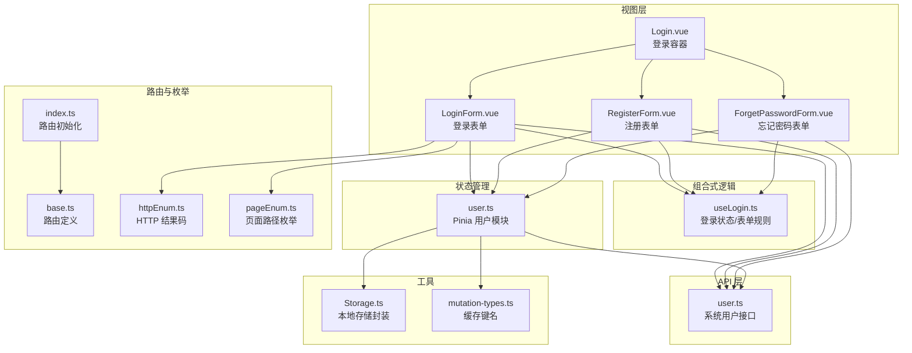
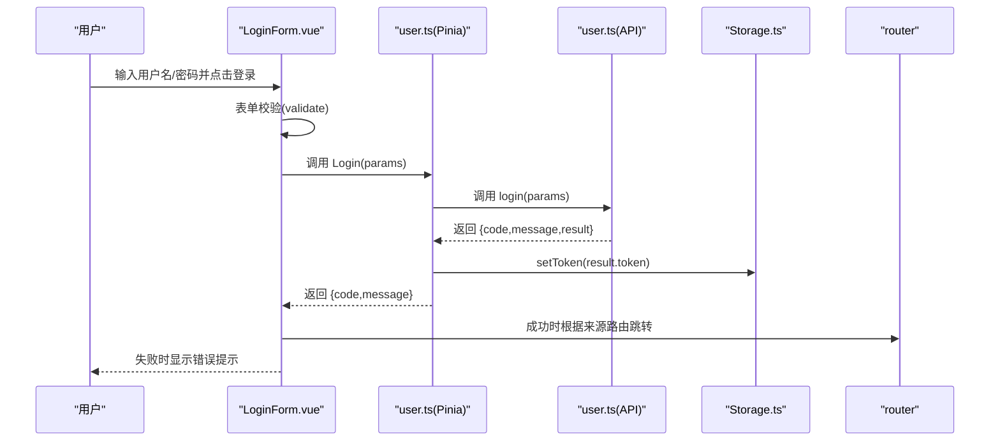
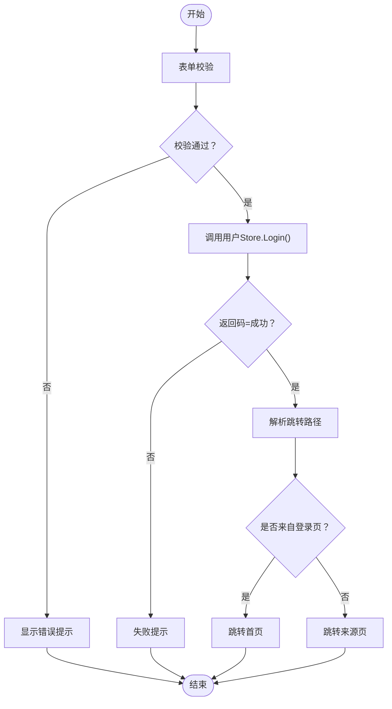
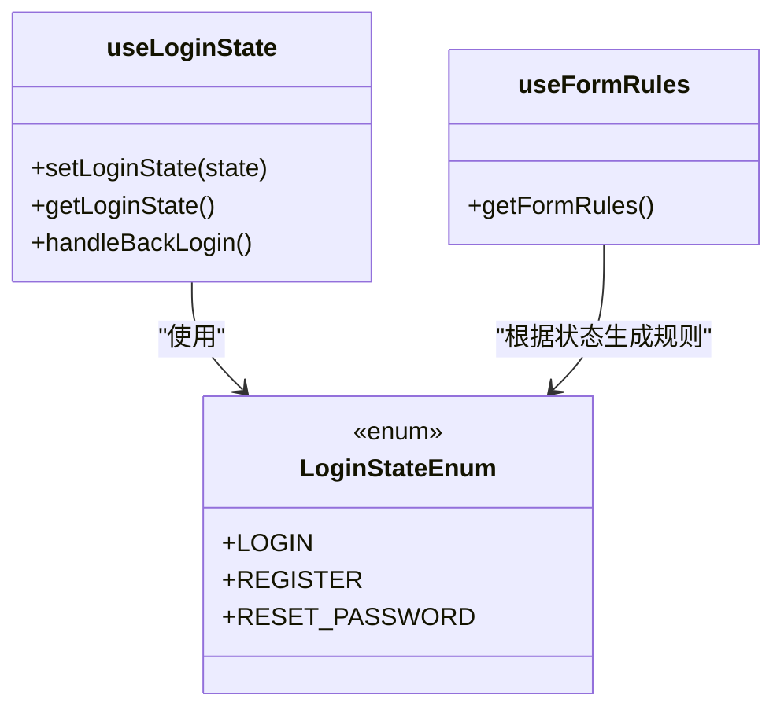
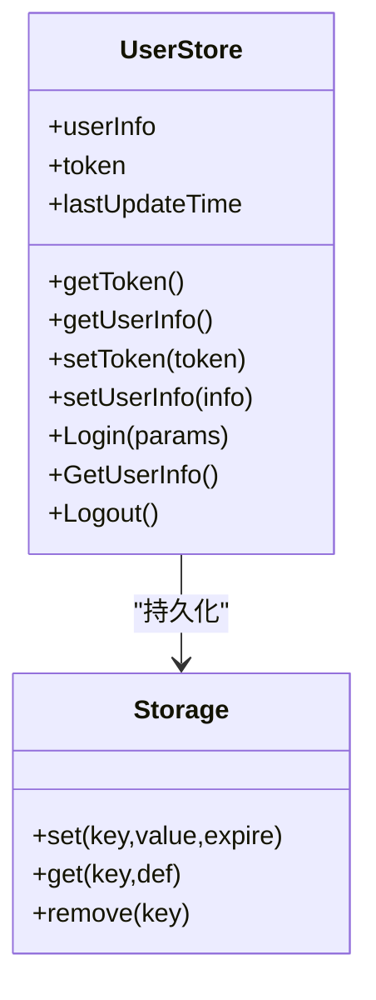
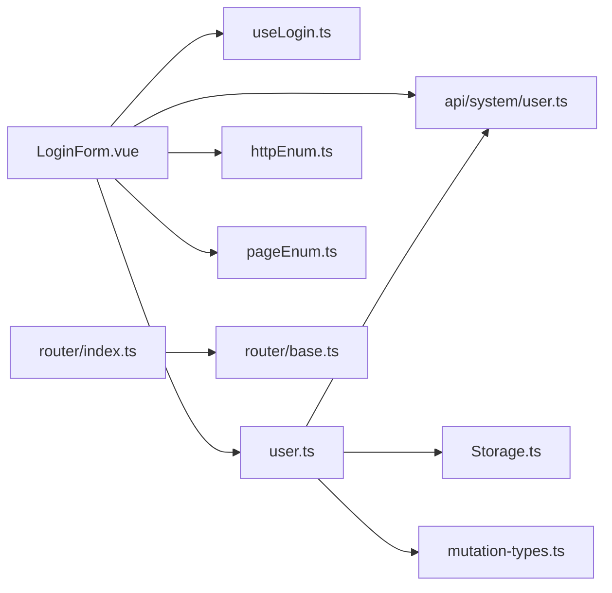
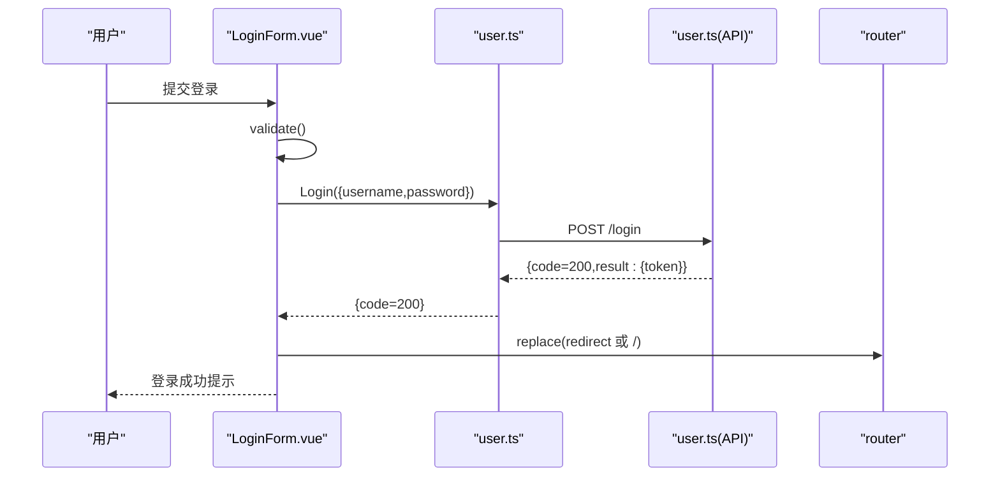

# 登录功能

<cite>
**本文引用的文件**
- [src/views/login/Login.vue](file://src/views/login/Login.vue)
- [src/views/login/useLogin.ts](file://src/views/login/useLogin.ts)
- [src/views/login/LoginForm.vue](file://src/views/login/LoginForm.vue)
- [src/store/modules/user.ts](file://src/store/modules/user.ts)
- [src/api/system/user.ts](file://src/api/system/user.ts)
- [src/router/base.ts](file://src/router/base.ts)
- [src/router/index.ts](file://src/router/index.ts)
- [src/enums/httpEnum.ts](file://src/enums/httpEnum.ts)
- [src/enums/pageEnum.ts](file://src/enums/pageEnum.ts)
- [src/utils/Storage.ts](file://src/utils/Storage.ts)
- [src/store/mutation-types.ts](file://src/store/mutation-types.ts)
- [src/views/login/ForgetPasswordForm.vue](file://src/views/login/ForgetPasswordForm.vue)
- [src/views/login/RegisterForm.vue](file://src/views/login/RegisterForm.vue)
- [mock/user/user.ts](file://mock/user/user.ts)
</cite>

## 目录
1. [简介](#简介)
2. [项目结构](#项目结构)
3. [核心组件](#核心组件)
4. [架构总览](#架构总览)
5. [详细组件分析](#详细组件分析)
6. [依赖关系分析](#依赖关系分析)
7. [性能考量](#性能考量)
8. [故障排查指南](#故障排查指南)
9. [结论](#结论)
10. [附录](#附录)

## 简介
本文件围绕 Vue3 + Vant + Pinia + Axios 的登录体系进行深入解析，覆盖登录表单设计（输入校验、错误提示与交互体验）、登录逻辑（凭据提交、API 调用与响应处理）、组合式函数 useLogin 的设计模式（状态切换与规则封装）、登录状态管理（Token 与用户信息持久化）以及移动端适配要点。同时提供从登录成功到页面跳转的完整流程示例，并给出常见问题的排查建议。

## 项目结构
登录相关代码主要分布在以下位置：
- 视图层：登录页面容器、登录表单、注册表单、忘记密码表单、波浪背景等
- 组合式逻辑：useLogin（登录状态、表单规则）
- 状态管理：Pinia 用户模块（Token、用户信息、登录/登出）
- API 层：系统用户接口（登录、获取用户信息、登出）
- 路由：登录页路由定义与全局路由守卫入口
- 工具：本地存储封装、枚举常量（HTTP 结果码、页面路径）

图表来源
- [src/views/login/Login.vue:1-47](file://src/views/login/Login.vue#L1-L47)
- [src/views/login/LoginForm.vue:1-124](file://src/views/login/LoginForm.vue#L1-L124)
- [src/views/login/RegisterForm.vue:1-165](file://src/views/login/RegisterForm.vue#L1-L165)
- [src/views/login/ForgetPasswordForm.vue:1-101](file://src/views/login/ForgetPasswordForm.vue#L1-L101)
- [src/views/login/useLogin.ts:1-97](file://src/views/login/useLogin.ts#L1-L97)
- [src/store/modules/user.ts:1-115](file://src/store/modules/user.ts#L1-L115)
- [src/api/system/user.ts:1-60](file://src/api/system/user.ts#L1-L60)
- [src/router/base.ts:1-54](file://src/router/base.ts#L1-L54)
- [src/router/index.ts:1-33](file://src/router/index.ts#L1-L33)
- [src/enums/httpEnum.ts:1-36](file://src/enums/httpEnum.ts#L1-L36)
- [src/enums/pageEnum.ts:1-12](file://src/enums/pageEnum.ts#L1-L12)
- [src/utils/Storage.ts:1-128](file://src/utils/Storage.ts#L1-L128)
- [src/store/mutation-types.ts:1-4](file://src/store/mutation-types.ts#L1-L4)

章节来源
- [src/views/login/Login.vue:1-47](file://src/views/login/Login.vue#L1-L47)
- [src/views/login/useLogin.ts:1-97](file://src/views/login/useLogin.ts#L1-L97)
- [src/views/login/LoginForm.vue:1-124](file://src/views/login/LoginForm.vue#L1-L124)
- [src/store/modules/user.ts:1-115](file://src/store/modules/user.ts#L1-L115)
- [src/api/system/user.ts:1-60](file://src/api/system/user.ts#L1-L60)
- [src/router/base.ts:1-54](file://src/router/base.ts#L1-L54)
- [src/router/index.ts:1-33](file://src/router/index.ts#L1-L33)
- [src/enums/httpEnum.ts:1-36](file://src/enums/httpEnum.ts#L1-L36)
- [src/enums/pageEnum.ts:1-12](file://src/enums/pageEnum.ts#L1-L12)
- [src/utils/Storage.ts:1-128](file://src/utils/Storage.ts#L1-L128)
- [src/store/mutation-types.ts:1-4](file://src/store/mutation-types.ts#L1-L4)

## 核心组件
- 登录容器组件负责布局与子表单的渲染与切换
- 登录表单组件负责输入收集、表单校验、加载态控制、调用用户 Store 执行登录、处理成功/失败提示与页面跳转
- 注册与忘记密码表单提供对应场景下的表单校验与交互
- useLogin 组合式函数统一管理登录状态枚举、当前状态读取/切换、以及不同表单的校验规则生成
- 用户 Store 封装登录、获取用户信息、登出等动作，并通过本地存储持久化 Token 与用户信息
- API 层提供登录、获取用户信息、登出等接口
- 路由层定义登录页路由与全局路由守卫入口
- 枚举提供 HTTP 结果码与页面路径常量
- 本地存储封装提供带过期时间的 KV 存储能力

章节来源
- [src/views/login/Login.vue:1-47](file://src/views/login/Login.vue#L1-L47)
- [src/views/login/LoginForm.vue:1-124](file://src/views/login/LoginForm.vue#L1-L124)
- [src/views/login/RegisterForm.vue:1-165](file://src/views/login/RegisterForm.vue#L1-L165)
- [src/views/login/ForgetPasswordForm.vue:1-101](file://src/views/login/ForgetPasswordForm.vue#L1-L101)
- [src/views/login/useLogin.ts:1-97](file://src/views/login/useLogin.ts#L1-L97)
- [src/store/modules/user.ts:1-115](file://src/store/modules/user.ts#L1-L115)
- [src/api/system/user.ts:1-60](file://src/api/system/user.ts#L1-L60)
- [src/router/base.ts:1-54](file://src/router/base.ts#L1-L54)
- [src/enums/httpEnum.ts:1-36](file://src/enums/httpEnum.ts#L1-L36)
- [src/enums/pageEnum.ts:1-12](file://src/enums/pageEnum.ts#L1-L12)
- [src/utils/Storage.ts:1-128](file://src/utils/Storage.ts#L1-L128)

## 架构总览
下图展示了从用户在登录表单输入凭据，到调用 API、更新状态、持久化 Token 并进行页面跳转的整体流程。

图表来源
- [src/views/login/LoginForm.vue:86-118](file://src/views/login/LoginForm.vue#L86-L118)
- [src/store/modules/user.ts:64-77](file://src/store/modules/user.ts#L64-L77)
- [src/api/system/user.ts:12-23](file://src/api/system/user.ts#L12-L23)
- [src/utils/Storage.ts:27-33](file://src/utils/Storage.ts#L27-L33)
- [src/router/base.ts:37-44](file://src/router/base.ts#L37-L44)

## 详细组件分析

### 登录表单组件（LoginForm.vue）
- 输入字段与图标：用户名、密码、记住我、忘记密码链接、注册按钮
- 表单校验：基于 useLogin 的规则生成器，支持失焦触发与自定义异步校验
- 加载态与提示：登录中显示加载提示；成功/失败分别提示
- 登录逻辑：调用用户 Store 的 Login 方法，接收返回码判断成功与否
- 页面跳转：根据来源路由参数决定跳转首页或原目标页；若直接访问登录页则跳首页
- 密码可见性：左侧图标区域支持切换明文/密文

图表来源
- [src/views/login/LoginForm.vue:86-118](file://src/views/login/LoginForm.vue#L86-L118)
- [src/enums/httpEnum.ts:4-10](file://src/enums/httpEnum.ts#L4-L10)
- [src/enums/pageEnum.ts:2-11](file://src/enums/pageEnum.ts#L2-L11)

章节来源
- [src/views/login/LoginForm.vue:1-124](file://src/views/login/LoginForm.vue#L1-L124)

### useLogin 组合式函数（useLogin.ts）
- 登录状态枚举：登录、注册、重置密码
- 登录状态管理：提供设置/获取当前状态与返回登录页的方法
- 表单规则生成：按当前状态动态返回不同字段的校验规则，支持必填、自定义异步校验（如确认密码一致性、隐私协议勾选）
- 规则触发时机：默认失焦触发，部分规则配置了变更触发

图表来源
- [src/views/login/useLogin.ts:3-23](file://src/views/login/useLogin.ts#L3-L23)
- [src/views/login/useLogin.ts:25-86](file://src/views/login/useLogin.ts#L25-L86)

章节来源
- [src/views/login/useLogin.ts:1-97](file://src/views/login/useLogin.ts#L1-L97)

### 用户状态管理（store/modules/user.ts）
- 状态结构：token、userInfo、lastUpdateTime
- Getter：从内存或本地存储读取 token 与用户信息
- Action：
  - Login：调用登录 API，成功后保存 token
  - GetUserInfo：获取用户信息并持久化
  - Logout：调用登出 API（可选），清理 token 与用户信息，跳转登录页并刷新
- 本地存储：通过封装的 Storage 对象以键名持久化 token 与用户信息

图表来源
- [src/store/modules/user.ts:36-109](file://src/store/modules/user.ts#L36-L109)
- [src/utils/Storage.ts:27-57](file://src/utils/Storage.ts#L27-L57)
- [src/store/mutation-types.ts:1-4](file://src/store/mutation-types.ts#L1-L4)

章节来源
- [src/store/modules/user.ts:1-115](file://src/store/modules/user.ts#L1-L115)
- [src/utils/Storage.ts:1-128](file://src/utils/Storage.ts#L1-L128)
- [src/store/mutation-types.ts:1-4](file://src/store/mutation-types.ts#L1-L4)

### API 层（api/system/user.ts）
- 接口定义：登录、获取用户信息、登出
- 请求封装：通过 http.request 调用后端接口，支持关闭响应体转换开关
- 返回模型：统一的 BasicResponseModel，包含 code、message、result 字段

章节来源
- [src/api/system/user.ts:1-60](file://src/api/system/user.ts#L1-L60)

### 路由与页面跳转（router/base.ts、router/index.ts）
- 登录页路由：定义 /login 路由与组件映射
- 路由初始化：注册常量路由与模块路由，创建路由守卫
- 页面枚举：提供登录页路径与首页路径常量，用于跳转逻辑

章节来源
- [src/router/base.ts:37-44](file://src/router/base.ts#L37-L44)
- [src/router/index.ts:19-30](file://src/router/index.ts#L19-L30)
- [src/enums/pageEnum.ts:2-11](file://src/enums/pageEnum.ts#L2-L11)

### 注册与忘记密码表单（RegisterForm.vue、ForgetPasswordForm.vue）
- 注册表单：用户名、手机号、短信验证码、密码、确认密码、隐私协议勾选
- 忘记密码表单：用户名、手机号、短信验证码
- 共同点：均使用 useLogin 的规则生成器与状态切换；注册表单包含确认密码一致性校验与隐私协议必勾校验

章节来源
- [src/views/login/RegisterForm.vue:1-165](file://src/views/login/RegisterForm.vue#L1-L165)
- [src/views/login/ForgetPasswordForm.vue:1-101](file://src/views/login/ForgetPasswordForm.vue#L1-L101)
- [src/views/login/useLogin.ts:25-86](file://src/views/login/useLogin.ts#L25-L86)

## 依赖关系分析
- LoginForm 依赖 useLogin（状态与规则）、user Store（登录动作）、API（登录接口）、枚举（HTTP 结果码、页面路径）、路由（跳转）
- user Store 依赖 API（登录/获取用户信息/登出）、Storage（持久化）、枚举（页面路径）
- API 依赖 http.request（Axios 封装）
- 路由依赖基础路由定义与路由守卫

图表来源
- [src/views/login/LoginForm.vue:62-74](file://src/views/login/LoginForm.vue#L62-L74)
- [src/views/login/useLogin.ts:1-97](file://src/views/login/useLogin.ts#L1-L97)
- [src/store/modules/user.ts:1-115](file://src/store/modules/user.ts#L1-L115)
- [src/api/system/user.ts:1-60](file://src/api/system/user.ts#L1-L60)
- [src/router/index.ts:1-33](file://src/router/index.ts#L1-L33)
- [src/router/base.ts:1-54](file://src/router/base.ts#L1-L54)
- [src/enums/httpEnum.ts:1-36](file://src/enums/httpEnum.ts#L1-L36)
- [src/enums/pageEnum.ts:1-12](file://src/enums/pageEnum.ts#L1-L12)
- [src/utils/Storage.ts:1-128](file://src/utils/Storage.ts#L1-L128)
- [src/store/mutation-types.ts:1-4](file://src/store/mutation-types.ts#L1-L4)

章节来源
- [src/views/login/LoginForm.vue:62-74](file://src/views/login/LoginForm.vue#L62-L74)
- [src/store/modules/user.ts:1-115](file://src/store/modules/user.ts#L1-L115)
- [src/api/system/user.ts:1-60](file://src/api/system/user.ts#L1-L60)
- [src/router/index.ts:1-33](file://src/router/index.ts#L1-L33)
- [src/router/base.ts:1-54](file://src/router/base.ts#L1-L54)
- [src/enums/httpEnum.ts:1-36](file://src/enums/httpEnum.ts#L1-L36)
- [src/enums/pageEnum.ts:1-12](file://src/enums/pageEnum.ts#L1-L12)
- [src/utils/Storage.ts:1-128](file://src/utils/Storage.ts#L1-L128)
- [src/store/mutation-types.ts:1-4](file://src/store/mutation-types.ts#L1-L4)

## 性能考量
- 表单校验触发策略：默认失焦触发，减少不必要的即时校验开销；确认密码等复杂规则采用变更触发，兼顾体验与性能
- 加载态控制：仅在登录请求期间开启加载态，避免长时间阻塞
- Token 与用户信息持久化：通过本地存储减少重复登录与重复拉取用户信息的成本
- 路由跳转：根据来源路由参数决定跳转目标，避免无谓的页面刷新

## 故障排查指南
- 登录失败提示：当返回码非成功时，前端会显示错误提示；检查后端返回的 message 字段与 code 值
- Token 丢失或过期：用户 Store 提供 getToken getter，若为空则需要重新登录；登出时会清理本地存储并跳转登录页
- 用户信息未更新：调用 GetUserInfo 后会更新 userInfo 与 lastUpdateTime；若未更新，检查接口返回与异常处理
- 路由跳转异常：确认来源路由参数 redirect 是否存在，以及页面枚举常量是否正确
- 移动端滚动与安全区：登录容器使用 dvh 与安全区适配，滚动行为通过 -webkit-overflow-scrolling 控制

章节来源
- [src/views/login/LoginForm.vue:97-109](file://src/views/login/LoginForm.vue#L97-L109)
- [src/store/modules/user.ts:42-51](file://src/store/modules/user.ts#L42-L51)
- [src/store/modules/user.ts:92-107](file://src/store/modules/user.ts#L92-L107)
- [src/router/base.ts:37-44](file://src/router/base.ts#L37-L44)
- [src/enums/pageEnum.ts:2-11](file://src/enums/pageEnum.ts#L2-L11)
- [src/views/login/Login.vue:23-46](file://src/views/login/Login.vue#L23-L46)

## 结论
该登录体系通过组合式函数统一管理登录状态与表单规则，借助 Pinia 实现 Token 与用户信息的集中管理，并通过本地存储实现会话持久化。登录流程清晰、可扩展性强，结合移动端适配与良好的错误处理，能够为用户提供稳定可靠的登录体验。后续可在注册与忘记密码流程中补充具体的 API 调用与验证码发送逻辑，进一步完善端到端能力。

## 附录

### 登录流程完整示例（成功登录后跳转）
- 用户在登录表单输入用户名/密码并点击登录
- 表单校验通过后，调用用户 Store 的 Login 方法
- 登录成功后，根据来源路由参数决定跳转首页或原目标页
- 若直接访问登录页，则跳转首页

图表来源
- [src/views/login/LoginForm.vue:86-118](file://src/views/login/LoginForm.vue#L86-L118)
- [src/store/modules/user.ts:64-77](file://src/store/modules/user.ts#L64-L77)
- [src/api/system/user.ts:12-23](file://src/api/system/user.ts#L12-L23)
- [src/enums/httpEnum.ts:4-10](file://src/enums/httpEnum.ts#L4-L10)
- [src/enums/pageEnum.ts:2-11](file://src/enums/pageEnum.ts#L2-L11)

### 移动端适配要点
- 使用 dvh 作为根容器高度，适配刘海屏与胶囊栏
- 滚动区域开启 -webkit-overflow-scrolling: touch，提升滚动体验
- 表单图标区域使用 :deep 选择器保证样式穿透
- 登录页容器设置最小高度与底部安全区补丁，避免内容被遮挡

章节来源
- [src/views/login/Login.vue:23-46](file://src/views/login/Login.vue#L23-L46)