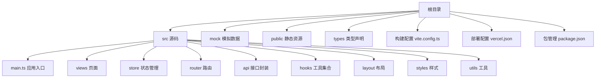
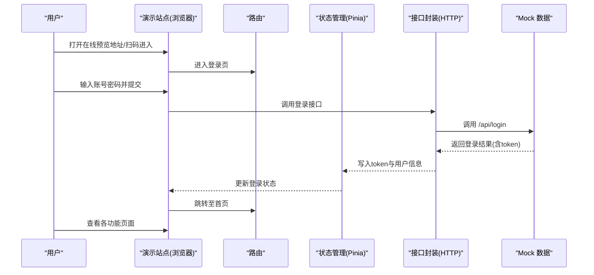
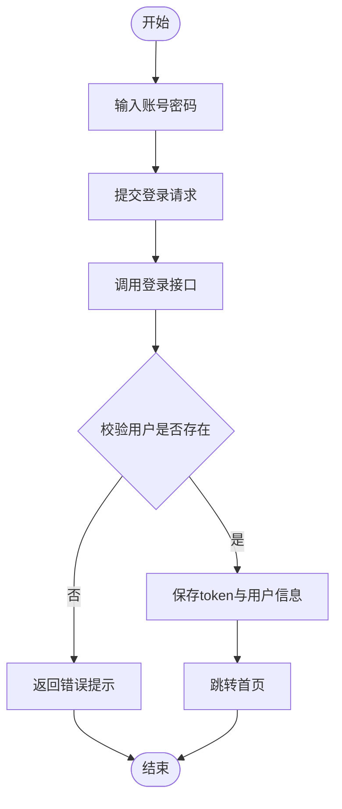
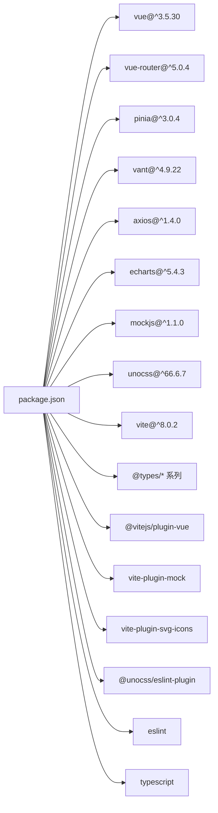

# 在线演示

<cite>
**本文引用的文件**
- [README.md](file://README.md)
- [package.json](file://package.json)
- [vercel.json](file://vercel.json)
- [vite.config.ts](file://vite.config.ts)
- [src/main.ts](file://src/main.ts)
- [src/views/login/Login.vue](file://src/views/login/Login.vue)
- [src/store/modules/user.ts](file://src/store/modules/user.ts)
- [src/api/system/user.ts](file://src/api/system/user.ts)
- [src/router/index.ts](file://src/router/index.ts)
- [mock/user/user.ts](file://mock/user/user.ts)
- [src/enums/httpEnum.ts](file://src/enums/httpEnum.ts)
- [build/vite/proxy.ts](file://build/vite/proxy.ts)
</cite>

## 目录
1. [简介](#简介)
2. [项目结构](#项目结构)
3. [核心组件](#核心组件)
4. [架构总览](#架构总览)
5. [详细组件分析](#详细组件分析)
6. [依赖分析](#依赖分析)
7. [性能考虑](#性能考虑)
8. [故障排查指南](#故障排查指南)
9. [结论](#结论)
10. [附录](#附录)

## 简介
本项目为 Vue3 微信 H5 移动端演示站点，提供在线预览地址、二维码访问方式、测试账号与密码、演示环境功能限制与注意事项、不同设备上的适配说明，以及部署与运行方式的说明，帮助用户快速体验项目功能。

- 在线预览地址与二维码访问方式详见“线上预览”章节
- 测试账号与密码详见“线上预览”章节
- 功能限制与注意事项详见“演示环境说明”章节
- 设备适配与运行方式详见“浏览器支持与设备适配”“运行与构建”章节
- 部署配置说明详见“部署与运行”章节

## 项目结构
项目采用 Vite + Vue3 + Vant4 + Pinia + TypeScript + UnoCSS 技术栈，结合 Mock 数据与登录/注册/找回密码页面，便于快速体验与二次开发。

图表来源
- [vite.config.ts:1-183](file://vite.config.ts#L1-L183)
- [package.json:1-118](file://package.json#L1-L118)

章节来源
- [vite.config.ts:1-183](file://vite.config.ts#L1-L183)
- [package.json:1-118](file://package.json#L1-L118)

## 核心组件
- 应用入口与初始化：应用入口负责挂载状态管理、路由与应用实例，确保路由准备后再挂载。
- 登录流程与页面：登录页整合标题、登录表单、忘记密码与注册表单，配合登录波浪动画与滚动区域设计。
- 用户状态管理：Pinia Store 负责 token 与用户信息的存储、获取与登出操作。
- 接口封装：统一的 HTTP 请求封装，提供登录、获取用户信息、登出等接口。
- 路由与守卫：基于 hash 模式的路由配置与全局守卫，确保页面跳转与权限控制。
- Mock 数据：模拟用户登录、获取用户信息与登出，便于演示与测试。

章节来源
- [src/main.ts:1-30](file://src/main.ts#L1-L30)
- [src/views/login/Login.vue:1-47](file://src/views/login/Login.vue#L1-L47)
- [src/store/modules/user.ts:1-115](file://src/store/modules/user.ts#L1-L115)
- [src/api/system/user.ts:1-60](file://src/api/system/user.ts#L1-L60)
- [src/router/index.ts:1-33](file://src/router/index.ts#L1-L33)
- [mock/user/user.ts:1-96](file://mock/user/user.ts#L1-L96)

## 架构总览
在线演示的整体交互流程如下：

图表来源
- [src/views/login/Login.vue:1-47](file://src/views/login/Login.vue#L1-L47)
- [src/store/modules/user.ts:64-77](file://src/store/modules/user.ts#L64-L77)
- [src/api/system/user.ts:12-23](file://src/api/system/user.ts#L12-L23)
- [mock/user/user.ts:38-60](file://mock/user/user.ts#L38-L60)

## 详细组件分析

### 在线演示入口与访问方式
- 在线预览地址与二维码访问方式：项目在 README 中提供了在线预览链接与二维码图片，用户可通过浏览器直接访问或使用手机微信扫描二维码进入演示。
- 测试账号与密码：README 中明确列出 admin/test 等示例账户及其密码，便于快速登录体验。
- 演示环境功能限制与注意事项：在线演示使用 Mock 数据，不涉及真实后端；演示站点为公开可访问的静态站点，不具备真实业务数据持久化能力。
- 不同设备上的访问效果：项目为移动端 H5，适配手机端与平板端，具体样式与交互以实际演示为准。

章节来源
- [README.md:58-70](file://README.md#L58-L70)

### 登录流程与状态管理
登录流程的关键步骤如下：

图表来源
- [src/store/modules/user.ts:64-77](file://src/store/modules/user.ts#L64-L77)
- [src/api/system/user.ts:12-23](file://src/api/system/user.ts#L12-L23)
- [mock/user/user.ts:38-60](file://mock/user/user.ts#L38-L60)

章节来源
- [src/store/modules/user.ts:1-115](file://src/store/modules/user.ts#L1-L115)
- [src/api/system/user.ts:1-60](file://src/api/system/user.ts#L1-L60)
- [mock/user/user.ts:1-96](file://mock/user/user.ts#L1-L96)

### 登录页面与布局
登录页面采用滚动容器与波浪动画背景，适配移动端滚动与安全区域，确保在不同设备上具有良好的视觉与交互体验。

章节来源
- [src/views/login/Login.vue:1-47](file://src/views/login/Login.vue#L1-L47)

### 路由与导航
- 路由采用 hash 模式，结合全局守卫实现页面跳转与权限控制。
- 常量路由与模块化菜单组合，形成完整的路由体系。

章节来源
- [src/router/index.ts:1-33](file://src/router/index.ts#L1-L33)

### 接口与 Mock 数据
- 登录接口：接收用户名与密码，返回 token 与用户基本信息。
- 获取用户信息接口：根据 token 返回用户详情。
- 登出接口：销毁 token 并清理本地存储。

章节来源
- [src/api/system/user.ts:1-60](file://src/api/system/user.ts#L1-L60)
- [mock/user/user.ts:1-96](file://mock/user/user.ts#L1-L96)

### 部署与运行
- 部署方式：项目使用 Vercel 进行静态站点托管，通过重写规则确保 SPA 路由在刷新或直连时能正确返回页面。
- 运行与构建：本地开发使用 Vite，支持热更新与代理；生产构建通过 Vite 打包并生成静态资源。

章节来源
- [vercel.json:1-9](file://vercel.json#L1-L9)
- [vite.config.ts:135-154](file://vite.config.ts#L135-L154)
- [package.json:24-40](file://package.json#L24-L40)

## 依赖分析
项目主要依赖与开发依赖如下：

图表来源
- [package.json:41-104](file://package.json#L41-L104)

章节来源
- [package.json:1-118](file://package.json#L1-L118)

## 性能考虑
- 构建优化：生产构建启用压缩与分包策略，手动拆分 node_modules 依赖，减少首屏加载体积。
- 依赖预构建：对常用依赖进行预构建，提升开发时的冷启动与切换页面速度。
- CSS 与样式：使用 UnoCSS 与 Less，注入全局变量，减少重复样式与提升样式复用性。
- 源码映射：生产构建默认关闭 source map，减少线上资源体积与泄露风险。

章节来源
- [vite.config.ts:72-122](file://vite.config.ts#L72-L122)
- [vite.config.ts:156-177](file://vite.config.ts#L156-L177)
- [vite.config.ts:124-133](file://vite.config.ts#L124-L133)

## 故障排查指南
- 登录失败
  - 确认输入的账号与密码与演示提供的示例一致
  - 检查网络请求是否成功返回 token
- 无法跳转或白屏
  - 确保路由已准备完成再挂载应用
  - 检查状态管理是否正确写入 token 与用户信息
- Mock 数据异常
  - 确认 Mock 接口路径与方法与接口封装一致
  - 检查 token 是否有效且未过期
- 代理与跨域
  - 如需联调真实后端，可在开发环境下配置代理规则

章节来源
- [src/store/modules/user.ts:64-77](file://src/store/modules/user.ts#L64-L77)
- [src/api/system/user.ts:12-23](file://src/api/system/user.ts#L12-L23)
- [mock/user/user.ts:38-60](file://mock/user/user.ts#L38-L60)
- [build/vite/proxy.ts:18-36](file://build/vite/proxy.ts#L18-L36)

## 结论
本在线演示站点基于 Vue3 生态与移动端适配方案，提供完整的登录与页面导航体验。通过 Mock 数据与公开托管，用户可快速扫码或直接访问体验项目功能。如需接入真实后端，可在本地开发环境中配置代理与接口，或在生产环境替换 Mock 实现。

## 附录

### 线上预览与访问方式
- 在线预览地址：见 README 中的“线上预览”章节
- 二维码访问：README 中提供二维码图片，使用手机微信扫描即可进入演示
- 测试账号与密码：README 中提供 admin/test 等示例账户与其密码

章节来源
- [README.md:58-70](file://README.md#L58-L70)

### 演示环境说明
- 功能限制：演示站点使用 Mock 数据，不涉及真实后端与持久化
- 注意事项：演示站点为公开可访问的静态站点，不适合存放敏感信息

章节来源
- [README.md:58-70](file://README.md#L58-L70)

### 浏览器支持与设备适配
- 浏览器支持：本地开发推荐使用 Chrome 80+，支持现代浏览器，不支持 IE
- 设备适配：项目为移动端 H5，适配手机端与平板端，具体样式与交互以实际演示为准

章节来源
- [README.md:288-297](file://README.md#L288-L297)

### 运行与构建
- 本地运行：安装依赖后执行开发命令，启动 Vite 开发服务器
- 生产构建：执行构建命令，生成静态资源并进行压缩与分包
- 预览：可使用 Vite 预览命令查看构建产物

章节来源
- [package.json:24-40](file://package.json#L24-L40)

### 部署与运行
- 部署平台：使用 Vercel 进行静态站点托管
- 重写规则：通过重写规则确保 SPA 路由在刷新或直连时能正确返回页面

章节来源
- [vercel.json:1-9](file://vercel.json#L1-L9)