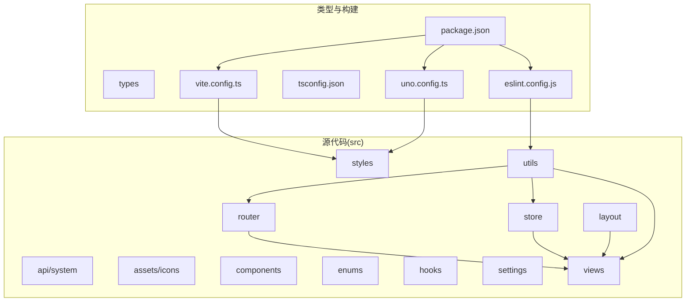
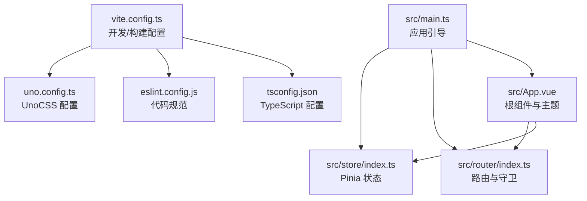
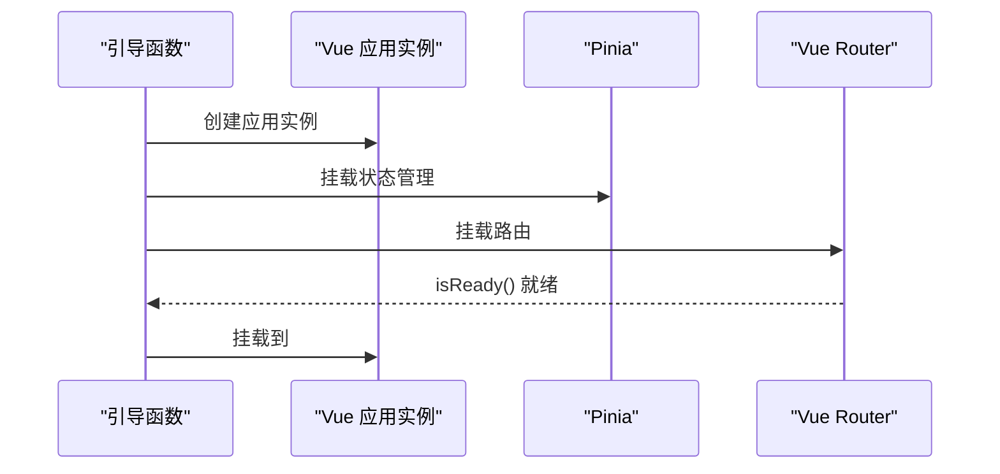
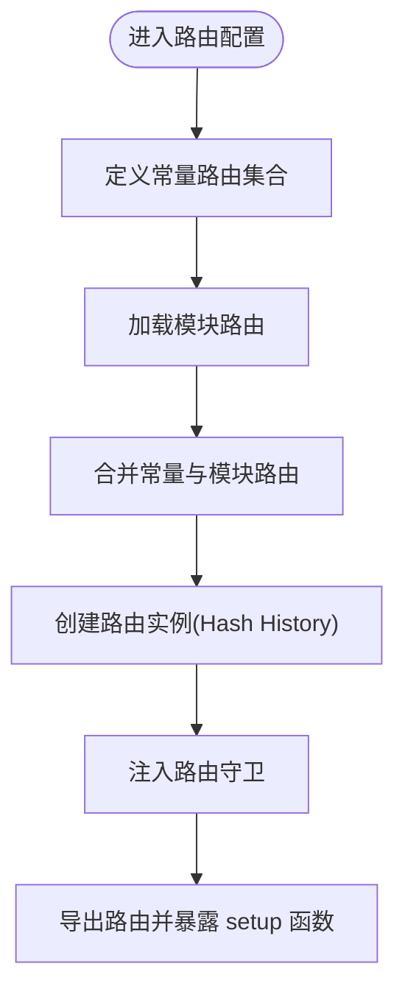
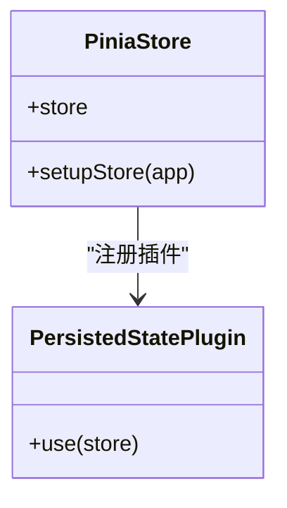
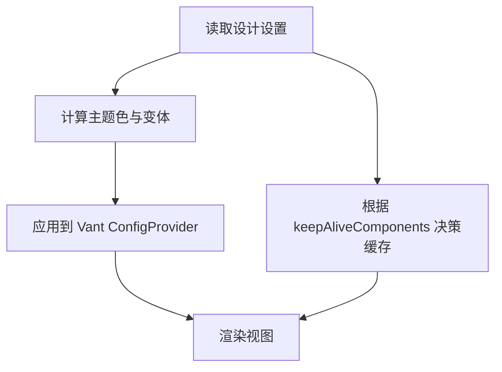
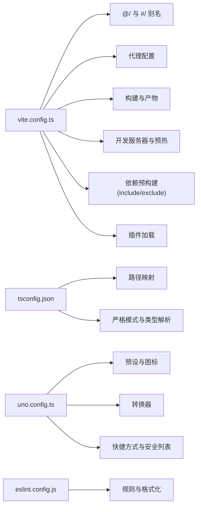
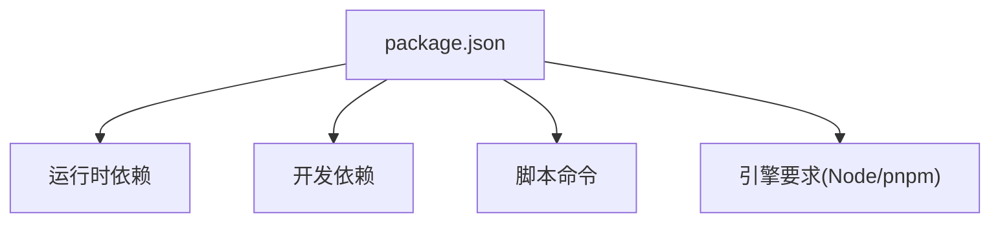

# 快速开始指南

<cite>
**本文档引用的文件**
- [README.md](file://README.md)
- [package.json](file://package.json)
- [vite.config.ts](file://vite.config.ts)
- [eslint.config.js](file://eslint.config.js)
- [tsconfig.json](file://tsconfig.json)
- [uno.config.ts](file://uno.config.ts)
- [src/main.ts](file://src/main.ts)
- [src/router/index.ts](file://src/router/index.ts)
- [src/store/index.ts](file://src/store/index.ts)
- [src/App.vue](file://src/App.vue)
- [src/settings/designSetting.ts](file://src/settings/designSetting.ts)
- [src/hooks/setting/index.ts](file://src/hooks/setting/index.ts)
- [src/enums/pageEnum.ts](file://src/enums/pageEnum.ts)
- [src/utils/env.ts](file://src/utils/env.ts)
</cite>

## 目录
1. [简介](#简介)
2. [项目结构](#项目结构)
3. [核心组件](#核心组件)
4. [架构总览](#架构总览)
5. [详细组件分析](#详细组件分析)
6. [依赖关系分析](#依赖关系分析)
7. [性能考虑](#性能考虑)
8. [故障排除指南](#故障排除指南)
9. [结论](#结论)
10. [附录](#附录)

## 简介
本指南面向希望快速启动 Vue3 微信 H5 移动端项目的开发者，涵盖环境准备、项目克隆、依赖安装、本地运行、开发环境配置（VS Code 插件、ESLint、代码格式化）、在线演示与二维码访问、目录结构说明、常见问题排查等内容。项目采用 Vue3.5、Vite8、Vant4、Pinia、TypeScript、UnoCSS 等主流技术栈，集成 Mock 数据、登录/注册/找回密码页面、暗黑模式与系统主题色持久化、图表与图标体系等。

- 在线演示链接：[https://vvmobile.xiangshu233.cn/](https://vvmobile.xiangshu233.cn/)
- 测试账号示例：
  - admin / 123456
  - test / 123456
- 二维码访问方式：扫描 README 中提供的二维码图片

章节来源
- [README.md:58-70](file://README.md#L58-L70)

## 项目结构
项目采用“功能域 + 层次化”组织方式，核心目录与职责如下：
- src：源代码
  - api/system：系统接口封装
  - assets/icons：SVG 图标资源
  - components：通用组件（Logo、SvgIcon）
  - enums：枚举定义（断点、缓存、HTTP、页面）
  - hooks：自定义组合式函数（事件、设计、web图表等）
  - layout：布局容器（含浮动导航栏）
  - router：路由定义、模块化路由、路由守卫
  - settings：设计与组件设置
  - store：状态管理（Pinia，带持久化）
  - styles：样式（过渡、通用、Vant、变量）
  - utils：工具库（HTTP、存储、日期、DOM、环境、日志、URL）
  - views：页面视图（仪表盘、示例、异常、登录、消息、我的、TabBar）
- types：类型声明
- mock：Mock 服务与工具
- public：公共资源
- 构建与配置：vite.config.ts、tsconfig.json、uno.config.ts、eslint.config.js、package.json、vercel.json 等

图表来源
- [vite.config.ts:1-183](file://vite.config.ts#L1-L183)
- [uno.config.ts:1-84](file://uno.config.ts#L1-L84)
- [tsconfig.json:1-42](file://tsconfig.json#L1-L42)
- [eslint.config.js:1-62](file://eslint.config.js#L1-L62)
- [package.json:1-118](file://package.json#L1-L118)

章节来源
- [README.md:111-117](file://README.md#L111-L117)
- [package.json:1-118](file://package.json#L1-L118)

## 核心组件
- 应用入口与初始化
  - src/main.ts：应用引导流程，挂载 Pinia、路由，等待路由就绪后挂载应用
- 路由系统
  - src/router/index.ts：定义常量路由、聚合模块路由、创建路由实例并注入守卫
- 状态管理
  - src/store/index.ts：创建 Pinia 实例并启用持久化插件
- 设计与主题
  - src/settings/designSetting.ts：主题色、暗黑模式、页面动画等全局设计设置
  - src/hooks/setting/index.ts：全局环境变量读取与校验
- 应用根组件
  - src/App.vue：统一的 Vant 主题配置、过渡动画、KeepAlive 缓存策略
- 构建与开发配置
  - vite.config.ts：别名、代理、构建产物、开发服务器、插件加载
  - tsconfig.json：路径映射、严格模式、类型解析
  - uno.config.ts：UnoCSS 预设、图标、转换器、快捷方式与安全列表
  - eslint.config.js：基于 antfu/eslint-config 的规则与格式化配置

章节来源
- [src/main.ts:1-30](file://src/main.ts#L1-L30)
- [src/router/index.ts:1-33](file://src/router/index.ts#L1-L33)
- [src/store/index.ts:1-13](file://src/store/index.ts#L1-L13)
- [src/settings/designSetting.ts:1-52](file://src/settings/designSetting.ts#L1-L52)
- [src/hooks/setting/index.ts:1-36](file://src/hooks/setting/index.ts#L1-L36)
- [src/App.vue:1-78](file://src/App.vue#L1-L78)
- [vite.config.ts:1-183](file://vite.config.ts#L1-L183)
- [tsconfig.json:1-42](file://tsconfig.json#L1-L42)
- [uno.config.ts:1-84](file://uno.config.ts#L1-L84)
- [eslint.config.js:1-62](file://eslint.config.js#L1-L62)

## 架构总览
整体架构围绕“应用引导 → 路由与状态 → 视图渲染”的主线展开，结合 UnoCSS 原子化样式、Vant 移动端组件库、Axios 请求封装与 Mock 数据，形成完整的移动端 H5 应用骨架。

图表来源
- [src/main.ts:18-30](file://src/main.ts#L18-L30)
- [src/router/index.ts:19-30](file://src/router/index.ts#L19-L30)
- [src/store/index.ts:5-10](file://src/store/index.ts#L5-L10)
- [src/App.vue:1-13](file://src/App.vue#L1-L13)
- [vite.config.ts:27-181](file://vite.config.ts#L27-L181)
- [uno.config.ts:13-83](file://uno.config.ts#L13-L83)
- [eslint.config.js:4-61](file://eslint.config.js#L4-L61)
- [tsconfig.json:2-24](file://tsconfig.json#L2-L24)

## 详细组件分析

### 应用引导与生命周期
应用通过异步引导函数完成 Pinia、路由挂载与路由就绪检测，最后进行应用挂载。该流程确保路由守卫与状态在首屏渲染前已准备完毕。

图表来源
- [src/main.ts:18-29](file://src/main.ts#L18-L29)

章节来源
- [src/main.ts:18-30](file://src/main.ts#L18-L30)

### 路由系统与守卫
- 常量路由：登录、根路由、错误页
- 模块化路由：从 modules 聚合菜单与路由表
- 路由守卫：在路由实例创建后注入，保障权限与导航行为
- Hash 模式：使用哈希历史记录，适配 H5 场景

图表来源
- [src/router/index.ts:12-30](file://src/router/index.ts#L12-L30)

章节来源
- [src/router/index.ts:1-33](file://src/router/index.ts#L1-L33)
- [src/enums/pageEnum.ts:1-12](file://src/enums/pageEnum.ts#L1-L12)

### 状态管理与持久化
- Pinia 创建与插件：启用持久化插件，实现跨会话状态保留
- 应用挂载：在引导阶段完成 store 注册

图表来源
- [src/store/index.ts:1-13](file://src/store/index.ts#L1-L13)

章节来源
- [src/store/index.ts:1-13](file://src/store/index.ts#L1-L13)

### 设计设置与主题系统
- 设计设置：主题色、暗黑模式、页面动画开关与类型
- 主题变量：根据当前主题动态生成 Vant 主题变量
- KeepAlive：根据路由配置缓存组件，减少重复渲染

图表来源
- [src/settings/designSetting.ts:38-49](file://src/settings/designSetting.ts#L38-L49)
- [src/App.vue:26-68](file://src/App.vue#L26-L68)

章节来源
- [src/settings/designSetting.ts:1-52](file://src/settings/designSetting.ts#L1-L52)
- [src/App.vue:1-78](file://src/App.vue#L1-L78)

### 构建与开发配置
- Vite 配置要点：路径别名、代理、构建产物、开发服务器、依赖预构建、插件加载
- TypeScript 配置：路径映射、严格模式、类型解析
- UnoCSS 配置：预设、图标、转换器、快捷方式与安全列表
- ESLint 配置：基于 antfu/eslint-config，启用格式化与规则定制

图表来源
- [vite.config.ts:49-181](file://vite.config.ts#L49-L181)
- [tsconfig.json:10-24](file://tsconfig.json#L10-L24)
- [uno.config.ts:15-83](file://uno.config.ts#L15-L83)
- [eslint.config.js:4-61](file://eslint.config.js#L4-L61)

章节来源
- [vite.config.ts:1-183](file://vite.config.ts#L1-L183)
- [tsconfig.json:1-42](file://tsconfig.json#L1-L42)
- [uno.config.ts:1-84](file://uno.config.ts#L1-L84)
- [eslint.config.js:1-62](file://eslint.config.js#L1-L62)

## 依赖关系分析
- 运行时依赖：Vue3、Vue Router、Pinia、Vant4、Axios、ECharts、Lodash-es、MockJS、NProgress 等
- 开发依赖：Vite8、UnoCSS、TypeScript、ESLint、cz-git、lint-staged、simple-git-hooks 等
- 脚本命令：dev、build、lint、type:check、preview 等
- 引擎要求：Node.js 与 pnpm 版本范围

图表来源
- [package.json:41-118](file://package.json#L41-L118)

章节来源
- [package.json:1-118](file://package.json#L1-L118)

## 性能考虑
- 依赖预构建：将常用库（pinia、lodash-es、axios）纳入预构建，减少首次加载等待
- 产物拆分：手动拆分 node_modules 依赖，优化首屏加载
- 构建目标：ES2015，确保现代浏览器兼容
- 压缩与体积：按需移除 console，可视化分析体积
- 开发体验：预热关键文件，缩短冷启动时间

章节来源
- [vite.config.ts:156-177](file://vite.config.ts#L156-L177)
- [vite.config.ts:72-122](file://vite.config.ts#L72-L122)

## 故障排除指南
- Node.js 与 pnpm 版本不匹配
  - 症状：依赖安装失败、打包报错
  - 解决：升级至推荐版本范围（Node.js ^20.19.0 || >=22.12.0；pnpm >=8.15.4）
- ESLint 与格式化冲突
  - 症状：VS Code 中格式化与 ESLint 冲突
  - 解决：启用 ESLint 平面配置，关闭默认格式化，使用 ESLint 自动修复
- Git Hooks 未生效
  - 症状：提交未触发校验
  - 解决：首次安装后执行更新 hooks 命令，并全局安装 commitizen CLI
- 浏览器兼容性
  - 症状：低端浏览器样式异常
  - 解决：使用现代浏览器（Chrome 80+），不支持 IE
- UnoCSS 动态图标未生成
  - 症状：运行时动态图标类名无样式
  - 解决：在 UnoCSS 配置中添加安全列表（safelist）

章节来源
- [README.md:111-117](file://README.md#L111-L117)
- [README.md:134-184](file://README.md#L134-L184)
- [README.md:232-251](file://README.md#L232-L251)
- [README.md:288-297](file://README.md#L288-L297)
- [uno.config.ts:77-82](file://uno.config.ts#L77-L82)

## 结论
本项目提供了开箱即用的 Vue3 移动端 H5 基础骨架，具备完善的开发与构建配置、主题与动画体系、Mock 数据与登录流程。按照本指南完成环境准备与安装后，即可快速启动开发与调试。建议在开发过程中充分利用 VS Code 插件链与 ESLint 规范，保持团队协作的一致性与高质量。

## 附录

### 环境准备与安装步骤
- 环境要求
  - Node.js：^20.19.0 || >=22.12.0
  - pnpm：>=8.15.4
  - Git：用于代码克隆与版本管理
- 安装步骤
  - 克隆项目：使用 Git 克隆仓库
  - 安装依赖：进入项目目录执行依赖安装
  - 启动开发：执行开发命令启动本地服务
  - 构建产物：执行构建命令生成生产包
- 在线演示与二维码
  - 在线链接与测试账号详见 README
  - 手机扫码访问演示页面

章节来源
- [README.md:111-117](file://README.md#L111-L117)
- [README.md:186-201](file://README.md#L186-L201)
- [README.md:58-70](file://README.md#L58-L70)

### VS Code 推荐插件与配置
- 插件清单：UnoCSS、Volar、TypeScript Vue Plugin、ESLint、DotENV、Error Lens、EditorConfig、File Nesting、Pretty TypeScript Errors、Todo Tree、Trailing Spaces
- ESLint 配置：启用平面配置、关闭默认格式化、保存时自动修复、静默部分风格规则、启用对多种语言的 ESLint 校验

章节来源
- [README.md:118-133](file://README.md#L118-L133)
- [README.md:134-184](file://README.md#L134-L184)
- [eslint.config.js:4-61](file://eslint.config.js#L4-L61)

### 目录结构与主要文件说明
- src/main.ts：应用引导与挂载
- src/App.vue：根组件与主题配置
- src/router/index.ts：路由定义与守卫
- src/store/index.ts：状态管理与持久化
- vite.config.ts：开发/构建配置
- tsconfig.json：TypeScript 路径与严格模式
- uno.config.ts：UnoCSS 预设与图标
- eslint.config.js：代码规范与格式化

章节来源
- [src/main.ts:1-30](file://src/main.ts#L1-L30)
- [src/App.vue:1-78](file://src/App.vue#L1-L78)
- [src/router/index.ts:1-33](file://src/router/index.ts#L1-L33)
- [src/store/index.ts:1-13](file://src/store/index.ts#L1-L13)
- [vite.config.ts:1-183](file://vite.config.ts#L1-L183)
- [tsconfig.json:1-42](file://tsconfig.json#L1-L42)
- [uno.config.ts:1-84](file://uno.config.ts#L1-L84)
- [eslint.config.js:1-62](file://eslint.config.js#L1-L62)