# 技术栈概览

<cite>
**本文档引用的文件**
- [package.json](file://package.json)
- [vite.config.ts](file://vite.config.ts)
- [uno.config.ts](file://uno.config.ts)
- [tsconfig.json](file://tsconfig.json)
- [src/main.ts](file://src/main.ts)
- [src/store/index.ts](file://src/store/index.ts)
- [src/router/index.ts](file://src/router/index.ts)
- [src/settings/designSetting.ts](file://src/settings/designSetting.ts)
- [build/vite/plugin/index.ts](file://build/vite/plugin/index.ts)
- [src/utils/http/axios/Axios.ts](file://src/utils/http/axios/Axios.ts)
- [src/App.vue](file://src/App.vue)
- [src/hooks/web/useECharts.ts](file://src/hooks/web/useECharts.ts)
- [mock/_createProductionServer.ts](file://mock/_createProductionServer.ts)
- [eslint.config.js](file://eslint.config.js)
- [commitlint.config.cjs](file://commitlint.config.cjs)
</cite>

## 目录
1. [引言](#引言)
2. [项目结构](#项目结构)
3. [核心组件](#核心组件)
4. [架构总览](#架构总览)
5. [详细组件分析](#详细组件分析)
6. [依赖关系分析](#依赖关系分析)
7. [性能考虑](#性能考虑)
8. [故障排查指南](#故障排查指南)
9. [结论](#结论)

## 引言
本项目为基于 Vue3.5 的微信 H5 移动端应用，采用现代化前端工程化体系，围绕 Vite8 构建工具、Vant4 移动端 UI 组件库、Pinia 状态管理、TypeScript 类型系统、UnoCSS 原子化 CSS 等核心技术进行设计与集成。项目同时引入 Axios、ECharts、Mock.js 等第三方库，配合 ESLint、CommitLint 等工具链，确保开发效率、代码质量与可维护性。

## 项目结构
项目采用“功能域 + 层次化”组织方式，核心目录职责如下：
- src：源码目录，包含页面视图、组件、路由、状态管理、工具库、样式与设置
- mock：模拟数据服务，支持开发与生产环境
- build：构建期工具与插件配置
- types：类型声明文件
- 根目录：构建配置、脚手架与工具链配置

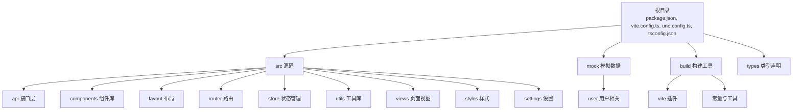

图表来源
- [package.json:1-118](file://package.json#L1-L118)
- [vite.config.ts:1-183](file://vite.config.ts#L1-L183)
- [uno.config.ts:1-84](file://uno.config.ts#L1-L84)
- [tsconfig.json:1-42](file://tsconfig.json#L1-L42)

章节来源
- [package.json:1-118](file://package.json#L1-L118)
- [vite.config.ts:1-183](file://vite.config.ts#L1-L183)
- [uno.config.ts:1-84](file://uno.config.ts#L1-L84)
- [tsconfig.json:1-42](file://tsconfig.json#L1-L42)

## 核心组件
- Vue3.5 核心框架：提供响应式与组合式 API，支撑页面与组件开发
- Vite8 构建工具：快速冷启动、热更新与高效打包
- Vant4 移动端 UI 组件库：提供丰富的移动端交互组件
- Pinia 状态管理：轻量级状态管理，支持持久化
- TypeScript 类型系统：强类型保障开发体验与可维护性
- UnoCSS 原子化 CSS：按需生成样式，提升开发效率与体积控制
- Axios 网络请求：统一拦截器、取消与转换机制
- ECharts 图表：封装响应式图表能力，支持深浅主题
- Mock.js：开发与生产环境模拟数据
- ESLint/CommitLint：代码规范与提交规范

章节来源
- [src/main.ts:1-30](file://src/main.ts#L1-L30)
- [src/store/index.ts:1-13](file://src/store/index.ts#L1-L13)
- [src/router/index.ts:1-33](file://src/router/index.ts#L1-L33)
- [src/App.vue:1-78](file://src/App.vue#L1-L78)
- [src/utils/http/axios/Axios.ts:1-225](file://src/utils/http/axios/Axios.ts#L1-L225)
- [src/hooks/web/useECharts.ts:1-123](file://src/hooks/web/useECharts.ts#L1-L123)
- [mock/_createProductionServer.ts:1-19](file://mock/_createProductionServer.ts#L1-L19)
- [eslint.config.js:1-62](file://eslint.config.js#L1-L62)
- [commitlint.config.cjs:1-156](file://commitlint.config.cjs#L1-L156)

## 架构总览
整体架构围绕“应用引导 → 插件装配 → 路由与状态 → 视图渲染”的主线展开，构建期通过 Vite 插件链路集成 UnoCSS、自动导入、组件按需注册与 SVG 图标等能力；运行期通过 Pinia 提供状态，Vant 提供 UI，Axios 提供网络访问，ECharts 提供图表展示。

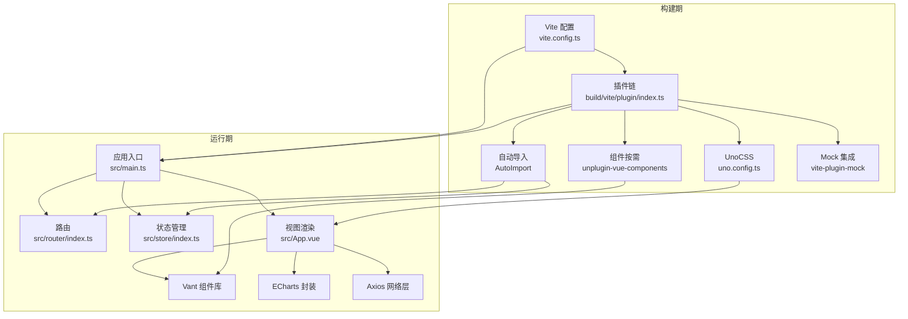

图表来源
- [vite.config.ts:1-183](file://vite.config.ts#L1-L183)
- [build/vite/plugin/index.ts:1-79](file://build/vite/plugin/index.ts#L1-L79)
- [uno.config.ts:1-84](file://uno.config.ts#L1-L84)
- [src/main.ts:1-30](file://src/main.ts#L1-L30)
- [src/router/index.ts:1-33](file://src/router/index.ts#L1-L33)
- [src/store/index.ts:1-13](file://src/store/index.ts#L1-L13)
- [src/App.vue:1-78](file://src/App.vue#L1-L78)

## 详细组件分析

### Vue3.5 与应用引导
- 应用通过入口文件创建实例，挂载状态管理与路由，并在路由就绪后挂载根组件
- UnoCSS 样式与 Vant 样式在入口处统一引入，保证首屏样式一致性

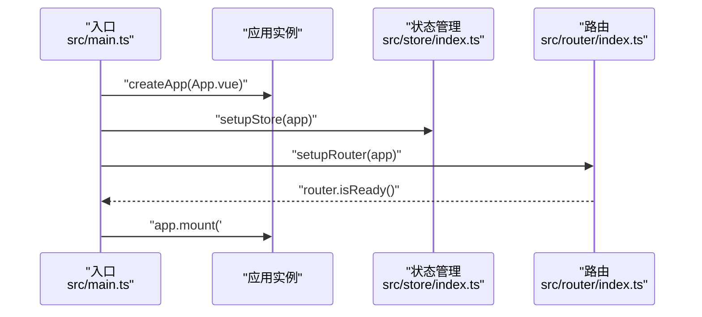

图表来源
- [src/main.ts:18-29](file://src/main.ts#L18-L29)
- [src/store/index.ts:8-10](file://src/store/index.ts#L8-L10)
- [src/router/index.ts:26-30](file://src/router/index.ts#L26-L30)

章节来源
- [src/main.ts:1-30](file://src/main.ts#L1-L30)
- [src/store/index.ts:1-13](file://src/store/index.ts#L1-L13)
- [src/router/index.ts:1-33](file://src/router/index.ts#L1-L33)

### Vite 插件生态与集成
- 插件链包含 Vue、组件按需与自动导入、UnoCSS、HTML、可视化、Mock、SVG 图标等
- 组件按需注册结合 Vant 解析器，减少打包体积
- 自动导入 Vue、Router、Pinia、@vueuse/core 等常用 API，降低样板代码

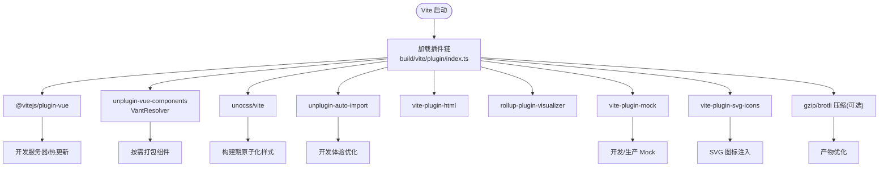

图表来源
- [build/vite/plugin/index.ts:19-78](file://build/vite/plugin/index.ts#L19-L78)
- [vite.config.ts:179-181](file://vite.config.ts#L179-L181)

章节来源
- [build/vite/plugin/index.ts:1-79](file://build/vite/plugin/index.ts#L1-L79)
- [vite.config.ts:1-183](file://vite.config.ts#L1-L183)

### UnoCSS 原子化与移动端适配
- 预设包括基础 Uno、图标、属性模式、排版与网络字体
- 通过 rem-to-px 预设与 PostCSS 转换，结合移动端 viewport 实现 px → vw/vh 的适配
- 提供常用快捷类与 safelist，兼顾动态类名场景

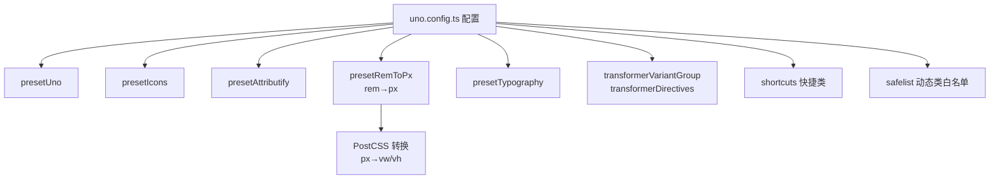

图表来源
- [uno.config.ts:13-83](file://uno.config.ts#L13-L83)

章节来源
- [uno.config.ts:1-84](file://uno.config.ts#L1-L84)

### Pinia 状态管理与持久化
- 创建 Pinia 实例并启用持久化插件，支持跨页签数据保持
- 在入口中统一安装，后续通过组合式 API 访问

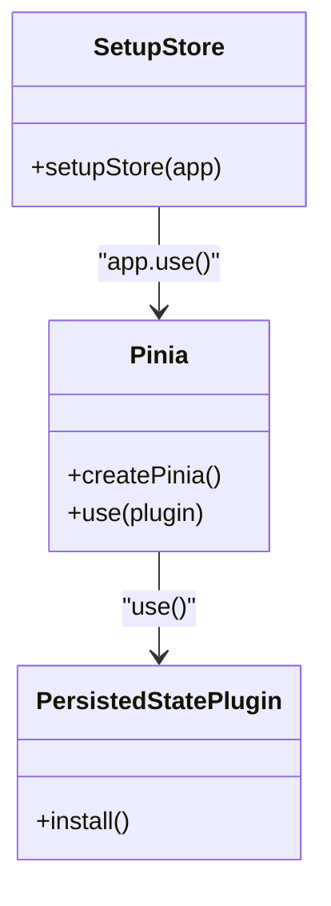

图表来源
- [src/store/index.ts:1-13](file://src/store/index.ts#L1-L13)

章节来源
- [src/store/index.ts:1-13](file://src/store/index.ts#L1-L13)

### 路由与导航
- 使用哈希历史模式，结合路由守卫与菜单/路由映射
- 常量路由与模块化路由合并，支持动态注入与权限控制

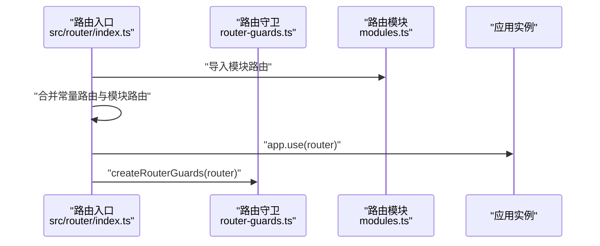

图表来源
- [src/router/index.ts:19-30](file://src/router/index.ts#L19-L30)

章节来源
- [src/router/index.ts:1-33](file://src/router/index.ts#L1-L33)

### 主题与样式体系
- 设计设置包含深浅主题、主题色、页面动画开关与类型
- App.vue 通过 Vant 的 ConfigProvider 注入主题变量，实现全局样式定制

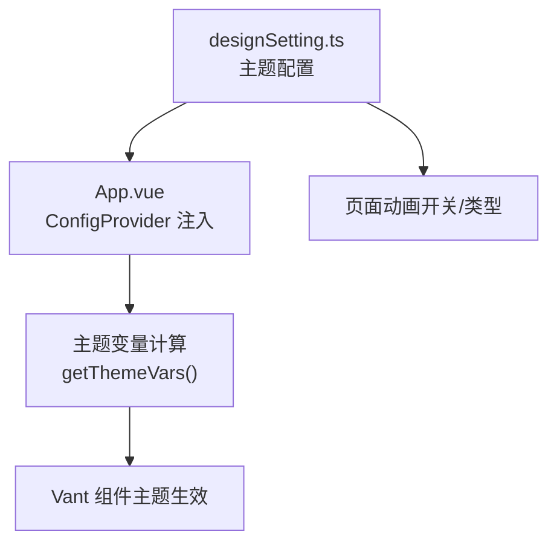

图表来源
- [src/settings/designSetting.ts:1-52](file://src/settings/designSetting.ts#L1-L52)
- [src/App.vue:26-68](file://src/App.vue#L26-L68)

章节来源
- [src/settings/designSetting.ts:1-52](file://src/settings/designSetting.ts#L1-L52)
- [src/App.vue:1-78](file://src/App.vue#L1-L78)

### 网络层与拦截器
- VAxios 封装 Axios，提供请求/响应拦截、取消、表单数据处理与统一转换钩子
- 支持请求前钩子、请求异常钩子与数据转换钩子，便于扩展业务逻辑

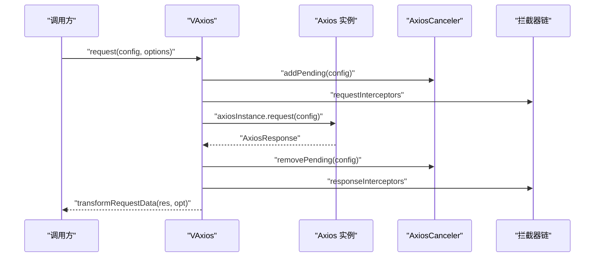

图表来源
- [src/utils/http/axios/Axios.ts:55-100](file://src/utils/http/axios/Axios.ts#L55-L100)
- [src/utils/http/axios/Axios.ts:175-223](file://src/utils/http/axios/Axios.ts#L175-L223)

章节来源
- [src/utils/http/axios/Axios.ts:1-225](file://src/utils/http/axios/Axios.ts#L1-L225)

### 图表与可视化
- useECharts 封装 ECharts 初始化、尺寸监听、主题切换与销毁流程
- 结合断点与深浅主题，自动适配不同屏幕与主题

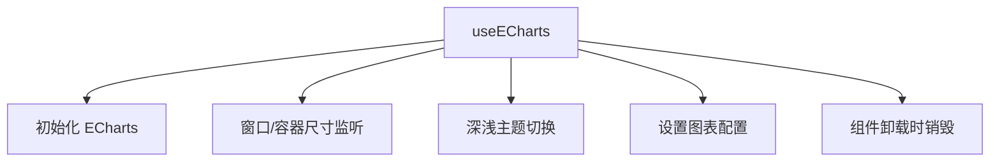

图表来源
- [src/hooks/web/useECharts.ts:40-98](file://src/hooks/web/useECharts.ts#L40-L98)

章节来源
- [src/hooks/web/useECharts.ts:1-123](file://src/hooks/web/useECharts.ts#L1-L123)

### Mock 服务
- 开发环境通过 vite-plugin-mock 提供便捷 Mock
- 生产环境通过手动聚合模块实现，避免自动扫描带来的体积与安全风险

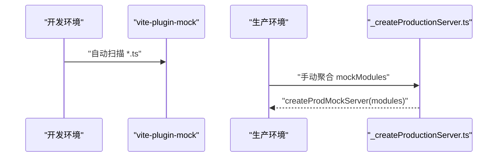

图表来源
- [mock/_createProductionServer.ts:16-18](file://mock/_createProductionServer.ts#L16-L18)

章节来源
- [mock/_createProductionServer.ts:1-19](file://mock/_createProductionServer.ts#L1-L19)

## 依赖关系分析
- 版本与兼容性
  - Node.js：^20.19.0 或 >=22.12.0
  - pnpm：>=8.15.4
  - TypeScript：^5.9.3
  - Vite：^8.0.2
  - Vue：^3.5.30
  - Vant：^4.9.22
  - Pinia：^3.0.4
  - UnoCSS：^66.6.7
  - ECharts：^5.4.3
  - Axios：^1.4.0
  - Mock.js：^1.1.0

- 关键依赖耦合
  - Vite 与插件链：构建期核心，决定开发体验与产物质量
  - UnoCSS 与 PostCSS：样式管线，影响体积与运行时性能
  - Pinia 与持久化：状态管线，影响数据一致性与用户体验
  - Vant 与自动导入：组件管线，影响打包体积与开发效率
  - Axios 与拦截器：网络管线，影响稳定性与可维护性

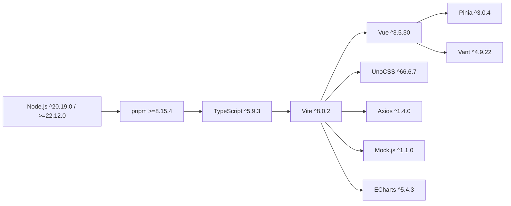

图表来源
- [package.json:20-23](file://package.json#L20-L23)
- [package.json:41-56](file://package.json#L41-L56)
- [package.json:57-104](file://package.json#L57-L104)

章节来源
- [package.json:1-118](file://package.json#L1-L118)

## 性能考虑
- 构建目标与压缩
  - 目标浏览器：es2015
  - 生产构建：可选 Terser 或 Oxc 压缩，支持移除 console 与 debugger
  - 分包策略：手动拆分 node_modules 依赖，提升缓存命中率
- 依赖预构建与排除
  - optimizeDeps.include：预构建 pinia、lodash-es、axios
  - optimizeDeps.exclude：排除 vant、@vant/use，避免重复打包
- 样式体积控制
  - UnoCSS 按需生成，结合 PostCSS 转换与 safelist，减少无效类
- 运行时性能
  - KeepAlive 缓存路由组件，减少重复渲染
  - ECharts 按需初始化与销毁，避免内存泄漏

章节来源
- [vite.config.ts:72-122](file://vite.config.ts#L72-L122)
- [vite.config.ts:156-177](file://vite.config.ts#L156-L177)
- [uno.config.ts:77-82](file://uno.config.ts#L77-L82)
- [src/App.vue:23-24](file://src/App.vue#L23-L24)
- [src/hooks/web/useECharts.ts:100-107](file://src/hooks/web/useECharts.ts#L100-L107)

## 故障排查指南
- 开发环境无法热更新
  - 检查 optimizeDeps.include 是否包含新增依赖
  - 确认插件链未遗漏 @vitejs/plugin-vue
- UnoCSS 样式不生效
  - 确认已引入 virtual:uno.css 与样式重置
  - 检查 safelist 是否包含动态类名
- 路由跳转异常
  - 检查路由守卫与菜单/路由映射是否正确合并
  - 确认哈希模式与基础路径配置
- 网络请求失败
  - 查看拦截器链是否正确处理请求/响应
  - 检查取消令牌与表单数据编码
- Mock 数据未生效
  - 开发环境确认 vite-plugin-mock 配置
  - 生产环境确认手动聚合模块是否正确

章节来源
- [vite.config.ts:156-177](file://vite.config.ts#L156-L177)
- [uno.config.ts:1-84](file://uno.config.ts#L1-L84)
- [src/router/index.ts:19-30](file://src/router/index.ts#L19-L30)
- [src/utils/http/axios/Axios.ts:175-223](file://src/utils/http/axios/Axios.ts#L175-L223)
- [mock/_createProductionServer.ts:16-18](file://mock/_createProductionServer.ts#L16-L18)

## 结论
本项目以 Vue3.5 为核心，结合 Vite8、Vant4、Pinia、TypeScript、UnoCSS 等技术栈，形成一套面向微信 H5 移动端的现代化前端工程化方案。通过完善的插件生态、主题与样式体系、状态管理与网络层封装，以及 Mock 与可视化工具，项目在开发效率、运行性能与可维护性方面取得平衡。建议在团队协作中严格遵循 ESLint 与 CommitLint 规范，持续优化构建与运行时性能。