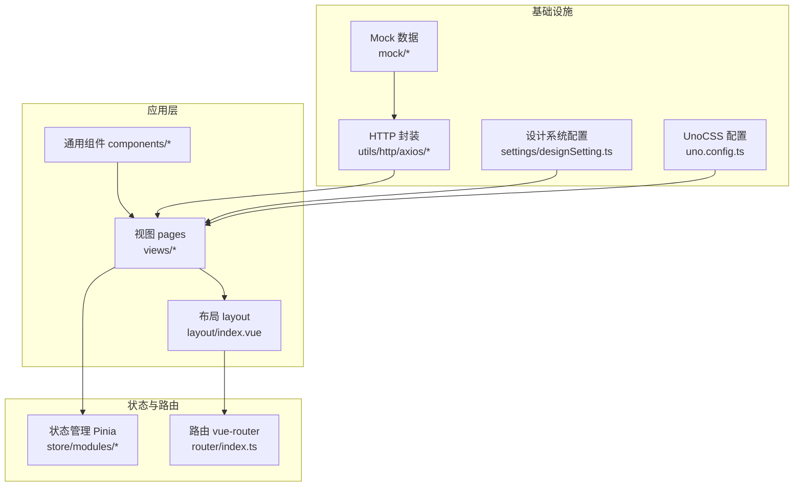
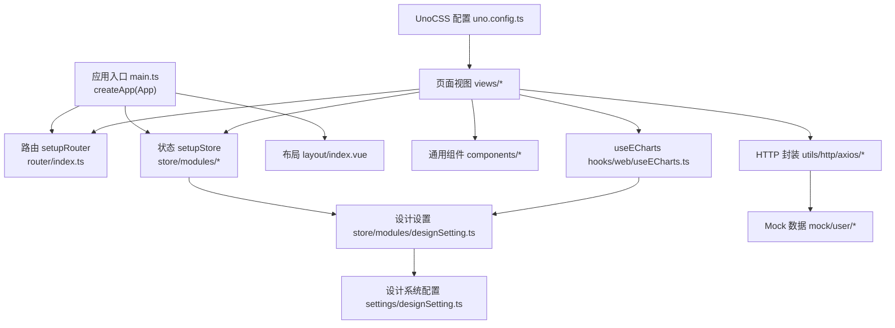
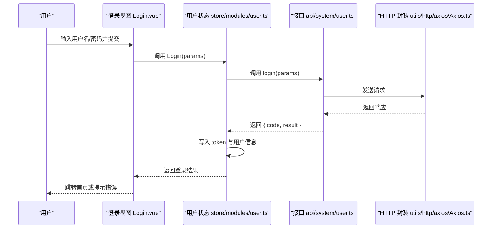
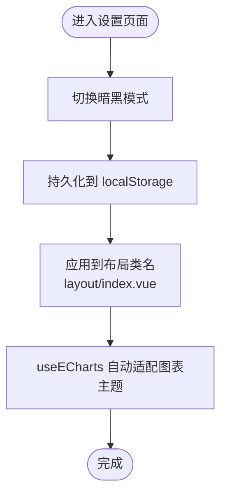
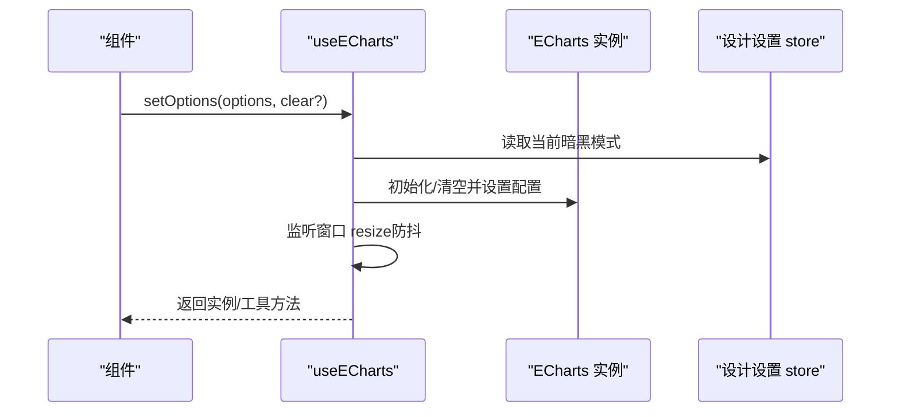
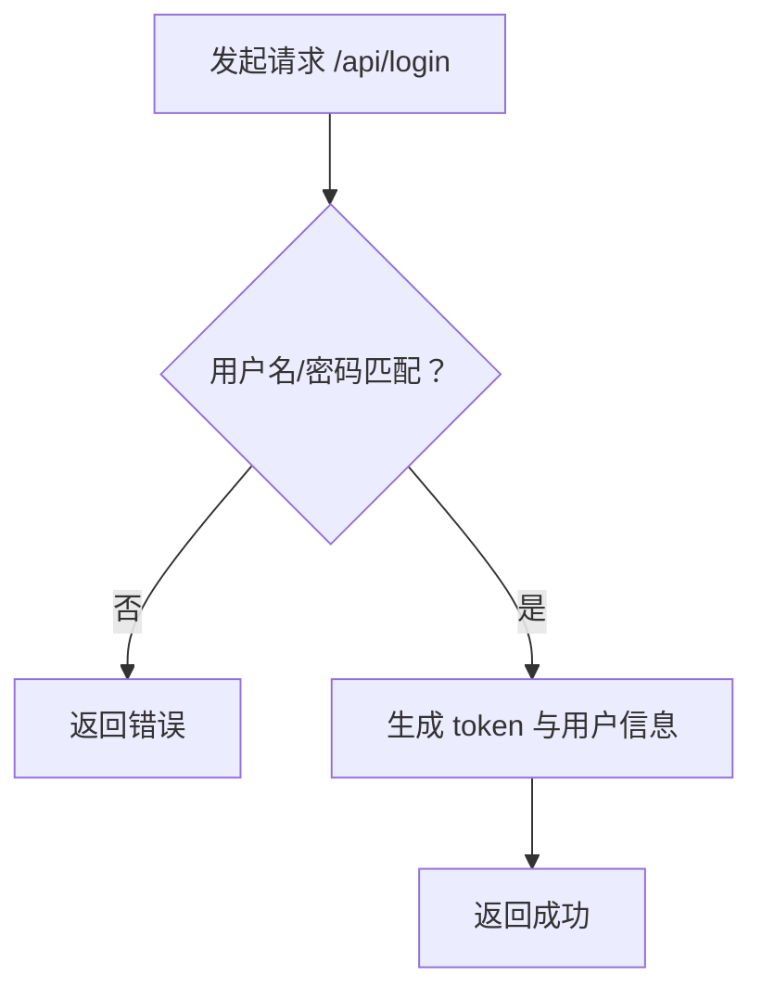
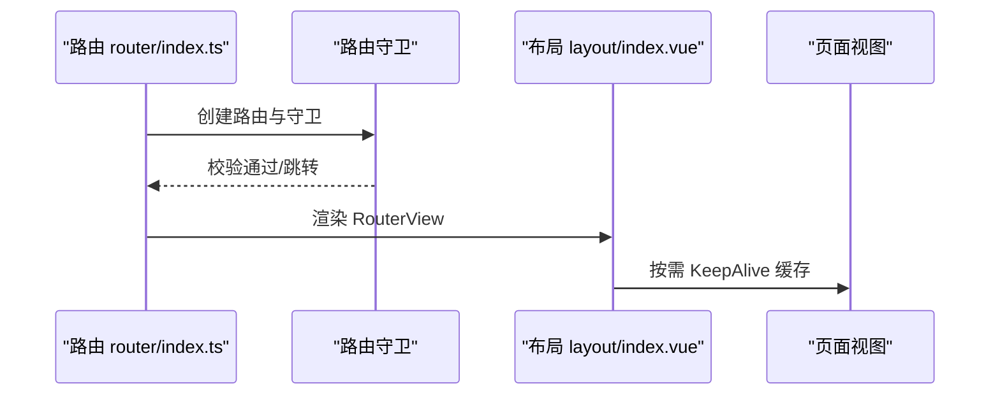
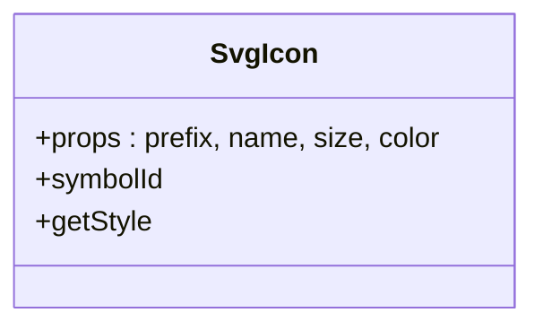
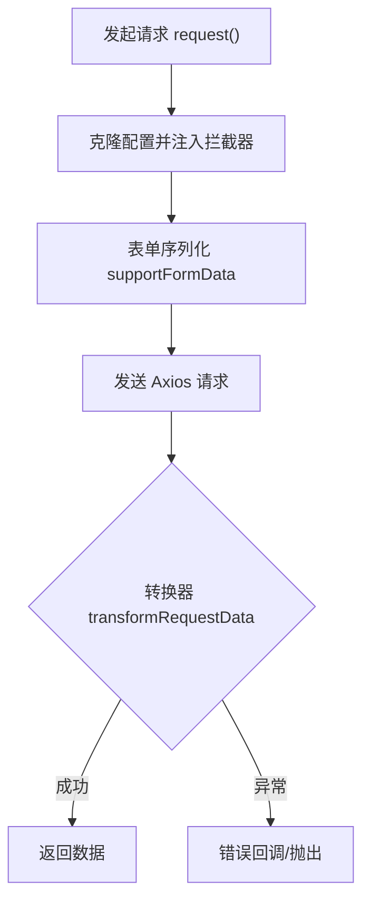
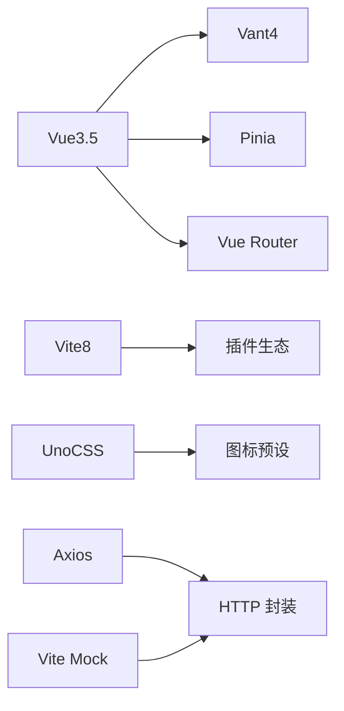

# 项目介绍与特性

<cite>
**本文引用的文件**
- [README.md](file://README.md)
- [package.json](file://package.json)
- [vite.config.ts](file://vite.config.ts)
- [uno.config.ts](file://uno.config.ts)
- [src/main.ts](file://src/main.ts)
- [src/router/index.ts](file://src/router/index.ts)
- [src/store/modules/user.ts](file://src/store/modules/user.ts)
- [src/store/modules/designSetting.ts](file://src/store/modules/designSetting.ts)
- [src/settings/designSetting.ts](file://src/settings/designSetting.ts)
- [src/layout/index.vue](file://src/layout/index.vue)
- [src/views/login/Login.vue](file://src/views/login/Login.vue)
- [src/hooks/web/useECharts.ts](file://src/hooks/web/useECharts.ts)
- [src/components/SvgIcon.vue](file://src/components/SvgIcon.vue)
- [src/utils/http/axios/Axios.ts](file://src/utils/http/axios/Axios.ts)
- [mock/user/user.ts](file://mock/user/user.ts)
</cite>

## 目录
1. [简介](#简介)
2. [项目结构](#项目结构)
3. [核心组件](#核心组件)
4. [架构总览](#架构总览)
5. [详细组件分析](#详细组件分析)
6. [依赖关系分析](#依赖关系分析)
7. [性能考量](#性能考量)
8. [故障排查指南](#故障排查指南)
9. [结论](#结论)
10. [附录](#附录)

## 简介
本项目是一个基于 Vue3.5、Vite8、Vant4、Pinia、TypeScript、UnoCSS 的微信 H5 移动端工程样板，旨在为移动端 Web 应用提供开箱即用的现代化开发体验。项目集成了暗黑模式、系统主题色切换、Mock 数据、登录/注册/找回密码页面、数据可视化图表、图标系统、路由与状态管理等能力，具备良好的扩展性与工程化实践。

项目价值主张：
- 快速落地：提供完整的登录页、仪表盘、消息页、我的页骨架，可直接二次开发业务。
- 工程化：统一的 ESLint、Commit 规范、Git Hooks、Mock、构建优化，保障团队协作质量。
- 移动端最佳实践：基于 UnoCSS 原子化与 rem-to-px + postcss-mobile-forever 的移动端适配方案，兼顾性能与一致性。
- 可视化与主题：内建 ECharts 集成与设计系统主题色，支持暗黑模式持久化。

## 项目结构
项目采用“按功能域分层 + 路由模块化”的组织方式，核心目录职责如下：
- src：应用源码
  - api/system：接口层（对接后端）
  - components：通用组件（如 SvgIcon）
  - hooks：自定义组合式工具（如 useECharts、useBreakpoint）
  - layout：布局容器与浮动导航
  - router：路由定义与守卫
  - store：Pinia 状态管理（用户、设计设置、路由）
  - views：页面视图（登录、仪表盘、消息、我的等）
  - utils：工具库（HTTP、存储、日期、DOM 等）
  - settings：设计系统默认配置
  - styles：样式入口与主题变量
- mock：本地 Mock 数据
- types：类型声明
- 配置：vite.config.ts、uno.config.ts、tsconfig.json、eslint.config.js 等

**图表来源**
- [src/layout/index.vue:1-60](file://src/layout/index.vue#L1-L60)
- [src/router/index.ts:1-33](file://src/router/index.ts#L1-L33)
- [src/store/modules/user.ts:1-115](file://src/store/modules/user.ts#L1-L115)
- [src/store/modules/designSetting.ts:1-52](file://src/store/modules/designSetting.ts#L1-L52)
- [src/settings/designSetting.ts:1-52](file://src/settings/designSetting.ts#L1-L52)
- [src/utils/http/axios/Axios.ts:1-225](file://src/utils/http/axios/Axios.ts#L1-L225)
- [mock/user/user.ts:1-96](file://mock/user/user.ts#L1-L96)
- [uno.config.ts:1-84](file://uno.config.ts#L1-L84)

**章节来源**
- [README.md:21-28](file://README.md#L21-L28)
- [package.json:41-56](file://package.json#L41-L56)
- [vite.config.ts:1-183](file://vite.config.ts#L1-L183)
- [uno.config.ts:1-84](file://uno.config.ts#L1-L84)

## 核心组件
- 登录/注册/找回密码页面：提供完整的用户认证流程页面与交互逻辑，便于替换为真实后端接口。
- 设计系统与主题：支持暗黑模式与主题色切换，主题色列表与默认值集中管理，持久化存储。
- 数据可视化：封装 useECharts，自动适配暗黑模式与尺寸变化，支持多种图表类型。
- Mock 数据：内置用户相关接口的 Mock，便于前后端并行开发。
- 路由与布局：基于 vue-router 的模块化路由与带 KeepAlive 的布局容器。
- 图标系统：支持 UnoCSS 图标预设与 SVG Symbol 方案，统一图标风格。
- HTTP 封装：基于 Axios 的二次封装，支持拦截器、取消重复请求、表单序列化等。

**章节来源**
- [src/views/login/Login.vue:1-47](file://src/views/login/Login.vue#L1-L47)
- [src/store/modules/designSetting.ts:1-52](file://src/store/modules/designSetting.ts#L1-L52)
- [src/settings/designSetting.ts:1-52](file://src/settings/designSetting.ts#L1-L52)
- [src/hooks/web/useECharts.ts:1-123](file://src/hooks/web/useECharts.ts#L1-L123)
- [mock/user/user.ts:1-96](file://mock/user/user.ts#L1-L96)
- [src/layout/index.vue:1-60](file://src/layout/index.vue#L1-L60)
- [src/components/SvgIcon.vue:1-40](file://src/components/SvgIcon.vue#L1-L40)
- [src/utils/http/axios/Axios.ts:1-225](file://src/utils/http/axios/Axios.ts#L1-L225)

## 架构总览
整体采用“视图层-状态层-路由层-基础设施层”分层架构，结合 Pinia、Vue Router、Axios、UnoCSS、Mock 等技术栈，形成高内聚低耦合的模块化体系。

**图表来源**
- [src/main.ts:1-30](file://src/main.ts#L1-L30)
- [src/router/index.ts:1-33](file://src/router/index.ts#L1-L33)
- [src/store/modules/user.ts:1-115](file://src/store/modules/user.ts#L1-L115)
- [src/store/modules/designSetting.ts:1-52](file://src/store/modules/designSetting.ts#L1-L52)
- [src/settings/designSetting.ts:1-52](file://src/settings/designSetting.ts#L1-L52)
- [src/layout/index.vue:1-60](file://src/layout/index.vue#L1-L60)
- [src/hooks/web/useECharts.ts:1-123](file://src/hooks/web/useECharts.ts#L1-L123)
- [src/utils/http/axios/Axios.ts:1-225](file://src/utils/http/axios/Axios.ts#L1-L225)
- [mock/user/user.ts:1-96](file://mock/user/user.ts#L1-L96)
- [uno.config.ts:1-84](file://uno.config.ts#L1-L84)

## 详细组件分析

### 登录/注册/找回密码页面
- 功能组成：登录表单、注册表单、忘记密码表单、登录标题与波浪背景装饰。
- 交互要点：表单项图标对齐、滚动区域适配安全区、触摸滚动优化。
- 与状态联动：登录成功后写入 Token 与用户信息；登出时清理状态并跳转登录页。

**图表来源**
- [src/views/login/Login.vue:1-47](file://src/views/login/Login.vue#L1-L47)
- [src/store/modules/user.ts:64-77](file://src/store/modules/user.ts#L64-L77)
- [src/utils/http/axios/Axios.ts:55-100](file://src/utils/http/axios/Axios.ts#L55-L100)

**章节来源**
- [src/views/login/Login.vue:1-47](file://src/views/login/Login.vue#L1-L47)
- [src/store/modules/user.ts:1-115](file://src/store/modules/user.ts#L1-L115)
- [src/utils/http/axios/Axios.ts:1-225](file://src/utils/http/axios/Axios.ts#L1-L225)

### 设计系统与主题切换
- 主题色：内置多套主题色，支持动态切换与持久化。
- 暗黑模式：统一在布局容器上通过类名切换，影响全局样式与图表主题。
- 路由动画：可配置页面切换动画类型与开关。

**图表来源**
- [src/layout/index.vue:1-60](file://src/layout/index.vue#L1-L60)
- [src/store/modules/designSetting.ts:34-45](file://src/store/modules/designSetting.ts#L34-L45)
- [src/settings/designSetting.ts:16-49](file://src/settings/designSetting.ts#L16-L49)
- [src/hooks/web/useECharts.ts:20-38](file://src/hooks/web/useECharts.ts#L20-L38)

**章节来源**
- [src/store/modules/designSetting.ts:1-52](file://src/store/modules/designSetting.ts#L1-L52)
- [src/settings/designSetting.ts:1-52](file://src/settings/designSetting.ts#L1-L52)
- [src/layout/index.vue:1-60](file://src/layout/index.vue#L1-L60)
- [src/hooks/web/useECharts.ts:1-123](file://src/hooks/web/useECharts.ts#L1-L123)

### 数据可视化（ECharts 集成）
- 能力概览：自动监听暗黑模式变化、窗口尺寸变化、初始化与销毁、防抖重绘。
- 使用方式：传入 DOM 容器与图表配置，内部自动处理主题与尺寸适配。

**图表来源**
- [src/hooks/web/useECharts.ts:14-123](file://src/hooks/web/useECharts.ts#L14-L123)
- [src/store/modules/designSetting.ts:16-32](file://src/store/modules/designSetting.ts#L16-L32)

**章节来源**
- [src/hooks/web/useECharts.ts:1-123](file://src/hooks/web/useECharts.ts#L1-L123)

### Mock 数据与接口
- 用户 Mock：提供登录、获取用户信息、登出三个接口的 Mock 实现，包含令牌校验与错误返回。
- 集成方式：通过 Vite Mock 插件在开发环境启用，生产可按配置切换。

**图表来源**
- [mock/user/user.ts:38-96](file://mock/user/user.ts#L38-L96)

**章节来源**
- [mock/user/user.ts:1-96](file://mock/user/user.ts#L1-L96)

### 路由与布局
- 路由：常量路由 + 模块化路由合并，支持路由守卫与滚动行为。
- 布局：RouterView 包裹 KeepAlive，支持按路由白名单缓存；底部浮动导航栏集成图标与暗黑切换。

**图表来源**
- [src/router/index.ts:1-33](file://src/router/index.ts#L1-L33)
- [src/layout/index.vue:1-60](file://src/layout/index.vue#L1-L60)

**章节来源**
- [src/router/index.ts:1-33](file://src/router/index.ts#L1-L33)
- [src/layout/index.vue:1-60](file://src/layout/index.vue#L1-L60)

### 图标系统
- UnoCSS 图标预设：通过原子类名直接使用图标，支持 CDN 与变体组合。
- SVG Symbol：自定义 SvgIcon 组件，支持前缀、尺寸、颜色定制。

**图表来源**
- [src/components/SvgIcon.vue:1-40](file://src/components/SvgIcon.vue#L1-L40)

**章节来源**
- [uno.config.ts:28-34](file://uno.config.ts#L28-L34)
- [src/components/SvgIcon.vue:1-40](file://src/components/SvgIcon.vue#L1-L40)

### HTTP 封装
- 能力：拦截器链路、重复请求取消、表单序列化、统一错误处理、可选忽略取消令牌。
- 集成：与 Mock、路由守卫、状态管理协同，确保请求生命周期可控。

**图表来源**
- [src/utils/http/axios/Axios.ts:55-100](file://src/utils/http/axios/Axios.ts#L55-L100)
- [src/utils/http/axios/Axios.ts:175-224](file://src/utils/http/axios/Axios.ts#L175-L224)

**章节来源**
- [src/utils/http/axios/Axios.ts:1-225](file://src/utils/http/axios/Axios.ts#L1-L225)

## 依赖关系分析
- 技术栈选择与优势
  - Vue3.5：最新 Composition API 与性能优化，提供更好的开发体验与运行时表现。
  - Vite8：极速冷启与热更新，插件生态完善，构建性能优异。
  - Vant4：移动端 UI 组件库，与项目移动端定位高度契合。
  - Pinia：轻量状态管理，TypeScript 友好，API 简洁。
  - TypeScript：强类型保障，提升代码可维护性与协作效率。
  - UnoCSS：原子化 CSS，体积小、按需生成、与图标预设无缝集成。
  - Mock：Vite Mock 插件，开发期零成本接入，前后端并行。
- 项目依赖与版本约束
  - Node 与 pnpm 版本要求明确，确保跨平台一致性。
  - 关键依赖集中在 src/main.ts 中按需引入，减少首屏负担。

**图表来源**
- [package.json:41-56](file://package.json#L41-L56)
- [src/main.ts:1-30](file://src/main.ts#L1-L30)
- [uno.config.ts:28-34](file://uno.config.ts#L28-L34)

**章节来源**
- [package.json:1-118](file://package.json#L1-L118)
- [src/main.ts:1-30](file://src/main.ts#L1-L30)

## 性能考量
- 构建优化
  - 按需拆分第三方依赖，手动分包策略减少首屏体积。
  - 生产环境可选 Terser 或 oxc 压缩，按需去除 console。
  - 预热关键文件与依赖预构建，缩短首次启动时间。
- 运行时优化
  - KeepAlive 缓存常用页面，减少重复渲染。
  - ECharts 防抖 resize 与实例复用，降低重绘成本。
  - UnoCSS 按需生成样式，避免全局污染。
- 移动端适配
  - UnoCSS rem-to-px + postcss-mobile-forever，确保小屏一致体验。

**章节来源**
- [vite.config.ts:72-122](file://vite.config.ts#L72-L122)
- [vite.config.ts:142-177](file://vite.config.ts#L142-L177)
- [uno.config.ts:22-25](file://uno.config.ts#L22-L25)

## 故障排查指南
- 登录失败
  - 检查 Mock 用户列表与输入账号密码是否匹配。
  - 查看网络面板与控制台错误信息，确认拦截器与转换器是否生效。
- 图表不显示或主题异常
  - 确认暗黑模式状态已持久化，useECharts 是否在正确时机初始化。
  - 检查容器尺寸与防抖重绘逻辑。
- 构建或运行报错
  - 确认 Node 与 pnpm 版本满足 engines 要求。
  - 清理缓存后重试：清理 .vite 与 .cache 目录。
- 图标不显示
  - 检查 UnoCSS 图标预设与 safelist 配置。
  - 确认类名前缀与图标名拼写正确。

**章节来源**
- [mock/user/user.ts:38-96](file://mock/user/user.ts#L38-L96)
- [src/hooks/web/useECharts.ts:40-98](file://src/hooks/web/useECharts.ts#L40-L98)
- [package.json:20-23](file://package.json#L20-L23)
- [uno.config.ts:77-83](file://uno.config.ts#L77-L83)

## 结论
本项目以 Vue3.5/Vite8/Vant4/Pinia/TS/UnoCSS 为核心技术栈，结合 Mock、路由与状态管理、图标与可视化等能力，形成了面向微信 H5 移动端的工程化样板。其优势在于：开发体验佳、工程规范完善、移动端适配成熟、主题与可视化一体化、可扩展性强。适合中小型移动端 Web 应用快速起步与团队协作。

## 附录
- 截图预览与线上演示
  - 登录页、首页、消息页、我的页、暗黑模式截图与二维码演示见 README。
  - 在线预览地址与演示账号可在 README 中找到。
- 快速开始
  - 克隆仓库 → 安装依赖 → 启动开发 → 构建产物 → 预览。

**章节来源**
- [README.md:29-71](file://README.md#L29-L71)
- [README.md:186-201](file://README.md#L186-L201)