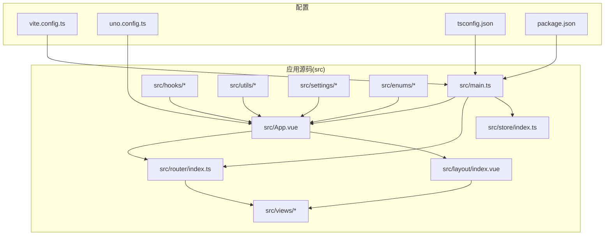
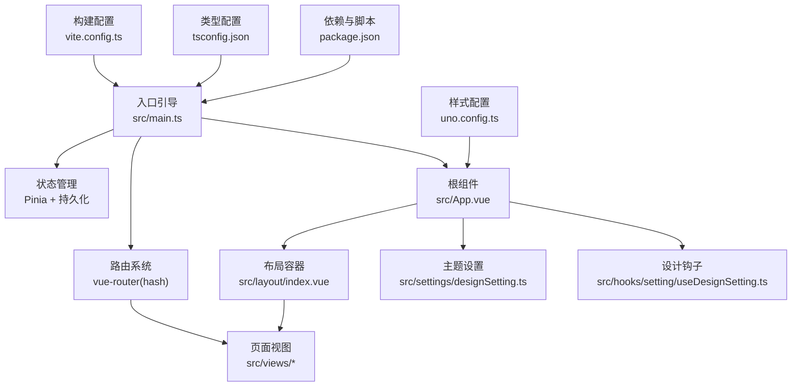
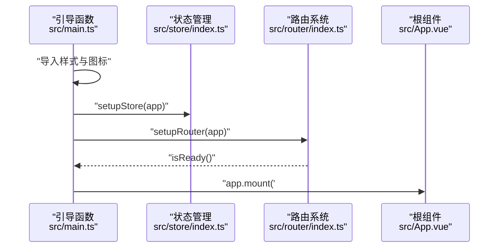
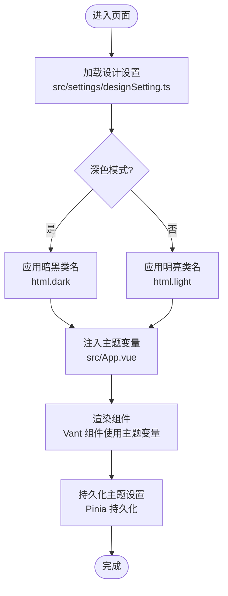
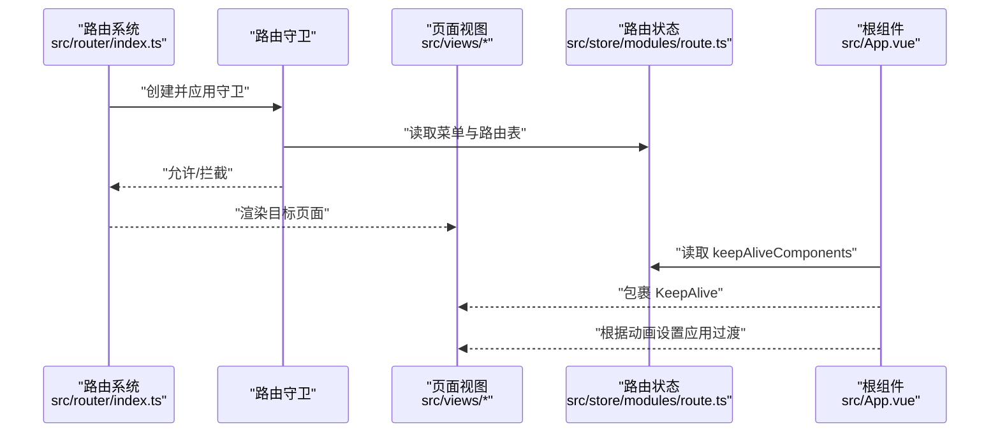
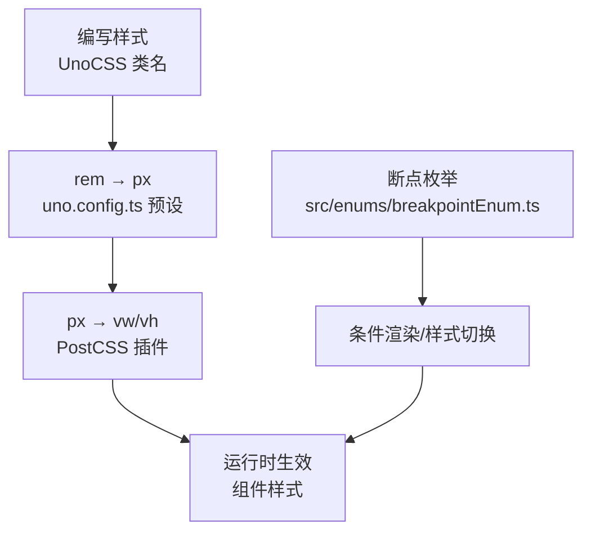
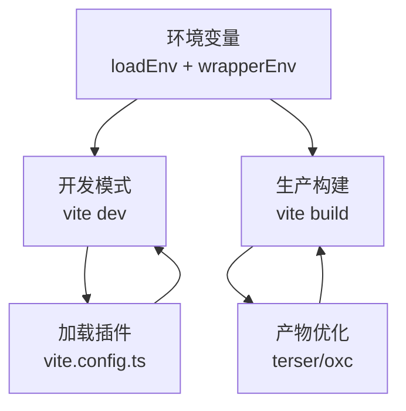
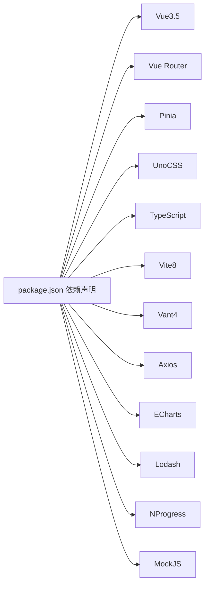

# 项目概述

<cite>
**本文引用的文件**
- [README.md](file://README.md)
- [package.json](file://package.json)
- [vite.config.ts](file://vite.config.ts)
- [uno.config.ts](file://uno.config.ts)
- [src/main.ts](file://src/main.ts)
- [src/App.vue](file://src/App.vue)
- [src/router/index.ts](file://src/router/index.ts)
- [src/store/index.ts](file://src/store/index.ts)
- [src/settings/designSetting.ts](file://src/settings/designSetting.ts)
- [src/layout/index.vue](file://src/layout/index.vue)
- [src/hooks/setting/useDesignSetting.ts](file://src/hooks/setting/useDesignSetting.ts)
- [src/utils/env.ts](file://src/utils/env.ts)
- [src/enums/breakpointEnum.ts](file://src/enums/breakpointEnum.ts)
- [src/views/dashboard/index.vue](file://src/views/dashboard/index.vue)
- [tsconfig.json](file://tsconfig.json)
</cite>

## 目录
1. [简介](#简介)
2. [项目结构](#项目结构)
3. [核心组件](#核心组件)
4. [架构总览](#架构总览)
5. [详细组件分析](#详细组件分析)
6. [依赖关系分析](#依赖关系分析)
7. [性能考虑](#性能考虑)
8. [故障排查指南](#故障排查指南)
9. [结论](#结论)
10. [附录](#附录)

## 简介
本项目是一个基于 Vue3.5、Vite8、Vant4、Pinia、TypeScript、UnoCSS 等主流技术栈打造的微信 H5 移动端项目样板。项目提供暗黑/明亮双主题、系统主题色持久化、Mock 数据、登录/注册/找回密码页面、路由与状态管理基础能力、图表与图标体系等，旨在帮助开发者快速落地移动端业务。

- 在线演示与账号示例：见“线上预览”章节
- 快速开始：见“使用”章节
- 截图预览与核心功能亮点：见“截图预览”章节

**章节来源**
- [README.md:21-28](file://README.md#L21-L28)
- [README.md:58-70](file://README.md#L58-L70)
- [README.md:288-297](file://README.md#L288-L297)

## 项目结构
项目采用“功能域 + 分层”的组织方式，核心目录与职责如下：
- src：应用源码
  - api/system：系统接口封装
  - assets/icons：SVG 图标资源
  - components：通用组件
  - enums：枚举定义（断点、缓存、HTTP、页面）
  - hooks：自定义组合式函数（事件、设置、web 等）
  - layout：布局容器与浮动导航
  - router：路由定义、模块化路由、路由守卫
  - settings：设计与组件设置
  - store：状态管理（Pinia），含持久化插件
  - styles：样式入口与过渡动画
  - utils：工具库（HTTP、日期、DOM、环境变量、日志等）
  - views：页面视图（仪表盘、示例、异常、登录、消息、我的、底部导航）
- types：类型声明
- mock：Mock 服务与工具
- 配置：vite.config.ts、uno.config.ts、tsconfig.json、package.json 等

**图示来源**
- [src/main.ts:1-30](file://src/main.ts#L1-L30)
- [src/App.vue:1-78](file://src/App.vue#L1-L78)
- [src/router/index.ts:1-33](file://src/router/index.ts#L1-L33)
- [src/store/index.ts:1-13](file://src/store/index.ts#L1-L13)
- [src/layout/index.vue:1-60](file://src/layout/index.vue#L1-L60)
- [vite.config.ts:1-183](file://vite.config.ts#L1-L183)
- [uno.config.ts:1-84](file://uno.config.ts#L1-L84)
- [tsconfig.json:1-42](file://tsconfig.json#L1-L42)
- [package.json:1-118](file://package.json#L1-L118)

**章节来源**
- [vite.config.ts:13-63](file://vite.config.ts#L13-L63)
- [uno.config.ts:13-59](file://uno.config.ts#L13-L59)
- [tsconfig.json:10-24](file://tsconfig.json#L10-L24)

## 核心组件
- 应用入口与初始化
  - 入口文件负责样式、图标注册、状态管理、路由挂载与应用实例挂载
  - 参考：[src/main.ts:18-30](file://src/main.ts#L18-L30)
- 应用根组件与主题适配
  - 根组件通过 Vant 的 ConfigProvider 注入主题变量，支持暗黑模式与主题色持久化
  - 参考：[src/App.vue:1-78](file://src/App.vue#L1-L78)
- 路由系统
  - 基于 vue-router，采用 hash 模式，常量路由 + 模块化路由合并，统一注入路由守卫
  - 参考：[src/router/index.ts:19-33](file://src/router/index.ts#L19-L33)
- 状态管理
  - Pinia + 持久化插件，提供设计设置与路由缓存等状态
  - 参考：[src/store/index.ts:1-13](file://src/store/index.ts#L1-L13)
- 设计设置与主题
  - 设计设置包含深浅主题、主题色列表、页面动画开关与类型
  - 参考：[src/settings/designSetting.ts:1-52](file://src/settings/designSetting.ts#L1-L52)
- 布局与浮动导航
  - 提供浮动导航栏与 KeepAlive 缓存策略，支持暗黑模式背景切换
  - 参考：[src/layout/index.vue:1-60](file://src/layout/index.vue#L1-L60)
- UnoCSS 原子化样式
  - rem → px → vw/vh 适配链路，图标预设、变体组、指令转换等
  - 参考：[uno.config.ts:13-84](file://uno.config.ts#L13-L84)
- TypeScript 配置
  - 路径别名、严格模式、ESM 解析、类型根等
  - 参考：[tsconfig.json:10-24](file://tsconfig.json#L10-L24)

**章节来源**
- [src/main.ts:11-27](file://src/main.ts#L11-L27)
- [src/App.vue:20-72](file://src/App.vue#L20-L72)
- [src/router/index.ts:12-24](file://src/router/index.ts#L12-L24)
- [src/store/index.ts:5-10](file://src/store/index.ts#L5-L10)
- [src/settings/designSetting.ts:38-49](file://src/settings/designSetting.ts#L38-L49)
- [src/layout/index.vue:32-48](file://src/layout/index.vue#L32-L48)
- [uno.config.ts:19-59](file://uno.config.ts#L19-L59)
- [tsconfig.json:10-24](file://tsconfig.json#L10-L24)

## 架构总览
项目采用“入口引导 → 路由驱动 → 状态管理 → 组件渲染”的分层架构，结合 Vant4 UI 与 UnoCSS 原子化样式，形成移动端 H5 的高可用样板。

**图示来源**
- [src/main.ts:13-27](file://src/main.ts#L13-L27)
- [src/App.vue:1-13](file://src/App.vue#L1-L13)
- [src/router/index.ts:19-33](file://src/router/index.ts#L19-L33)
- [src/store/index.ts:5-10](file://src/store/index.ts#L5-L10)
- [src/layout/index.vue:1-30](file://src/layout/index.vue#L1-L30)
- [src/settings/designSetting.ts:38-49](file://src/settings/designSetting.ts#L38-L49)
- [src/hooks/setting/useDesignSetting.ts:4-24](file://src/hooks/setting/useDesignSetting.ts#L4-L24)
- [vite.config.ts:27-181](file://vite.config.ts#L27-L181)
- [uno.config.ts:13-84](file://uno.config.ts#L13-L84)
- [tsconfig.json:10-24](file://tsconfig.json#L10-L24)
- [package.json:24-40](file://package.json#L24-L40)

## 详细组件分析

### 组件一：应用入口与初始化流程
- 初始化顺序：样式与图标 → 状态管理 → 路由 → 应用挂载
- 关键点：确保路由 ready 后再挂载，避免首屏闪烁；依赖预构建提升开发体验

**图示来源**
- [src/main.ts:18-30](file://src/main.ts#L18-L30)
- [src/store/index.ts:8-10](file://src/store/index.ts#L8-L10)
- [src/router/index.ts:26-30](file://src/router/index.ts#L26-L30)

**章节来源**
- [src/main.ts:11-27](file://src/main.ts#L11-L27)

### 组件二：主题与暗黑模式适配
- 主题变量注入：通过 Vant ConfigProvider 动态注入主题色与组件变量
- 暗黑模式：基于设计设置与 html/body 类名切换，配合样式变量实现明暗适配
- 主题色持久化：通过 Pinia 持久化插件保存用户偏好

**图示来源**
- [src/settings/designSetting.ts:38-49](file://src/settings/designSetting.ts#L38-L49)
- [src/App.vue:26-68](file://src/App.vue#L26-L68)
- [src/store/index.ts:3-6](file://src/store/index.ts#L3-L6)

**章节来源**
- [src/App.vue:2-12](file://src/App.vue#L2-L12)
- [src/settings/designSetting.ts:38-49](file://src/settings/designSetting.ts#L38-L49)

### 组件三：路由与页面缓存策略
- 路由：常量路由 + 模块化路由合并，统一守卫
- 缓存：通过 KeepAlive 与路由 store 的 keepAliveComponents 实现页面缓存
- 动画：根据设计设置决定页面切换动画类型

**图示来源**
- [src/router/index.ts:12-33](file://src/router/index.ts#L12-L33)
- [src/App.vue:6-11](file://src/App.vue#L6-L11)

**章节来源**
- [src/router/index.ts:12-24](file://src/router/index.ts#L12-L24)
- [src/App.vue:23-24](file://src/App.vue#L23-L24)

### 组件四：移动端适配与响应式设计
- 适配策略：UnoCSS rem → px → vw/vh 链路，结合 PostCSS 插件完成 px 到视口单位的转换
- 断点枚举：提供 XS 到 XXL 的断点映射，便于条件渲染与样式切换
- 响应式：结合 hooks 与断点枚举，实现不同屏幕尺寸下的布局与交互优化

**图示来源**
- [uno.config.ts:19-25](file://uno.config.ts#L19-L25)
- [uno.config.ts:53-59](file://uno.config.ts#L53-L59)
- [src/enums/breakpointEnum.ts:10-28](file://src/enums/breakpointEnum.ts#L10-L28)

**章节来源**
- [uno.config.ts:19-59](file://uno.config.ts#L19-L59)
- [src/enums/breakpointEnum.ts:10-28](file://src/enums/breakpointEnum.ts#L10-L28)

### 组件五：构建与开发体验
- Vite8：热重载、依赖预构建、代理、产物优化
- 插件生态：Mock、SVG、可视化、压缩、HTML 注入等
- 环境变量：通过环境文件与运行时注入，支持开发/生产差异化配置

**图示来源**
- [vite.config.ts:27-181](file://vite.config.ts#L27-L181)
- [package.json:24-40](file://package.json#L24-L40)

**章节来源**
- [vite.config.ts:27-181](file://vite.config.ts#L27-L181)
- [package.json:20-23](file://package.json#L20-L23)

## 依赖关系分析
- 运行时依赖
  - Vue3.5、Vue Router、Pinia、Vant4、Axios、ECharts、Lodash、NProgress、MockJS 等
- 开发依赖
  - Vite8、UnoCSS、TypeScript、ESLint、Commitizen、simple-git-hooks、Rollup 生态等
- 关键耦合点
  - main.ts 依赖 router 与 store 的 setup 函数
  - App.vue 依赖设计设置与路由 store 的缓存列表
  - UnoCSS 与 PostCSS 插件共同完成移动端适配

**图示来源**
- [package.json:41-104](file://package.json#L41-L104)

**章节来源**
- [package.json:41-104](file://package.json#L41-L104)

## 性能考虑
- 依赖预构建：将常用依赖（如 pinia、lodash-es、axios）纳入 optimizeDeps.include，减少首次加载等待
- 产物拆分：manualChunks 将 node_modules 依赖按包名拆分，提升缓存命中率
- 构建压缩：生产环境可按需启用 terser 去除 console/debugger
- 图标与样式：UnoCSS 的 safelist 预生成常用图标类，避免运行时动态类名导致的 CSS 未生成问题
- 开发体验：预热关键文件、自动打开浏览器、端口与代理配置

**章节来源**
- [vite.config.ts:156-177](file://vite.config.ts#L156-L177)
- [vite.config.ts:109-121](file://vite.config.ts#L109-L121)
- [uno.config.ts:77-83](file://uno.config.ts#L77-L83)

## 故障排查指南
- 环境版本不匹配
  - Node 与 pnpm 版本要求较高，建议按 engines 配置安装
  - 参考：[package.json:20-23](file://package.json#L20-L23)
- 构建失败或依赖安装问题
  - 使用 pnpm 并确保版本满足要求；必要时清理缓存后重试
  - 参考：[package.json:24-36](file://package.json#L24-L36)
- 图标未显示或样式异常
  - 确认 UnoCSS safelist 中包含所需图标类；检查图标前缀与类名拼写
  - 参考：[uno.config.ts:77-83](file://uno.config.ts#L77-L83)
- 移动端适配异常
  - 检查 rem → px → vw/vh 链路是否正确；确认 PostCSS 插件已启用
  - 参考：[uno.config.ts:19-25](file://uno.config.ts#L19-L25)
- 路由跳转失效或白屏
  - 确保路由守卫已创建并应用；检查路由表与菜单注入逻辑
  - 参考：[src/router/index.ts:26-30](file://src/router/index.ts#L26-L30)
- 暗黑模式不生效
  - 检查 html 类名切换逻辑与主题变量注入；确认设计设置持久化
  - 参考：[src/App.vue:2-12](file://src/App.vue#L2-L12), [src/settings/designSetting.ts:38-49](file://src/settings/designSetting.ts#L38-L49)

**章节来源**
- [package.json:20-23](file://package.json#L20-L23)
- [uno.config.ts:77-83](file://uno.config.ts#L77-L83)
- [uno.config.ts:19-25](file://uno.config.ts#L19-L25)
- [src/router/index.ts:26-30](file://src/router/index.ts#L26-L30)
- [src/App.vue:2-12](file://src/App.vue#L2-L12)
- [src/settings/designSetting.ts:38-49](file://src/settings/designSetting.ts#L38-L49)

## 结论
本项目以 Vue3.5/Vite8 为核心，结合 Vant4、Pinia、TypeScript、UnoCSS 等技术，提供了移动端 H5 的完整样板：从主题与暗黑模式、路由与状态管理、到图标与样式体系、构建与开发体验，均给出开箱即用的最佳实践。对于初学者，可直接在此基础上快速开发业务；对于有经验的开发者，亦可通过插件生态与构建配置进一步扩展与优化。

## 附录
- 快速开始
  - 克隆 → 安装依赖 → 启动开发服务器 → 打包构建
  - 参考：[README.md:186-201](file://README.md#L186-L201)
- 在线演示与二维码
  - 预览链接与账号示例、二维码
  - 参考：[README.md:58-70](file://README.md#L58-L70)
- 截图预览
  - 登录页、首页、消息页、我的页、暗黑模式截图
  - 参考：[README.md:29-56](file://README.md#L29-L56)
- 基础知识与图标使用
  - Vite、Vue3、Vant4、Pinia、TypeScript、Vue-Router、ECharts、UnoCSS、Mock.js、PostCSS-Mobile-Forever 等
  - 参考：[README.md:72-110](file://README.md#L72-L110)
- 浏览器支持
  - 现代浏览器，不支持 IE
  - 参考：[README.md:288-297](file://README.md#L288-L297)